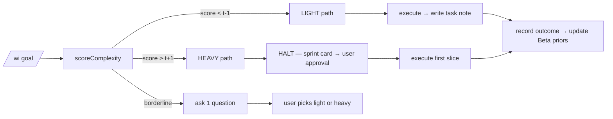

# ADR-033: Cypher Framework — Adopt Token-Cheap Brain-Anchored Execution, Drop GSD

> **AMENDMENT NOTICE (2026-06-15):** [ADR-036](./adr-036-cypher-cli-primary.md) supersedes the **"depth ≤ 2 / never auto-invoke" invariant** from § Surfaces & dispatch — but **only for `auto`-class skills** (read-anything OR WI-internal write). Skills marked `confirm` (anything affecting colleagues — Jira comments, PR pushes, Teams/email — or critical machine state) still require explicit user confirmation before invocation. The category system itself was also revised by ADR-036 from 4-way (`read | write | cli | unknown`) to 3-way (`auto | confirm | cli`). Read ADR-036 § D-supersedes-033 + § D8 for the full delta.

> **AMENDMENT NOTICE (2026-06-20):** [ADR-037](./adr-037-cypher-tool-use-loop.md) supersedes the **9-step pipeline framing** in § 4 (Framework contract). Under v2.0, Cypher executes as a single `while`-loop tool-use controller, not a 9-stage sequential pipeline; investigate / clarify / plan / execute become **tools the model calls** rather than coded stages. The framework contract's *intent* (visible-stages, evidence at each step, audit trail) is preserved by ADR-037 D7 (tool_call event schema) and D9 (cypher_outcomes ledger). What survives unchanged from ADR-033: CAP-12/13/14, runtime topology § 9, core/project boundary § 10, the `cypher_sessions` / `cypher_steps` / `cypher_outcomes` audit ledgers. Read [Cypher v2.0 PRD](../prd/cypher-v2.0.md) and [ADR-037](./adr-037-cypher-tool-use-loop.md) for the full delta. v2.5 production-grade work — task memory, project scoping, worktrees — is captured in [ADR-038](./adr-038-cypher-v2.5-production-grade.md).

**Scope**: *Implementation* lives in Work Intelligence MCP (this repo). *Cypher itself* is **Maaz's portfolio-spanning engineering persona, hosted in WI today** — WI is the body/host, Cypher is the mind. It operates across all of Maaz's projects (WI / example-service / operations / future), not just WI; it is not a Claude Code primitive and not a per-repo agent. Its **core identity/state is logically separable from WI's runtime** (see Decision §10); state physically lives in WI `data.db` for v1.4, and a portability/export runtime is an explicit **non-goal** (§10).
**Terminology (what Cypher is / is not)**: Cypher is a **persona + framework contract** delivered as a **persistent *reactive* service** — the brain layer of the already-running WI bridge process, reachable by every harness/surface (see Decision §9 "Runtime topology"). It is persistent (long-lived, holds state) but **reactive and human-gated, not autonomous** — so it is *not "an agent"* in WI's internal vocabulary. Inside WI, the noun **"agent"** is reserved for (a) ADR-017 always-on daemon tenants (`OrchestratorAgent`, `AlertScorerAgent`, …) and (b) CAP-11 fan-out workers spawned via the Workflow `agent()` primitive. Cypher *orchestrates* agents and *hosts* them; it is not one. Externally/product-facing, "engineering agent" / "agentic engineering persona" is acceptable in the loose sense.
**Pipeline stages**: Cypher governs all four (Fetch / Process / Analyze / Propose). The framework SITS ON the existing Workflow tool primitive — it does not replace any runtime. **Note:** that Workflow tool (`phase()` / `agent()` / `parallel()` / `pipeline()` / `budget`) is **harness-side (Claude Code / Cursor), not WI-owned source** — there is no `phase/agent/parallel/pipeline` implementation in `src/` to rewrite.
**Related**: [ADR-014](./adr-014-self-learning-investigation-brain.md), [ADR-015](./adr-015-mempalace-integration.md), [ADR-016](./adr-016-second-brain-architecture.md), [ADR-017](./adr-017-always-on-agent-architecture.md) (defines WI's "agent" tenants — Cypher is *not* one of these), [ADR-024](./adr-024-unified-brain.md), [ADR-027](./adr-027-code-graph-indexer-scheduling.md), [ADR-030](./adr-030-self-healing-bug-loop.md), [ADR-031](./adr-031-per-bucket-model-effort-config.md) (**extended here**: CAP-12 adds `fallback_chain` at schema v59, adds 4 buckets, and revises the `fetch`/`digest` recommended defaults to multi-provider), [ADR-032](./adr-032-persona-memory-loop.md)

---

## Executive summary

**Cypher is a self-managing engineering persona that uses itself to track itself.** The strongest evidence isn't a benchmark or a token-cost graph — it's that PM-1 (the slice that built `work_items` + `work_item_links`) marked itself `shipped` in the table it had just created, with smoke § 21 + commit `3c771f1` linked as evidence. Subsequent slices (PM-2, PM-2.5, PM-3-PRIME-A) followed the same pattern. **Status comes from a query, not a prose section that humans forget to update.** That property — `SELECT count(*) FROM work_items WHERE status='shipped'` is unfakeable — is the spine that makes every other ADR-033 capability tractable.

The framework layers a **9-step task contract** (Investigate → Ask → Research → Plan → Execute → Quality gate → Confirm → Surface → Record) over the existing Workflow tool. **Triggered discipline, not always-on ceremony**: a complexity scorer with visible additive signals decides per-task whether to take the light path (record decisions, ship) or halt with a sprint card (heavy verdict, mandatory pause). The same dial fires regardless of repo — task shape decides discipline, not repo identity. Six capabilities ride on top: thread state (CAP-01), fan-out preamble (CAP-11), multi-model routing (CAP-12), self-extension (CAP-13), skill consolidation (CAP-14), and the **PM lens (added 2026-06-14)** that makes all of it queryable.

**Token-cost was the original case** for replacing GSD (67 skills, 2.9 MB `.planning/`, 41 commits in 14 days, doc files reloaded across 5 agent waves). It's still real — but the durable thesis is **maintenance is a side effect of usage, not a separate task**. Cypher's runtime writes its own work-tracking; if Cypher is being used, the data is fresh. GSD's `STATE.md` rotted because keeping it accurate was a manual chore. Cypher's table doesn't rot for the same reason a git log doesn't rot.

First proof point (`wi-skill-install`) shipped 2026-06-11. Cypher PM lens shipped across 2026-06-13/14 (PM-1 → PM-3-PRIME-A → PM-4 → PM-DRIFT → PM-AUTO → PM-VISIBILITY at `/cypher`). The lens is now self-maintaining: PM-AUTO writes evidence and transitions on every dispatch; PM-DRIFT surfaces rot at read time; the visibility panel renders both. GSD-67 retirement continues piecewise; the PM lens has reached the point where status comes from a query that is unfakeably grounded in autonomous writes.

---

## Context

### Why Cypher exists

Maaz works as a portfolio engineer across three projects today (WI itself + `./repos/example-service` + `./repos/operations`) plus future projects. The current execution substrate (GSD, 67 skills, 5-wave phases) was built for one big delivery: ship example-service's WI MCP. It worked — Phases 68–76 shipped, ADRs 024/027/028/030/031 landed, the bug loop closed end-to-end. **But the substrate has eaten its own returns.**

### Token-waste inventory (2026-06-10 snapshot)

| Signal | Number |
|---|---|
| GSD skills installed | 67 |
| `.planning/` size on disk | 2.9 MB |
| GSD-driven commits in last 14 days | 41 |
| Largest GSD doc files (each loaded into multiple agent contexts) | 52 KB (Phase 75 PLAN), 49 KB (ADR-REVIEW), 48 KB (Phase 74 PLAN) |
| Phase 80 PRD size | 25 KB / 319 lines |
| Phase 80 PRD reads per milestone | ~25 (5 waves × ~5 agents) |
| `CLAUDE.md` size (loaded every session) | 27 KB / 484 lines |

The waste is structural:

1. **Each GSD skill loads its own SKILL.md** — 67 skills × 100–200 lines = ~10–13K lines of prompt template before any task work begins.
2. **Each phase agent re-reads the same docs** — Phase 80's 25 KB PRD gets reloaded ~25 times per milestone.
3. **Sequential gates re-spawn agents** — `gsd-discuss → gsd-plan → gsd-plan-checker → gsd-execute → gsd-verify` each spawn fresh contexts that re-load CLAUDE.md, STATE.md, the phase PRD, etc.
4. **Repeated blocker / verification cycles** — when a plan-checker fails, the planner re-runs with even more context loaded.
5. **No caching across agents** — even when two parallel agents need the same artifact, each loads it independently.

External corroboration: 's EATER tool radar (verified 2026-06-11) lists GSD #33 and GSD #36 as **REJECTED** for wide adoption. The token-cost intuition + EATER's eval failures + cost analysis converge on the same conclusion.

### What survives in Cypher's DNA (the good parts of GSD)

- **Explicit phase goals** with backward verification.
- **Requirement traceability** — REQUIREMENTS.md → PRD → PLAN → SUMMARY → VERIFICATION.
- **Adversarial review** — `gsd-plan-checker`, scope-critic agents catch blockers before tasks land.
- **Smoke discipline** — "don't ship without smoke" is non-negotiable in Cypher too.
- **Goal-backward analysis** — "does this PLAN actually achieve the phase goal?" is the right gate.
- **State files for cross-session continuity** — STATE.md per milestone is the right idea, even if implementation needs work.

These survive in Cypher's framework contract; the *execution substrate* (skill-as-markdown, 5-wave phases, per-agent context reload) is what dies.

### Empirical validation already on disk

Cypher's load-bearing capability — **CAP-11 fan-out with context** (agents inherit a ≤500-token preamble instead of re-deriving from scratch) — is already empirically validated:

- Track G (5 component docs in parallel): 5/5 useful preambles
- Track H (PRD subagent): 1/1 useful preamble
- Solo retries: 2/2 useful preambles
- **Cumulative: 14/14 useful preambles where the agent completed.** 2/16 fan-out failures were parallel-multi-step-IO mode, NOT preamble-related.

This isn't a hypothesis; it's measured.

---

## Decision

**WI adopts Cypher.** v1.4 ships the foundation; GSD retires piecewise via parallel construction, gated on first proof point + 3 successful Cypher-framework executions.

Cypher is composed of:

### 1. Cypher's identity (locked Track A)

A software-engineer persona with **7 explicit modes**: investigate, ask, plan, build, review, decide, report. **Hybrid portfolio model**: project context is path-inferred (CWD/file paths) + explicit override (`cypher use example-service`) + always-named in responses. **4-status thread lifecycle**: ACTIVE / PAUSED / BLOCKED / DONE. **13+3 authority-matrix rows** mapping every Cypher action to one of three tiers:

| Tier | Behavior |
|---|---|
| **AUTO** | Cypher does it without asking (read-only or trivial side-effect). |
| **CONFIRM-THEN-DO** | Cypher proposes; Maaz approves; Cypher executes. |
| **ALWAYS-MAAZ** | Cypher returns the action to Maaz to perform manually (push, deploy, customer-repo writes). |

Canonical detail: [`.planning/cypher/01-CYPHER-IDENTITY.md`](../../../.planning/cypher/01-CYPHER-IDENTITY.md).

### 2. Interaction protocol (locked Track B)

Cypher operates **symmetrically across 4 surfaces** (Claude Code CLI, OpenCode TUI, WI Web UI ChatPanel, `wi_dispatch` MCP tool — external clients see exactly one tool). Every non-trivial turn follows the **6-stage visible contract**:

```
ACK (&lt;1s) → INVESTIGATE → PROPOSE (with cost estimate) → WAIT → EXECUTE (mode + project named) → REPORT (with R&U if applicable)
```

Trivial info queries short-circuit ACK → REPORT. CONFIRM-THEN-DO actions from non-primary surfaces queue in a `pending_approvals` SQLite table; bridge tracks Maaz's "active surface"; falls back to Apple Notes/Reminders after 5 min idle. **ALWAYS-MAAZ tier is never auto-executed even after approval** — Cypher returns the action.

New sessions emit an **active-thread digest** before responding (3–5 active threads + R&U from last session + pending_approvals count, ~400 tokens cap). This closes today's "what were we discussing?" confabulation gap.

Canonical detail: [`.planning/cypher/04-INTERACTION-PROTOCOL.md`](../../../.planning/cypher/04-INTERACTION-PROTOCOL.md).

### 3. Project portfolio (locked Track G)

A **project = `(git_repo, working_area)`**. Sub-folders inherit the envelope; no separate `project_id` for nested directories. Three projects live today (WI / example-service / operations); future projects auto-discover on path-miss → probe → AskUserQuestion → register.

Per-project **`projects` table** (new, schema v61) is the source-of-truth for `project_id` foreign keys.

**Schema reality check (audit 2026-06-12).** Three of the tables the original draft named as existing-and-getting-a-`project_id`-FK **do not exist under those names** in `src/db/schema.ts`, and **no table has a `project_id` column today** (grep returns zero). The v61 migration must therefore be specified per-target, not as a blanket "add a column":

| Original draft name | Reality in `src/db/schema.ts` | v61 action required |
|---|---|---|
| `threads` | does not exist (new in v60) | add `project_id` at creation (v60) |
| `pr_review_comments` | **not found** — closest is `pr_review_cache` (`schema.ts:873`, SHA-keyed JSON blob, different shape) | decide: extend `pr_review_cache`, or create a new per-comment table |
| `lessons_learned` | **not found** — closest is `ticket_learnings` (`schema.ts:683`) | add `project_id` FK to `ticket_learnings` (confirm this is the intended table) |
| `rule_cards` | **not found anywhere in WI schema** | clarify: likely an ADR-032 persona/rule artifact that may live in MemPalace, not `data.db` — resolve before v61 |

Cross-project knowledge defaults to **isolated**; promotion is explicit by **extending the ADR-032 propose-then-approve gate pattern to cross-project promotion** (ADR-032's gate is documented for Tier-1-pattern→rule promotion; reusing it for project-isolated→shared promotion is this ADR's extension, not something ADR-032 already specifies). Multi-project tasks (PROJ-16141 spanned example-service + operations) carry `primary_project_id` + `linked_project_keys[]` array, mirroring CAP-01's thread shape.

Cypher never silently flips the active project. Path inference resolves per-prompt routing, but the portfolio-level active flag changes only with Maaz's confirmation.

Canonical detail: [`.planning/cypher/02-PROJECT-PORTFOLIO.md`](../../../.planning/cypher/02-PROJECT-PORTFOLIO.md).

### 4. Framework contract (locked Track G)

A **9-step task contract** every Cypher turn honors, operationalized via the existing Workflow tool. The contract is:

1. **Investigate** — read code, search memory, query brain. Bounded budget (claude-mem hits + brain confidence threshold).
2. **Ask** — explicit AskUserQuestion when ambiguous; ≤3 ranked questions; high bar for "ambiguous."
3. **Research** — consult external sources only when investigate failed.
4. **Plan** — small chunks shippable in a single session. Explicit DAG.
5. **Parallel** — leaf nodes fan out via Workflow `parallel()` + CAP-11 preamble.
6. **Quality** — selective gates (smoke, type-check, plan-checker, adversarial-verify) per task type.
7. **Cost** — small chunks; brain budget caps; `ROUTER_MAX_PER_HOUR=20` shared pool; no runaway loops.
8. **Confirm** — destructive actions confirm via Track A authority matrix.
9. **Surface** — one-line status per agent; visible-stages contract honored throughout.

The framework **does not rewrite the Workflow tool**. The tool's `phase()` / `agent()` / `parallel()` / `pipeline()` primitives plus the `budget` global are the substrate. The 9-step contract is a **discipline layered on top**. Every `agent()` invocation MUST attach a CAP-11 preamble; every `parallel()` MUST honor brain budget; every `phase()` MUST scope to one project envelope.

Canonical detail: [`.planning/cypher/03-FRAMEWORK-CONTRACT.md`](../../../.planning/cypher/03-FRAMEWORK-CONTRACT.md).

### 5. Memory model (locked Track G)

**Additive on existing substrate.** The layers below exist to varying degrees of maturity; Cypher adds the scoping + promotion + decay + observability glue. The "Status" column below distinguishes **wired** (consumed by WI code today) from **scaffolding** (schema/writers exist but the capability is not actually delivering value yet) — the original "all LIVE" framing oversold readiness:

| Layer | Status (audited 2026-06-12) |
|---|---|
| MemPalace wings WI actually writes drawers to (`topics` / `conversations` / `meetings` / `decisions` / `investigations`) | **WIRED** (`src/intelligence/memory-enricher.ts`, `investigation-orchestrator.ts`) |
| MemPalace `entities` / `entity-relationships` | **PARTIAL** — realized as KG triples, not drawer writes (the "6 wings" framing is MemPalace's server taxonomy, not WI's call-site shape) |
| MemPalace **`reviews` wing** (#7, ADR-032 — *named `reviews`, not "persona"*; "persona" is the system name, the wing identifier is `reviews`) | Phase 80 in flight |
| claude-mem corpus + session summaries | **WIRED** |
| WI brain decisions ledger (ADR-024); `brain.record_outcome` | **WIRED but underused** (`tools/brain-record-outcome.ts`, `routes/brain.ts`, `services/brain/learn.ts`) |
| WI KG triples | **SCAFFOLDING / latent gap** — writer code exists (9+ `kgAdd` call-sites) but `tripleCount=0` in the live store. Cypher's memory model leans on this; treat the empty store as a bug to fix, not a live capability (see R11). |
| Auto-memory dir (`~/.claude/projects/<proj>/memory/`) | **WIRED** |

Cypher's additions:

- `project_id` foreign key on every drawer / triple / lesson (claude-mem already tags `project`; ADR-032 already has wing scoping — hardening into PK).
- **Isolated cross-project default**; promotion only via the **ADR-032 propose-then-approve gate pattern, extended here to cross-project promotion** (ADR-032 documents this gate for Tier-1-pattern→rule promotion; cross-project reuse is this ADR's extension).
- Self-outcome loop wired through `brain.record_outcome` (already shipped, underused).
- 60-day decay extended from persona-only to all memory.
- MINJA poisoning protection extended from reviewer voice to self-outcome (Cypher can't promote a false-positive outcome to KG).
- `/setup/memory` observability surface; "forget that" tombstone hook.
- New-project bootstrap = empty + WI-base-rules seed.

Storage placement: tables land in WI `data.db` (consumers all live in WI).

Canonical detail: [`.planning/cypher/05-MEMORY-MODEL.md`](../../../.planning/cypher/05-MEMORY-MODEL.md).

### 6. Six locked capabilities

#### CAP-01 — Thread state (cross-session memory) (Track D)

Hybrid storage: **claude-mem** owns observations + summaries (untouched); **WI `data.db`** owns thread state (new tables `threads`, `thread_observations`, `thread_sync_cursor`). WI pulls; sync at session-start + manual on-demand. Two-pass clustering: deterministic grouping on `(project, files, jira_keys, time-window)` then a single Haiku call to merge/split + name (~$0.0005 per rebuild). Threads are "pieces of work" (hours to weeks) with auto-naming from Jira key when shared. Per-prompt Haiku classifier ($0.0005, ~800ms) decides continue / new / pivot / resume / ambiguous; ambiguous and pivot ALWAYS ask before silent thread switch. Lifecycle: ACTIVE / PAUSED / BLOCKED / DONE.

> **Persistence note (per Decision §9).** The original "no daemon, no cron, sync-on-session-start" design assumed an ephemeral Cypher that forgets between sessions. With the persistent-reactive-service topology, Cypher lives in the always-on bridge, so active threads are held as in-memory objects and most of the session-start sync/cluster machinery **collapses** — `data.db` becomes the crash-recovery checkpoint, not the per-session reload source. CAP-01's storage schema stays; its sync ceremony simplifies.

Canonical: [`.planning/cypher/cap-01-thread-state.md`](../../../.planning/cypher/cap-01-thread-state.md).

#### CAP-11 — Fan-out with context (Track D)

Every fan-out agent inherits a **≤500-token preamble** with five canonical fields plus an extensible `extra` map:

| Field | Purpose |
|---|---|
| `parent_intent` | What the parent is trying to do (1 sentence) |
| `working_hypothesis` | What the parent currently believes (2-3 sentences) — agent can confirm or challenge |
| `output_will_feed` | What consumes this output next (1 sentence) |
| `do_not_re_derive` | Facts the parent already knows; don't re-prove (bullet list) |
| `format_hint` | What shape the output needs (bullet list) |
| `extra` | Capability-specific additions (CAP-13's `parent_skill_being_authored`, CAP-12's `preferred_provider`, etc.) |

Empirical validation: **14/14 useful preambles where agents completed**, across 5 distinct fan-outs in 2026-06-11. Anti-pattern confirmed: parallel research agents need stable on-disk substrate; live external multi-step fetches cause socket disconnects (the 2/16 failure mode). **Source note:** the cap-11 doc only records the 4/4 Track C subset; the cumulative **14/14 · 14/16** numbers live in [`09-BRAINSTORM-LOG.md`](../../../.planning/cypher/09-BRAINSTORM-LOG.md) (Track H entry). The cap-11 doc should be amended post-Track-H to absorb them.

Canonical: [`.planning/cypher/cap-11-fanout-with-context.md`](../../../.planning/cypher/cap-11-fanout-with-context.md) (subset) + [`09-BRAINSTORM-LOG.md`](../../../.planning/cypher/09-BRAINSTORM-LOG.md) (cumulative telemetry).

#### CAP-12 — Multi-model routing (Track F)


v1.4 routing table:

| Bucket | Primary | Provider | Fallback chain |
|---|---|---|---|
| fetch | gemini-2.5-flash-lite | Google | `[claude-haiku-latest]` |
| digest | gpt-5-mini | OpenAI | `[claude-sonnet-latest]` |
| chat | claude-sonnet-latest | Anthropic | `[claude-haiku-latest]` |
| analyse | claude-opus-latest | Anthropic | `[claude-sonnet-latest]` |
| **decide** | claude-opus-latest | Anthropic | **`[]` fail fast** |
| agents | claude-sonnet-latest | Anthropic | `[claude-haiku-latest]` |
| **bug-investigator** | claude-opus-latest | Anthropic | **`[]` fail fast** |
| **bug-resolver** | claude-opus-latest | Anthropic | **`[]` fail fast** |
| **NEW web-research** | sonar-pro | Perplexity | `[]` |
| **NEW embeddings** | text-embedding-3-large | OpenAI | `[gemini-embedding]` |

**Critical-reasoning rule (load-bearing):** the 4 reasoning-heavy buckets (`analyse`, `decide`, `bug-investigator`, `bug-resolver`) stay on Anthropic Opus AND have empty fallback chains. Two layers of guard against silent quality degradation. **D5 — multi-perspective ensemble** is on-demand and user-driven (no canonical triple, no fixed N) — fires only when Maaz says "check with another model" / "what does Gemini think?".

Pre-ship empirical validation gate: 100 real fetch-bucket inputs through both Gemini Flash Lite and Claude Haiku; require &lt;5% quality delta at >5× cost reduction OR revert.

Canonical: [`.planning/cypher/cap-12-multi-model-routing.md`](../../../.planning/cypher/cap-12-multi-model-routing.md).

#### CAP-13 — Self-extension (Track E)

When recurring pain (≥3 occurrences) becomes encapsulable (clear inputs/outputs/side-effects, NOT a behavior rule), Cypher proposes a new skill via **draft SKILL.md + 5-line evidence block** (single review, single decision). After Maaz approves, Cypher **dogfoods the skill on the originating task before commit**. Pass → commit + register. Fail → iterate or abandon (no orphan skills ship). Memory persists in **both layers**: claude-mem `skill_birth` observation + auto-memory pointer with retirement criteria.

The 19→5 ratio audit (2026-06-11): only ~5 of 19 felt-pain memories are skill-shaped; the rest are correctly memory-shaped rules. CAP-13's encapsulable gate prevents GSD's 67-skill failure from repeating.

**Empirically validated 2026-06-11 (commit `04e6534`):** the first proof point `wi-skill-install` ran the full birth pump end-to-end. D1 + D2 + D3 + D4 all fired; idempotency proven; 33-skill catalog clean across all 3 layers. **Source note:** the cap-13 doc was locked *before* the proof shipped and only lists `wi-skill-install` as a *proposed* candidate; the actual ship evidence (commit hash, 33/33 PASS) lives in [`09-BRAINSTORM-LOG.md`](../../../.planning/cypher/09-BRAINSTORM-LOG.md) Track H and [`08-FIRST-PROOF-POINT.md`](../../../.planning/cypher/08-FIRST-PROOF-POINT.md). Amend cap-13 to mark it shipped.

Canonical: [`.planning/cypher/cap-13-self-extension.md`](../../../.planning/cypher/cap-13-self-extension.md) (design) + [`09-BRAINSTORM-LOG.md`](../../../.planning/cypher/09-BRAINSTORM-LOG.md) (ship evidence).

#### CAP-14 — Skill consolidation (Track E)

Paired with CAP-13: birth pump + retirement valve. **Soft cap of 30 wi-* skills** (current ~33). Cap-breach triggers immediate audit; calendar trigger fires at `last_audit > 90 days`. Three retirement signals (any one qualifies): **usage** (90d no-fire), **overlap** (≥70% description-similarity OR ≥80% caller-path), **stale evidence** (originating pain is fixed).

**Hybrid runner:** `scripts/skill-audit.mjs` collects mechanical data (frontmatter, telemetry, overlap signals); Cypher applies semantic judgment (overlap meaning, stale-evidence detection); Maaz decides per skill (`retire = CONFIRM-THEN-DO`).

GSD-67 retirement is a **one-time CAP-14 sweep** (separate retirement track), not regular cadence. GSD-67 stays out of the 30-skill soft cap.

Canonical: [`.planning/cypher/cap-14-skill-consolidation.md`](../../../.planning/cypher/cap-14-skill-consolidation.md).

### 7. GSD-drop plan (locked Track G)

**Parallel construction with piecewise replacement** — NOT hard cutover. Cypher's framework builds in parallel; first proof point (08 doc, `wi-skill-install`, shipped) validates; then triage GSD's 67 skills by family — keep useful primitives (`gsd-status`, `gsd-stats`), retire entire workflows (`gsd-execute-phase`, `gsd-discuss-phase`) once Cypher's framework covers the use case. `.planning/` stays as archive (read-only after cutover). In-flight Phase 80 wave 77a-wide completes under GSD; everything starting AFTER GSD-drop-tag uses Cypher.

**`gsd-dead/v1.4` cutover tag** = (1) all 6 v1.4 capabilities ship, (2) first proof point + ≥3 successful Cypher-framework executions on real tasks, (3) Phase 80 ships, (4) GSD-67 Batch 1 retired, (5) `.planning/` archive policy applied, (6) ROADMAP.md/STATE.md/CLAUDE.md updated.

Canonical: [`.planning/cypher/07-GSD-DROP-PLAN.md`](../../../.planning/cypher/07-GSD-DROP-PLAN.md).

### 8. First proof point (locked + shipped)

`wi-skill-install` shipped 2026-06-11 (commit `04e6534`). Closes the long-standing `scripts/install-skills.sh` ghost (`feedback_skill_top_level_symlinks` + `feedback_skill_registration`). Exercises all 9 framework contract steps (Step 5 parallel-execution flagged as not authentically exercised at this scope — honest gap). Success criteria all PASS: 33/33 registration completeness; ~15 min wallclock (target ≤30); idempotency proven by 2nd run; live verified in available-skills list.

Reframing during INVESTIGATE: a stale feedback memory claimed `install-skills.sh` "does not exist"; the freshness hook (`<system-reminder>This memory is N days old</system-reminder>` on auto-memory reads) flagged the staleness pre-execution and prompted re-verification, which validated the freshness-warning pattern. **Correction (audit 2026-06-12):** git shows `scripts/install-skills.sh` was actually created/committed on **2026-06-12 in commit `04e6534`** (the same commit as this proof point) — it was NOT a pre-existing 2026-05-25 artifact. The prior "found a 2026-05-25 script" framing was wrong; the script and the proof point landed together. The freshness-hook value still holds (a stale memory was caught), but the specific date claim has been corrected.

Two more proof executions needed (CAP-13 D3 evidence accumulation; gates `gsd-dead/v1.4`). Candidates: `wi-gh-fallback` (github-tools 403 fallback), `wi-research-fanout` (Perplexity-less deep-research). Both are CAP-13 birth candidates already on the felt-pain-audit list.

Canonical: [`.planning/cypher/08-FIRST-PROOF-POINT.md`](../../../.planning/cypher/08-FIRST-PROOF-POINT.md).

### 9. Runtime topology — Cypher is a persistent *reactive service*, not an autonomous agent

The question "should Cypher be an agent?" conflates two independent axes. We separate them explicitly:

| | **Reactive** (acts only when asked) | **Autonomous** (self-directs) |
|---|---|---|
| **Persistent** (always-running) | ✅ **Cypher — a service / assistant-on-call** | classic "agent" (rejected) |
| **Ephemeral** (per-session) | the original per-session persona framing | per-session auto-pilot |

**Decision: persistent + reactive.** Cypher is the **brain/persona layer of the already-running WI bridge process** (`:3132`, the ADR-017 daemon), reachable by every harness and by external callers via `wi_dispatch`. It is **not** a new daemon — it reuses ADR-017's always-on infrastructure. This is what makes the multi-harness + external-integration goal possible: OpenCode / a TUI harness / the Web UI / n8n all **attach to the same running Cypher** (e.g. n8n → `wi_dispatch`: *"I got this notification, what do you think?"*) rather than each spawning an ephemeral copy that forgets on exit.

**Why persistent.** External callers (n8n, Cursor, Slack) cannot "ask Cypher" if Cypher only exists inside an ephemeral CLI session — the brain must live in a long-running process, and that process already exists. Persistence also **simplifies CAP-01**: a Cypher that never forgets holds threads as in-memory objects, collapsing much of the sync/cluster machinery (see CAP-01 note).

**Why NOT autonomous (the hard line).** Cypher's value is *judgment*, and the entire authority matrix (Track A) exists to keep Maaz in the loop. Background/between-session loops (CAP-13 skill drafting, ADR-017 enrichers, notification triage) may **PREPARE and PROPOSE** only — enrich memory, cluster threads, draft a skill, pre-compute an opinion. They **never EXECUTE** consequential actions unsupervised: every consequential action queues in `pending_approvals` and surfaces at Maaz's next attach. A reactive trigger ("n8n asks what I think") is fine; acting on it ("n8n says go fix it") still lands as CONFIRM-THEN-DO, never silent execution.

**Net:** Cypher is a **persistent reactive engineering service** — "assistant on call," not an autonomous agent. (This adopts, in reactive form, the back-end framing of [`05-persistent-agent.md`](../../../.planning/cypher/operating-model-proposals/05-persistent-agent.md), which that doc itself predicted would be the realistic endgame — "it becomes the back-end; per-session is the front-end story." The new multi-harness + n8n goal is the input that promotes it from "expected to lose" to adopted.) The bare noun **"agent"** remains reserved internally for ADR-017 `*Agent` tenants and CAP-11 fan-out workers; "engineering agent" is acceptable externally in the loose sense.

### 10. Cypher core vs project context — portable persona, permission & learning model

> Added 2026-06-14 from an external design review. The strategic reframe is adopted; over-scoped items are deferred as explicit non-goals (below). **Factual note for future readers:** that review assumed primitives that are *not* in this ADR (`work_items`/`work_item_links` at v60, a "light/heavy complexity dial") — **v60 is CAP-01 `threads`**, and no complexity scorer exists here. Treat the gaps below as *missing*, not partially-built.

Cypher is **Maaz's engineering persona, hosted in WI** (per the reframed Scope), so its state must be layered: a project-agnostic **core** and per-project **context**. Today the ADR conflates them; this section draws the line.

**Two-tier memory (an organizing discipline, not a second datastore).** Both tiers live in WI `data.db`; the boundary is simply *which tables carry `project_id`*:

| Tier | Contents | Keyed by |
|---|---|---|
| **Cypher core** (portable) | identity + 7 modes, skill catalog + priors, granted-permission ledger, outcome/learning history, heuristics (recall thresholds, router priors) | **no `project_id`** |
| **Project context** (scoped) | norms/vocab, threads, project-scoped memory, people | **`project_id` FK** |

Maintaining this split keeps future extraction *possible* without building a portability runtime now.

**Granted-permission ledger (concept + behavior; schema deferred to implementation).** The Track A authority matrix is *static rules* ("this action needs this tier"). It has **no memory of dynamic grants** — the thing a colleague does when you say "you can auto-commit to operations for PROJ-16141 this week." Behavior:

- When Maaz approves a gated action, Cypher *may* record a **scoped, expiring, revocable grant**: `scope` (session / thread / task / project / forever), `action_pattern`, `granted_by`, `rationale`, `expires_at`. (Concrete table left to implementation.)
- On a later matching action inside an active grant, Cypher proceeds **under the grant** (still surfaced + logged), without re-asking.
- **Relationship to existing concepts:** complements `pending_approvals` (the *one-shot* queue from §2) — the grant ledger is the *standing-grant* store. A grant may downgrade a **CONFIRM-THEN-DO** action to AUTO *within its scope*; it can **never** elevate an **ALWAYS-MAAZ** action (push / deploy / customer-repo writes stay manual even under a grant). Revocation is immediate.

**Closed-loop learning behaviors (wired to the ADR-014 brain, not a new system).** Makes "self-learning" concrete — what Cypher does *differently next week*:

| Trigger | Learned behavior |
|---|---|
| Skill X fails ≥3× on a task-class (e.g. TS repos) | lower its prior *for that class*; surface "I've struggled with this before — here's what went wrong" |
| Maaz edits Cypher's output the same way ≥4× | propose a new skill (CAP-13) **or** a project heuristic ("in operations, prefer pattern Y") |
| A grant is given then revoked within ~1h | lower confidence in proposing similar grants; ask before assuming |
| A memory is contradicted by reality | mark superseded; lower the prior of the source that produced it (extends §5 MINJA protection) |
| A pattern recurs across projects | propose cross-project promotion via the ADR-032 gate (per §3) |
| Router pick rejected / alternative chosen | update `router_decisions.outcome` → adjust the skill prior (already half-wired in the dispatch section) |

These are **behaviors over existing machinery** (Beta priors, `brain.record_outcome`, `router_decisions`), not new infrastructure.

**Thin `project_profile` (reuse, don't reinvent).** A per-project profile — norms (formatter/lint), vocab (e.g. what "deploy" means here), people (reviewers) — that **references existing infra** (ADR-005 `member_aliases` for people; MemPalace entities for vocab) rather than building a parallel social graph. `project_id`-scoped; staged *after* the core/project boundary lands.

> **Schema note (intentional).** §10 defines the **concepts and behavior contract only** — it deliberately does *not* specify SQL for the new stores (`granted_permissions`, `project_profile`, and the core/project table tagging). Table shapes, columns, indexes, and migration version are left to **implementation-time design**, to be added when the persona/permission phase opens (and after the foundation gaps from the audit — KG `tripleCount=0`, v61 target tables — are resolved). This mirrors how CAP-01/§9 fixed behavior before locking storage; the contract here is binding, the schema is not yet drawn.

**Non-goals (explicit deferrals).**
- **Portability / export runtime — NOT v1.4.** The core/project boundary keeps extraction possible; a literal export format is deferred until/unless WI is actually replaced. Building it now is speculative generality for a single-user system.
- **`sprints` table / `sprint-plan` mode — deferred.** Multi-session decomposition rides the existing 9-step **Plan** step plus the slicing framework, which is designed and proven on the proof points *before* being formalized (consistent with the GSD-drop sequencing — don't formalize a primitive before the framework that uses it is validated).

---

## Consequences

### Positive

- **Token-cheap by design.** One context load per session, not per agent. Skills as data (frontmatter + tool list + 1-line system-prompt addition), not 200-line markdown. Brain decides what to load. CAP-11 preamble drops fan-out re-derivation cost ~95% (measured: ~19K wasted tokens per 4-agent fan-out without CAP-11; ~1K with).
- **Cross-session continuity.** CAP-01 thread state means Cypher never asks "what were we discussing?" again. Active-thread digest at session-start surfaces work in flight.
- **Multi-project consciousness.** Project portfolio model handles WI/example-service/operations + future projects with isolated knowledge by default; cross-project promotion is explicit.
- **Bounded skill catalog.** CAP-13 + CAP-14 paired forcing function prevents GSD's 67-skill failure from repeating at smaller scale.
- **Symmetric surfaces.** Same Cypher across Claude Code CLI, OpenCode TUI, WI Web UI, `wi_dispatch` MCP — no surface-specific feature subsets.
- **Adversarial review survives.** Quality gates (smoke, plan-check, goal-backward) carry over from GSD's DNA.
- **Empirical foundation.** CAP-11 telemetry validated 14/14 across 5 fan-outs; first proof point shipped end-to-end; framework contract maps 1:1 to interaction protocol's visible-stages.

### Negative

- **Schema churn.** The current shipped schema is **v56** (`src/db/schema.ts` → `CURRENT_SCHEMA_VERSION = 56`). The v59→v62 numbering below assumes Phase 80 lands **v57 + v58 first** (still pending as of 2026-06-12); per Open Question #7 (float, assign at write-time) the implementer **must re-read `CURRENT_SCHEMA_VERSION` before assigning** rather than hard-coding v59. v1.4 then adds 4 schema bumps (fallback_chain, threads, portfolio + memory, optional pending_approvals). Each requires migration code + a `tests/db/` migration test + smoke + rollback path. (Note: the `wi-add-bucket` skill still says "schema v52" — stale by 4 migrations; update it alongside this work.)
- **Dual-write phases.** Embeddings cutover (MEMPALACE_PYTHON sentence-transformers → OpenAI text-embedding-3-large) needs a dual-write soak window before single-source.
- **Re-training cost.** Maaz's muscle memory ("invoke `/gsd-execute-phase`") doesn't transfer. New verbs (Cypher's 7 modes, visible-stages, thread digests). Friction during transition.
- **Worktree hygiene risk.** Phase 78a (Unified Buddy Chat) and other in-flight worktrees finish under GSD; mixing GSD + Cypher state in the same task crosses wires.

### Risk register

| ID | Risk | Severity | Mitigation |
|---|---|---|---|
| R2 | `latest` alias regression silently changes WI behavior | HIGH | `/api/system-health/tokens` per-bucket telemetry catches token/latency/error spikes; revert path is one UI click |
| R3 | MEMPALACE_PYTHON cutover dual-write phase fails | HIGH | Two-stage: dual-write phase (both old + new) → cutover only after parity verified across N drawers; rollback path = re-enable Python sidecar |
| R4 | Schema migration bug bricks `data.db` | MED | Migration tests in `tests/db/` per migration; backup before each schema bump; manual rollback runbook |
| R5 | First proof point's "Step 5 parallel" gap means CAP-11 not validated for v1.4 in-context | MED | Run `wi-research-fanout` as second proof point — it's a CAP-11-shaped task by definition |
| R6 | GSD-67 retirement timing — Phase 78a/77 land mid-cutover | MED | Hard rule: in-flight phases complete under GSD; new phases started after `gsd-dead/v1.4` tag use Cypher |
| R7 | Authority matrix friction (CONFIRM-THEN-DO every memory write) drowns Maaz in approval prompts | LOW | Batch CONFIRM-THEN-DO requests in active-thread digest; queue in `pending_approvals` table; Apple Reminders fallback |
| R8 | Project envelope merge conflicts on multi-project tasks | LOW | Surface conflicts as ambiguity, NOT silent merge (per Track G Q7 anti-pattern) |
| R9 | CAP-13 D3 dogfood-on-originating-task gate fails on a real skill | LOW | Iterate ≤2 rounds or abandon; evidence stays in memory; no orphan ships |
| R10 | wi-* skill catalog overshoots 30-skill soft cap mid-implementation | LOW | Cap-breach triggers CAP-14 audit immediately; new skill commits alongside retirements |
| R11 | **WI KG `tripleCount=0`** despite 9+ `kgAdd` writer call-sites — the memory model leans on triples that are not actually being persisted | HIGH | Treat as a pre-existing bug to fix before the memory model depends on it; add a smoke assertion that `tripleCount > 0` after an enrichment run; root-cause the empty store (writer no-op vs. seeder guard at `palace-seeder.ts:168`) |
| R12 | **v61 targets non-existent tables** (`pr_review_comments`, `lessons_learned`, `rule_cards` are not in `src/db/schema.ts`) — migration could be written against names that don't exist | MED | Resolve target tables before v61 (see Memory-model "Schema reality check" table); write per-target migrations + `tests/db/` coverage; do not assume "add a column" |
| R13 | **Autonomy creep** (Decision §9) — once Cypher is a persistent service with background loops, it is tempting to let loops *act*, not just propose | HIGH | Hard rule: background loops PREPARE/PROPOSE only; every consequential action queues in `pending_approvals` for explicit Maaz go; no silent execution path exists in code |
| R14 | **Daemon operational surface** (Decision §9) — crash recovery, observability, security of a long-lived process holding state | MED | Reuse ADR-017's existing bridge lifecycle (already paid for); checkpoint state to `data.db` on a short interval; expose health in the Web UI status surface; loopback-only bind + per-surface auth for `wi_dispatch` attach |
| R15 | **Stale / over-broad granted permission** (Decision §10) — a standing grant auto-executes something Maaz no longer intends | HIGH | Grants are scoped + expiring + revocable by construction; ALWAYS-MAAZ can never be granted away; every grant-driven action is still surfaced + logged; revoke-then-regrant feeds the learning loop (§10) to down-weight risky grant proposals |

**Reversibility note.** Not all bets in this ADR are equally reversible — the risk register conflates cheap rollbacks with expensive ones. Classify before committing:
- **Cheaply reversible (one UI click / config flip):** CAP-12 routing changes, `latest`-alias pins (R1/R2).
- **Expensive / one-way:** schema bumps v59–v62 (need backups + migration tests + manual rollback runbook, R4), the `MEMPALACE_PYTHON → OpenAI` embeddings cutover (needs the full dual-write soak, R3), and GSD-67 skill retirement (deletion). Sequence the expensive bets last and behind the first-proof + 3-execution gate.

---

## Alternatives considered

| # | Alternative | Why rejected |
|---|---|---|
| **Alt 1** | **Prune GSD in place** — keep the substrate, cut ~67 skills down to ~20, fix the context-reload waste with caching | Doesn't address the structural waste (skill-as-markdown, 5-wave per-agent reload). Caching across re-spawned agents is exactly what GSD's architecture resists. Pruning buys a temporary win; the soft-cap/birth-pump forcing function (CAP-13/14) is what prevents regrowth. Rejected in favor of replacing the *substrate* while keeping GSD's good DNA (goal-backward verification, traceability, smoke discipline). |
| **Alt 2** | **Build a fresh execution runtime** instead of layering on the harness Workflow tool | Re-implements `phase()/agent()/parallel()/pipeline()/budget` that the harness already provides — large surface area, no differentiation, and couples Cypher to a runtime WI would then own and maintain. Layering a 9-step *discipline* on the existing primitive is far cheaper and keeps Cypher portable across CLI/TUI/MCP surfaces. |
| **Alt 4** | **Cypher as a fully autonomous daemon** (`05-persistent-agent.md`'s strong form) — always-running *and* self-directing | The **persistent** half is now **adopted** (see Decision §9: Cypher is the brain layer of the existing ADR-017 bridge). The **autonomous** half is rejected: self-directed execution forfeits the human-in-the-loop judgment that is Cypher's whole value and invites runaway loops / unsupervised commits / token burn. Resolution: **persistent + reactive** — background loops propose, never execute. |
| **Alt 5** | **Single PRD** instead of the dual published-vs-engineering PRD arrangement | The split (published `docs/docs/prd/cypher-v1.4.md` = LOCKED canonical; `.planning/cypher/v1.4-PRD.md` = engineering draft) caused the effort-number contradiction this audit caught. Kept for now because the published doc is the Docusaurus-visible contract, but the `.planning` draft must be re-synced (status still says "DRAFT, awaiting lock" though the ADR is Accepted) and the §4/§9.1 contradiction removed. |
| **Alt 6** | **Build the full portable-entity layer now** (export runtime + `sprints` table + full `project_profiles`) per the 2026-06-14 external review | Over-scoped for v1.4 and out of sequence: the *existing* foundation isn't proven yet (KG `tripleCount=0`, v61 target tables unresolved, schema at v56). Adopted the cheap, high-value subset (core/project boundary + granted-permission ledger + learning behaviors); deferred portability-export and `sprints` as non-goals (see Decision §10). Avoids a six-table refactor before the framework is validated on the remaining proof points. |

**Note on superseded ADRs.** This ADR drops GSD but marks **no ADR as Superseded**, because **no prior ADR ever established GSD** — it is a 67-skill substrate documented in `CLAUDE.md` / `.planning/` / `~/.claude/skills/`, never codified as an architectural decision. (That a substrate large enough to require this ADR to retire was never itself ADR-formalized is a governance gap worth noting.) GSD's retirement is tracked via the `gsd-dead/v1.4` cutover tag and [`07-GSD-DROP-PLAN.md`](../../../.planning/cypher/07-GSD-DROP-PLAN.md), not a Superseded marker.

---

## Implementation phasing

Detailed schedule lives in [`docs/docs/prd/cypher-v1.4.md`](../prd/cypher-v1.4.md). Architectural sequencing summary:

```
Phase 80 wave 77a-wide ships (under GSD)
  ↓
Schema v59 (CAP-12 fallback_chain)        Schema v60 (CAP-01 threads)
  Bucket migration table                    Sync cursor + clusterer
  ALL_MODELS expansion                      Lifecycle state machine
  LiteLLM-shape adapter                     Per-prompt Haiku classifier
       ↓                                          ↓
       └──────────────┬───────────────────────────┘
                      ↓
            CAP-11 preamble builder
            (Workflow tool first-class agent() option)
                      ↓
            Schema v61 (portfolio + memory project_id)
                      ↓
            Framework contract integration (9-step)
                      ↓
       ┌──────────────┼──────────────┬──────────────┐
       ↓              ↓              ↓              ↓
   CAP-13 birth    CAP-14 audit   Memory model    Interaction
   pump            valve          (additive)      protocol surfaces
       ↓              ↓              ↓              ↓
       └──────────────┴──────────────┴──────────────┘
                      ↓
            First proof + 3-execution soak
                      ↓
            GSD-67 Batch 1 retirement
                      ↓
            `gsd-dead/v1.4` tag cut
```

**Total effort estimate:** ~52–61 engineer-days of scope. With two engineers that is **~5–6 calendar weeks** (52–61 engineer-days ÷ 2 ≈ 26–31 working-days each, allowing for critical-path serialization between CAP-01→CAP-11 and the schema chain). The published PRD ([`../prd/cypher-v1.4.md`](../prd/cypher-v1.4.md)) is the canonical schedule reference; the `.planning/cypher/v1.4-PRD.md` engineering draft carries an older "30–39 day" figure in its §4 that contradicts its own §9.1 per-capability sum (52–61) — the 52–61 sum is authoritative and the §4 figure should be deleted. (The earlier "3–4 weeks @ 2 engineers" claim was arithmetically inconsistent with 52–61 engineer-days and has been corrected.)

---

## Open questions (resolved 2026-06-12)

All 10 operational questions surfaced in the Proposed-stage ADR were resolved interactively during the Accept phase:

1. **Staffing.** You + Claude Code as Stream B (parallel-able). **~5–6 calendar weeks elapsed** (corrected from "~3–4 weeks" to match the 52–61 engineer-day scope — see Implementation phasing).
2. **Phase 80 sequencing.** Parallel — Phase 80 schema (v57+v58) ships first (~2-3 days, blocking only for Cypher v61), then Phase 80 implementation runs in parallel with Cypher v1.4 under GSD. Both finish within a week of each other.
3. **A/B harness fixture.** Hybrid: 50 real-data samples (anonymized claude-mem observations) + 50 synthetic prompts. Belt-and-suspenders against drift.
4. **Apple Notification idle threshold.** 5 min default (per Track B Sub-decision 4 — battle-tested via `wi-remind`).
5. **`web-research` bucket scope.** Conservative — new call sites only. Existing `wi-search-all` + `wi-code-research` keep current implementations until v1.5.
6. **`MEMPALACE_PYTHON` cutover soak.** 2 weeks dual-write (industry-standard for cross-provider embedding migrations).
7. **Schema ordering against Phase 80 v58.** Float — assign migration version at write-time. Most flexible.
8. **OpenCode MCP Registry SADD submission.** Included as v1.4 deliverable (~1-2 days governance work) — unblocks OpenCode adoption per Track C follow-up #6.
9. **GSD-67 Batch 1 selection.** Workflow orchestrators retire first: `gsd-execute-phase`, `gsd-discuss-phase`, `gsd-plan-phase`, `gsd-autonomous`, `gsd-mvp-phase`, `gsd-execute-plan`, `gsd-progress`, `gsd-quick`, `gsd-fast` (~9 skills). Biggest token-waste reduction first; direct Cypher framework replacements available.
10. **`wi-skill-audit` recursive bootstrap.** Skill + script paired birth — author `scripts/skill-audit.mjs` AND `wi-skill-audit` SKILL.md together as a CAP-13 D2 paired delivery. CAP-14 first audit run is the dogfood evidence.

---

## Cypher PM — the project-manager lens (added 2026-06-14)

Earlier sections describe Cypher's *runtime*. This section adds the *substrate that makes the runtime self-managing*. Without it, Cypher would inherit GSD's rot mode: planning artifacts kept in markdown that humans hand-maintain until they don't. With it, **the table is the truth, the table is filled by usage, and `SELECT` answers questions ADRs lie about within 60 days.**

### What Cypher PM is

Two SQL tables (schema v60) plus a complexity scorer plus three triage paths:



| Component | Role |
|---|---|
| `work_items` table | One row per AC, slice, or milestone. `id`, `phase`, `wave`, `title`, `description`, `status` (∈ `pending`, `in_progress`, `shipped`, `blocked`, `deferred`), `priority`, `depends_on` (JSON array of work_item ids). |
| `work_item_links` table | Many-to-many evidence map. `evidence_kind` ∈ `commit_sha`, `cypher_session_id`, `smoke_section`, `file_path`, `pr_url`. UNIQUE(work_item_id, evidence_kind, evidence_value) keeps writes idempotent. |
| `complexity.ts` scorer | Pure function: goal text + work_items context → `{verdict, score, signals[], reasoning}`. Verdict is one of `light`, `heavy`, `borderline`. Threshold tunable via `CYPHER_HEAVY_THRESHOLD` env (default 5). |
| Service helpers | `src/services/cypher/pm.ts` is the sole gateway (Hard rule 7). Read API: `getWorkItem`, `listWorkItems`, `nextItems`, `statusRollup`, `evidenceFor`, `impactedBy`. Write API: `upsertWorkItem`, `setStatus`, `linkEvidence`. |
| HTTP face | `GET /api/cypher/pm/{next,status,rollup,impact}` + `POST /api/cypher/pm/link`. Same backend; thin wrappers. |

### Why this matters more than the token-cost thesis

The original ADR-033 framing was token economics: GSD wastes tokens, Cypher saves them. That's still true. But the **durable** value of what shipped is different:

| Property | What it gives you |
|---|---|
| **Recursion** — PM-1 marks PM-1 shipped in the table PM-1 created | The dogfood loop closes on day one. There is no separate place for status to drift; the system uses itself. |
| **Status by query, not prose** | `SELECT count(*) FROM work_items WHERE status='shipped'` is unfakeable. Implementation Status sections in ADRs lie within 60 days because humans don't update them; a query doesn't lie. |
| **Visible additive signals on the scorer** | When `score=13, threshold=5, verdict=HEAVY` with named contributing signals, you can audit, tune, and explain. Not "the LLM decided it's complex" — `multi_part: 3 conjunctions (+3) + planning_lang: research, architecture, parallel (+3) + multi_ac: 3 AC ids (+3) + research_shape: research (+2)`. Mechanical, observable. |
| **HALT before execute** | Heavy verdict halts with `status='asked_user'` + sprint card. **No autonomous agent does this.** Devin doesn't. AutoGPT doesn't. Cursor's agent mode doesn't. The discipline is automatic on heavy paths and absent on light paths — triggered friction, not always-on ceremony. |
| **Before-edit impact awareness** | `pm.impactedBy('file_path', 'src/services/cypher/run.ts')` returns the work_items already linked to that file. Refactor risk visible *before* the refactor. |
| **Same dial regardless of repo** | Task shape decides discipline. The path-classifier at the write stage decides write policy (WI auto-commit, customer-repo confirm, outside-repo block). Decoupled correctly. |

### The complexity scorer — visible signals

`src/services/cypher/complexity.ts`. Eight signals. Additive. Trivial-shape negative.

| Signal | Weight | Fires on |
|---|---|---|
| `long_goal` | +2 (>200 chars) / +1 (>100) | Long descriptions tend multi-step |
| `multi_part` | +3 (≥3 conjunctions) / +1 (2) | "build X and Y and Z" |
| `planning_lang` | +3 / +1 | sprint, wave, ADR, PRD, architecture, migration, refactor, backfill, cluster, pipeline, parallel, fan-out, etc. |
| `multi_ac` | +3 / +1 | Goal references known AC id pattern (BDS-/PERSONA-/CYPHER-/etc.) |
| `critical_path_files` | +3 / +1 | `hint_files` map to many shipped slices via `pm.impactedBy` (high blast radius) |
| `busy_workboard` | +1 | ≥ 3 work_items already `in_progress` |
| `research_shape` | +2 | research / spike / investigate-architecture / explore / propose |
| `trivial_shape` | **−3** | typo / one-liner / tweak / small.fix |

**Threshold default 5.** Borderline window ±1. Scores ≥ 6 → heavy. Scores ≤ 3 → light. 4 or 5 → borderline (one clarifying question).

This is **interpretable AI**. Every classification logs its signals. Bad calibrations get spotted by reading the signal list, not by guessing why the LLM picked.

### HALT-before-execute — the load-bearing safety

```ts
if (complexity.verdict === 'heavy' && !input.answers?.sprint_approved) {
  return { status: 'asked_user', questions: [sprint_card], complexity, ... };
}
```

That conditional is the difference between Cypher and "another agent that runs amok." Before any code change, before any commit, before any side-effect, heavy goals halt. The sprint card surfaces:

- The chosen first slice + ranked alternatives (Beta priors)
- Top 4 signals + score + threshold + reasoning
- The work_items context (what's already in flight, what depends on this)

User approves → `answers: { sprint_approved: 'yes' }` on the next call → execution proceeds. User says "actually it's lighter than that" → the verdict gets coerced to light → execution proceeds with a task note instead of a sprint card.

### Schema (v60)

```sql
CREATE TABLE work_items (
  id              TEXT PRIMARY KEY,
  phase           TEXT NOT NULL,
  wave            TEXT,
  title           TEXT NOT NULL,
  description     TEXT,
  status          TEXT NOT NULL DEFAULT 'pending'
                   CHECK(status IN ('pending','in_progress','shipped','blocked','deferred')),
  priority        INTEGER NOT NULL DEFAULT 5,
  depends_on      TEXT NOT NULL DEFAULT '[]',
  smoke_section   TEXT,
  blocker_reason  TEXT,
  shipped_at      TEXT,
  created_at      TEXT NOT NULL DEFAULT (datetime('now')),
  updated_at      TEXT NOT NULL DEFAULT (datetime('now'))
);
CREATE TABLE work_item_links (
  id              INTEGER PRIMARY KEY AUTOINCREMENT,
  work_item_id    TEXT NOT NULL,
  evidence_kind   TEXT NOT NULL CHECK(evidence_kind IN
                   ('commit_sha','cypher_session_id','smoke_section','file_path','pr_url')),
  evidence_value  TEXT NOT NULL,
  note            TEXT,
  created_at      TEXT NOT NULL DEFAULT (datetime('now')),
  FOREIGN KEY (work_item_id) REFERENCES work_items(id) ON DELETE CASCADE,
  UNIQUE(work_item_id, evidence_kind, evidence_value)
);
```

### Implementation Status

| Slice | Description | Status | Evidence |
|---|---|---|---|
| **PM-1** | Schema v60 + work_items + work_item_links + ingestion shim that seeds 38 PRD ACs + 13 cypher items | ✅ Shipped | commit `3c771f1`, smoke § 21.1–21.5 |
| **PM-2** | HTTP endpoints — `/api/cypher/pm/{next,status,rollup,impact,link}` | ✅ Shipped | commit `8250fff`, smoke § 21.6 |
| **PM-2.5** | TS smoke runner + migrate § 21 PM-lens checks from bash to vitest | ✅ Shipped | commit `4080e40`, `scripts/smoke/pm-lens.smoke.ts` (12/12 in ~200ms) |
| **PM-3-PRIME-A** | Complexity scorer + heavy/light/borderline branching in run.ts research stage | ✅ Shipped | commit `cde548b`, `src/services/cypher/complexity.ts` |
| **PM-4** | Auto-link Cypher sessions + commits to ACs (regex on goal text; suggestions surface in dispatch response) | ✅ Shipped 2026-06-14 | commit `197c5c1`, `src/services/cypher/auto-link.ts`, smoke § 22 |
| **PM-DRIFT** | Read-time drift detector (stale `in_progress`, shipped without commit, dead `file_path`) | ✅ Shipped 2026-06-14 | commit `8b78670`, `src/services/cypher/drift.ts`, smoke § 23 |
| **PM-AUTO** (slice 81a) | Autonomous PM writes — high-confidence PM-4 suggestions persist as evidence; pending→in_progress on first link; in_progress→shipped on outcome=success commit-link; all logged to `pm_auto_actions` audit table (schema v61). Closes the PM-4 maintenance gap. | ✅ Shipped 2026-06-14 | commit `2b76c7a`, `src/services/cypher/pm-auto.ts`, smoke § 25 |
| **PM-VISIBILITY** (slice 81b) | `/cypher` page + three read-only health endpoints (`/priors`, `/sessions?limit=N`, `/sessions/:id`). Renders Beta priors + per-skill success rate + 9-stage drill-down + auto-actions feed. | ✅ Shipped 2026-06-14 | commit `81fa66f`, `src/services/cypher/health.ts`, `web/src/pages/CypherPage.tsx`, smoke § 26 |
| **PM-STALE-SWEEP** (slice 82a-1) | Stuck-sessions pane in `/cypher` Section C + GET `/sessions/stale` + POST `/sessions/sweep` for bulk-marking pending sessions older than 2h with `mixed`/`failed`. Each sweep updates `skill_priors`. Top-of-page explainer banner introduced. | ✅ Shipped 2026-06-14 | commit `83f5ca3`, `src/services/cypher/sweep.ts`, smoke § 27 |
| **PM-PRIORS-FIX** (slice 82a-2) | Schema v62 `cypher_sessions.skill_actually_invoked` (idempotent ALTER). Beta-prior credit-assignment uses `skill_actually_invoked ?? chosen_skill` as the credit target. `recordSkillOutcome` → `recordSkillOutcomes` (plural). Closes the credit-leak that left `wi-search`, `wi-bug-resolve`, `wi-blast-radius` with zero priors despite 49 combined attempts. | ✅ Shipped 2026-06-14 | commit `f8c0ad9`, `src/services/cypher/learn.ts`, smoke § 28 |
| **PM-SKILL-DISCOVERY** (phase 82b) | Schema v63 `skill_catalog` table + boot-time scanner of `~/.claude/skills` + plugin marketplaces (123 skills cataloged: 36 wi + 55 global + 32 plugin from 166 SKILL.md scanned). `resolveCandidates(taskClass, list, db?)` merges discovered skills below seeded entries. New task classes `ui-review`, `frontend`, `design`. `/api/cypher/skill-catalog` + Catalog widget on `/cypher` panel. Operator-console UI redesign (status strip + asymmetric grid). Closes the catalog blind-spot — Cypher now suggests `frontend-design`, `code-reviewer`, `adversarial-reviewer` etc. that it could not see before. | ✅ Shipped 2026-06-14 | commit `87a5a40` + `f217db9`, `src/services/cypher/skill-discovery.ts`, `web/src/pages/CypherPage.tsx`, smoke § 29 |
| **PM-3-PRIME-B** | LLM-backed sprint planner (replaces heuristic-derived sprint card with proper wave decomposition) | ⏳ Pending — but see § Open risks | — |
| **PM-5** | Architecture pages (`cypher-pm-lens.md`) + cross-doc updates | ⏳ Pending | — |

**The PM lens is now self-maintaining AND self-correcting as of 2026-06-14.** Phase 81 closed the suggest→write gap (PM-AUTO writes evidence; PM-DRIFT surfaces rot; PM-VISIBILITY renders both). Phase 82a closed the credit-assignment gap (PM-STALE-SWEEP clears stuck-pending rows; PM-PRIORS-FIX makes Beta priors credit the actually-invoked skill not the recommended one). The recursion proof Cypher demonstrated for PM-AUTO/PM-VISIBILITY held for 82a too: PM-AUTO autonomously shipped both PM-STALE-SWEEP and PM-PRIORS-FIX, and 82a-2's own build session was the first dogfood call to use the new `skill_actually_invoked` field at outcome time.

### Open risks (named honestly)

These are the failure modes a 2026-06-14 review of the PM lens flagged. Each has a mitigation; without all three, the spine rots.

| Risk | Mitigation |
|---|---|
| **Scorer gaming.** Once thresholds + signals are public, prompts will unconsciously drift to avoid heavy verdicts. People who don't want sprint cards split goals into separate `/wi` calls. | Log every classification + actual outcome. Monthly review: when "light" tasks need re-dispatch within 24h, the scorer is mis-calibrated. Tunable threshold = single dial to adjust. |
| **PM-4 maintenance gap.** Manual `curl` evidence-linking works for two weeks of enthusiasm, then degrades. The recursion proof depends on linking being **automatic**. Without PM-4, the queries lie at day 30 and we're back to GSD's failure mode with extra steps. | **Make PM-4 the next slice, no excuses.** Goal-text regex extraction is fine for v1; show the matches in the dispatch card so the user can correct false positives. 70% accuracy auto-link beats 0% manual. |
| **Drift detection missing.** Sessions that crash mid-flight don't update status → stale `in_progress`. Manual SQL edits introduce drift. Cypher proposes status changes Maaz doesn't action → reality and table diverge silently. | Daily drift detector queries: `status='in_progress' AND updated_at < now-7d`, `shipped without commit_sha evidence`, `evidence references file_path that no longer exists`. Surface in the morning brief. |
| **Smoke failures normalized.** 2-3 "pre-existing" failures get treated as background noise. Each was once a P0. The dogfood discipline applied to ADRs and work_items must apply to smoke too. | Open a `work_item` per pre-existing failure. Mark `pending`. Cypher PM tells you to fix them when nothing higher-priority is in flight. If smoke is exempt from the queue, the queue isn't the source of truth. |
| **LLM-temptation on planner.** PM-3-PRIME-B (LLM sprint planner) is queued. The current heuristic-derived sprint card is probably *better* than what an LLM call gives for the next 3 months — deterministic, debuggable, free, aligned with visible signals. | Before shipping PM-3-PRIME-B, articulate what the LLM sees that the heuristic doesn't. If the answer isn't crisp, don't add the LLM call. LLM-in-the-loop is a *capability*, not an *upgrade*. |
| **Auto-link false positives.** Goal text "PERSONA-AC-7" matches; "the persona AC seven thing" doesn't; "AC-7" is ambiguous (which namespace?); typo references AC-7 but actual work was on AC-8. | Show regex matches in the dispatch card. User can correct before the link lands. Auto-link with confirmation > silent auto-link. |

### Why this section earns its place in the ADR

The ADR was originally framed around token cost. After 2026-06-13/14's slices shipped, the **strongest property of the system isn't token cost** — it's that the system uses itself to track itself, with `SELECT`-grounded status that doesn't rot. That property changes the comparison set:

- It's **not "another agent framework"**. It has a query-grounded substrate.
- It's **not "another planning tool"**. The data is filled by usage.
- It's **not "GSD with fewer tokens"**. It has a different failure mode (assuming PM-4 ships).

**The recursion proof is the load-bearing claim.** Token-cost is supporting evidence.

---

## Surfaces & dispatch (folded from earlier `adr-033-wi-router` draft, 2026-06-12)

> An earlier ADR-033 draft (`adr-033-wi-router.md`, 2026-06-07, kept in git at commit `de356ba` on branch `worktree-phase-78a-buddy-chat`) proposed a separate `/wi <natural language>` skill router. That draft and Cypher were independently designed at overlapping times and ended up sharing the same number. **Cypher subsumes the wi-router design.** The wi-router was carving out one stage of Cypher's 9-step contract — "given a goal, decide what to run" — and framing it as a standalone skill. Cypher owns the whole goal→execution loop, so we fold the wi-router's load-bearing design into this section and drop the separate ADR. No detail is lost; this section preserves the unique content (Hybrid pattern, hard rules, schema, alternatives reasoning).

### One pipe, multiple front doors

Cypher's dispatch surface is the same pipe regardless of how the user reaches it:

| Front door | Surface | Notes |
|---|---|---|
| `/wi <free text>` | Claude Code slash command (skill) | Day-zero surface. `skills/wi-router/SKILL.md` is a thin Bash-only adapter — `curl POST /api/router/route` — that renders a decision card and stops. The skill body never shells out to another skill. |
| `wi_dispatch` MCP tool | MCP tool registered in `TOOL_MANIFEST` | Day-one surface for any MCP-speaking client (Claude Desktop, Claude Code via MCP, headless agents). Same shape as the slash command — accepts free text, returns the same `RouterDecision` JSON. |
| n8n / external automation | Webhook → `POST /api/router/route` | Future surface. The bridge endpoint is the contract; n8n nodes / Zapier / cron / voice transcript pipes all post to the same URL with the same body shape. |
| ChatPanel free-text dispatcher | Web UI | Future surface. Same endpoint. Decision card renders inline in the chat thread. |

All four routes share **one decision path on the server**: `runDecision({decision_kind: 'skill_route', tools: <catalog>})` from `src/services/brain/decision-engine.ts`. No fork, no parallel implementation. The brain's existing recall, cache, evidence-gathering, and budget gates apply uniformly.

### The Hybrid pattern (was wi-router ALT-H)

The wi-router draft surveyed 11 alternatives (ALT-A through ALT-K) and settled on **ALT-H: a thin slash-command that calls `/api/brain/decide` with the 36-tool catalog as Anthropic tool definitions**. That choice is preserved in Cypher with one sharpening: the dispatch decision-kind is `skill_route`, the cache key namespace must include `decision_kind`, and the model bucket is `decide` (Opus/max — the 36-tool catalog is too wide for Haiku).

ALT-A (skill-with-in-context-catalog, no brain call) and ALT-J (embedding-only fast-path via sqlite-vec) are **deferred to v2** as a sub-100ms pre-filter that slots in front of Hybrid for obvious cases. Hybrid ships first because the brain plumbing already exists and auditability is needed from day 0.

### Decision shape

Every front door returns the same JSON, regardless of surface:

```ts
type RouterDecision = {
  decision_id: string;          // ULID-ish, reuses decision-engine decId()
  chosen_skill: string;         // e.g. 'wi-investigate'
  confidence: number;           // 0.0..1.0
  rationale: string;
  evidence: Array<{ source: 'palace' | 'claude-mem'; snippet: string; score: number }>;
  alternatives: Array<{ skill: string; confidence: number; why: string }>;  // length ≤ 2
  requires_confirmation: boolean;  // ALWAYS true for write-category skills
  suggested_command: string;       // e.g. '/wi-investigate PROJ-15702'
  cached: boolean;
};
```

The slash-command surface renders a compact card and prints the suggested command; the user types it themselves. The MCP/webhook surfaces return the JSON to the caller.

### Hard rules (non-negotiable, inherited from wi-router draft)

These are P0 invariants. Any of them being violated by a future PR is grounds for rollback:

1. **Write-category skills NEVER auto-execute.** The dispatcher always returns `requires_confirmation: true` for `wi-update-context`, `wi-bug-resolve`, `wi-bug-resolve-all`, `wi-save-to-ticket`, `wi-sync` — regardless of what the brain says. Mirrors the `BUG_AUTO_MERGE=0` invariant from ADR-030.
2. **Cache key MUST include `decision_kind='skill_route'`.** The existing `/api/brain/decide` cache is keyed by `(question, user, UTC day)`. Without namespacing, router calls would poison decide-stream callers and vice versa.
3. **Per-hour budget gate before every brain call.** Routes through `src/services/brain/budget.ts`; cap is 60 calls per user per hour. Failed brain calls still consume budget (closes the ADR-030 audit finding about failed-call bypass).
4. **Dispatch depth ≤ 2.** The router never invokes another skill from inside `SKILL.md`. The user types the chosen `/wi-X` themselves. A grep guard in smoke enforces this on every bridge restart.
5. **Catalog generated from `TOOL_MANIFEST`.** No fork, no copy, no manual list. `src/services/router/skill-catalog.ts` reads `src/tools/manifest.ts` plus on-disk `SKILL.md` frontmatter and emits the Anthropic-tool-shaped catalog. Single source of truth (per ADR-025).
6. **Deprecated stubs get a hardcoded Beta(1,10) prior.** `wi-blast-radius`, `wi-check-links`, `wi-daily-digest`, `wi-frontmatter`, `wi-who-owns` are downweighted so they only get picked when no live alternative scores above threshold.
7. **36-tool catalog runs on Opus (`decide` bucket); Haiku context is insufficient.** The route handler asserts the resolved model is Opus-class at request time and returns `ok:false` with `code='wrong_model_bucket'` otherwise.
8. **Router never invokes another skill from inside the SKILL.md.** The dispatcher prints the suggested command; the user types it. No `claude --skill` shell-out, no `/wi-` substring in any Bash command block.

### Schema (`router_decisions`, was wi-router schema v57)

A single SQL table preserves every dispatch decision for v2 prior-learning. The original draft scheduled this as schema v57 — that slot has since been consumed by Phase 78a (chat_modes + chat_messages) and v58 by Phase 80 (persona memory loop). The router schema lands as a future migration when the dispatch implementation phase opens; the shape itself is unchanged from the draft:

```sql
CREATE TABLE IF NOT EXISTS router_decisions (
  id TEXT PRIMARY KEY,
  request TEXT NOT NULL,
  normalized_request TEXT NOT NULL,
  user TEXT NOT NULL DEFAULT 'maaz',
  decided_at INTEGER NOT NULL,
  chosen_skill TEXT NOT NULL,
  confidence REAL NOT NULL,
  rationale TEXT NOT NULL,
  evidence TEXT NOT NULL DEFAULT '[]',
  alternatives TEXT NOT NULL DEFAULT '[]',
  requires_confirmation INTEGER NOT NULL DEFAULT 0,
  suggested_command TEXT NOT NULL,
  cached INTEGER NOT NULL DEFAULT 0,
  outcome TEXT NOT NULL DEFAULT 'pending',
  outcome_alternative_index INTEGER,
  outcome_note TEXT,
  confirmed_at INTEGER,
  CHECK (outcome IN ('pending','ran','rejected','alternative_picked','failed'))
);
CREATE INDEX IF NOT EXISTS idx_router_decisions_user_decided
  ON router_decisions(user, decided_at DESC);
CREATE INDEX IF NOT EXISTS idx_router_decisions_chosen_skill_outcome
  ON router_decisions(chosen_skill, outcome);
CREATE INDEX IF NOT EXISTS idx_router_decisions_normalized
  ON router_decisions(normalized_request, user);
```

`outcome` is closed by an idempotent `POST /api/router/outcome` call from the dispatcher's confirmation step (best-effort in v1; foundational signal for v2 prior-learning).

### What this section replaces

The wi-router draft (`adr-033-wi-router.md`, 2026-06-07, commit `de356ba`) has been **archived rather than published**. Anything not folded above (file inventory line counts, alternative table for ALT-A through ALT-K, smoke § 17 sub-cases, rollout-day-3 30-intent eval set spec) is implementation-level and lives in the original git commit for any reader who wants the full pre-fold draft. Sidebar entry removed; no Docusaurus build error. ADR numbering for `wi-router` reused by Cypher; nothing else takes the 033 slot.

---

## Cross-references — canonical detail

All implementation specifics live in `.planning/cypher/`. This ADR cites them; the cypher/ docs ARE the canonical record.

> **Link note:** inline links above use the repo-relative prefix `../../../.planning/cypher/…` so they resolve in-repo / in-IDE (the original bare `.planning/cypher/…` form resolved to `docs/docs/adr/.planning/…` and was broken). The `.planning/` tree sits **outside** the Docusaurus content root, so these links resolve when reading the repo but will **not** render as live links on the published docs site — they are intentionally repo-internal pointers.

| Doc | Scope |
|---|---|
| `.planning/cypher/00-INDEX.md` | Capability table + brainstorm-log pointer |
| `.planning/cypher/01-CYPHER-IDENTITY.md` | 7 modes, 4-status lifecycle, authority matrix |
| `.planning/cypher/02-PROJECT-PORTFOLIO.md` | Hybrid portfolio, projects table, multi-project tasks |
| `.planning/cypher/03-FRAMEWORK-CONTRACT.md` | 9-step contract on Workflow primitive |
| `.planning/cypher/04-INTERACTION-PROTOCOL.md` | 6-stage visible contract, symmetric surfaces, pending_approvals |
| `.planning/cypher/05-MEMORY-MODEL.md` | Additive scoping/promotion/decay/observability |
| `.planning/cypher/07-GSD-DROP-PLAN.md` | Parallel construction, GSD-67 family triage |
| `.planning/cypher/08-FIRST-PROOF-POINT.md` | wi-skill-install (shipped 2026-06-11) |
| `.planning/cypher/09-BRAINSTORM-LOG.md` | Tracks A-H chronological log |
| `.planning/cypher/cap-01-thread-state.md` | Thread storage, lifecycle, classifier |
| `.planning/cypher/cap-11-fanout-with-context.md` | Preamble shape, telemetry, anti-patterns |
| `.planning/cypher/cap-12-multi-model-routing.md` | Routing table, fallback chains, ensemble |
| `.planning/cypher/cap-13-self-extension.md` | Recurring + encapsulable gate, dogfood |
| `.planning/cypher/cap-14-skill-consolidation.md` | Soft cap, audit cadence, retirement signals |
| `.planning/cypher/v1.4-PRD.md` | Engineering PRD (detailed schedule, schema, acceptance) |
| `.planning/cypher/proofs/01-wi-skill-install/PLAN.md` | First proof DAG |

---

## Post-acceptance actions

- Status changed from Proposed → Accepted with Maaz signoff on 2026-06-12.
- v1.4 implementation phase has begun.
- ROADMAP.md updated: v1.4 listed as next milestone after Phase 80.
- STATE.md updated: Current Position = "v1.4 implementation, foundation phase."
- CLAUDE.md updated: 7 Cypher modes named in session-workflow section; visible-stages contract noted; project portfolio table referenced.
- `gsd-dead/v1.4` cutover tag scheduled per phasing diagram above.
