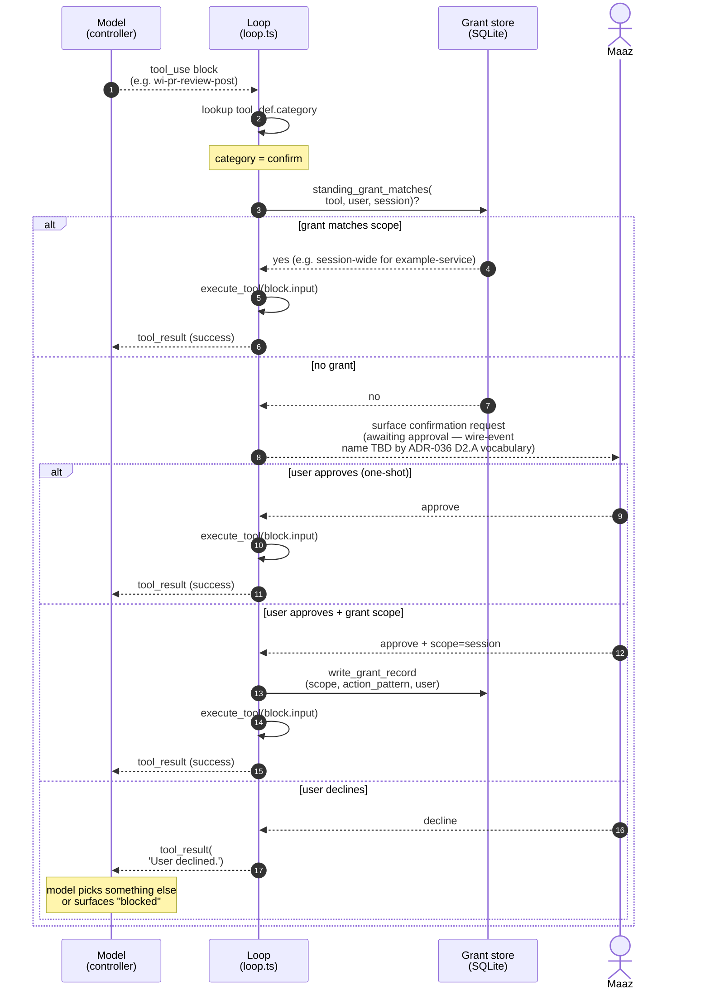
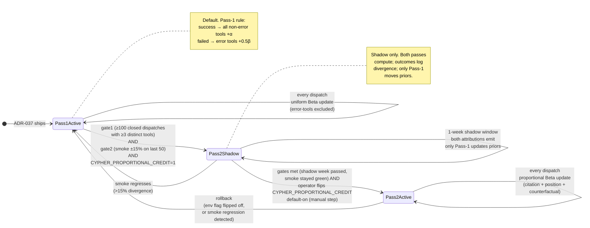
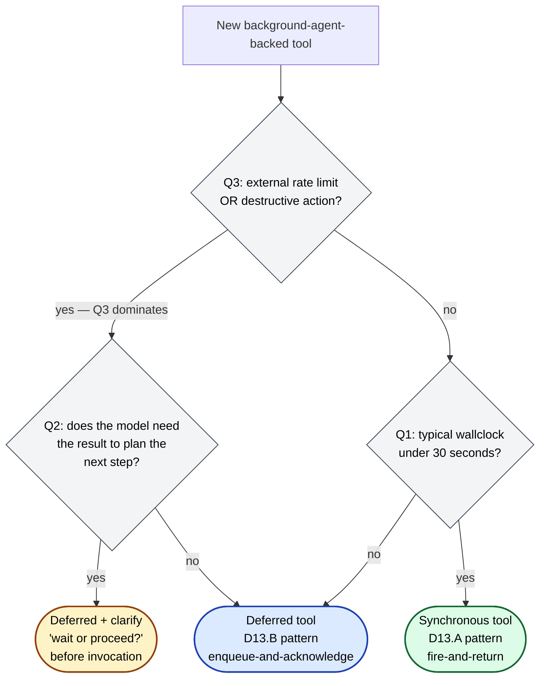
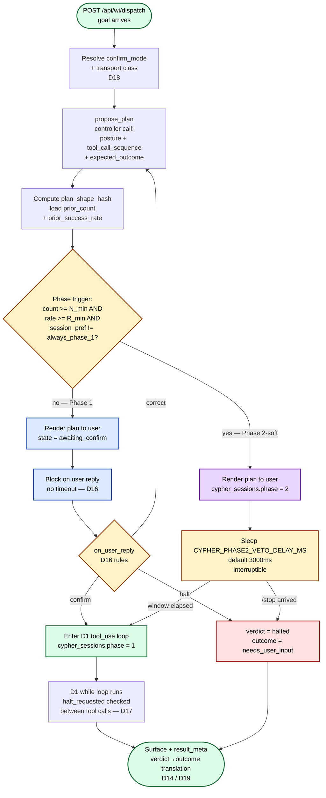
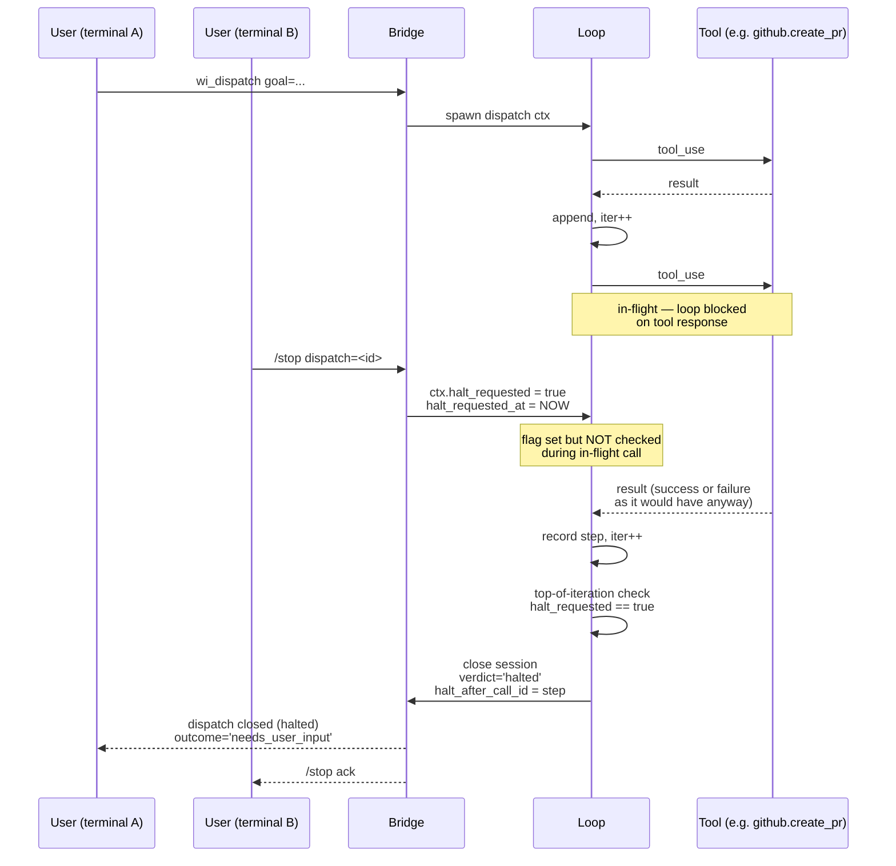
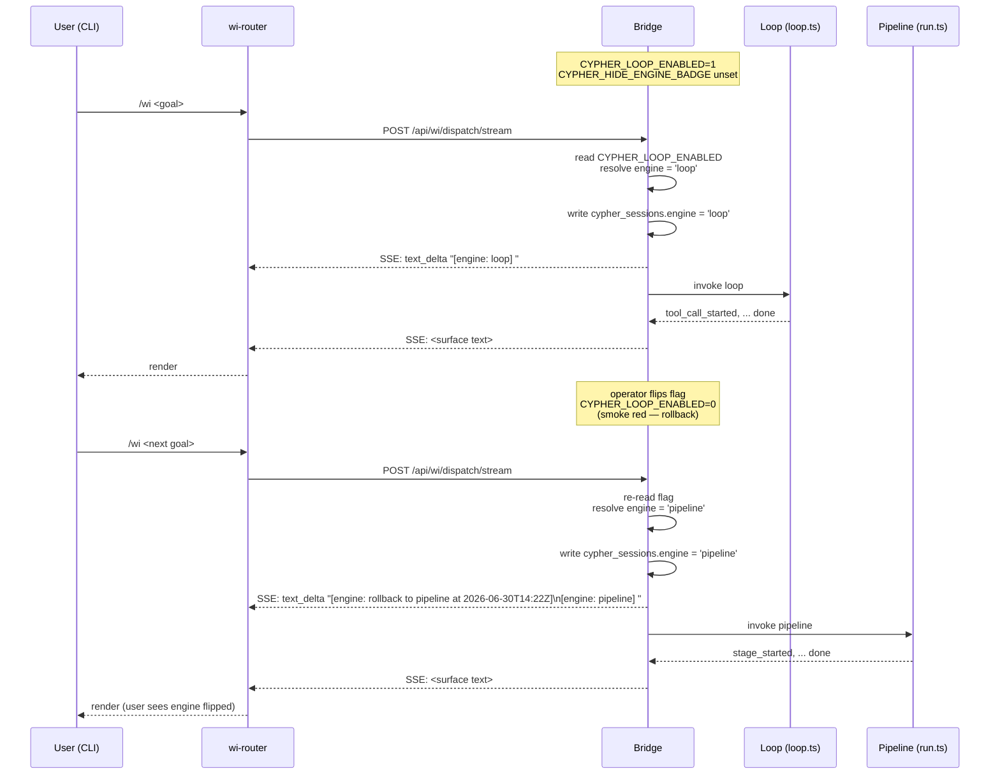

# ADR-037: Cypher Becomes a Tool-Use Loop — Replace the 9-Stage Pipeline with an Agentic Controller

**Status:** Accepted (2026-06-23 cutover). Originally Proposed 2026-06-16; flipped to Accepted at Phase 6 cutover when `CYPHER_LOOP_ENABLED` default flipped from `=== '1'` to `!== '0'` in `web-server.js` (commit on master). The pipeline path (`src/services/cypher/run.ts`) remains in the codebase for ≥4 weeks post-cutover per execution plan § 7 — rollback is a one-env-var flip (`CYPHER_LOOP_ENABLED=0`), no code change. Companion to [`CYPHER.md`](../../../CYPHER.md) — the canonical identity doc.

**Cutover accepted with explicit Phase 5 gate not formally met.** The user's protocol: monitor `/cypher/cost` post-cutover; if cost looks structurally bad, flip `CYPHER_LOOP_ENABLED=0` to revert; otherwise formally close Phase 5 with a decision after enough real-usage data accumulates. Documented in `15-SHADOW-MODE-METRICS.md`.

**Phase 5 closure verdict (2026-06-23):** ✅ **Proceed — Phase 6 stays.** 42 dispatches in the soak window with 0 silent confirm fires, 0 failures, 0 budget exhaustions, and 0 observed cost (the tool-use hot path did not exercise in any of the 42 sessions — all went through the cheap router path or were `iterations=0` smoke probes). Nothing observed argues for rollback. Loop's hot path remains under-exercised; observation continues during the run.ts-retention window. See [`15-SHADOW-MODE-METRICS.md § When Phase 5 closes`](../../../.planning/cypher/15-SHADOW-MODE-METRICS.md#when-phase-5-closes) for the full post-mortem table and what to monitor.

**Phase 7 pre-decided 2026-06-24 — landing 2026-07-21:** All Phase 7 quality gates cleared one day post-cutover (Q1 rollback events = 0, Q2 verdict rows with `iterations > 0` = 15 vs. ≥ 5 bar, Q3 `runLoop` token_usage = 35 rows / $1.31, Q4a silent confirm fires = 0, Q4b budget exhaustions = 0). The only remaining gate is the **4-week lower-bound landing date of 2026-07-21**, preserved as the calendar safety margin — *not* a fresh decision in mid-July. The original 2026-07-07 re-eval reminder (Apple Reminders `BFBEB7D4`, list `Atlas`) becomes a **regression-check** on that date rather than a fresh re-decision: if nothing has regressed AND the deletion PR is pre-staged, land at 2026-07-21. A second reminder due `2026-07-21T09:00` local is the actual land trigger. The dual-engine code path stays in master between now and 2026-07-21 as the rollback insurance; loop is the only engine going forward (see `CLAUDE.md` and `.claude/rules/cypher-discipline.md` — pipeline path is end-of-life).

**Cypher session:** TBD (this ADR will run through Cypher once the loop ships).
**Related:**
- [ADR-024](./adr-024-unified-brain.md) — Brain's structure. Brain becomes a tool the loop calls.
- [ADR-031](./adr-031-per-bucket-model-effort-config.md) — bucket discipline. The loop uses the `decide` bucket for the controller call.
- [ADR-033](./adr-033-cypher-framework.md) — Cypher framework. **Partially superseded** by this ADR (delta below).
- [ADR-034](./adr-034-cypher-learning-autonomy-engine.md) — learning engine. Reused unchanged.
- [ADR-036](./adr-036-cypher-cli-primary.md) — CLI primary surface. Reused; some sub-decisions reframed under the loop shape.
- [ADR-038](./adr-038-cypher-v2.5-production-grade.md) — v2.5 production-grade follow-up (task memory, project scoping, worktrees, Q-1.13 Option C, D19 Flavor B).

---

## Context

Cypher's vision (per [`CYPHER.md`](../../../CYPHER.md)) is *"the loop that uses Brain to do work like a senior engineer would."* The current implementation in `src/services/cypher/run.ts` is a **fixed 9-stage pipeline** that runs once, top-to-bottom, and returns. This shape cannot deliver the vision for three reasons:

### 1. No feedback between stages

A senior engineer reads, *thinks*, decides what to read next. Hits a wall, *backs up*, tries a different angle. Calls a tool, sees the result, decides whether to call another or stop.

`run.ts` runs **investigate → ask → research → plan → execute → quality_gate → confirm → surface → record** in a fixed order. Each stage sees the previous stage's output but **cannot loop back**. If the plan stage produces a bad plan, there is no mechanism to revise it before execute. If execute fails, the contract simply records the failure — there is no second attempt with a different tool.

### 2. Stages are partially stubbed

The contract is documented as nine stages with rich behavior. The code is not. Concrete stub markers in `run.ts`:

- **investigate** stage (line 262): `// v1: bounded — record entry/exit. Real probe (claude-mem hits, brain confidence) wires in v2 once we have a sync API to call.`
- **execute** stage: a single fetch to the chosen `/api/wi/*` endpoint — does not exercise multiple tools, does not adapt mid-execution.
- **quality_gate** and **confirm**: present in the contract; no enforcement code in production paths.

The doc describes intent. The code implements skeleton. The gap is structural — adding more stage-specific code makes the pipeline rigid in a different way; what's needed is a different control structure entirely.

### 3. Cypher reaches for ~3 of ~30 available tools

The bridge exposes Brain (`brain.recall`, `brain.decide`, `brain.verify` with 4 verifier adapters), palace (`palace.search`, `palace.recall`), code graph, FTS5, Jira MCP, GitHub MCP, smoke runner, typecheck runner, git, and the entire `wi-*` skill catalog. Cypher's run.ts touches three: clarify (Haiku), `getRankedSkills` (SQL), and an HTTP fetch to one chosen `wi-*` endpoint. **A senior wouldn't use 3 tools when 30 are sitting on the desk.**

The fix is not to add stages for each tool. It's to give the loop a tool catalog and let the LLM controller pick what to call next based on what just happened.

---

## Decision

**Cypher's runtime becomes an Anthropic tool-use loop, not a 9-stage pipeline.** The 9-step contract becomes the *system prompt* — guidance the controller follows because the prompt instructs it to, not because the code forces it to.

### D1 — The loop primitive

A bounded `while` loop driven by Anthropic's `tool_use` SDK feature:

```
controller_call:
  client.beta.promptCaching.messages.create({
    model: bucketCallParams(db, 'decide').model,
    system: SYSTEM_PROMPT_WITH_9_STEP_CONTRACT,
    tools: TOOL_CATALOG,
    messages: conversation_so_far,
    max_iterations: budget_per_session  // default 25
  })

while not done:
  response = controller_call()
  if response.stop_reason == 'end_turn':
    surface_to_user(response)
    break
  for tool_use_block in response.content where type == 'tool_use':
    if tool.category == 'confirm' and not has_standing_grant(tool, user):
      pause_and_ask_user(tool_use_block)
    result = execute_tool(tool_use_block)
    conversation_so_far.append(tool_use_block, result)
  if iterations > max_iterations or tokens > budget:
    break
```

The controller is **one function** in `src/services/cypher/loop.ts` (~200 LOC). It replaces the 733 LOC `run.ts` pipeline.

The same `while` as a flowchart, with the three exit paths (`end_turn`, budget, error) made explicit:

```mermaid
flowchart TD
    START([POST /api/wi/dispatch<br/>goal arrives]) --> INIT[Init: messages = goal<br/>iter = 0, tokens = 0]
    INIT --> CALL[controller_call<br/>messages.create<br/>system + tools + cache]
    CALL --> STOP{stop_reason?}

    STOP -->|end_turn| SURFACE[Surface text to user<br/>ledger row: cypher_outcomes.verdict='mixed'<br/>result_meta.outcome='success'<br/>&#40;D7 may flip ledger on next reply&#41;]
    STOP -->|max_tokens| BUDGET
    STOP -->|tool_use| BLOCKS[Iterate tool_use blocks]

    BLOCKS --> CAT{tool.category?}
    CAT -->|cli| BLOCKED[Reject — never registered<br/>&#40;should not happen&#41;]
    CAT -->|auto| EXEC[execute_tool block.input]
    CAT -->|confirm| GRANT{standing<br/>grant?}
    GRANT -->|yes| EXEC
    GRANT -->|no| ASK[Pause loop<br/>surface to user]
    ASK --> USER{user reply?}
    USER -->|approve| EXEC
    USER -->|approve + grant| WRITE_GRANT[Write grant scope] --> EXEC
    USER -->|decline| INJ_DECLINE[Inject 'User declined.'<br/>as tool_result]
    EXEC --> APPEND[messages.append<br/>assistant + tool_result]
    INJ_DECLINE --> APPEND

    APPEND --> COUNT[iter++<br/>tokens += usage]
    COUNT --> LIMITS{iter > 25<br/>OR tokens > 200K<br/>OR wallclock > 10m?}
    LIMITS -->|no| CALL
    LIMITS -->|yes| BUDGET[Surface budget message<br/>ledger row: cypher_outcomes.verdict='mixed'<br/>result_meta.outcome='budget_exhausted']
    BUDGET --> END
    SURFACE --> END([Return DispatchResult<br/>surface + result_meta])

    classDef start fill:#dcfce7,stroke:#166534,stroke-width:2px,color:#000
    classDef gate fill:#fef3c7,stroke:#92400e,stroke-width:2px,color:#000
    classDef exit fill:#fee2e2,stroke:#991b1b,stroke-width:2px,color:#000
    classDef ok fill:#dbeafe,stroke:#1e40af,stroke-width:1px,color:#000
    class START,END start
    class CAT,GRANT,USER,LIMITS,STOP gate
    class BUDGET,INJ_DECLINE,BLOCKED exit
    class CALL,EXEC,APPEND,SURFACE ok
```



Three things to read off the diagram:

1. **The bounded `while`** is the `CALL → STOP → BLOCKS → APPEND → COUNT → LIMITS → CALL` cycle. Every loop iteration costs one Anthropic call — **including the recovery turn after a user decline**: `INJ_DECLINE → APPEND → COUNT` re-enters the loop, so the model needs one more controller call to plan a new tool. The decline path is not free.
2. **The confirm gate (D5)** is the `CAT → GRANT → ASK` subtree. The user is the only path that lets a `confirm` tool execute.
3. **Two real exits + one defensive guard:** `end_turn` (the loop completed; surface answers the goal) and `budget` (iteration / token / wallclock cap hit) are the two ways every dispatch terminates in production. The `cli`-class branch (BLOCKED node) is a guard-rail, not a third exit — `cli` tools are filtered out at catalog registration and should never appear in a `tool_use` block at all. The branch exists in the diagram so the reader can prove the loop terminates safely *even if registration ever leaked a `cli` tool through* — but it should never fire. Both real exits return the same `DispatchResult` shape (surface + result_meta).

### D2 — The 9-step contract becomes the system prompt

The system prompt frames the contract as **the moves a senior engineer has available**, not a sequence to follow:

> You are Cypher, a senior software engineer agent inside Work Intelligence. When you receive a goal, you work through it like a senior engineer.
>
> The following nine moves describe how senior engineers think through tasks. **They are available moves, not a checklist.** Use them in whatever order the work calls for. Skip any that don't apply. A small goal might use two of these (Investigate → Execute). A large one might cycle through several multiple times (Investigate → Research → Plan → Execute → Quality gate → back to Research).
>
> - **Investigate** — read what's already known. Call `brain.recall`, `palace.search`, `claude_mem.search`, `cypher.recent_sessions` before deciding what to do. Don't repeat work the system has already done.
> - **Ask** — if the goal is ambiguous and the answer would change what you do, call `clarify` once with a targeted question carrying a default. Don't interrogate.
> - **Research** — gather facts the goal needs. `code_graph.search`, `fts.search`, `jira.fetch`, `github.fetch`, `wi-find-expert`. Stop when you have enough to plan.
> - **Plan** — emit a plan as text in your response. For heavy goals (`complexity.score >= 5`), the plan must include dependency steps. For light goals, a one-line plan is enough — or skip the move entirely.
> - **Execute** — call the right `wi-*` skill (or compose multiple). The skill catalog is in your tools. Beta priors are surfaced as `prior_mu` in each tool's description.
> - **Quality gate** — if your work changed code or schema, call `smoke.run` and `typecheck.run`. Don't declare done before they pass.
> - **Confirm** — if you must do something colleague-visible (Jira comment, PR push, Teams send, email send), the tool will pause the loop and ask Maaz. You will not be silently blocked.
> - **Surface** — your final response is what Maaz reads. Lead with the outcome. Cite paths/line numbers.
> - **Record** — call `cypher.record_outcome` with what you did, what worked, what didn't.
>
> **Heuristics, not laws:**
>
> - You don't need every move on every goal.
> - Investigate is cheap. Skipping it on heavy work is the most common senior-engineer mistake; don't make it.
> - Quality gate is non-negotiable when code or schema changed.
> - Confirm is a runtime gate — the loop will pause you, you don't need to ask permission in the prompt.
> - Record always runs at the end. The runtime calls it; you don't need to.

The contract is **prose, not control flow.** The model picks moves based on the goal in front of it; the runtime guards (confirm gate, budget, quality-gate-on-code-change check) are the enforcement layer. If the model deviates (skipping investigate on a heavy goal, declaring done before quality gate on a code change), the outcome ledger captures the mistake and the next dispatch's recall surfaces it as a learned pattern.

### D3 — Tools, not stages

The 9 stages collapse into a tool catalog. Every existing capability becomes a tool definition the controller can call:

| Old stage | New tools |
|---|---|
| Investigate | `brain.recall`, `palace.search`, `claude_mem.search`, `cypher.recent_sessions` |
| Ask | `clarify` (pauses loop, surfaces question to user, returns answer) |
| Research | `code_graph.search`, `fts.search`, `jira.fetch`, `github.fetch`, `wi-find-expert`, `wi-blast-radius`, `wi-pre-meeting`, etc. |
| Plan | (LLM emits plan as text — not a tool) |
| Execute | One tool per `wi-*` skill: `wi-pr-review`, `wi-jira-analyze`, `wi-investigate`, `wi-bug-report`, `wi-update-context`, etc. Plus `brain.decide` for structured decisions and `brain.verify` for claim verification. |
| Quality gate | `smoke.run`, `typecheck.run`, `lint.run` |
| Confirm | (runtime check on tool category — not a tool itself) |
| Surface | (LLM emits final response — not a tool) |
| Record | `cypher.record_outcome` |

Every tool has:
- a JSON schema (parameters)
- a category (`auto` / `confirm` / `cli` per ADR-036 D8 — `cli` tools are not registered with the loop)
- an estimated duration (per ADR-036 D8 metadata)
- a current Beta `prior_mu` injected into the description

### D4 — Beta priors bias tool selection, not stage execution

Today's `getRankedSkills` returns a sorted list to a stage that picks the top one. In the loop world, **priors are surfaced to the model as part of each tool's description:**

```
tool.description = "Run a PR review. Reads PR diff, runs WI context enrichment, returns review notes. Beta prior μ=0.78 (n=42)."
```

The model sees the prior and weights it against the goal. High-prior tools get reached for first by default; low-prior tools still appear when the goal demands them. **The model is the selector; the prior is a hint.** No stage forces the choice.

`recordSkillOutcomes` (ADR-034 L1) continues to update priors based on real outcomes. The signal flow is unchanged: outcome ledger → Beta(α,β) update → next dispatch's prior_mu reflects the new posterior.

### D5 — Confirm-class gate is a runtime check, not a stage

When the controller emits a `tool_use` block for a `confirm`-class tool, the loop pauses **before executing the tool**:

```
if tool_def.category == 'confirm' and not standing_grant_matches(tool, user, session):
  surface_confirmation_request(tool_use_block) -> user
  if user.declines:
    inject_decline_as_tool_result(tool_use_block, "User declined.")
    continue  // model picks something else
  if user.approves_with_grant_scope:
    write_grant_record(scope, action_pattern, user)
  execute_tool(tool_use_block)
```

The runtime owns the boundary. The model never directly executes `confirm`-class side effects. ADR-036 D8 categorization is enforced **at the loop layer**, not by trusting the model.

The full exchange when a `confirm` tool surfaces:



The model's view of the gate is uniform: it emits a `tool_use` block; later it sees a `tool_result`. Whether the result came from `execute_tool` or from the user's decline doesn't change the shape of the conversation — only the content. That's what lets the model recover gracefully when blocked, instead of hanging or hallucinating an unsuccessful side effect.

### D6 — Bounded loop with budget

Every dispatch gets a budget:

- `max_iterations` (default 25 — configurable via `CYPHER_MAX_ITERATIONS`)
- `max_input_tokens` per dispatch (default 200K — configurable via `CYPHER_MAX_TOKENS`)
- `max_wallclock_ms` per dispatch (default 10 minutes — configurable via `CYPHER_MAX_WALLCLOCK_MS`)

Budget overrun closes the loop with `outcome=mixed` and a "budget exhausted" surface message. No silent truncation. The user knows the loop hit a limit and can re-dispatch with a tighter goal or extended budget via flag.

### D7 — Streaming is per-tool-call, not per-stage

ADR-036 D2.A (hybrid SSE event granularity) is reframed:

- **Fine streaming** on the controller's text output (the model's narration of what it's doing and the final surface response) — words stream as the SDK delivers them. **This is what `thinking` means going forward** — it's the model talking, not a tool.
- **Coarse streaming** per tool call — one event when a `tool_use` block opens (`tool_call_started`), one event when it returns (`tool_call_completed`), with structured payloads.

Output kind metadata (D2.B `thinking | findings | signal | decision | side-effect-only | user-prompt`) attaches to **tools**, not stages. The mapping has one new category compared to ADR-036:

| Output kind | Tools | What the CLI shows |
|---|---|---|
| `thinking` | (controller text deltas — not a tool) | Streamed words as the model narrates. |
| `findings` | `brain.recall`, `palace.search`, `code_graph.search`, `fts.search`, `wi-pre-meeting`, `wi-blast-radius` | Structured result block. |
| `signal` | `smoke.run`, `typecheck.run`, `lint.run`, `brain.verify` | Pass/fail badge + summary. |
| `decision` | `brain.decide`, `wi-jira-analyze`, `wi-pr-review` | Decision card with confidence + alternatives. |
| `side-effect-only` | `wi-pr-create`, `wi-bug-report`, `wi-update-context` | "Did X" confirmation row. |
| `user-prompt` (NEW) | `clarify` | Pause-and-ask UI. The loop pauses; the CLI surfaces the question; user replies; the loop resumes with the answer injected as the tool result. |

`clarify` is **not** thinking — it's an interrupt to the user. Calling it `user-prompt` in the metadata makes the CLI render it as a question waiting for input rather than as a stream of model words. Bug-fixing this category split early avoids the CLI rendering a Haiku-generated question as a thinking block.

### D8 — Heavy/light is a routing hint, not a separate path

Today's `complexity.scoreComplexity` returns `light | heavy`. Today's pipeline branches on this — light skips planning, heavy runs full ceremony.

Under the loop, **complexity is a system prompt addendum, not a code branch:**

- `light` → "This goal is small. You probably don't need investigate/research/quality_gate. One or two tool calls and surface."
- `heavy` → "This goal is large. Plan in waves. Engage Maaz before executing destructive steps. Run quality_gate before declaring done."

The model adjusts behavior based on the prompt addendum. One code path, two postures. ADR-036 D4's "natural-language understanding is the plan stage's job" composes naturally with this — heavy goals where the model emits a multi-step plan get more loop iterations; light goals finish in 2-3.

### D9 — Outcome capture (ADR-036 D7) is unchanged

When the loop ends, write `outcome=mixed` to `cypher_sessions` (no Beta movement yet). On the user's next `/wi`, ADR-036 D7's classifier reads the user's preceding message + the prior dispatch's surface output, classifies as correction/continuation/unrelated, flips `mixed → success | failed`, and `recordSkillOutcomes` updates priors for **every** tool the loop invoked (not just one chosen skill).

This generalizes ADR-034's CAP-12-FIX from "one skill per dispatch" to "many tools per dispatch."

#### D9.1 — Two-pass credit assignment (with explicit triggers)

Pass 1 ships with the loop and uses the simplest defensible attribution:

> **Pass-1 rule:** apply the dispatch verdict (`success` / `failed`) uniformly to every tool the loop invoked, **excluding** tools whose `tool_result` was an error. Tools that returned errors get no Beta movement on a `success` outcome (they didn't help) and `+0.5β` on a `failed` outcome (they contributed to the failure).

Pass 2 — proportional credit — is an ADR-034 evidence-pulled refinement, **not** a vague "refine later." It fires when **both** of these are true on the rolling 30-day window:

1. **Evidence threshold:** ≥ 100 closed dispatches with ≥ 3 distinct tools each have accumulated. Below this, Pass-2 priors are too sparse to be more accurate than Pass-1.
2. **Smoke gate:** a new smoke section verifies that for the last 50 dispatches, Pass-2's per-tool attributions agree with Pass-1's whole-dispatch verdict to within ±15% on the dominant tool. (i.e. Pass-2 doesn't wildly disagree with the simple rule on the average case before being trusted on the edge cases.)

When both fire, Pass-2 attribution comes online behind the `CYPHER_PROPORTIONAL_CREDIT=1` flag and runs in shadow mode for 1 week — emitting both attributions, recording divergence, but only Pass-1 updates priors. After the shadow week, if the smoke gate stays green, Pass-2 takes over and the flag flips to default-on.

The trigger structure is identical to ADR-034 L2's promotion of Bayesian selection out of shadow mode. **No "refine later" without a measurement that says it's time.**



The diagram makes three properties visible:

1. **Pass-1 is the floor.** Every state has a path back to Pass-1; nothing requires Pass-2 to be running.
2. **Two independent gates** (≥100 dispatches AND ±15% smoke agreement) must *both* fire before Pass-2 even enters shadow. Either gate failing alone keeps the system on Pass-1.
3. **Shadow mode is not a celebration; it's a probation.** A 1-week shadow window with a green smoke gate is the *minimum* — promotion to Pass-2 active requires an **operator manually flipping `CYPHER_PROPORTIONAL_CREDIT` default-on** after reviewing the shadow data. The gates qualify the system for promotion; a human still ratifies it.

#### D9.2 — What Pass-2 looks like (sketch — final shape decided in PLAN.md)

Pass-2 weights each tool's contribution by:
- whether the tool's output was *cited* in the controller's final surface response (extracted via the `tool_use_id` referenced in the response text),
- the position of the tool call in the loop (early `findings` calls that informed many later steps weight more than late `signal` calls),
- whether the tool's result changed the loop's trajectory (measured by whether the next tool call would have been the same without this tool's result — counterfactual baseline from priors).

The exact formula is open. The trigger is not.

### D14 — `result_meta`: structured handoff for outer-loop consumers

Cypher's loop is consumed by other agentic systems (Hermes-Agent, n8n, custom MCP clients). Surface text alone forces those consumers to pattern-match prose to decide retry/escalate/done. That's brittle and undermines the layered-agentic design (see [`CYPHER.md` § Layered agentic architecture](../../../CYPHER.md)).

> **Two outcome enums, on purpose.** WI keeps two distinct outcome vocabularies for two different audiences. They don't conflict; they answer different questions:
>
> | Enum | Where | Values | Audience | Question it answers |
> |---|---|---|---|---|
> | **Ledger verdict** (ADR-034 L1) | `cypher_outcomes.verdict` (DB row written every dispatch) | `success` · `mixed` · `failed` | Beta-priors learning loop | "Did this dispatch help or hurt the running average?" `mixed` means "not yet classified — wait for D7 to flip on next reply." |
> | **`result_meta.outcome`** (this section) | JSON returned over MCP / SSE | `success` · `partial` · `blocked` · `needs_user_input` · `budget_exhausted` · `error` | Outer ReAct (Hermes), automation, CLI renderer | "What should the caller do next?" |
>
> A single dispatch writes both. They're set independently. Example: a dispatch that hit the iteration cap writes `verdict='mixed'` (the priors loop hasn't been told it failed yet — the user's next reply will classify it via D7) AND returns `outcome='budget_exhausted'` (the outer loop knows immediately that scope reduction or extension is needed). The diagram in D1 annotates both values at each terminal node so the two are never conflated.

Every dispatch returns **two payloads**:

```typescript
type DispatchResult = {
  surface: string;                    // human-readable answer for the user
  result_meta: {
    outcome: 'success' | 'partial' | 'blocked' | 'needs_user_input' | 'budget_exhausted' | 'error';
    confidence: number;               // 0.0-1.0; controller's self-assessed confidence
    iterations: number;               // tool calls used
    tokens_used: number;              // total input+output across the loop
    tools_invoked: Array<{
      name: string;
      tool_use_id: string;
      success: boolean;
      duration_ms: number;
    }>;
    deferred_actions?: Array<{        // confirm-class tools the loop wanted but didn't run
      tool: string;
      args: object;
      reason: string;                 // 'awaiting_user_confirmation' | 'category_blocked' | ...
    }>;
    asks_for_user?: Array<{           // open questions surfaced via clarify
      question: string;
      context: string;
      tool_use_id: string;
    }>;
    citations?: Array<{               // tool outputs the surface response cites
      tool_use_id: string;
      tool_name: string;
    }>;
    cypher_session_id: string;        // for downstream JOIN against cypher_sessions
  };
};
```

**Outcome semantics:**
- `success` — loop completed, surface answers the goal.
- `partial` — loop completed but goal had multiple parts, only some addressed (with deferred_actions or asks_for_user populated).
- `blocked` — loop ran but couldn't proceed (missing info, missing permission, broken tool).
- `needs_user_input` — loop paused on a `clarify` or confirm-class tool; asks_for_user populated.
- `budget_exhausted` — D6 budget hit before goal completion.
- `error` — runtime exception (controller crashed, tool execution panic).

**Hermes (or any outer ReAct consumer) reads `result_meta` to decide:**

```pseudo
if outcome == 'success' && confidence > 0.7:
    summarize surface for user, done
elif outcome == 'needs_user_input':
    escalate asks_for_user to user, wait
elif outcome == 'blocked':
    refine goal based on result_meta.deferred_actions, retry once
elif outcome == 'partial':
    surface partial result + ask user about deferred_actions
elif outcome == 'budget_exhausted':
    suggest scope reduction OR escalate
elif outcome == 'error':
    escalate with full error trace
```

**MCP integration:** `wi_dispatch` returns the `DispatchResult` shape via JSON-RPC. CLI consumers render `surface` and ignore `result_meta`. Programmatic consumers (Hermes, automation) read both.

**Verdict → outcome translation (the boundary that protects Contract B):**

The internal `cypher_outcomes.verdict` (Contract A) is open and grows freely as the loop adds new internal states. The external `result_meta.outcome` (Contract B) is closed at v2.0 launch with the six values listed above. Every internal verdict maps to exactly one external outcome via this translation, applied in the `wi_dispatch` response wrapper:

| `verdict` (internal, Contract A) | `outcome` (external, Contract B) | Notes |
|---|---|---|
| `success` | `success` | normal completion |
| `mixed` | `partial` | some steps succeeded, some didn't |
| `failed` | `error` | unhandled exception or hard failure |
| `halted` | `needs_user_input` | user `/stop` (Q-1.12); could resume on next reply |
| `abandoned` | `error` | terminal disconnect or 24h cleanup sweep (Q-1.11) |
| `rejected_non_interactive` | `error` | `confirm_mode` mismatch with transport (Q-1.13) |

Internal verdicts may grow freely post-v2.0; each new value MUST add a row to this translation map but Contract B stays at six external values. Full evolution policy lives in **D19**.

**Storage:** `result_meta` is written verbatim to `cypher_sessions.result_meta` (new column, JSON). This makes every dispatch's structured outcome queryable for analytics and for ADR-036 D7 classification.

**Cost:** ~2-5KB additional response payload per dispatch. Negligible.

**Why this is required, not optional:** without it, the layered-agentic design (CYPHER.md § Layered agentic architecture) doesn't compose. Hermes's outer ReAct cannot evaluate a Cypher result by reading prose. Every framework that consumes Cypher would re-invent its own brittle prose-parsing layer.

### D10 — What dies

- **`src/services/cypher/run.ts`** — 733 LOC of pipeline. Replaced by `src/services/cypher/loop.ts` (~200 LOC).
- **The 9-stage `cypher_steps` row pattern** — `cypher_steps` table survives, but rows now record tool calls, not stage transitions. Migration: existing rows stay readable; new rows have `step_kind='tool_call'` instead of `step_kind='stage'`.
- **Stage-specific stub code** — investigate's "v1 stub" comment, execute's single-skill-fetch hardcoding, quality_gate's missing enforcement. All replaced by tool definitions the loop sees uniformly.
- **The "depth ≤ 2 invariant"** — already amended by ADR-036, but the loop architecture removes the rationale entirely. The loop is depth-N by design; the depth-≤-2 framing made sense for the pipeline shape and is dead under the new shape.

### D11 — What survives

Splitting this into two groups so the spike doesn't surprise itself.

#### D11.A — Survives **untouched** (same code, same callers, same shape)

- **All schema** (`cypher_sessions`, `cypher_outcomes`, `skill_priors`, `work_items`, `work_item_links`, `skill_gap_observed`, `skill_proposals`).
- **Beta priors math** in `learn.ts`: `betaPosterior`, decay rules, Thompson sampling per ADR-034 L2.
- **Multi-signal aggregation** in `outcomes.ts` (ADR-034 L1). Same code, same SQL.
- **Complexity scoring math** in `complexity.ts` (`scoreComplexity`, the 8 signals + thresholds). Same function; the call site moves from the pipeline branch to the system-prompt assembler.
- **Clarify Haiku call** in `clarify.ts`. Becomes the implementation of the `clarify` tool — same model call, same JSON schema, different invocation site (called by the runtime when the controller emits a `tool_use` for `clarify`).
- **PM lens** in `pm.ts` / `pm-auto.ts` / `pm-seed.ts` / `drift.ts`. Unchanged.

#### D11.B — Survives but **called differently** (real refactor surface)

These files survive the cutover but their interfaces change. **The spike will discover surprises here, not in D11.A.**

- **`memory.ts` — saved-context pull.** Today: one cold-start helper that returns a single payload. Under the loop: split into two distinct tools — `cypher.recent_sessions` (returns last N sessions for the same user/goal pattern) and `cypher.saved_context` (returns the cacheable prefix for the loop's prompt cache). Same data sources; different access shapes; new JSON schemas.
- **`learn.ts` — `recordSkillOutcomes` signature change.** Today: `recordSkillOutcomes(skillName: string, outcome: Verdict)`. Under the loop: `recordSkillOutcomes(toolNames: string[], outcome: Verdict, contributions: Map<string, ContributionMetadata>)` per D9.1 / D9.2. Pass-1 contributions are uniform; Pass-2 contributions are proportional. Callers updated.
- **`skills.ts` — `SKILL_CATALOG` becomes a tool generator.** Today: `SKILL_CATALOG` is a flat array consumed by the candidate ranker. Under the loop: each entry must additionally produce a tool definition (description + JSON schema + category + duration estimate + injected `prior_mu`). New helper: `skillToToolDef(skill, db)` that builds the tool entry the loop sees.
- **`candidates.ts` — eviscerated.** Today: `resolveCandidates(goal, taskClass, db, override?)` returns a ranked candidate list to the pipeline's research stage. Under the loop: the controller picks tools directly from the catalog using `prior_mu` injected into descriptions. `resolveCandidates` survives only as a helper for the `prior_mu` enrichment pass — most of the file becomes unused.
- **`run.ts` — replaced wholesale by `loop.ts`.** Listed here for completeness; this is the largest single delta and is fully covered in D10.

The spike (Migration step 1) targets D11.B specifically — proving that `memory.ts` + `learn.ts` + `skills.ts` can be refactored against a real loop call without breaking the rest. D11.A files are left alone in the spike on purpose; if the spike has to touch them, that's a signal something is wrong with the design.

### D12 — Migration: spike → walk-in → sunset

1. **Spike** (1-2 days): one-file proof of the loop pattern with 5 tools (`brain.recall`, `fts.search`, `wi-pr-review`, `clarify`, `cypher.record_outcome`). Real Anthropic call. Real bridge. Real outcome write. Validate the primitive works before committing to the larger refactor.
2. **Parallel run** (1-2 weeks): loop available behind a flag (`CYPHER_LOOP_ENABLED=1`). Default off. `/api/wi/dispatch` continues to call `run.ts`. `/api/wi/dispatch/stream` calls the loop when the flag is on. Compare outcomes side-by-side on real dispatches.
3. **Catalog migration**: every tool in the loop's catalog gets validated. Smoke check: every `wi-*` skill has a corresponding tool definition with valid JSON schema.
4. **CLI cutover (BREAKING — explicit step)**: the SSE event schema changes from `stage_started` / `stage_completed` to `tool_call_started` / `tool_call_completed` / `text_delta` / `done`. **Every existing CLI installation needs a fresh `wi-router` SKILL.md before this step lands** — the old renderer cannot consume the new events. Migration sub-steps:
   - **4a.** Ship the new `wi-router` SKILL.md that consumes both event schemas (old + new) with auto-detection. This is the *only* version that can survive the cutover.
   - **4b.** Run `bash scripts/install-skills.sh` (or `/wi-skill-install`) on every machine that has WI installed — rebuilds top-level + Hermes-side symlinks against the new SKILL.md. **Smoke check verifies the deployed version supports both schemas before the flag flips.**
   - **4c.** Flip `CYPHER_LOOP_ENABLED=1` by default. The new SKILL.md auto-detects new events; old SKILL.md installations would silently render nothing — hence step 4a is non-negotiable.
   - **4d.** After two weeks of stable operation, drop old-schema support from `wi-router` SKILL.md (smaller, simpler renderer).
5. **HTTP cutover for non-streaming callers**: `/api/wi/dispatch` (non-streaming) starts running the loop with a "run-to-completion, return final response" wrapper. Response shape (`{ session_id, chosen_skill, summary, ... }`) is preserved — the wrapper extracts the final surface response from the loop and packs it into the legacy shape. ADR-036 D9's compatibility guarantee holds.
6. **Sunset (DEFERRED 2026-06-23)**: delete `run.ts`. Update ARCHITECTURE.md § 5 to reflect the loop. Mark ADR-033's pipeline framing as superseded (this ADR). **Remove the EXTMCP forward-looking footnote in [`CYPHER.md` § MCP integration](../../../CYPHER.md)** — once `jira.fetch` and `github.fetch` are first-class catalog entries, the today-vs-target distinction the footnote calls out becomes wrong (target *is* today). This ties cleanup of the ADR-induced doc-debt to the migration step that triggers it. **2026-06-23 update — Phase 7 is deferred with a calendar reminder, not auto-firing at the 4-week mark.** Re-evaluation due `2026-07-07T09:00` local (Apple Reminders, list `Atlas`); at that re-eval, delete if retention-window gates have cleared, otherwise keep and set another reminder. See `15-SHADOW-MODE-METRICS.md § Phase 7 (deferred — 2026-07-07 re-eval)` for the gate questions.

The same six steps as a flowchart, with the `CYPHER_LOOP_ENABLED` flag state and the rollback arrows visible. Steps 4a–4d implement the dual-schema → single-schema cutover for SSE events; the "old-schema" / "new-schema" framing refers to [ADR-036 D2.A's event vocabulary](./adr-036-cypher-cli-primary.md#d2a--sse-event-granularity-hybrid) (`stage_started`/`stage_completed` → `tool_call_started`/`tool_call_completed`/`text_delta`/`done`).

```mermaid
flowchart LR
    SPIKE["[PRE] 1. Spike<br/>scripts/spike-cypher-loop.ts<br/>5 tools · 1 goal · stand-alone<br/>flag: n/a"]
    PARALLEL["[PRE] 2. Parallel run<br/>loop.ts wired to /stream route<br/>run.ts still on /dispatch<br/>flag: ENABLED=0 default"]
    CATALOG["[PRE] 3. Catalog migration<br/>every wi-* skill → tool def<br/>JSON schema smoke<br/>flag: ENABLED=0"]
    CLI4A["[STAGE] 4a. wi-router SKILL.md<br/>dual-schema renderer<br/>(old + new events)"]
    CLI4B["[STAGE] 4b. install-skills.sh<br/>top-level symlinks rebuilt<br/>smoke: dual-schema OK"]
    CLI4C["[CUT] 4c. CLI cutover<br/>flag: ENABLED=1 default<br/>SSE events flip to<br/>tool_call_*"]
    CLI4D["[CUT] 4d. +2 weeks stable<br/>drop old-schema branch<br/>from wi-router"]
    HTTP["[CUT] 5. HTTP cutover<br/>/api/wi/dispatch wraps loop<br/>legacy response shape preserved<br/>(ADR-036 D9 compat)"]
    SUNSET["[DEFERRED] 6. Sunset<br/>delete run.ts (-733 LOC)<br/>update ARCHITECTURE.md § 5<br/>mark ADR-033 § 4 superseded<br/>remove EXTMCP forward-looking<br/>footnote in CYPHER.md<br/>━━━━━━━━━━<br/>DEFERRED 2026-06-23<br/>re-eval reminder 2026-07-07"]

    SPIKE -->|primitive proven| PARALLEL
    PARALLEL -->|outcomes diverge<br/>or smoke fail| SPIKE
    PARALLEL -->|side-by-side OK| CATALOG
    CATALOG --> CLI4A
    CLI4A --> CLI4B
    CLI4B -->|smoke green| CLI4C
    CLI4B -.->|smoke fail| CLI4A
    CLI4C -->|2 weeks stable| CLI4D
    CLI4C -.->|regression: redeploy<br/>old SKILL.md + flip flag off| CLI4B
    CLI4D --> HTTP
    HTTP --> SUNSET

    classDef pre fill:#fef3c7,stroke:#92400e,stroke-width:2px,color:#000
    classDef shadow fill:#dbeafe,stroke:#1e40af,stroke-width:2px,color:#000
    classDef cutover fill:#fee2e2,stroke:#991b1b,stroke-width:2px,color:#000
    classDef done fill:#dcfce7,stroke:#166534,stroke-width:2px,color:#000
    class SPIKE,PARALLEL,CATALOG pre
    class CLI4A,CLI4B shadow
    class CLI4C,CLI4D,HTTP cutover
    class SUNSET done
```



Read the phase tags (color reinforces — accessible without it):

- **`[PRE]` (1–3, yellow)** — pre-cutover work. The loop exists; nobody depends on it yet. Rollback is free.
- **`[STAGE]` (4a–4b, blue)** — staging. Skill files updated everywhere; the flag has not flipped. **Last point at which rollback costs nothing.**
- **`[CUT]` (4c–5, red)** — cutover. The loop is live. Rollback at 4c means **flipping the flag back off and redeploying old SKILL.md** (dotted arrow back to 4b — the SKILL.md staging) — not unwinding the parallel-run wiring. The 4b/4c gap is the smallest reversible step; that's why the rollback target is 4b, not "all the way back to parallel run." Going further back is re-architecting, not regression recovery.
- **`[DONE]` (6, green)** — terminal. `run.ts` is gone; there is no rollback target. Only forward.

The discipline this encodes: **two separate gates** before the user-visible flag flips (4b smoke green AND 2-week stability at 4c). Either gate failing alone keeps the system on `run.ts`.

### D13 — Background-agent tools: synchronous-vs-deferred contract

`CYPHER.md` § Runtime topology says background agents (BugInvestigator, OrchestratorAgent, MeetingPrepAgent, etc.) are siblings to Cypher and that "Cypher *invokes* them as tools when relevant." This ADR fixes the precise contract so the spike doesn't drift on it.

Background agents fall into two patterns under the loop:

#### D13.A — **Synchronous tools** (fire-and-return)

These wrap an agent's underlying primitive and call it directly, bypassing the polling loop:

| Tool | Underlying agent | Pattern |
|---|---|---|
| `bug.investigate` | BugInvestigatorAgent | Calls `investigateBug(bugId, db, palace)` from `src/intelligence/bug-investigator-agent.ts` directly. Does NOT enqueue work for the agent's 5-min poll. Returns the structured `InvestigationDecision` (`{root_cause, files_to_change, suggested_patch, confidence}`) synchronously. Per-hour budget cap from `BUG_INVESTIGATOR_MAX_PER_HOUR` is shared between the agent's polling path and the synchronous tool path — a single counter governs both. |
| `pr.enrich` | (no agent — direct service) | Calls the PR enrichment service synchronously; returns the enriched context. |
| `code_graph.blast_radius` | CodeGraphIndexer | Reads pre-computed graph state from `code_graph_*` tables. Does NOT trigger reindexing. |

Synchronous tools are right when the user is **waiting for the answer in `/wi`** and the work is bounded enough to complete inside the loop's iteration budget (typical < 30s). Bug investigation fits because each investigation is one brain call; PR enrichment fits because it's pure DB+Git reads.

#### D13.B — **Deferred tools** (enqueue-and-acknowledge)

These enqueue work for the agent's next poll cycle and return immediately:

| Tool | Underlying agent | Pattern |
|---|---|---|
| `bug.resolve_attempt` | BugResolverAgent | Enqueues to `bugResolverInstance.queue` (1s heartbeat drains it). Returns `{ enqueued: true, expected_completion_window_ms: ~1000 }`. The loop continues; the user gets a "resolution running in background" surface. Outcome is NOT recorded against this `wi_dispatch` session — the resolver's commit lands separately and gets its own `bug_resolutions` audit row. |
| `correlate.run_now` | CorrelationAgent | Enqueues a one-shot run. Returns `{ enqueued: true }`. Result lands in `proactive_queue` later; user sees it via SSE at the next chat-panel drain. |
| `sync.start` | SyncService | Enqueues a sync. Returns `{ enqueued: true, sync_id }`. |

Deferred tools are right when the work is **long-running** (BugResolver does git-apply + typecheck + commit, can take minutes), **rate-limited externally** (sync hits Jira/Teams APIs), or **better surfaced asynchronously** (correlation digests aren't decision-blocking).

#### D13.C — The decision rule

When adding a new background-agent-backed tool, classify by these questions:

1. **Is the typical wallclock under 30 seconds?** Yes → synchronous candidate. No → deferred.
2. **Does the user need the answer to continue the loop?** Yes → must be synchronous (deferred can't return data the model needs to plan the next step).
3. **Is there an external rate limit or destructive action involved?** Yes → deferred (queue absorbs bursts; audit trail is per-job, not per-loop).

If 1 and 2 say synchronous but 3 says deferred, the answer is deferred — destructive/rate-limited wins. If the model needs the result, `clarify` the user with "this will take a few minutes; do you want me to wait or proceed and surface the result later?"

The same rule as a decision tree. Read top-down; the rate-limit/destructive question (Q3) overrides the others when it's "yes":



**Q3 is the gate that dominates.** If the action is destructive or rate-limited externally, the answer is "deferred" regardless of what Q1 says — only Q2 (does the model need the result to keep planning?) decides between plain `deferred` and the `deferred + clarify` compromise. If Q3 is no, Q1's wallclock check alone settles it: synchronous when fast, deferred when slow.

Worked examples (matching D13.A and D13.B tables):

| Tool | Q1 (≤30s?) | Q2 (needs result?) | Q3 (destructive/rate-limited?) | Verdict |
|---|---|---|---|---|
| `bug.investigate` | yes (one brain call) | yes | no (idempotent read) | **synchronous** (D13.A) |
| `code_graph.blast_radius` | yes (DB read) | yes | no | **synchronous** (D13.A) |
| `pr.enrich` | yes | yes | no | **synchronous** (D13.A) |
| `bug.resolve_attempt` | no (git apply + typecheck + commit) | no (commit lands separately) | yes (destructive — git mutation) | **deferred** (D13.B) |
| `correlate.run_now` | no | no | no, but long-running | **deferred** (D13.B) |
| `sync.start` | no | no | yes (Jira/Teams API rate limits) | **deferred** (D13.B) |
| (hypothetical) `coverage.generate` | no | yes (model needs to plan) | no | **deferred + clarify** (D13.D compromise) |

#### D13.D — Why not just always synchronous?

Two reasons. **First**, deferred work has its own lifecycle (BugResolver's `bug_resolutions` audit table; SyncService's per-source cursors). Folding that into a `cypher_sessions` row would muddle which engagement owns which side effect. **Second**, polling agents have built-in rate limiting (`BUG_INVESTIGATOR_MAX_PER_HOUR=10`, `SYNC_INTERVAL_MS=15min`). Bypassing them for synchronous tools means re-implementing those limits in the tool layer — duplicative, and the polling agent's limits get out of sync.

The synchronous/deferred split keeps each lifecycle clean. The trade-off is that the loop sometimes can't directly observe the result of work it triggered — but that's fine: the user gets the proactive notification, and the next dispatch's `brain.recall` will surface the outcome.

---

### D15 — Plan-Confirm-Act control flow + Phase 2 trigger predicate

The bare `tool_use` loop from D1 is not the v2.0 shape. Q-1.1 collapsed the posture-decision question into a **two-phase plan-confirm-act control flow**: posture is a property of the proposed plan, not a property of the dispatch contract. v2.0 implements this as a wrapper around the D1 loop — `propose_plan` runs first, then either waits for confirmation (Phase 1) or proceeds with a veto window (Phase 2-soft) into the existing `tool_use` body.

**Phase trigger predicate (Q-1.10):** Phase 2-soft activates iff a count gate AND a success-rate modulator AND the user's session preference all clear. Any leg failing falls back to Phase 1 (explicit confirm required).

```
runs_phase_2_soft(goal, plan_shape) =
    count(confirmed_dispatches_with_similar_plan_shape) >= CYPHER_PHASE2_COUNT_MIN  // default 3
  AND
    success_rate(those_dispatches) >= CYPHER_PHASE2_RATE_MIN                        // default 0.8
  AND
    session_pref != 'always_phase_1'                                                // CYPHER_CONFIRM_MODE
```

**Plan-shape similarity (v2.0 lock):** exact match on `(posture, tool_call_sequence)` ignoring tool arguments. `plan_shape_hash` is computed at plan time and persisted to `cypher_sessions`. Embedding-based similarity is v2.5 work.

**Phase 2 is soft, not silent.** Plan visibility is preserved in both phases — Phase 2-soft only skips the wait-for-confirm step. Phase 2-hard (silent execution from priors, no plan render) is rejected.

The amended loop diagram, with the three exits from `propose_plan` made explicit:



**What changes in `cypher_sessions`:** new columns `phase ∈ {1, 2}`, `plan_shape_hash TEXT`, `prior_count INTEGER`, `prior_success_rate REAL`. These feed the trigger predicate and let v2.5 W1 derive evidence-based defaults from real data.

**Override surface:** per-session via `CYPHER_CONFIRM_MODE ∈ {auto, always}` and per-dispatch via the inline modifier `/wi --confirm <goal>`.

### D16 — Confirmation interaction protocol

Q-1.11 locks three things at the confirmation boundary: the message shape (free-text with pattern match + length-aware fallback), the wait policy (no timeout), and the Phase 2-soft veto window (3 seconds, configurable).

**Free-text classifier rules** (the only logic that runs on `awaiting_confirm` user replies — no slash-commands, no model call):

```
on_user_reply(reply):
    normalized = lowercase(strip(reply))

    if starts_with_any(normalized, ["yes", "y", "go", "do it", "confirm",
                                    "ok", "okay", "lgtm", "ship", "proceed"])
       AND length(normalized) <= 20:
        log confirmation_method = 'pattern_confirm'
        → confirm

    elif starts_with_any(normalized, ["no", "stop", "wait", "cancel",
                                       "halt", "abort", "hold"])
       AND length(normalized) <= 20:
        log confirmation_method = 'pattern_halt'
        → halt

    elif length(normalized) > 20:
        log confirmation_method = 'length_correct'
        → correct  // full reply becomes the correction; loop re-proposes

    else:
        re-prompt("I read that as ambiguous — confirm to proceed,
                   or describe what to change?")
        log confirmation_method = 'reprompt_{confirm|halt|correct}'
                                  // depending on the second-pass classification
```

> **Length-20 is the discriminator, not a magic constant.** Short affirmatives ("yes", "lgtm") are unambiguous; anything longer is plausibly a qualification ("yes but only for BD-2871") and routes to `correct` rather than guessing. The starter list and cutoff are tuned post-launch from `confirmation_method` audit data.

**No timeout on Phase 1 wait.** The dispatch blocks indefinitely on stdin. Resource hygiene comes from three independent signals, not a clock:

1. **Explicit `/stop`** from any terminal pointing at the bridge halts the dispatch (`verdict='halted'`).
2. **Transport-disconnect detection** — the bridge's existing streaming-liveness signal closes the dispatch with `verdict='abandoned'`.
3. **Bridge-startup cleanup sweep** — on boot, `UPDATE cypher_sessions SET verdict='abandoned' WHERE state='awaiting_confirm' AND opened_at < NOW() - 24h`. The 24h floor is deliberately loose so genuine overnight-thinking sessions survive.

**Phase 2-soft veto window.** After the plan renders, the loop sleeps `CYPHER_PHASE2_VETO_DELAY_MS` (default `3000`) before firing the first tool call. The sleep is interruptible by `/stop`. Setting the env var to `0` disables the window for trusted batch sessions; setting it higher widens it. Subsequent tool calls fire without per-call delays.

**Audit:** `cypher_steps.confirmation_method TEXT NULL` is written on every plan-confirm row. Six values: `pattern_confirm`, `pattern_halt`, `length_correct`, `reprompt_confirm`, `reprompt_halt`, `reprompt_correct`. Misclassification rates are queryable post-launch and feed v2.5 W1 tuning.

### D17 — Stop semantics: wait-then-halt

Q-1.12 locks the stop contract: `/stop` halts the loop **between** tool calls, never **during** one. The dispatch context carries a single shared `halt_requested: bool` flag set by the bridge on `/stop` or transport disconnect. The loop checks the flag at exactly two points: (i) before issuing the next tool call, (ii) at the top of each iteration. No mid-call interruption. No `AbortController`, no cancellation signal, no tool-side cooperation needed.

The four stop-moments and their behaviors:

| Moment | Behavior |
|---|---|
| Phase 1 wait (no tool call fired) | Halt immediately. `verdict='halted'`. |
| Phase 2-soft 3-second veto window | Interruptible sleep cancels. No tool call fired. `verdict='halted'`. |
| Between tool calls (model reasoning) | Halt-flag check exits the loop before next call. `verdict='halted'`. |
| **During an in-flight tool call** | **Call completes normally.** Result recorded. Loop sees flag, exits without making any further calls. `verdict='halted'`, `halt_after_call_id=<id>`. |

The hard case (`/stop` arriving during a long-running tool call) as a sequence diagram:



**Trade-off accepted:** a runaway destructive call cannot be stopped mid-flight. Worst case the user waits 30+ seconds for the call to finish before halt takes effect. The audit trail is honest about it: `cypher_outcomes.halt_after_call_id INTEGER NULL` (FK to the last completed `cypher_steps` row before halt fired) and `halt_requested_at TIMESTAMP NULL` (when `/stop` was received, distinct from `closed_at` which is when the loop actually exited). The gap between these two timestamps is the queryable telemetry that feeds the v2.5 decision on whether to upgrade to read/write split cancellation.

> **Why mid-call cancel was rejected for v2.0.** Partial-write risk: `git_commit` cancelled mid-write = corrupted index; `jira_update` cancelled mid-HTTP = unknown server state. "Stop sometimes leaves things in an unknown state" is a worse contract than "stop waits for the current call but no further calls happen." Read/write classification (Option 3) is a v2.5 question that earns the registry work only if telemetry shows long destructive calls are a real annoyance.

### D18 — Non-interactive callers: `confirm_mode` directive

Phase 1 requires a human to confirm. n8n / cron / headless MCP clients have no human. Q-1.13 locks the contract via an inline `confirm_mode` parameter on `wi_dispatch`, defaulting to `interactive`:

```
wi_dispatch(
    goal: "investigate why BD-2871 is stuck",
    confirm_mode: "interactive"   // default — Phase 1 normally if interactive transport
)

wi_dispatch(
    goal: "morning sync of Teams + Outlook + Jira",
    confirm_mode: "auto"          // explicit opt-in for automation
)
```

Three values:

| `confirm_mode` | Behavior |
|---|---|
| `interactive` (default) | If interactive transport (CLI / Hermes stdio with TTY), run Phase 1 normally. If transport is non-interactive (n8n / cron / MCP-without-stdin), reject with `verdict='rejected_non_interactive'` (translates to `outcome='error'` per D14/D19). |
| `auto` | Skip Phase 1 wait regardless of transport. Plan still rendered into `cypher_steps` for audit but proceeds straight into the D1 loop. Effectively forces Phase 2-soft behavior with zero veto window. |
| `reject` | Always reject without rendering a plan. Useful for capability-probe / dry-run flows ("would this dispatch run?"). |

**Transport detection:** stdio with TTY = `interactive`. HTTP from n8n / cron = `non_interactive`. The classification helper is a one-line check on the active MCP transport metadata, not a registry. Per-caller registry (Q-1.13 Option C) is deferred to v2.5 — see [ADR-038](./adr-038-cypher-v2.5-production-grade.md) for the v2.5 architectural commitment. It's the right long-term answer once usage patterns stabilise but is overkill for 3 known callers in v2.0.

**Audit:** `cypher_sessions.confirm_mode_requested TEXT` (what the caller passed) and `confirm_mode_used TEXT` (what actually happened). Post-launch telemetry shows which callers bypass review; if usage skews heavily toward `auto`, that's the signal to graduate to a registry in v2.5.

> **Migration footgun.** Existing n8n / cron flows break on the day v2.0 ships until they're updated to pass `confirm_mode='auto'`. The break is loud (`verdict='rejected_non_interactive'` returned to the caller) and the migration is mechanical (one parameter per call site). Loud breakage is the point — silent auto-confirm for automation removes review at the exact place review matters most.

**Trust note:** a malicious caller can pass `confirm_mode='auto'` to skip review. Acceptable for a local single-user system; if Cypher ever goes multi-user, the per-caller registry (Option C) becomes mandatory.

### D19 — Outcome contract evolution: open verdict, closed-additive outcome

Q-1.3 locks two **different** evolution policies for the two outcome enums, with a translation map at the boundary:

**Contract A — `cypher_outcomes.verdict` (internal, open).** Cypher writes whatever values the loop needs. No values-history table; the only reader is Cypher itself. Future additions land via direct code change. v2.0 ships with six values: `success`, `mixed`, `failed`, `halted`, `abandoned`, `rejected_non_interactive`.

**Contract B — `result_meta.outcome` (external, closed-additive).** Six values frozen at v2.0 launch: `success`, `partial`, `blocked`, `needs_user_input`, `budget_exhausted`, `error`. **No v2.0 additions to Contract B** — the new internal verdicts from Q-1.11/12/13 do NOT propagate; they map via the D14 translation table. Post-launch additions are additive-only and follow the developer-mediated PR protocol below. Removals or repurposings are NEVER allowed — once a value ships, it's permanent.

**Boundary:** the verdict→outcome translation in `wi_dispatch` (see D14) is what isolates Contract A churn from Contract B stability. Future internal verdicts get added freely; each adds one row to the translation map; Contract B stays at six.

**Values-history table for Contract B** — single source of truth lives at [`docs/docs/architecture/contract-evolution.md`](../architecture/contract-evolution.md). The table below is reproduced inline for convenience; the linked file is canonical and every PR adding a value must update it:

| Value | Added | Source | Rationale | Consumer impact |
|---|---|---|---|---|
| `success` | v1.0 | original (D14) | normal completion | baseline |
| `partial` | v1.0 | original (D14) | some steps succeeded, some didn't | dashboards show as "yellow" |
| `blocked` | v1.0 | original (D14) | external dependency missing | alerts route to "blocked" channel |
| `needs_user_input` | v1.0 | original (D14) | dispatch needs human reply | UI prompts user |
| `budget_exhausted` | v1.0 | original (D14) | hit dispatch token / iteration / wallclock cap | UI shows budget-warning |
| `error` | v1.0 | original (D14) | unhandled exception | alerts route to "error" channel |

**Addition protocol (Flavor A — developer-mediated, the v2.0 mechanism):**

1. Telemetry surfaces a real gap (e.g., Cypher routinely hits API rate limits but has no clean external value to record).
2. Developer opens a PR adding the value to the enum + a row to the table above with rationale and consumer-impact analysis.
3. Reviewers approve; addition lands in next release.
4. Existing consumers continue to work (additive-only); new consumers can pattern-match the new value.

**Consumer contract:** consumers MUST default-case unknown `outcome` values (treat as `'error'` with logging). Consumers that fail loud on unknowns surface drift early — encouraged but not required.

**Flavor B (runtime self-extension via Phase 1 propose-confirm) is deferred to v2.5 — see [ADR-038](./adr-038-cypher-v2.5-production-grade.md).** It's the same architectural primitive as Q-1.5 Option C (runtime tool-definition self-registration) and rides the same promotion gate — see D21. v2.0 telemetry on Flavor A's developer-mediated rate is the input signal for "is Flavor B worth building."

### D20 — Cutover visibility: engine badge + telemetry slice

Q-1.4 owns what the user sees during the 14-day Phase 4 dual-path window where both `loop.ts` (default) and `run.ts` (rollback) are reachable. The lock is **Option B + telemetry slice**: a per-dispatch engine badge, a permanent `engine` column, and a rollback announcement on flag flip. No dual-render, no offline replay harness — both are v2.5+ if regression telemetry from this window argues for them.

**User-visible:** `[engine: loop]` / `[engine: pipeline]` prefix on the first stream chunk of every dispatch during Phase 4. Suppressible via `CYPHER_HIDE_ENGINE_BADGE=1` for users who find it noisy. The badge code lives in the `wi-router` dual-engine branch — it would disappear with `run.ts` IF Phase 7 fires; Phase 7 is currently deferred (re-eval 2026-07-07), so the badge stays useful for the retention window.

**Backend:** `cypher_sessions.engine TEXT NOT NULL DEFAULT 'loop'` (values: `'loop'`, `'pipeline'`). Recorded on every dispatch and **retained post-Phase-6** as historical postmortem signal even after only one engine remains in the codebase.

**Rollback honesty:** if `CYPHER_LOOP_ENABLED` flips from `1` → `0` at runtime (smoke red, manual rollback), the bridge emits a one-line announcement (`[engine: rollback to pipeline at <ts>]`) on the next dispatch's first stream chunk so the user knows the engine changed under them.

The Phase 4 sequence — flag state → engine resolution → badge prefix → rollback announcement:



**Engine resolution is at dispatch entry, not request entry.** The flag is re-read for each `wi_dispatch` so a runtime flip takes effect on the very next dispatch — operators don't have to restart the bridge to roll back.

**Out of scope for v2.0:** dual-render comparison mode (Option C) and offline replay harness with drift alerts (Option D). Both are v2.5+ if the telemetry from this 14-day window argues for them. Smoke-suite-level engine comparison on a fixed corpus is the right layer; see [D12 step 4b](#d12--migration-spike--walk-in--sunset).

### D21 — `ToolDefinition` shape & codegen disposition

Q-1.5 closes three sub-questions about how new skills register as tool definitions. Two locks for v2.0; one v2.5 tracked open question with an explicit promotion gate.

**(1) v2.0 mechanism — Option A: hand-write.** Phase 2 lands ~36 hand-written `ToolDefinition` entries for the existing wi-* skills. For any CAP-13 birth approved during the v2.0→v2.5 window (~6 weeks), the registration step is hand-written — same pattern Phase 2 used. v2.5 W2 owns the codegen migration.

**Friction instrumentation:** `cap13_birth_decisions.skipped_reason TEXT NULL` ledger column captures *why* a birth gate didn't approve. Without this column, "no candidates qualified" and "candidates qualified but Maaz skipped them because the slog wasn't worth it" look identical in telemetry — and the second case is CAP-13 dying silently. The column is a one-line schema addition that grounds v2.5 W2's acceptance gate in evidence rather than vibes.

**(2) Phase 2 shape constraint — three default rules + per-field escape hatch.** Every new `ToolDefinition` MUST follow these three rules, which exist to make v2.5 W2 codegen mechanical rather than a partial rewrite:

1. `posture_eligibility: string[]` — list of posture names, NOT a predicate function.
2. `input_schema: <JSON schema literal>` — static object, NOT a runtime-built object.
3. `description: string` OR `description_from: "SKILL.md"` — no runtime assembly.

Any of the three may be opted out per-field via a `codegen_exempt` declaration:

```ts
{
  name: "wi_some_complex_skill",
  posture_eligibility: customPredicate,        // breaks rule 1
  codegen_exempt: {
    reason: "posture eligibility depends on goal-text classification",
    fields: ["posture_eligibility"],
  },
  // input_schema and description still follow the default rules
}
```

Rules around the escape hatch:

- Each exempt skill MUST declare its `reason` in plain text — read by the v2.5 W2 audit and by code reviewers to confirm the exemption is justified rather than lazy.
- `codegen_exempt` is per-field, not whole-definition. A skill can opt out of rule 1 only and still have rules 2 and 3 codegen-derived.
- **At v2.0 ship: target N=0 exempt skills.** If Phase 2 ships with `N>0`, that's a signal the default rules are wrong — the v2.0 acceptance gate flags this for review before Phase 6 closes.
- v2.5 W2 codegen iterates only over non-exempt skills. Exempt skills stay hand-maintained until refactored or until v2.5 introduces additional shape constraints that absorb the exempt cases.
- A future PR converting a skill from `codegen_exempt` → default shape requires the same code review as adding a new skill — no silent migrations.

**(3) Option C disposition — v2.5 tracked open question, high-bar promotion gate.** Option C (Cypher proposes new `ToolDefinition` JSON inline as part of a Phase 1 plan; user confirms via the Q-1.10/Q-1.11 propose-confirm primitive; confirmed definition lands in catalog at runtime) is **not** v2.0 scope and **not** a v2.5 commitment. It's recorded in the v2.5 PRD as a tracked open question with three independent promotion legs — all must clear:

1. **Evidence:** ≥12 CAP-13 birth approvals on Option B (codegen) with measured median time-to-register. The data has to show codegen friction is high enough to justify runtime self-registration's risk.
2. **Design doc:** explicit treatment of the "wrong schema = future runtime crash" failure mode. Anyone proposing Option C must answer how a Cypher-proposed JSON schema that miss-validates an input the loop later passes is detected before it crashes a real dispatch.
3. **Schema smoke harness:** a test fixture that exercises every Cypher-proposed schema against synthetic inputs *before* the schema is allowed to enter the live catalog. Runnable code in a v2.5 phase plan, not a "we'll write tests" promise.

If any leg fails, Option C stays a tracked open question — it does not advance to a phase plan. The bar is deliberately high because the failure mode (Cypher writes a tool definition that crashes production hours later) is hard to surface and easy to ship.

> **Linkage to D19 Flavor B.** Option C and D19's Flavor B (runtime extension of `result_meta.outcome` enum) are the same architectural primitive: Cypher proposes a structured artifact at runtime, user confirms via Phase 1, artifact lands persistently. If Option C ever clears the gate and ships, Flavor B is a free side effect; if Option C stays unshipped forever, Flavor B also stays unshipped. They share fate by construction.

---

### Schema additions (cumulative across D15–D21)

Single canonical list of every new column / verdict value / env var introduced by the v2.0 plan-confirm-act / outcome-contract / cutover / codegen decisions. v2.0 phase-1 work and ADR-034 schema amendments target exactly these:

**`cypher_sessions` (additive columns):**
- `phase INTEGER NOT NULL` — `1` or `2`, recording which phase the dispatch ran under (D15)
- `plan_shape_hash TEXT NOT NULL` — hash of `(posture, tool_call_sequence)` for similarity matching (D15)
- `prior_count INTEGER NOT NULL DEFAULT 0` — count of confirmed dispatches with same plan_shape_hash at trigger evaluation (D15)
- `prior_success_rate REAL` — success rate over those priors (D15; nullable if `prior_count = 0`)
- `confirm_mode_requested TEXT NOT NULL` — what the caller passed (D18)
- `confirm_mode_used TEXT NOT NULL` — what actually happened (D18)
- `engine TEXT NOT NULL DEFAULT 'loop'` — `'loop'` or `'pipeline'`; retained post-Phase-6 (D20)

**`cypher_outcomes` (additive verdict values + columns):**
- New `verdict` values: `halted` (D17), `abandoned` (D16), `rejected_non_interactive` (D18). Translation to Contract B per D14 / D19.
- `halt_after_call_id INTEGER NULL` — FK to last completed `cypher_steps` row before halt fired (D17)
- `halt_requested_at TIMESTAMP NULL` — when `/stop` arrived; distinct from `closed_at` (D17)

**`cypher_steps` (additive column):**
- `confirmation_method TEXT NULL` — one of `pattern_confirm` / `pattern_halt` / `length_correct` / `reprompt_confirm` / `reprompt_halt` / `reprompt_correct`; written on `step_kind = 'plan_confirm'` rows (D16)

**`cap13_birth_decisions` (additive column):**
- `skipped_reason TEXT NULL` — captures CAP-13 birth-gate friction signal so v2.5 W2's acceptance gate is evidence-based (D21)

**New env vars (cumulative):**
- `CYPHER_PHASE2_COUNT_MIN` — default `3` (D15)
- `CYPHER_PHASE2_RATE_MIN` — default `0.8` (D15)
- `CYPHER_CONFIRM_MODE` — `auto` or `always` per-session override (D15)
- `CYPHER_PHASE2_VETO_DELAY_MS` — default `3000` (D16)
- `CYPHER_HIDE_ENGINE_BADGE` — default unset (D20)

**New `wi_dispatch` parameter:**
- `confirm_mode ∈ {'interactive', 'auto', 'reject'}` — default `'interactive'` (D18)

**New per-dispatch CLI modifier:**
- `/wi --confirm <goal>` — per-dispatch override forcing Phase 1 (D15)

---

## Consequences

### What dies

- 733 LOC `run.ts` → 200 LOC `loop.ts`. Net ~530 LOC deletion.
- Stage-specific stub code (investigate v1 stub, execute single-fetch, quality_gate absence).
- The "depth ≤ 2" invariant from ADR-033 (already amended, now structurally moot).
- The "9 stages as code" framing from ADR-033 § 4. The contract survives as system prompt; its expression in code is gone.

### What changes

- `web-server.js` `/api/wi/dispatch/stream` route now invokes the loop. SSE events become `tool_call_started` / `tool_call_completed` / `text_delta` / `done` instead of `stage_started` / `stage_completed`.
- `cypher_steps` rows shift from stage transitions to tool calls. Old rows still readable; new rows distinguishable by `step_kind` column.
- `recordSkillOutcomes` is called once per dispatch with the full set of tools invoked (not one chosen skill). Implementation: extend the existing function's signature from `(skillName, outcome)` to `(toolNames[], outcome, contributions[])`. Wire the credit assignment per D9.
- The system prompt becomes the locus of Cypher's behavior. Iterating on Cypher's behavior is increasingly prompt-engineering, not code refactoring. This is intended.

### What stays the same

- All persistence (schema, tables, indexes).
- All learning math (Beta priors, decay, Thompson sampling per ADR-034 L2).
- ADR-034's evidence-pulled methodology — observe-only mode, smoke gates before flag flip.
- ADR-036's user-facing surface (CLI streaming, auto-invoke gate, outcome via next message).
- ADR-031's bucket discipline.
- Brain's structure (this ADR doesn't touch `src/services/brain/`).
- The tool-use loop itself uses the `decide` bucket; if a per-stage mapping (ADR-036 D1.2) emerges, it maps tools to buckets, not stages to buckets.

### Risks and mitigations

| Risk | Mitigation |
|---|---|
| Loop runs away (tool spam, infinite re-call) | Hard budget caps (D6). Iteration limit, token limit, wallclock limit. Outcome=mixed on overrun. |
| Model picks `confirm`-class tool and the runtime check is missed | Loop layer enforces category check on every `tool_use` block before execution. Smoke test verifies a sentinel `confirm` tool never auto-fires. |
| Credit assignment to many tools is noisy (D9) | Start with whole-dispatch verdict applied uniformly to all invoked tools. Refine as outcome data accumulates (proportional based on tool error/success). ADR-034's evidence-pulled discipline applies. |
| System-prompt-as-behavior is fragile (model drifts from contract) | The contract is also reflected in tool descriptions and runtime checks (confirm gate, budget). The prompt is guidance; runtime guards are enforcement. Drift surfaces in outcomes; outcomes update priors. |
| `cypher_steps` shape change breaks PM lens | Migration guard: `step_kind` column added with default `'stage'` for old rows; PM lens queries filter on `step_kind` or use the new tool-call rows. Smoke § PM verifies both paths. |
| Existing `/api/wi/dispatch` callers (n8n, MCP wi_dispatch) break | Non-streaming endpoint preserved. Wraps the loop with a "run to completion, return final response" adapter. ADR-036 D9 guarantee holds. |
| Prompt cost (every dispatch sends system prompt + tool catalog) | Anthropic 1h prompt cache (ADR-036 D1.4). Tool catalog hash → invalidation when catalog changes. Cost recovers within 2-3 dispatches per session. |
| Phase 2-soft eats wall-clock latency (3s veto window per dispatch, ~60s/day at 20 dispatches) (D15/D16) | `CYPHER_PHASE2_VETO_DELAY_MS` is configurable; trusted batch sessions set `0`. Telemetry on routine `=0` overrides triggers default re-evaluation in v2.5. |
| Indefinite Phase 1 wait creates zombie sessions (D16) | Three independent cleanup signals — explicit `/stop`, transport-disconnect detection, 24h bridge-startup sweep — replace what a timeout would have done. No clock for the user to race. |
| Wait-then-halt cannot stop runaway destructive tool call mid-flight (D17) | Worst-case wait bounded by tool-level wallclock cap (10min at the loop level). Audit captures the gap (`halt_requested_at` vs `closed_at`); telemetry feeds v2.5 read/write split decision. Mid-call cancellation rejected because partial-write risk is a worse contract. |
| Existing n8n / cron flows break on v2.0 ship until updated to pass `confirm_mode='auto'` (D18) | Loud breakage by design — `verdict='rejected_non_interactive'` returned to caller; migration is one parameter per call site. Silent auto-confirm rejected because it removes review where review matters most. |
| External `result_meta.outcome` enum drift breaks consumer dashboards / alerts (D19) | Contract B closed at v2.0 launch with 6 values, additive-only post-launch via developer-mediated PR + values-history table embedded in this ADR. Removals never allowed. Consumers MUST default-case unknown values; verdict→outcome translation in `wi_dispatch` isolates Contract A churn. |
| Cutover blindness during 14-day Phase 4 dual-path window (D20) | Engine badge on first stream chunk (`[engine: loop]` / `[engine: pipeline]`); `cypher_sessions.engine` permanent column; rollback announcement on flag flip. `CYPHER_HIDE_ENGINE_BADGE` opt-out for users who find the prefix noisy. |
| Hand-written `ToolDefinition` friction kills CAP-13 silently in v2.0→v2.5 window (D21) | `cap13_birth_decisions.skipped_reason` ledger column makes "Maaz skipped because the slog wasn't worth it" distinguishable from "no candidates qualified" in telemetry. Phase 2 shape constraints (3 default rules + `codegen_exempt: {reason, fields}` escape hatch with target N=0) keep v2.5 W2 codegen mechanical. |
| Option C (runtime tool-definition self-registration) ships and crashes production via miss-validating schema (D21) | Option C deferred to v2.5 with a high-bar three-leg promotion gate: ≥12 CAP-13 approvals on Option B with measured friction, design doc addressing the failure mode, schema smoke harness as runnable code. Any leg failing keeps Option C as a tracked open question, not a phase plan. |

---

## Migration order

Suggested phasing for `PLAN.md` (not part of this ADR — separate planning doc):

1. **Spike** — one file, 5 tools, real Anthropic call. Stand-alone script first; integrate to bridge after primitive proves out.
2. **Tool registry** — extract every existing capability into a tool definition. Validate JSON schemas. Smoke check every `wi-*` skill has a tool def.
3. **Loop controller** — `src/services/cypher/loop.ts`. Implement budget guards, confirm-gate, iteration limit, error handling.
4. **SSE bridge** — `/api/wi/dispatch/stream` wired to the loop. Event schema updated. CLI renderer updated.
5. **Outcome wiring** — D9 generalized credit assignment. `recordSkillOutcomes` extended.
6. **Parallel run** — flag-gated loop alongside `run.ts`. Compare on real dispatches.
7. **Cutover** — flip the flag.
8. **Sunset** — delete `run.ts`. **(DEFERRED 2026-06-23 — re-eval reminder 2026-07-07.)**

Each step has its own smoke section. ADR-034's "ship the thinnest usable slice, run in shadow mode first, let usage produce evidence" governs the rollout.

---

## Open questions

- **D1.2 (from ADR-036):** model-per-stage bucket mapping. Under the loop, this becomes "model-per-tool" — does `brain.recall` get `decide-fast` while `brain.verify` gets `decide-deep`? Picked up after spike lands so we have real tool-call profiles to design against.
- **Tool catalog versioning:** when CAP-13 adds a new skill, the tool catalog grows. Prompt cache invalidation strategy needs a versioning hash. Defer to PLAN.md.
- **Multi-turn engagement:** if a `confirm` action paused the loop, the loop must resume cleanly when the user responds. The conversation state needs to persist across the pause. Implementation detail; deferred to PLAN.md.

---

## What this ADR explicitly does NOT decide

- **The system prompt's exact wording.** The 9-step contract framing in D2 is illustrative. Final wording iterates with the spike.
- **Tool naming.** The names listed in D3 are illustrative. Final names settled during catalog extraction.
- **Brain's HTTP surface.** This ADR doesn't fold `/api/brain/*` into the loop. Brain stays a tool. Future v2 might re-examine.
- **CAP-13 behavior under the loop.** Self-extension keeps proposing skills; the registration target is now a tool definition, not a SKILL.md file. Detail deferred.
- **Replacing `wi-*` SKILL.md files.** SKILL.md files stay (they're the human-readable spec). Tool definitions are generated from them or hand-curated alongside.

---

## References

- [`CYPHER.md`](../../../CYPHER.md) — canonical identity doc; the *what* this ADR delivers the *how* for.
- `src/services/cypher/run.ts` — the 733 LOC pipeline being replaced.
- `src/services/brain/anthropic-tool-use.ts` — already implements single-round tool_use; the loop is a bounded `while` around the same primitive.
- ADR-033 § 4 — original 9-step framing (now system-prompt content).
- ADR-034 L1 — outcome ledger (reused unchanged).
- ADR-036 D1, D7, D8 — surface, outcome capture, permission gate (reused; some sub-decisions reframed under loop shape).
- Anthropic SDK docs — `client.beta.promptCaching.messages.create` with `tools: [...]` and `cache_control: { type: 'ephemeral', ttl: '1h' }`.
