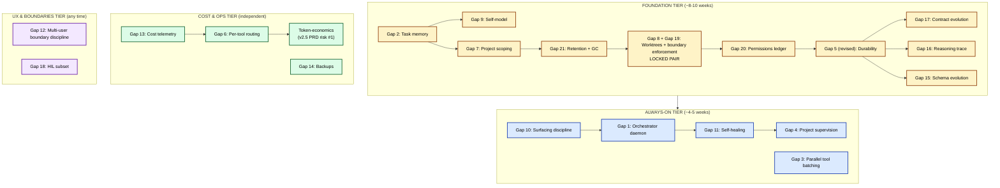

# ADR-038: Cypher v2.5 — Production-Grade Foundation, Always-On Intelligence, and Multi-Project Safety

**Status:** ✅ **Accepted — foundation tier shipped 2026-06-28** (D1–D8 + D17–D19 + D21 landed on master). Always-on tier (D9–D14), cost & ops tier (D15–D16), and the remainder of UX & boundaries (D20) **deferred to v2.6**. Originally proposed 2026-06-18; revised 2026-06-19 with v1.4 baseline measurements; foundation tier began landing 2026-06-22 and completed 2026-06-28 with the A1 (v87 outcome CHECK widening) + B1 (`cypher_compact_context` in-place compaction) + C1 (D4 worktree bootstrap) polish pass. Companion to [`CYPHER.md`](../../../CYPHER.md), the v2.5 brainstorm log at [`.planning/cypher/12-V2-V2.5-DESIGN-DISCUSSION.md`](../../../.planning/cypher/12-V2-V2.5-DESIGN-DISCUSSION.md), the v1.4 baseline measurements at [`.planning/cypher/13-V1.4-BASELINE-MEASUREMENTS.md`](../../../.planning/cypher/13-V1.4-BASELINE-MEASUREMENTS.md), and the foundation-tier retro at [`.planning/cypher/v2.5-foundation-tier-retro.md`](../../../.planning/cypher/v2.5-foundation-tier-retro.md).

**Successor to:** [ADR-037](./adr-037-cypher-tool-use-loop.md) — v2.5 builds on the tool-use loop without replacing it.
**Related:**
- [ADR-033](./adr-033-cypher-framework.md) — original framework. v2.5 deepens the runtime topology defined there.
- [ADR-034](./adr-034-cypher-learning-autonomy-engine.md) — learning engine. Reused unchanged; Beta priors get richer keys per Gap 7.
- [ADR-036](./adr-036-cypher-cli-primary.md) — CLI primary surface. D8 categorization extends to risk tiers per Gap 20.

> **One sentence:** v2.5 ships the production-grade foundation — task memory, project scoping, worktrees, permissions, retention — that makes Cypher trustworthy enough to be always-on across multi-week timescales and multiple projects.

---

## Context

v2.0 made Cypher *capable* — one tool-use loop with full catalog, plan-confirm-act, learning. ADR-037 shipped the architecture; CYPHER.md doctrine locked the identity. After v2.0, three concrete pressures surfaced during the 2026-06-18 brainstorm:

1. **Long-running tasks across weeks.** A 4-week design project (ADR → PRD → phases → smoke → cutover) currently has no resumable thread. `cypher.recent_sessions` is a lookup of past surface text, not continuity. Bridge restarts wipe the 1-hour prompt cache. Each dispatch starts cold.

2. **Multi-project work without contamination.** Today every `brain.recall` / `palace.search` / `wi-find-expert` reads global state. "Sara" in example-service context bleeds into operations context. Beta priors averaged across all projects are meaningless. Concurrent dispatches edit the same checkout, racing on file state.

3. **Ambient intelligence without becoming spam.** A senior engineer notices things: new Jira comment, calendar approaching, Teams spike. v2.0 Cypher only wakes on `/wi`. Adding always-on without surfacing discipline drives the user to mute Cypher within a week.

The brainstorm produced **21 architectural gaps** that v2.0 doesn't address. None are about adding capability. All are about making Cypher trustworthy at production timescales. This ADR captures the architectural commitments those 21 gaps imply; the brainstorm log carries the per-gap analysis; the Q-2.x walks (one design question at a time, brutal-honest) ratify each primitive's design.

> **v2.5 is a milestone of trust, not capability.** Zero new external capabilities ship. Every primitive deepens an existing one to survive multi-week timescales, cross-project boundaries, and always-on operation.

---

## Decision

### D1 — Four-tier scope structure with binding sequencing

v2.5 organizes 21 architectural primitives into four tiers with explicit dependencies. Tier ordering is binding: foundation must complete before always-on starts; cost and UX run in parallel.



**Sequencing constraints (locked):**

1. **Gap 8 + Gap 19 are a locked pair** — worktrees alone are unsafe; boundary enforcement is the safety net. Ship together. No exceptions.
2. **Gap 21 must precede Gap 5** — retention design supersedes Gap 5's original `messages_snapshot` schema. Without Gap 21 first, Gap 5 ships an inline-blob schema that becomes a multi-year disk hazard requiring painful migration to fix.
3. **Gap 20 must precede Gap 1** — without permissions ledger, always-on intelligence creates a confirmation-prompt avalanche that drives the user to mute Cypher within a week.
4. **Gap 9 (self-model) walks first** — the Q-2.5 design question is the first one to ratify. Always-on intelligence without self-knowledge produces a confident-but-incompetent system; safety primitive before always-on capability.

### D2 — Task as the long-running unit of work (Gap 2)

A `task` is a persistent named unit of work that survives bridge restarts and multi-week timescales. Dispatches operate against tasks. Tasks have curated context that compounds across dispatches.

**Schema (additive):**

```sql
CREATE TABLE tasks (
  id              TEXT PRIMARY KEY,
  title           TEXT NOT NULL,
  posture         TEXT NOT NULL,              -- pr_review | bug_investigate | pm | generic
  status          TEXT NOT NULL,              -- open | paused | blocked | closed
  parent_task_id  TEXT NULL,                  -- supports task trees
  external_ref    TEXT NULL,                  -- e.g. "jira:BD-2871"
  project         TEXT NOT NULL,              -- per Gap 7
  owner_user_id   TEXT NOT NULL DEFAULT 'maaz',  -- Gap 12 optionality
  created_at      TIMESTAMP NOT NULL,
  last_touched    TIMESTAMP NOT NULL,
  closed_at       TIMESTAMP NULL,
  closed_reason   TEXT NULL,
  git_branch      TEXT NULL,                  -- Gap 8: cypher/<task_id>
  worktree_path   TEXT NULL,                  -- Gap 8: worktrees/<task_id>
  worktree_status TEXT NULL                   -- created | active | torn_down
);

CREATE TABLE task_contexts (
  task_id                 TEXT NOT NULL,
  version                 INTEGER NOT NULL,
  context_summary         TEXT NOT NULL,      -- LLM-curated rolling summary (~2KB)
  open_questions          TEXT NULL,
  things_tried            TEXT NULL,
  curator_dispatch_id     TEXT NULL,
  curator_format_version  INTEGER NOT NULL DEFAULT 1,  -- Gap 15
  created_at              TIMESTAMP NOT NULL,
  PRIMARY KEY (task_id, version)
);

CREATE TABLE task_history (
  task_id      TEXT NOT NULL,
  dispatch_id  TEXT NOT NULL,
  outcome      TEXT NOT NULL,
  ts           TIMESTAMP NOT NULL,
  PRIMARY KEY (task_id, dispatch_id)
);
```

**Lifecycle:**
- Dispatch entry: if `taskId` supplied, load `task_contexts.version=latest`, inject `context_summary + open_questions + things_tried` into the loop's system prompt.
- Dispatch close: one cheap LLM call (Haiku, ~$0.005) summarizes what changed; writes new `task_contexts` row at `version+1`. **This is the curation step — the ladder rung that moves info from short-term to long-term memory.**
- Task close: explicit (`/wi close <taskId>`) or implicit (orchestrator detects external_ref is `Done`, proposes closing).

**Q-2.1** walks the design.

### D3 — Project as a first-class scope dimension (Gap 7)

Memory queries default-isolate by project. Cross-project lookups require explicit opt-in.

**Scope hierarchy:**
```
global         — Cypher's self-model; priors with insufficient per-project data
project        — example-service | operations | wi | <future>
task           — task_id within a project (D2)
dispatch       — single Cypher session
```

**Schema additions:**
- `tasks.project TEXT NOT NULL` (D2 already includes this)
- `cypher_sessions.project TEXT NOT NULL` (additive; existing rows backfilled to `'legacy'` or heuristically inferred)
- `brain_decisions`, `palace`, `claude_mem`: every row tagged with `project_id`
- `skill_priors`: keyed on `(tool, project, task_class)` — extends Q-1.5's `(tool, task_class)`

**Tool changes:** every read tool (`fts.search`, `wi-find-expert`, `code_graph.search`, `brain.recall`) gains a `scope: 'project' | 'all_projects'` parameter, default `'project'`. The model has to *want* the global view; it doesn't get it accidentally.

**Project detection at dispatch entry:** explicit `--project` flag, taskId carry, or path inference. Ambiguous → `clarify`, never default to global.

**Q-2.2** walks the design.

### D4 — Per-task git worktrees + tool-layer boundary enforcement (Gaps 8 + 19, locked pair)

`repos/<project>/` becomes bare clones. `worktrees/<task_id>/` is a per-task working tree on branch `cypher/<task_id>`. Every file-touching tool is bound to its dispatch's worktree at runtime.

```
~/.work-intelligence-mcp/
  data.db
  repos/                     ← bare clones (NEW shape)
    example-service.git/
    operations.git/
    wi.git/                  ← WI itself becomes a project
  worktrees/                 ← per-task working trees (NEW)
    task_2026_06_18_bd2871/  ← worktree on cypher/task_2026_06_18_bd2871
```

**Discipline:**
1. One worktree per task, created with `git worktree add` on first dispatch.
2. Every dispatch against task X uses `worktrees/<task_X>/` as cwd.
3. Branch is `cypher/<task_id>` — predictable, traceable, never collides.
4. Worktree teardown on `tasks.status='closed'`. Branch retained for `success`, deleted for `abandoned`.
5. Daily branch hygiene cron prunes `cypher/*` branches for abandoned tasks > 30 days old.
6. Maaz's own working copies (`~/Desktop/projects/acme/example-service/`) stay untouched; the bridge never writes to them.

**Cross-task code-graph reconciliation:** primary = task worktree (current branch state); secondary = master diff via `code_graph.diff_master` for "what else has changed." The model sees its own task's reality first.

**Tool-layer boundary enforcement (Gap 19) — the safety net:**

```
Tool runtime, before executing any file-touching tool call:

1. Resolve dispatch context → task_id → worktree_root = worktrees/<task_id>/
2. Pin tool execution to cwd = worktree_root.
3. For each path argument:
   a. Reject absolute paths unless they resolve under worktree_root
   b. Reject paths containing ".." that escape worktree_root after resolution
   c. Reject symlink targets outside worktree_root (canonicalize and check)
4. For tools that invoke subprocesses (smoke.run, typecheck.run, git.*):
   a. Force cwd = worktree_root as the subprocess's working directory
   b. Reject if subprocess args reference paths outside worktree_root
5. For SAME-FILE concurrency within one dispatch:
   a. Per-file lock during tool execution
   b. If two parallel tool calls target the same path, serialize them
```

**Schema additions:**
- `cypher_steps.path_arg TEXT NULL` — resolved path for audit
- `cypher_steps.boundary_violation TEXT NULL` — reason if rejected (`absolute_path_outside_root`, `path_traversal`, `symlink_escape`, `subprocess_cwd_mismatch`)

> **Gap 8 + Gap 19 ship together. No exceptions.** Gap 8 alone is layout safety theatre — looks isolated, isn't enforced. A buggy tool, a confused model, or a malicious-looking path argument could escape the worktree and corrupt other tasks, the bare repo, or Maaz's own working copies. None of these are recoverable from a backup if discovered late.

**Q-2.3** + **Q-2.3b** walk together.

### D5 — Permissions ledger with risk-tier classification (Gap 20)

The confirm-gate gets memory. Granted permissions persist with explicit scope and lifecycle. A three-tier risk classification on tool definitions determines what's grantable at all.

**Schema (additive):**

```sql
CREATE TABLE permissions (
  id              TEXT PRIMARY KEY,
  granted_at      TIMESTAMP NOT NULL,
  granted_by      TEXT NOT NULL DEFAULT 'maaz',
  action_pattern  TEXT NOT NULL,                    -- "file.edit:*", "git.commit:cypher/task_*"
  scope_kind      TEXT NOT NULL,                    -- 'one_shot' | 'task' | 'project' | 'session' | 'standing'
  scope_id        TEXT NULL,
  expires_at      TIMESTAMP NULL,
  expires_after_n INTEGER NULL,
  uses_count      INTEGER NOT NULL DEFAULT 0,
  status          TEXT NOT NULL,                    -- 'active' | 'expired' | 'revoked' | 'consumed'
  reason          TEXT NULL,
  revoked_at      TIMESTAMP NULL,
  revoked_reason  TEXT NULL
);

CREATE TABLE permission_uses (
  permission_id   TEXT NOT NULL,
  dispatch_id     TEXT NOT NULL,
  step_id         INTEGER NOT NULL,
  used_at         TIMESTAMP NOT NULL,
  PRIMARY KEY (permission_id, dispatch_id, step_id)
);
```

**Three-tier risk model (added to `ToolDefinition`):**

| Tier | Definition | Grantable? | Examples |
|---|---|---|---|
| **1 — Reversible local** | Local-only side effect; trivially undoable | yes, no friction | `file.edit` in worktree, `file.read`, `claude_mem.write`, `palace.write`, `cypher.record_outcome` |
| **2 — Reversible-ish** | Costs effort to undo but stays local | yes, default to one_shot | `git.commit` on `cypher/task_*`, `smoke.run`, `typecheck.run`, `apple-reminders.add`, `obsidian.write` |
| **3 — Irreversible / colleague-visible** | Cannot be ungrabbed; visible to others; mutates customer code | **NO** — ALWAYS asks, ledger ignored | `git.push`, `wi-pr-review-post`, `jira.comment`, `jira.update`, `teams.send`, `email.send`, `git.merge` to non-Cypher branches, `bug.resolve_attempt` |

> **The Tier 3 short-circuit is the safety floor.** Even if the user grants "approve everything for this session," the loop still pauses for tier-3 actions. Ledger is ignored entirely. This is what makes the rest of the ledger safe to be lenient with.

**Tool definition addition:**
```typescript
type ToolDefinition = {
  // ...existing fields from Q-1.5...
  risk_tier: 1 | 2 | 3;
  grantable: boolean;             // derived: tier_3 → false, else true
};
```

**User-facing surfaces:** `/wi grants`, `/wi revoke <id>`, web UI panel, dispatch surface logs grant consumption ("auto-approved via grant `<id>`") — transparency is the antidote to silent escalation.

**Q-2.19** walks the design.

### D6 — Data lifecycle: retention policy + GC daemon (Gap 21)

Every table that grows unboundedly gets explicit retention. Time-series data rolls up into aggregates. A nightly GC daemon enforces the policy.

**Per-table retention rules (defaults; user-configurable):**

| Table | Retention policy |
|---|---|
| `cypher_sessions` | Keep 90 days hot; older roll up to `cypher_sessions_summary`; delete raw beyond 1 year |
| `cypher_steps` | Keep 30 days; older roll up to per-dispatch tool-call summary |
| `cypher_outcomes` | Keep forever (small; foundation of self-model) |
| `messages_snapshot` | **MOVED to separate `dispatch_snapshots` table; deleted on dispatch close** |
| `task_contexts` | Keep all versions while task open; collapse to last-3-versions on task close |
| `task_history` | Keep forever (small; needed for self-model) |
| `permissions` | Keep all rows (explicit user authorizations) |
| `permission_uses` | Keep 90 days; older roll up to per-grant aggregate |
| `surface_log` | Keep 30 days |
| `bridge_health_checks` | Keep 30 days |
| `cost_ledger` | Keep 1 year hot; older roll up to monthly aggregates |
| Worktrees on disk | Delete on task close (covered by Gap 8) |
| Palace embeddings | **Measure first** — no defaults until v2.0 baseline known |

**Critical schema revision — `dispatch_snapshots` supersedes Gap 5's inline column:**

```sql
-- Gap 21 supersedes Gap 5's original schema
CREATE TABLE dispatch_snapshots (
  dispatch_id    TEXT PRIMARY KEY,         -- FK to cypher_sessions
  iter_number    INTEGER NOT NULL,
  messages_blob  TEXT NOT NULL,            -- JSON-encoded messages array
  written_at     TIMESTAMP NOT NULL
);

-- On every loop iter: UPSERT into dispatch_snapshots
-- On dispatch close: DELETE FROM dispatch_snapshots WHERE dispatch_id = ?
-- On bridge restart with status='in_progress': resume from messages_blob
```

This separation is the most important single schema change v2.5 introduces. Inline blobs on `cypher_sessions` would slow EVERY query touching the table; year-1 = 2GB+ of overflow pages without explicit `SELECT` projection discipline. Separate table + delete-on-close is cheap if done now, expensive if retrofitted.

**Roll-up tables:**
```sql
CREATE TABLE cypher_steps_summary (
  dispatch_id          TEXT PRIMARY KEY,
  tool_call_count      INTEGER NOT NULL,
  unique_tools_count   INTEGER NOT NULL,
  total_duration_ms    INTEGER NOT NULL,
  failed_tool_count    INTEGER NOT NULL,
  per_tool_aggregates  TEXT,         -- JSON
  rolled_up_at         TIMESTAMP NOT NULL
);

CREATE TABLE cypher_sessions_summary (
  week_start_iso       TEXT NOT NULL,
  posture              TEXT NOT NULL,
  project              TEXT NOT NULL,
  dispatch_count       INTEGER NOT NULL,
  success_count        INTEGER NOT NULL,
  failed_count         INTEGER NOT NULL,
  abandoned_count      INTEGER NOT NULL,
  median_iterations    INTEGER NOT NULL,
  median_cost_usd      REAL NOT NULL,
  rolled_up_at         TIMESTAMP NOT NULL,
  PRIMARY KEY (week_start_iso, posture, project)
);

CREATE TABLE gc_log (
  run_id          TEXT PRIMARY KEY,
  ran_at          TIMESTAMP NOT NULL,
  duration_ms     INTEGER NOT NULL,
  table_actions   TEXT NOT NULL,    -- JSON
  total_freed_mb  REAL NOT NULL,
  errors          TEXT NULL
);
```

**The lossy-but-bounded principle:** `cypher_steps_summary` cannot reconstruct individual tool calls — that signal is gone. But it preserves what matters for self-model (D8), supervision (D12), and trend dashboards (D14). Detail goes; signal stays.

**User-facing surfaces:** `/wi disk-usage`, `/wi gc --dry-run`, `/wi gc --run-now`, `/wi retention`, web UI dashboard with growth charts.

> **Skipping Gap 21 doesn't surface failure for 6-12 months — by then it's too late to fix without painful migration.** The user feels "WI is getting slower" with no obvious cause. Retention design must land before data accumulates.

**Q-2.20** walks the design — must walk before Q-2.4 (durability).

### D7 — Dispatch durability with three timescales of memory (Gap 5, revised)

Three layers of memory at three timescales:

```
[seconds-minutes]   message array (in-memory, snapshotted each iter)
                              ↓ snapshot after each iteration
[minutes-hours]     dispatch_snapshots table (D6 — durable mid-dispatch)
                              ↓ at dispatch close: curate; delete snapshot
[days-weeks-∞]      task_contexts (D2 — rolling distilled summary,
                                    survives restarts forever)
```

**Bridge crash mid-dispatch:** on restart, dispatches with `status='in_progress'` load their `messages_blob` from `dispatch_snapshots`, continue from last snapshot.

**Confirm gate paused over weekend:** new `dispatch_state` enum — `open` | `suspended_awaiting_user` | `closed_*`. Suspended dispatches are durable across bridge restarts; resume on user reply.

**In-loop summarization tool:** `cypher.compact_context` lets the model fold older tool results into a summary when its context fills up before the hard 200K cap. ~1 day of work; significantly extends what one dispatch can chew through.

**Q-2.4** walks the design — consumes Gap 21 schema decisions.

### D8 — Self-model and meta-cognition (Gap 9)

Cypher knows what it's good at, what it's bad at, and when to escalate.

**Dependency on ADR-037.5 v2 (updated 2026-06-25).** D8's primary data substrate is the loop's plan-shape posterior — `cypher_outcomes` aggregated by `(plan_shape_hash, task_class)`, post the substrate fix at commit `e18f1d4` (loop.ts:624 priors-read). The gap-flag overlay comes from `plan_shape_gap_observed` (shipped 2026-06-25 under [ADR-037.5 v2](./adr-037-5-cap13-skill-self-extension.md) as CAP-13-LITE recognition). D8 does NOT depend on the original CAP-13 skill-keyed framing — that was v1 of ADR-037.5 and was invalidated by adversarial audit. D8 can ratify against the v2 plan-shape substrate as soon as the LITE recognition corpus has 2–3 weeks of organic gap-fires. If the corpus stays sparse (rare gap-fires on a healthy catalog), D8's `cypher.self_assess` reads `cypher_outcomes` directly without needing CAP-13's observation overlay.

**New tool:**
```
cypher.self_assess(goal, posture)
  Returns: {
    confidence: 0.0-1.0,            -- aggregated Beta posterior
    n_similar_tasks: int,
    recent_success_rate: 0.0-1.0,   -- last 10 similar tasks
    typical_iterations: int,
    typical_cost_usd: float,
    failure_modes: [string],
    recommendation: 'proceed' | 'proceed_with_caution' | 'escalate' | 'decline'
  }
```

**Schema additions:**
- View/materialized: `cypher_capability_summary(posture, task_class, n_tasks, success_rate, mu, sigma)` — aggregated from `cypher_outcomes` + `skill_priors`
- `cypher_outcomes.failure_pattern TEXT NULL` — when verdict='failed', curator (D2) extracts a short failure-mode tag

**How orchestrator uses it:** before firing a speculative dispatch, calls `cypher.self_assess`. If `recommendation='decline'`, surfaces "Cypher would normally attempt this but its track record is weak — confirm to proceed?" rather than firing blindly.

**How loop uses it:** at dispatch entry, system prompt includes self-assessment for the current goal. Model knows "I'm at 0.42 confidence on this shape; engage Maaz before destructive steps."

> **Always-on intelligence without self-knowledge is the worst possible combination** — a confident agent that doesn't know what it's bad at, firing speculatively at things it can't handle. Gap 9 is the safety primitive that gates ambient intelligence.

**Q-2.5** walks the design — **the FIRST Q-2.x question to ratify in v2.5 design phase.**

### D9 — Always-on orchestrator daemon (Gap 1)

A cheap LLM running inside the bridge, always-on, signal-driven.

**Behavior:**
- Wakes on signals (timer ticks, webhook deliveries, new event rows, calendar approaching events).
- Reads open tasks + recent events; decides what deserves attention.
- Possible actions: fire `wi_dispatch` against a task, surface notification, propose closing stale task, do nothing.
- Hard budget: ≤12 LLM decisions/hour; idle sleep when no signals; ~$0.30/day on Haiku rates worst case.
- Calls `cypher.self_assess` (D8) before firing speculative work.

**Per-tool confirm gate is preserved:** orchestrator-fired dispatches with `confirm_mode='auto'` still pause for tier-3 actions — path-classifier (ADR-036 D8) + risk-tier (D5) enforce at the per-tool layer regardless of dispatch source.

**Q-2.9** walks the design.

### D10 — Surfacing discipline + tiered urgency (Gap 10)

Four surface tiers prevent ambient intelligence from becoming ambient annoyance:

| Tier | Channel | Example |
|---|---|---|
| **0 — INTERRUPT** | iMessage + Apple Reminder | "Production smoke red on master after Cypher's task_X commit; reverted automatically" |
| **1 — PROMPT** | Hermes alert + CLI banner on next session | "BD-2871 has new Sara comment that contradicts your investigation conclusion" |
| **2 — NUDGE** | Morning-brief digest entry (batched) | "Calendar prep notes drafted for 2pm meeting" |
| **3 — AMBIENT** | Silent unless queried | "task_X supervisor: on track" |

**Tier-assignment is the orchestrator's job.** Each dispatch carries a `surface_tier` hint. User can override per-task.

**Aggregation:** Tier 2 batches into digest; Tier 3 silent unless `/wi status`; Tier 0/1 never aggregate.

**Schema:**
- `tasks.surface_tier_default INTEGER`
- New `surface_log(dispatch_id, tier, channel, delivered_at, acknowledged_at)`

**Q-2.12** walks the design.

### D11 — Self-healing meta-supervision (Gap 11)

Periodic check (every 6h) watches Cypher itself.

**Detects:**
- Tool error rate > X% on a given tool over last N dispatches → tool likely broken
- Failure cluster around a specific token expiry → auth issue
- Worktree disk usage > Y% → storage pressure
- Lock held > Z hours on a task → stuck dispatch

**Auto-remediates (auto-class):** re-auth expired MCP tokens, prune corrupted worktrees, release stale per-task locks, clear filesystem caches.

**Surfaces (tier 0/1):** "Smoke runner appears broken — affected dispatches suggest dependency conflict; investigate?" / "Bridge entering degraded mode; subsystems X/Y/Z unavailable."

**Schema:**
- `bridge_health_checks(check_id, ts, subsystem, status, details)`
- `auto_remediation_log(action, dispatch_id_target, success, ts)`

> Without it, "failures pile up silently because nobody is watching" once always-on. The orchestrator and user are decoupled in time; failures need their own watcher.

**Q-2.11** walks the design.

### D12 — Project supervision (Gap 4) — emerges from D2 + D9

Daily-ish PM-posture supervisor dispatch against open root tasks. Reads `task_contexts` + `task_history` + `git log cypher/<task_id>`. Surfaces drift, re-estimates, flags risks.

**Not a new primitive** — composes Gap 1 (orchestrator) + Gap 2 (task memory) + posture system. Scheduled supervisor dispatch with PM posture against a root task.

**Cost discipline:** ~5 root tasks × ~$0.30 = ~$1.50/day. Bounded by activity-gating (no supervision on stale tasks). Terse-by-default (1-line "on track"); full digest only on real signal.

**Q-2.10** walks the design.

### D13 — Parallel tool batching (Gap 3)

Anthropic API natively supports the model emitting multiple `tool_use` blocks per turn. v2.0 executes them serially. v2.5 enables concurrent execution of independent tool calls within one model turn.

Same one model session, same one context — parallelism is at the *tool execution layer*, not the model layer.

**Same-file concurrency** is handled by Gap 19's per-file locks (D4). Different-file parallel calls run concurrently with no contention.

**Long-running tools** still use ADR-037 D13's deferred pattern. Parallel batching handles ≤30s tools; deferred handles >30s.

**This is the "specialists" instinct decoded.** What the brainstorm initially framed as "parallel specialist agents" is really parallel tool calls in one loop. No multi-agent.

**Q-2.13** walks the design.

### D14 — Cost telemetry + budget ledger (Gap 13)

```sql
CREATE TABLE cost_ledger (
  window_start  TIMESTAMP NOT NULL,
  window_end    TIMESTAMP NOT NULL,
  project       TEXT NOT NULL,
  task_id       TEXT NULL,
  dispatch_id   TEXT NOT NULL,
  model         TEXT NOT NULL,
  tokens_in     INTEGER NOT NULL,
  tokens_out    INTEGER NOT NULL,
  cost_usd      REAL NOT NULL
);

CREATE TABLE cost_budgets (
  scope_kind        TEXT NOT NULL,    -- 'project' | 'task' | 'orchestrator'
  scope_id          TEXT NULL,
  window            TEXT NOT NULL,    -- 'hour' | 'day' | 'week'
  budget_usd        REAL NOT NULL,
  action_on_breach  TEXT NOT NULL     -- 'warn' | 'block_orchestrator' | 'block_all'
);
```

**Budget enforcement:**
- Soft cap: warning at 80% of window budget
- Hard cap: orchestrator-fired dispatches refused above 100%
- User-fired dispatches always allowed (user owns the override)

> **Telemetry must land before tuning.** v2.5 risk #1 (token-economics hardening) operates blind without Gap 13.

**Q-2.15** walks the design.

### D15 — Per-tool model routing (Gap 6, picks up ADR-037 D8 deferral)

Loop's controller call uses configurable model per iteration kind:

| Kind | Suggested model |
|---|---|
| `findings` tools (brain.recall, fts.search) | Cheap (Haiku/DeepSeek/local) |
| `signal` tools (smoke, typecheck) | Cheap |
| `decision` tools (brain.decide, wi-jira-analyze) | Sonnet/Opus |
| Synthesis turns (final surface) | Opus |

**Evidence-pulled** — measure where Haiku/DeepSeek regress vs Opus on real dispatches before flipping defaults. **Escalation primitive** — if cheap model emits low-confidence pick, kick to Opus.

> **Splitting the LLM splits the context.** Savings only land if routing decisions can be made on partial context (last 2-3 messages). Needs measurement.

**Q-2.14** walks the design.

### D16 — Backup & disaster recovery (Gap 14) — operations, not architecture

- Daily snapshot of `~/.work-intelligence-mcp/data.db` to a separate location.
- Pre-migration snapshots with retention until migration validated stable.
- Worktree branches push to a personal remote (separate from upstream) for offsite redundancy.
- Documented restore procedure.

**Why include in v2.5:** trust requires durability beyond crash-recovery (D7). Without backups, weeks of curated task contexts can be lost to SSD failure.

**Q-2.16** walks the design.

### D17 — `wi_dispatch` contract evolution under v2.5 load (Gap 17)

```typescript
wi_dispatch params:
  goal: string
  taskId?: string                            // D2
  project?: string                           // D3
  confirm_mode?: 'interactive'|'auto'|'reject'  // existing (Q-1.13)
  surface_tier?: 0|1|2|3                     // D10
  contract_version?: '2.0'|'2.5'             // NEW

Returns:
  surface: string
  result_meta: {
    outcome: <6 frozen values>               // existing (Q-1.3)
    cypher_session_id: string                // existing
    taskId?: string                          // D2
    worktree_path?: string                   // D4
    self_assessment?: {...}                  // D8
    suspended_dispatch_id?: string           // D7
    surface_tier_used?: 0|1|2|3              // D10
    contract_version: '2.5'
  }
```

**Compat rules:** v2.0 callers (no `contract_version`) get v2.0 shape — new fields suppressed, parameters ignored. v2.5 callers get full shape. Additive-only post-launch (Q-1.3 rule extended). Removals never allowed.

**Q-2.6** walks the design.

### D18 — Reasoning-trace observability (Gap 16)

```sql
ALTER TABLE cypher_steps ADD COLUMN reasoning_trace TEXT NULL;     -- text immediately preceding tool_use
ALTER TABLE cypher_steps ADD COLUMN controller_model TEXT NULL;    -- which model made the pick (D15)
```

Captured for every tool_use block; truncated to 4KB if larger. Available in dispatch debug surfaces (web UI, `/wi debug <session_id>`).

> Cheap to write; invaluable for trust. Without it, "why did Cypher do that?" requires loading the full conversation. With it, a single SQL query answers most debugging questions.

**Q-2.7** walks the design.

### D19 — Schema evolution policy under task memory (Gap 15)

`task_contexts.curator_format_version INTEGER NOT NULL DEFAULT 1` — every curated row tags itself with its format version. Compatibility shim reads previous N versions; beyond N, lossy upgrade or explicit re-curation via `cypher.recurate_task_context taskId`.

**Why it matters:** `task_contexts` is the long-term memory; breaking its format is breaking memory itself. Versioning protocol must be designed before content accumulates.

**Q-2.8** walks the design.

### D20 — Multi-user / multi-laptop boundary (Gap 12) — explicit out-of-scope

Single-laptop, single-user discipline preserved. **What v2.5 explicitly does NOT do:**
- Multi-machine sync (Maaz's desktop ↔ laptop)
- OAuth / RBAC for multiple users
- Cross-laptop coordination protocol

**What v2.5 preserves for future optionality:**
- `tasks.owner_user_id TEXT NOT NULL DEFAULT 'maaz'` — single value today, ready for multi-user
- `cypher_sessions.machine_id TEXT NOT NULL DEFAULT 'primary'` — single value today, ready for multi-machine

Cost: ~0 days direct effort. It's a *design discipline* applied to other gaps' schemas. Documenting it prevents painting into a corner.

**Q-2.17** is design discipline applied across all schema-touching Q-2.x questions.

### D21 — HIL interaction patterns subset (Gap 18)

**Two HIL primitives ship in v2.5:**
- "Show me the diff before approving" — confirm-gate enrichment, ~2 days
- "Pause this task indefinitely until I say resume" — lifecycle primitive, ~1 day

**Three deferred to v3.0+:**
- Branch this task into two parallel investigations
- Promote a Cypher surface output into a Jira ticket
- Apply a Cypher commit into Maaz's own working copy

**Q-2.18** walks the design.

### D22 — What v2.5 does NOT do

| Wrong addition | Why rejected |
|---|---|
| Multi-agent (PR specialist, Jira specialist as separate processes) | ADR-037 explicitly rejected; trap is process-isolation costs more than it saves |
| Cypher as a "dispatcher" routing to "worker agents" | Same trap dressed differently — D15 per-tool routing inside one loop is the right shape |
| Always-running expensive LLM watching everything | Burns budget for no benefit when no events are firing — D9 signal-driven orchestrator with idle sleep |
| "Context as fat prompt" passed between agents | Defeats efficiency — D2 taskId reference to umbrella memory; small prompts, big shared store |
| Single shared checkout for all dispatches' code work | File-state races, smoke tests collide, branch confusion — D4 per-task worktrees |
| Global memory queries that ignore project boundary | Cross-project context contamination, meaningless averaged priors — D3 default-isolated scoping |
| Always-on without self-knowledge | Confident incompetent agent firing speculative work; pollutes inbox — D8 self-model gates speculation |
| Confirm-gate without memory | Same prompt re-asked 4-6 times in one dispatch; user mutes Cypher within a week — D5 permissions ledger |
| Granting bypass for irreversible/colleague-visible actions | Wide-open grants would make `git push`/Jira-comment fire silently — D5 Tier 3 short-circuit |
| No retention policy / unbounded data growth | Multi-year accumulation slows queries; user feels "WI is getting slower" — D6 retention + GC |
| `messages_snapshot` as inline column on `cypher_sessions` | Year-1 = 2GB+ overflow pages slowing every query — D6 separate `dispatch_snapshots` table |
| Separate Cypher web UI dashboard | Fragments existing UI; adds maintenance burden |
| External webhooks/API for third-party integrations | Single-laptop discipline (D20) |
| Voice/multi-language interface | Different product surface; out of scope |
| Auto-merging Cypher's branches into main | Always confirm-class; would violate ADR-036 D8 |
| "Throw it all in one big v2.5 milestone" | 14-week monolith with no rollback gates — D1 tiered scope with independent shippability |

---

## Consequences

### What dies

Nothing. v2.5 is an additive milestone. Every v2.0 primitive remains in place; v2.5 deepens them.

### What changes

- **Schema additions** across `tasks`, `task_contexts`, `task_history`, `permissions`, `permission_uses`, `dispatch_snapshots`, `cost_ledger`, `cost_budgets`, `surface_log`, `bridge_health_checks`, `gc_log`, plus roll-up tables and additive columns on `cypher_sessions`, `cypher_steps`, `cypher_outcomes`.
- **New tools** in the catalog: `cypher.self_assess`, `cypher.compact_context`, `cypher.recurate_task_context`, `code_graph.diff_master`.
- **New CLI surfaces:** `/wi grants`, `/wi revoke`, `/wi disk-usage`, `/wi gc`, `/wi retention`, `/wi tasks`, `/wi close <taskId>`, `/wi debug <session_id>`.
- **New daemons inside the bridge:** orchestrator (D9), self-healing meta-supervisor (D11), GC daemon (D6).
- **New env vars** for budgets, retention windows, surface-tier defaults, orchestrator decision rate caps.
- **`wi_dispatch` contract** evolves with new optional parameters and result_meta fields, gated by `contract_version` (D17).

### What stays the same

- v2.0 tool-use loop primitive (ADR-037)
- Plan-confirm-act control flow (ADR-037 D15-D18)
- Beta priors learning math (ADR-034 unchanged)
- Bucket discipline (ADR-031 unchanged)
- Brain HTTP routes (per Gap 12 deferral; v2.5 risk #4 still owns the audit-and-decide work)
- ADR-036 CLI surface
- Single-laptop, single-user discipline (D20)

### Risks and mitigations

| Risk | Mitigation |
|---|---|
| **Curation drift** (D2) — task_contexts summaries compound errors over weeks | Versioned curations (D19); smoke harness on synthetic 40-dispatch corpus; user-visible context preview with `wi tasks --show-context` |
| **Worktree disk pressure** (D4) — N tasks × 1GB worktrees | Daily branch hygiene cron; explicit task-close workflow; `wi disk-usage` surface |
| **Orchestrator decision quality** (D9) — false positives spam, false negatives miss urgent work | Self-model gating (D8); user-feedback loop on tier classifications; conservative default cadence |
| **Tier classification disputes** (D5) — Tier 1 vs Tier 2 boundary is contested | Codify in tool definitions; smoke check fails CI if Tier 3 tool gains `grantable: true`; iterate based on real usage |
| **Lossy summarization** (D6) — once detail rolled up, gone forever | Configurable retention windows; smoke harness validates Beta-prior preservation; pre-GC backup per run |
| **GC failure semantics** — half-finished GC corrupts data | Transactional summarize-AND-delete; `gc_log` records every action; vacuum gated on success |
| **Per-tool routing context-split** (D15) — cheap models regress without full context | Evidence-pulled rollout; escalation primitive for low-confidence picks; shadow-mode measurement before flag flip |
| **Unbounded daemon memory** — orchestrator/self-healing leak over weeks | Explicit memory budgets per cache; hard caps with eviction; restart-on-budget-exceed as last resort |
| **SQLite write contention** under parallel dispatches | WAL mode; batched writes where possible; write queue with backpressure if measured to be a problem |
| **Schema migration on populated tables** | All v2.5 schema changes are additive (new columns nullable, new tables); content migrations versioned per D19 |
| **Brainstorm log scope underestimate** — gaps we haven't surfaced yet | Mid-flight gap-inventory checkpoint after foundation tier ships; expect ≥3 new gaps from real usage |

---

## Critical decision anchors

Four "single most important" gaps anchor the foundation tier. Each addresses a different concern; missing any one breaks v2.5 in a different way.

| Anchor | Concern | Failure mode if missing |
|---|---|---|
| **Gap 9 (D8) — Self-model** | Always-on safety | Confident incompetent agent; ambient annoyance |
| **Gap 19 (D4) — Boundary enforcement** | Worktree safety; locked pair with Gap 8 | Silent corruption of other tasks/repos/user's checkouts |
| **Gap 20 (D5) — Permissions ledger** | UX viability | User mutes Cypher within a week of always-on |
| **Gap 21 (D6) — Retention + GC** | Longevity | System slowly degrades over multi-year timescales |

**Sequencing constraints (locked):**

1. **Gap 8 + Gap 19 ship together** (D4) — locked pair, no exceptions
2. **Gap 21 precedes Gap 5** (D6 supersedes D7's original schema) — `dispatch_snapshots` separate table, not inline column
3. **Gap 20 precedes Gap 1** (D5 before D9) — permissions ledger before always-on
4. **Q-2.5 (self-model) walks first** — Gap 9's design ratifies before any other Q-2.x

**Q-2.x walk order:**
- **First two:** Q-2.5 (self-model) and Q-2.20 (retention + GC). These constrain everything downstream.
- **Foundation tier:** Q-2.1, Q-2.2, Q-2.3 + Q-2.3b (locked pair), Q-2.19, Q-2.4, Q-2.6, Q-2.7, Q-2.8.
- **Always-on tier:** Q-2.12, Q-2.9, Q-2.11, Q-2.10, Q-2.13.
- **Cost & UX:** Q-2.15, Q-2.14, Q-2.16, Q-2.18 — any time after foundation.
- **Q-2.17** (multi-user boundary) is design discipline applied during all schema work.

---

## Open questions

- **v2.5 scope split.** The 21-gap inventory is large. A natural split: foundation = v2.5 (~6-8 weeks per baseline-adjusted estimate), always-on = v2.6 (~4-5 weeks), cost+UX = v2.7 (~3-4 weeks). Each milestone has clean ship gates. **Resolved by v1.4 baseline data: foundation-only v2.5, always-on deferred to v2.6 with experiment gates.** See § "v1.4 baseline-driven scope adjustments" below.
- **Shipping criteria per milestone.** v2.0 had clean gates (`run.ts` deleted, smoke green, 2-week stability). v2.5's foundation tier doesn't have an obvious ship date. Pre-commit quantitative criteria before each milestone starts (e.g., "Foundation tier ships when one real multi-week task completes end-to-end without context loss + smoke green for 2 weeks + GC has run nightly for 30 days without errors").
- **Mid-flight gap-inventory checkpoint.** After foundation tier ships, before always-on tier design opens, rerun the brainstorm process with real usage data. The 21 gaps are a starting hypothesis, not a final spec.
- **Palace embedding growth rate.** ~~Currently unmeasured.~~ **Partially resolved 2026-06-19:** `message_embeddings` (in-DB) grows ~15MB/year — benign. Palace ChromaDB filesystem still unmeasured; flagged as v2.0 phase-0 audit item.
- **Minimal v2.5 framing (revised 2026-06-19 with v1.4 baseline data).** Originally framed as D2 + D8 + D6 (3 gaps). v1.4 baseline data confirms the **multi-project use case is real (62% WI / 38% example-service ratio)**, which expands minimal v2.5 to **6 gaps**: D2 (task memory) + D3 (project scoping, Gap 7) + D4 (worktrees + boundary, Gaps 8+19, locked pair) + D5 (permissions ledger, Gap 20) + D6 (retention + GC, Gap 21) + D8 (self-model, Gap 9). That's the foundation tier complete in ~6-8 weeks. Always-on tier deferred to v2.6 with experiment gates (see § "v1.4 baseline-driven scope adjustments" below).

---

## v1.4 baseline-driven scope adjustments (2026-06-19)

After ADR-038 first authored, v1.4 baseline measurements were captured against the live `~/.work-intelligence-mcp/data.db`. Full data: [`.planning/cypher/13-V1.4-BASELINE-MEASUREMENTS.md`](../../../.planning/cypher/13-V1.4-BASELINE-MEASUREMENTS.md). Three measurements changed v2.5 priority enough to surface here:

### Adjustment 1 — Defer D12 (Project supervision, Gap 4) to v2.6 with experiment gate

**Data:** Zero multi-week tasks observed in v1.4. All multi-dispatch clusters in `cypher_sessions` are smoke tests or PM test fixtures. Real maaz dispatches are nearly all single-shot (77 real dispatches across 6 days; only 4 had >1 dispatch sharing a goal-prefix, and those topped out at 3 dispatches).

**Adjustment:** D12 was originally always-on tier. **Defer to v2.6** with explicit gate: "Activate D12 only after observing ≥5 multi-week tasks created by users." If v2.5 ships D2 (task memory) and the primitive does not produce multi-week task usage organically, D12 has nothing to supervise.

**v2.5 build order updated:** D9 (orchestrator) → D11 (self-healing) → ~~D12 (project supervision)~~ becomes v2.6 candidate.

### Adjustment 2 — Lower priority on D14 + D15 (Cost telemetry + per-tool routing, Gaps 13 + 6)

**Data:** Total brain-call cost over 18 days was **~$1.85 USD** (~$3/month). Token economics is not a real concern at v1.4 baseline. Even with v2.5's 10x multiplier from orchestrator + curation, projected monthly cost is $30-50 — well below any meaningful budget threshold.

**Adjustment:** D14 and D15 stay in v2.5 scope (cost & ops tier) but **lower priority**. Do not block foundation tier on them. v2.5 risk #1 (token-economics hardening from the v2.5 PRD) is **lower priority than originally framed.**

**Trade-off check:** D15 (per-tool routing) saves perhaps $5/month on the projected $30/month total. Effort/savings ratio is poor compared to UX work (D5 permissions, D8 self-model). Time spent on D15 should be measured against time spent improving the foundation tier instead.

### Adjustment 3 — Operations as a project is not real yet

**Data:** Zero operations-tagged dispatches across 592 sessions. WI + example-service are the real multi-project use case (62% / 38%).

**Adjustment:** D3 (project scoping, Gap 7) and D4 (worktrees, Gap 8) remain in v2.5 scope but **scoped to WI + example-service** initially. Don't pre-build operations-specific scaffolding. The worktree primitive trivially extends to operations later when operations work materializes (no schema or contract change needed).

### Three v2.0 phase-0 audit items — WALKED 2026-06-24


1. **What's deleting `cypher_sessions` older than 6-7 days?** **Answered: NOTHING.** The v1.4 baseline observed schema age, not a retention floor. `cypher_sessions` was created by schema v59 on 2026-06-13 (commit `41e07b4`); the "6-day horizon" simply reflected the table being 6 days old at measurement time. No `DELETE FROM cypher_sessions` exists in `src/` outside a smoke-test cleanup. `ResearchCachePrune` does not touch cypher tables. As of 2026-06-24 the table has 733 sessions spanning the full 11-day schema lifetime — accumulation is monotonic. **D6 designs retention from scratch.** The 88%-freelist baseline observation was also transient — post-`PRAGMA wal_checkpoint(TRUNCATE)` the freelist is 0.004%. The real growth hazard is `data.db` itself (452 MB and growing), not palace.

2. **Why are `skill_proposals` at 0 despite 11 `skill_gap_observed`?** **Answered: CAP-13-FULL never merged to master.** ADR-034 line 20 cited four commits as shipped (`7ffce96` / `6fd56f4` / `a0d1afb` / `8f18bcd`) but they live only on the `adr-032-blocker-fixes-and-prd` and `worktree-phase-83-cypher-preflight` branches. `src/services/cypher/proposals.ts` does not exist on master. The 11 `skill_gap_observed` rows are real signal accumulating since v64, but there is no agent on master that converts them into `skill_proposals` rows. Notably, the `v66_cap13_birth_decisions` migration DID land on master (the telemetry table for CAP-13 D21 friction instrumentation), so master has the *telemetry table* for CAP-13 but not the *engine*. **Resolution (2026-06-24):** the spike was snapshotted into `.planning/spikes/2026-06-14-cap-13-original/` and the re-imagining is ratified in [ADR-037.5](./adr-037-5-cap13-skill-self-extension.md). ADR-034 doc-honesty bug fixed in the same commit. **D8 (Self-model) is now explicitly dependent on ADR-037.5 — see D8 above.**

3. **What's palace's actual ChromaDB filesystem usage?** **Answered: 7.7 MB; growth ~30 MB/year. Trivial.** Palace dir composition: `chroma.sqlite3` 7.1 MB, `knowledge_graph.sqlite3` 256 KB, two HNSW index dirs 200 KB each. 729 embeddings across 2 collections. Growth from initial install (62 days) is ~5 MB. **Permissive retention defaults for embeddings (1-year hot, 2-year cold, or "never delete") are confirmed safe.** D6's tight constraints are on `messages` / `meetings` / `topics` / `cypher_outcomes` in the main DB.

**Side discoveries (worth tracking, not part of ADR-038 scope):**

- `~/.mempalace/` (121 MB) is dead state from an old install path — safe to delete after backup.
- Four orphan `mempalace.mcp_server` Python processes accumulate across bridge restarts — bridge shutdown should SIGTERM its palace MCP child cleanly.
- WAL grows unbounded without explicit checkpoint — D6's GC daemon should run `PRAGMA wal_checkpoint(TRUNCATE)`.
- ADR-034 documents CAP-13-FULL as shipped when it isn't on master — doc honesty fix landed 2026-06-24 alongside ADR-037.5.

These three audit items are now **CLOSED**. v2.5 design work (the Q-2.x walks) may proceed; D6 in particular has its assumptions corrected before scope-locks.

### Foundation-tier scope after these adjustments

Updated minimal v2.5 (the 6-gap shape):

| Gap | Tier | Effort | Status post-baseline |
|---|---|---|---|
| D2 — Task memory (Gap 2) | Foundation | ~2 weeks | Confirmed; foundation primitive |
| D3 — Project scoping (Gap 7) | Foundation | ~1 week | Confirmed; scope WI + example-service |
| D4 — Worktrees + boundary (Gaps 8+19) | Foundation | ~2 weeks + 3-5 days | Locked pair; confirmed |
| D5 — Permissions ledger (Gap 20) | Foundation | ~1-1.5 weeks | Confirmed; high value at low real-work ratios |
| D6 — Retention + GC (Gap 21) | Foundation | ~1-1.5 weeks | Confirmed; supersedes D7 schema |
| D7 — Durability (Gap 5, revised) | Foundation | ~1 week | Confirmed; schema constrained by D6 |
| D8 — Self-model (Gap 9) | Foundation | ~3-5 days | Confirmed; FIRST Q to walk |
| D17 — Contract evolution (Gap 17) | Foundation | ~3 days | Unchanged |
| D18 — Reasoning trace (Gap 16) | Foundation | ~2 days | Unchanged |
| D19 — Schema evolution (Gap 15) | Foundation | ~3 days | Unchanged |

**Total foundation tier: ~6-8 weeks** (vs original ~8-10).

**Deferred to v2.6 (with experiment gates):**
- D9-D13 (always-on tier): orchestrator, surfacing, self-healing, project supervision, parallel batching
- D14, D15 (cost & ops, lower priority): cost telemetry, per-tool routing
- D16 (backups): operations work, can land any time

This is the **ratified scope of v2.5**, grounded in measurement.

---

## What this ADR explicitly does NOT decide

- **Per-gap implementation details.** Each Q-2.x walk owns the design; this ADR locks the architectural commitments those designs have to honor.
- **Exact schema migrations.** Schemas above are illustrative shapes; final column types, indexes, FK constraints settled per Q-2.x.
- **Exact env-var names.** Final names settled during implementation.
- **Tool naming.** Names like `cypher.self_assess` are illustrative; finalized during catalog migration.
- **Brain HTTP audit (Q-1.2).** Already deferred to v2.5 risk #4; this ADR doesn't pre-empt that audit.

---

## References

- [`.planning/cypher/12-V2-V2.5-DESIGN-DISCUSSION.md`](../../../.planning/cypher/12-V2-V2.5-DESIGN-DISCUSSION.md) — v2.5 brainstorm log; Gaps 1-21 with full per-gap analysis. **Authoritative source for everything in this ADR.**
- [`.planning/cypher/13-V1.4-BASELINE-MEASUREMENTS.md`](../../../.planning/cypher/13-V1.4-BASELINE-MEASUREMENTS.md) — v1.4 baseline measurements (2026-06-19); evidence grounding the scope adjustments above. Re-run queries periodically to track baseline drift.
- [`CYPHER.md`](../../../CYPHER.md) — canonical identity doc.
- [ADR-037](./adr-037-cypher-tool-use-loop.md) — predecessor; v2.5 builds on the tool-use loop.
- [ADR-036](./adr-036-cypher-cli-primary.md) — CLI surface; D8 categorization extends to risk tiers per D5.
- [ADR-034](./adr-034-cypher-learning-autonomy-engine.md) — learning engine; reused unchanged.
- [ADR-033](./adr-033-cypher-framework.md) — framework; runtime topology deepens here.
- [`docs/docs/prd/cypher-v2.0.md`](../prd/cypher-v2.0.md) — v2.0 PRD; v2.5 builds on its acceptance criteria.
- [`docs/docs/prd/cypher-v2.5.md`](../prd/cypher-v2.5.md) — v2.5 PRD (existing — covers risks #1-#4 only); needs extension to W5-W25 incorporating Gaps 1-21.
