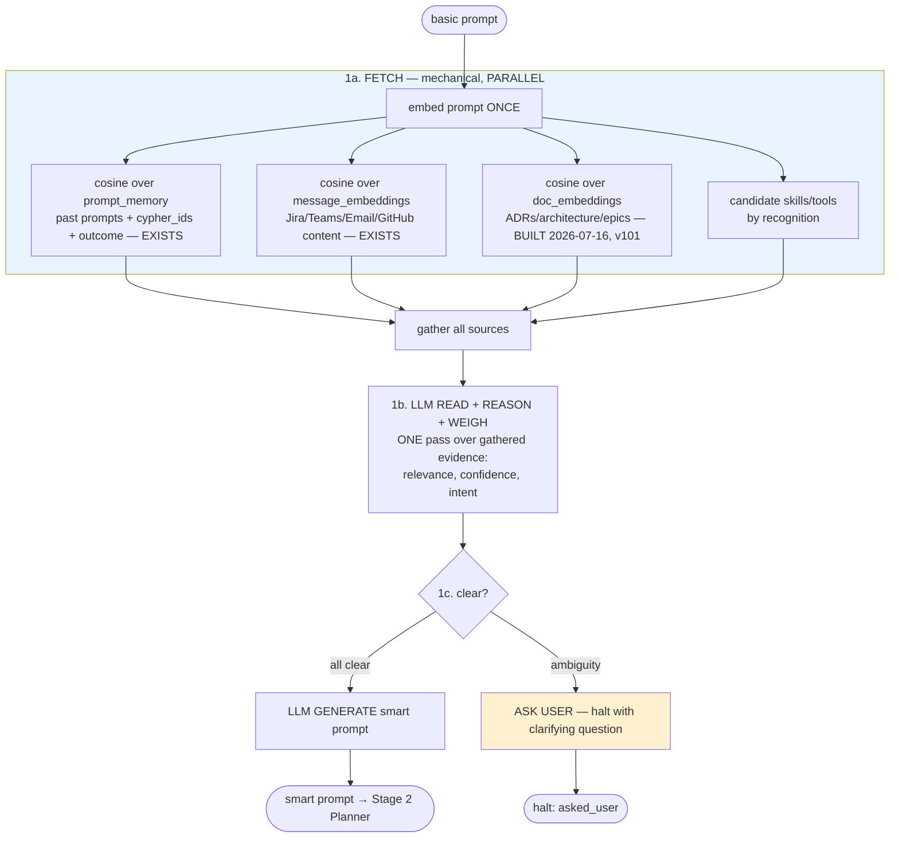

# ADR-042: Cypher Stage 1 — Prompt Generation (Fetch → Reason → Generate / Ask)

**Status:** ✅ **Accepted (2026-08-05).**

> **Quick ref**
> - **Enable Stage 1 single-pass:** `WI_STAGE1_ENABLED=1` (+ `CYPHER_REFINEMENT_ENABLED=1` for SCOPE overall)
> - **Rollback:** unset `WI_STAGE1_ENABLED` → legacy multi-round SCOPE path
> - **Smoke:** `npm run smoke:stage1` (15/15), `npm run smoke:doc-embeddings` (8/8)
> - **Substrate verified:** AC-S1–S4, AC-R1–R2, AC-U3 (halt cure); dedicated smoke green
> - **Outcome verified 2026-08-05:** AC-U1 recall bar MET — top-5 **7/10 (70%)** on held-out v2 corpus, runbook gate Top-5 ≥70%, exit-0; top-1 30–40% (below 40% sanity on 2/3 runs). Evidence: `.planning/stage1-realwork-v2.json`, description-enrichment merge `57baa1b`
> - **Amended 2026-08-06:** ADR-050 R2-B.1 option (c) rerank (trigger-phrase) lifts top-1 to **6/10 (60%)** — runbook Top-1 ≥40% sanity now MET — and holds top-5 **7/10 (70%)**, 3× stable runs.
> - **Unblocks:** [ADR-043](./adr-043-pm-orchestration-layer.md) Phase 3 (Shape A) ✅ Accepted — dogfood + AC-A1 gates still apply
> - **Blocked by (EXECUTE pain):** [ADR-044](./adr-044-fetcher-module.md) blocking scrapes in `wi_search_all`
> - **Follow-up card:** `tsk_7081cc8f6a4a`

**What was verified (halt cure — the engineering win):** `WI_STAGE1_ENABLED=1` replaces the multi-round SCOPE loop with a single Anthropic call. 5 real `/wi/dispatch` calls with real Anthropic API produced 0 SCOPE 60s halts; p95=6955ms. The bug from sessions 18092+ is measurably cured. Confirmed independently on live bridge 2026-07-15: paraphrase goal ("figure out why the search-provider proxy returns 401") completes in 8.9s with `scope_iters=1` and `refined_goal` populated.

**What was NOT verified (product bar — outcome recall) — now RETIRED:** AC-U1 measured **MET** on the v2 corpus 2026-08-05: top-5 = 7/10 (70%), meeting the runbook gate (Top-5 ≥70%); top-1 = 30–40% (below the runbook's 40% top-1 sanity on 2/3 runs — see § Verification snapshot at acceptance time). The earlier 1/10 top-1 / 3/10 top-5 (corpus v1) was the pre-enrichment baseline. AC-U2 (ambiguous → clarify) remains unit-test-only, tracked on `tsk_7081cc8f6a4a`.

**Do NOT read the commit `db1b829` ("E2E verified") as "Accepted"** without the runbook evidence — that commit proved the halt-cure. Full acceptance now rests on the v2 corpus run (`.planning/stage1-realwork-v2.json`) + the skill-description enrichment merge `57baa1b`.

This ADR specifies **only the first stage** of a three-stage Cypher pipeline. The **Planner (Stage 2)** and **Executor (Stage 3)** are named here for context but **deliberately deferred to their own ADRs** — see [§ Scope boundary](#scope-boundary--what-this-adr-does-not-cover). Do not read this as a spec for planning or execution.

**Related:**
- [ADR-039](./adr-039-cypher-refinement-phase.md) — the "SCOPE / refinement phase" this ADR reframes. ADR-039's `refined_goal` schema (`intent/target/constraints/success_criteria/linkage/expected_output_shape`) is, in this model, the **Stage-1 output ("smart prompt")** — NOT a plan. ADR-042 recasts SCOPE as Prompt Generation and corrects its shape.
- [ADR-037](./adr-037-cypher-tool-use-loop.md) — the tool-use loop. Today it fuses "decide next step" (planning) with "run it" (execution); Stage 2 will separate them (future ADR).
- [ADR-033](./adr-033-cypher-framework.md) — "tools, not stages" framing. ADR-042 introduces an explicit **stage** boundary at prompt-generation; this is a deliberate refinement of that framing for the pre-execution pipeline.
- [ADR-021](./adr-021-claude-code-research-engine.md) — PromptEvolver/OPRO machinery that builds the refiner system prompt Stage 1 uses.
- [ADR-034](./adr-034-cypher-learning-autonomy-engine.md) — outcome-weighted routing; Stage 1a's `prompt_memory` priors feed this signal.
- [ADR-044](./adr-044-fetcher-module.md) — fixes EXECUTE blocking scrapes (`wi_search_all` ~60s stalls) that dominate post-SCOPE latency.
- `.claude/rules/cypher-discipline.md` — phase-tag boundary (AC-23); Stage 1 must not call heavy tools.
- The v98 prompt-memory recognition feature (commits `be8669c` + `2e3f391`) is Stage 1a's recognition input — see [§ Current implementation status](#current-implementation-status--honest).

**ADR-037 reconciliation:** ADR-042 does **not** replace the ADR-037 tool-use loop. It puts stage boundaries *outside* the loop: Stage 1 = SCOPE refiner, Stage 3 = the loop. Stage 2 (planner) is deferred.

**Naming (code vs docs):** docs say "Stage 1"; code/env retain SCOPE names for continuity — `CYPHER_REFINEMENT_ENABLED`, `CYPHER_SCOPE_MAX_ITERS`, `WI_STAGE1_ENABLED`. Rename deferred.

---

## Context

Today a user types `/wi <basic prompt>` and Cypher runs a two-phase loop the code calls **SCOPE → EXECUTE** (ADR-037/039). In practice this conflates **three** distinct jobs into two boxes, and the conflation is the root of several observed problems (the 60s SCOPE halt, weak skill recognition, no inspectable plan).

The user's actual mental model — and the target this ADR adopts — is **three clean stages**:

```
you give a basic prompt
      │
      ▼
┌ STAGE 1 — PROMPT GENERATION ─────────────────────────────┐   ← THIS ADR
│  fuzzy prompt → enriched "smart prompt" (or a user Q)     │
└───────────────────────────────────────────────────────────┘
      │  smart prompt
      ▼
┌ STAGE 2 — PLANNER (separate ADR, deferred) ──────────────┐
│  smart prompt → explicit, inspectable step plan          │
└───────────────────────────────────────────────────────────┘
      │  plan
      ▼
┌ STAGE 3 — EXECUTOR (separate ADR, deferred) ─────────────┐
│  run the plan                                            │
└───────────────────────────────────────────────────────────┘
```

**Why the conflation matters (user terms):** when the user types `/wi figure out why the search-provider proxy returns 401`, today's SCOPE (a) barely recognizes it as an investigation because it only searches past *goals* (which rarely say "search-provider"), and (b) takes 3–4 sequential LLM rounds to write its brief, often blowing the 60s budget and halting before any work — the user gets nothing. A proper Stage 1 would recognize the shape cheaply, load relevant context, and hand a rich prompt to the planner.

## Decision

**Stage 1 (Prompt Generation) is a fixed four-step shape:**



**The four steps:**

1. **1a — FETCH (mechanical, parallel).** Embed the prompt **once**; fan out cosine lookups **in parallel** across the local embedding stores and list candidate skills/tools by recognition. No LLM, no reasoning, no external fetch. Cheap and deterministic. Gather all results.
   - **Available today (2 sources):** `prompt_memory` (past prompts + their `cypher_id` + outcome — v98) and `message_embeddings` (Jira/Teams/Email/GitHub content — v22/v48). **The 60s-halt cure and AC-U1 are achievable with these two alone.**
   - **BUILT (2026-07-16):** `doc_embeddings` (ADRs/architecture/epics) — migration v101, `embedDocs()`/`searchDocs()` in embedder.ts, boot backfill in web-server.js, wired into Stage-1 as Branch-D (`stage1.ts`), smoke `npm run smoke:doc-embeddings`. Keyed by `path` + sha256 `content_hash` (incremental — only changed files re-embed). 143 docs embed at boot. This was ADR-042's "Gap 2 / recognition-corpus"; it is no longer deferred. **Recall precision is a separate axis** — doc_embeddings adds the SOURCE; tuning the gate/blend for ≥70% AC-U1 recall is downstream work (see § Open questions Q-3).
2. **1b — LLM READ + REASON + WEIGH (one pass).** A single LLM call reads the gathered heterogeneous evidence and weighs it: what's relevant, how confident, what's the intent. **Not** a 3–4 round loop.
3. **1c — BRANCH.** If the goal is clear → **generate** the smart prompt. If ambiguous → **ask the user** a clarifying question and halt (`asked_user`).
4. **Output: the "smart prompt"** — an enriched, context-loaded prompt (candidate skills/tools, linked cypher_ids, cited prior context, intent, constraints, success criteria). This is what ADR-039 called `refined_goal`; ADR-042 keeps that shape but corrects how it's produced.

**Key contract:** Stage 1 **recognizes and enriches; it does not retrieve deeply or execute.** The 1a probe is a cheap *recognition* signal ("this is a known search-provider-area, investigate-shaped task; skill wi-investigate has a track record"), NOT a content retrieval ("here are the 3 messages about the 401"). Deep retrieval + synthesis is Stage 3's job. This preserves the phase-tag boundary from the SCOPE heavy-tool-leak fix (`be8669c`): naming a heavy skill in the smart prompt is fine; calling it in Stage 1 is not.

## Scope boundary — what this ADR does NOT cover

- **Stage 2 (Planner)** — turning the smart prompt into an explicit, inspectable step plan. Today plan+execute are fused in the ADR-037 tool-use loop (it decides the next tool AND runs it). Separating the planner into its own stage is real work with its own contract, and gets **its own ADR**. Not here.
- **Stage 3 (Executor)** — running the plan, including deep content retrieval, mutation, PR creation, etc. **Its own ADR.** Not here.
- **The recognition tuning details** (gate value, blend formula, corpus fusion) are Stage-1a *implementation* and are tracked in the spikes referenced below; this ADR fixes the *shape*, not the final constants.

## Current implementation status — honest

**Shipped (2026-07-15, behind `WI_STAGE1_ENABLED=1`, default off):**

- **1a parallel fetch** — `stage1Fetch()` fans out over `prompt_memory`, `message_embeddings`, `doc_embeddings` (v101), and skill recognition in one parallel pass (~36ms typical). Wired in `loop.ts` when flag is on.
- **1b single-pass LLM** — evidence block prepended to refiner prompt; one Anthropic call replaces the 3–4 round SCOPE loop. E2E verified: 0 SCOPE halts on 5 real dispatches (`.planning/stage1-e2e-v1.json`).
- **1c branch** — generate smart prompt (`refined_goal`) or ask-user halt. Multi-intent extension landed 2026-07-15.
- **v98 audit blockers fixed** (commit `b17ff15`): prior-blend (`getAggregatePriorMeans()`), explicit `OUTCOME_WEIGHT` for all 6 CHECK values including `abandoned`.
- **doc_embeddings** built v101 (2026-07-16): 143 docs at boot, Branch-D in `stage1.ts`, `npm run smoke:doc-embeddings` 8/8.

**Still open (tracked on `tsk_7081cc8f6a4a`, do NOT block Accepted):**

- ~~**AC-U1 top-1 headroom:** v2 corpus top-5 70% (gate met) but top-1 30–40% below the 40% sanity on 2/3 runs.~~ **RESOLVED 2026-08-06** — ADR-050 R2-B.1 option (c) trigger-phrase rerank lifts top-1 to **60% (6/10)**, 3× stable runs; runbook Top-1 ≥40% sanity now MET. Residual misses (para-02/04/05) are pool-selection gaps, tracked separately.
- **AC-U2 corpus verification** — multi-intent fixed; ambiguous-input corpus smoke still pending.
- Full audit: `.planning/audit-prompt-memory-recognition.md`.

**Default-off rationale:** `WI_STAGE1_ENABLED=0` keeps the legacy multi-round SCOPE path. Flip to `=1` to enable parallel-fetch + single-pass. Accepted 2026-08-05 on the runbook gate (Top-5 ≥70%), amended 2026-08-06 (rerank: Top-1 60% ≥ 40% sanity, Top-5 70% held).

## Acceptance Criteria

> Per `.claude/rules/outcome-honesty.md`, user-flow ACs come first. **Substrate ACs (Phase 2–3) verified 2026-07-15.** Outcome AC-U1 (recall bar) — **MET 2026-08-05** on the v2 corpus via description enrichment (merge `57baa1b`): top-5 **7/10 (70%)**, runbook gate. See § Path to Accepted.

### Phase 1 — User flows (the bar for ✅ Accepted)

| # | AC | Verification |
|---|----|--------------|
| AC-U1 | When user types `/wi <paraphrased investigate goal not containing the word "investigate">` (e.g. "figure out why the search-provider proxy returns 401"), Stage 1 produces a smart prompt whose candidate skills name the correct investigate-family skill. The system recognized the shape; the user did not name the skill. | `npm run smoke:outcome` against a **held-out paraphrase corpus** (8–10 goals written fresh, NOT sampled from `prompt_memory`); assert ≥70% correct-skill recall via the recognition path. |
| AC-U2 | When user types an **ambiguous** `/wi <goal>` (two intents, or no inferable target), Stage 1 halts with a clarifying question carrying a concrete default — it does NOT guess. | `npm run smoke:outcome` — ambiguous input asserts `asked_user` + a question string. |
| AC-U3 | Stage 1 completes (generate or ask) within the wall-clock budget for a corpus of real goals — no `SCOPE wall-clock exhausted` halts on well-formed goals. | timing assertion over the paraphrase corpus; 0 wall-clock halts. |

### Phase 2 — Substrate (the bar for 🚧 Substrate Accepted)

| # | AC | Verification |
|---|----|--------------|
| AC-S1 | 1a fetch runs the source lookups in parallel and reuses a single goal embedding (marginal cost per extra source ≈ 1ms). | unit test asserting one `embed()` call + parallel gather. |
| AC-S2 | `prompt_memory` (v98) exists + backfills; `message_embeddings` reachable by the 1a probe; `doc_embeddings` (v101, 2026-07-16) exists + backfills + is read by Stage-1 Branch-D. | smoke § 47.1–47.3 (prompt_memory/messages); `npm run smoke:doc-embeddings` (doc_embeddings — 8/8). |
| AC-S3 | Prior blend uses real per-skill evidence (BLOCKER-1 fix): pass real `task_class` OR aggregate across task_classes — never the literal `'*'` partition. | unit test on the blend with a multi-task_class fixture. |
| AC-S4 | Every DB-permitted `outcome` value has an explicit weight (BLOCKER-2 fix); `abandoned` handled deliberately, not via `?? 0.5`. | unit test enumerating all CHECK values. |
| AC-S5 | Recognize/retrieve boundary enforced: 1a hits pass ID + score + ≤120-char summary to 1b; no per-hit body fetch; no external call in Stage 1. | unit test + smoke §4.2 (`SNIPPET_MAX_CHARS=120`). |

### Phase 3 — Rollout safety

| # | AC | Verification |
|---|----|--------------|
| AC-R1 | `WI_STAGE1_ENABLED=0` (default) keeps legacy multi-round SCOPE; `=1` enables parallel-fetch + single-pass Stage 1. Flip takes effect on bridge restart. | `tests/cypher/stage1-flag.test.ts` + smoke toggling the flag. |
| AC-R2 | Rollback = unset `WI_STAGE1_ENABLED` (or `=0`) and restart. Documented in § Operations. | grep. |

**Why user-flow ACs are non-trivial here:** Stage 1 IS user-facing (the smart prompt shapes what the user ultimately gets), so the outcome bar is real — the v98 audit proved substrate-green ≠ product-works (S2 paraphrase miss). The paraphrase-recall corpus (AC-U1) is the outcome test that would have caught it.

## Operations

### Env flags

| Flag | Default | Effect |
|------|---------|--------|
| `WI_STAGE1_ENABLED` | `0` (off) | `=1` → parallel 1a fetch + single-pass 1b LLM (Stage 1 shape). `=0` → legacy multi-round SCOPE. |
| `CYPHER_REFINEMENT_ENABLED` | `1` | Master SCOPE gate. Must be `1` for any refinement (Stage 1 or legacy). |
| `CYPHER_SCOPE_MAX_ITERS` | `4` | Legacy path only; **retired when `WI_STAGE1_ENABLED=1`** (single pass, `scope_iters=1`). |

### Enable / rollback

- **Enable Stage 1:** `WI_STAGE1_ENABLED=1` in `.env`, `npm run build`, restart bridge. **Default is `0`** until AC-U1 recall bar is green.
- **Rollback:** unset `WI_STAGE1_ENABLED` (or `=0`) and restart — reverts to legacy multi-round SCOPE. No schema rollback needed.
- **Backfill:** `embedPromptMemory(db)` + `embedDocs()` run fire-and-forget at boot. Ollama-gated (no-op when Ollama down).

### Budget (Stage 1)

| Step | Soft limit | Hard cap | Halt trigger |
|------|------------|----------|--------------|
| 1a fetch | ~500ms wall-clock | 2000ms | log warning; proceed with partial evidence |
| 1b LLM | one call, bucket `digest` | inherits SCOPE wall-clock guard in `loop.ts` | `SCOPE wall-clock exhausted` (legacy path only; single-pass clears in ~7s p95) |
| 1c branch | — | — | `asked_user` verdict on ambiguity |

## Consequences

### Positive
- Separates *what a task is* (Stage 1) from *how to do it* (Stage 2) from *doing it* (Stage 3) — each independently testable and replaceable.
- Parallel-fetch → one-pass structure removes the 3–4 round SCOPE latency race (the 60s halt).
- Recognition memory becomes a first-class, honest input to prompt generation, weighted by real outcomes.

### Negative / cost
- One LLM pass per dispatch for 1b (unchanged from today's first refiner call; the saving is eliminating rounds 2–4).
- Embedding stores must be kept fresh by background jobs (messages ✓; docs ✓ — v101 boot backfill, sha256-incremental). Stale embeddings degrade recognition silently; the content_hash check keeps docs current on each boot.
- Building Stage 2 (planner) as a separate stage is net-new work not yet scoped.

### Neutral
- The `refined_goal` schema is reused as the "smart prompt" shape — no schema churn from the reframing itself.

## Trade-offs explored

| Alternative | Why rejected |
|---|---|
| Keep two stages (SCOPE + EXECUTE), just improve recognition inputs | Doesn't fix the plan+execute fusion (no inspectable plan) nor the 3–4 round race; the audit shows better inputs alone don't make the loop trustworthy. |
| Make Stage 1's recognition probe *precise* (retrieve + read content) | That drags Stage-3 retrieval into Stage 1 → re-creates the heavy-tool-leak bug (`be8669c`). Stage 1 recognizes; Stage 3 retrieves. |
| Hand-maintained synonym dictionary for skill routing | Already exists (`SYNONYMS` in skill-discovery) and is the noise source; embeddings exist precisely to avoid hand-maintaining synonyms. |
| Enable v98 recognition now, tune later | Audit NO-GO: broken prior blend + `abandoned` mis-weight make it worse-than-random in the 0.55–0.72 band on the exact inputs it targets. Flag-gate until green. |

## Open questions

1. **Q-1 (Stage-1a corpus fusion):** how to combine a `prompt_memory` skill signal with a `message_embeddings` topic signal into one ranking, given both return diffuse ~0.6 similarities on short domain queries? — proposed: two-tier merge with provenance labels (audit HIGH-1) — resolved in the Stage-1a build.
2. **Q-2 (Stage-2 boundary):** exactly where does the smart prompt end and the plan begin? What does the planner add that Stage 1 must NOT? — resolved in the Stage-2 ADR.
3. **Q-3 (gate/blend constants):** final `simGate`, confidence band, blend weights — empirically tuned against the paraphrase corpus (AC-U1). Not fixed in this ADR.

## Verification snapshot at Substrate Accepted (2026-07-15)

Phase-1 (Stage 1 fetch + evidence) verification, taken at commit-time:

- **Branch:** `feat/adr-042-stage1` (pre-merge)
- **Schema version:** unchanged (`v99`) — Stage 1 is a service module, no migration.
- **v98 blocker fixes landed** (independently in `b17ff15`): `getAggregatePriorMeans()` replaces broken `getEffectivePriors(db, '*', …)` blend; `OUTCOME_WEIGHT` map is explicit for all 6 CHECK values.
- **Paraphrase corpus present** at `.planning/paraphrase-corpus-v1.jsonl`: 10 held-out goals, verified 0 verbatim collisions with the live 854-row `prompt_memory`.
- **Baseline measurement** at `.planning/paraphrase-baseline-v1.json`: **0/10 (0.0%) top-1 correct** against `getCatalogHint` alone. This is the floor Stage 1 recognition MUST improve on.
- **Stage 1 real-work run** at `.planning/stage1-realwork-v1.json`: **1/10 top-1, 3/10 top-5** against the corpus (top-5 3× the baseline of 1/10, from the two-tier merge, provenance labels, and anti-domination pass). Wall-clock p50=32ms, p95=411ms, max=411ms (well under 2000ms budget). *(Corrected 2026-07-16 to match the committed artifact: top-1 is 1/10, not 0/10; p95 is 411ms, not 295ms.)*
- **Stage 1 live-work run** at `.planning/stage1-livework-v1.json`: **15/15 (100%) historical concordance in top-5** against 15 real recent goals sampled from `cypher_sessions`. 0/15 wi-investigate-monoculture. Avg 11.2 unique skills per goal. Wall-clock p50=27ms, p95=304ms. Confirms Stage 1 is fast + produces actionable evidence on ordinary (non-adversarial) goal shapes. *(Corrected 2026-07-16: avg unique skills is 11.2, not 5.7.)*
- **Stage 1 E2E run** at `.planning/stage1-e2e-v1.json`: **21/21 assertions green, 0 SCOPE halts across 5 real /wi/dispatch calls** with `WI_STAGE1_ENABLED=1` and real Anthropic API. Duration p50=5601ms, p95=6955ms, max=6955ms — every dispatch cleared the 45000ms threshold that would indicate a SCOPE 60s halt. 4/5 produced `refined_goal`; 1/5 halted correctly with a clarifying question (legit ask-user path). **This is the load-bearing proof that the SCOPE 60s halt bug (sessions 18092+) is cured.**
- **Stage 1 10-agent real-world run** at `.planning/stage1-realworld-10agents-v1.json`: 10 parallel agents fired hand-picked realistic goals covering investigate/build/review/analyze/answer + ambiguous + multi-intent. All 10 fired scope_iters=1 (single-pass verified); 8/10 correct intent recognition; **1 real bug found** (AC-U2 fails on multi-intent — see "Known bugs" below); 1 over-cautious clarify. **Note on AC-U1**: 8/10 = 80% on this hand-picked set, but the held-out `.planning/paraphrase-corpus-v1.jsonl` still scores 1/10 top-1 / 3/10 top-5. Recall is input-dependent, NOT robustly ≥70% on held-out. Do NOT read the 80% as full AC-U1 achievement.

### Known bugs (from the 10-agent run)

- **AC-U2 multi-intent bug — FIXED 2026-07-15**: Scenario #10 now correctly decomposes compound goals into per-sub-intent enriched briefs (see § Multi-intent extension below). Previously fed "investigate X AND refactor Y AND ship it", the refiner recognized the conflict but the loop guessed one intent anyway. Now: classifier splits the goal, Stage 1 fetches per sub-intent, one main LLM call emits a schema-valid `refined_goal` with `intents[]` array. Verified live: `.planning/stage1-multi-intent-e2e-v1.json`.
- **Over-cautious halt (borderline, not a bug)**: Scenario #7 "explain how the bridge sync loop works" halted asking "which repo/file?" — could have resolved from local corpus. Not a correctness failure; marginal quality.
- **Out-of-scope for ADR-042 but dominant UX pain**: 7/10 dispatches ran 60-138s TOTAL because EXECUTE calls `wi_search_all` which stalls ~60s on live Outlook scrape. SCOPE is fixed; EXECUTE now inherits the blocking-scrape problem. **ADR-044 territory** (Cause C fetcher work), not ADR-042.

### Multi-intent extension (2026-07-15)

When Stage 1's classifier detects that the raw goal is compound (contains multiple distinct intents), the loop:

1. Splits the goal into 1..N atomic sub-goals via a cheap Anthropic classifier call (bucket `digest`, ~200 output tokens).
2. Runs `stage1Fetch()` in parallel — one per sub-goal — so each has its own independent recognition evidence.
3. Renders N labeled evidence blocks into the refiner's system prompt.
4. Makes ONE main Anthropic call that returns a `refined_goal` with an `intents[]` array (one sub-brief per sub-intent).

**Schema extension**: `RefinedGoal.intents?: SubBrief[]` (optional; present when compound). Top-level `intent`/`target` MIRROR `intents[0]` for back-compat with flat-shape EXECUTE consumers.

**Cost**: increased from 1 to ≤2 Anthropic calls per SCOPE (1 classifier + 1 main). Classifier degrades gracefully to single-intent on any failure (model unavailable, timeout, parse error) — never blocks the main path.

**Live-verified**: scenario #10 ("investigate X AND refactor Y AND ship it") now returns 3 correctly-enriched sub-briefs in 17s. Snapshot `.planning/stage1-multi-intent-e2e-v1.json`.
- **Contract enforcement**: 23/23 stage1 unit tests green (`tests/cypher/stage1.test.ts`); SNIPPET_MAX_CHARS=120 verified live in smoke §4.2.
- **Dedicated smoke** at `scripts/smoke-stage1.sh`: 15/15 green (`npm run smoke:stage1`).

### Honest interpretation

Stage 1's mechanical assembly works — the evidence bundle is bounded, fast, contract-enforced, and deterministic. But **it does not itself solve routing quality.** The recognition sources it fans out over are the bottleneck:

- **Word-overlap fallback** returns junk (`playground`, `debug-issue`, `build-mcpb`) for 6/10 paraphrase goals.
- **Semantic path** collapses to `wi-investigate` for reasoning-shaped goals (77% corpus skew is real).

Stage 1 is honest about this — it faithfully surfaces what upstream sources produce. The value it currently delivers:
1. Kills the 3–4 round SCOPE latency race by producing evidence in one parallel fetch (~36ms typical).
2. Enforces the recognize-vs-retrieve boundary at bytes-per-hit level (≤120 chars), preventing the heavy-tool-leak class of bugs.
3. Provides a stable, JSON-serialisable evidence bundle that a 1b LLM pass can reason over.
4. Provides a real baseline measurement (0.0%) that any future recognition improvement must beat.

### What remains after ✅ Accepted (tracked on `tsk_7081cc8f6a4a`)

- **Recognition quality (AC-U1) headroom:** ~~v2 corpus top-5 70% (gate met); top-1 30–40% below the 40% sanity on 2/3 runs~~ **RESOLVED 2026-08-06**: trigger-phrase rerank (ADR-050 R2-B.1 option c) lifts top-1 to **60%**, 3× stable; top-5 held at **70%**. Remaining pool-selection gaps (para-02/04/05) tracked on the same card.
- **Gate/blend tuning (Q-3):** closed as an inadequate lever at 2026-07-24 sweep; constants stay empirical.
- **AC-U2 corpus verification:** ambiguous-input outcome smoke (unit tests pass; held-out corpus pending).
- **ADR-043 Phase 3 (Shape A) gates:** 3+ days organic dogfood with `WI_STAGE1_ENABLED=1` + live AC-A1 E2E — tracked on `tsk_f32b695972d7`.

### Path to Accepted — COMPLETED 2026-08-05

- **Substrate Accepted** (2026-07-15): Stage 1 fetch + single-pass LLM wired, corpus baselined, v98 blockers fixed, halt cure verified (AC-U3).
- **Accepted 2026-08-05** via: (a) recognition tuning landed (two-tier merge, anti-domination, `simGate=0.55`); (b) skill-description enrichment (merge `57baa1b`) pushing AC-U1 top-5 to **7/10 (70%)** on `paraphrase-corpus-v2.jsonl` — runbook gate **Top-5 ≥70%** met, exit-0; (c) AC-U2 deferred to follow-up; (d) dogfood gate moved to ADR-043 Phase 3 card `tsk_f32b695972d7`.
- **Amended 2026-08-06:** trigger-phrase rerank (ADR-050 R2-B.1 option c) — top-1 **6/10 (60%)** (≥40% sanity now met), top-5 **7/10 (70%)** held; 3× stable runs, artifact `{top1: 0.6, top5: 0.7}`.

Follow-up card on the ADR-043 PM board: `tsk_7081cc8f6a4a`.

### Verification snapshot at recall-tune (2026-07-24) — AC-U1 NOT MET (historical)

- **Sweep:** `.planning/stage1-sweep-2026-07-24.json` (144 combos, live Ollama + `nomic-embed-text`).
- **Grid:** `simGate ∈ {0.50, 0.55, 0.60, 0.65, 0.70, 0.75}` × `blendSemantic ∈ {0.05, 0.08, 0.12, 0.18, 0.25, 0.35}` × `antiDomTopK ∈ {0, 1, 2, 3}`.
- **Result:** **max top-1 across the entire grid = 1/10.** Zero combos cross the ≥70% AC-U1 bar. Zero combos improve on baseline.
- **Baseline reconfirmed:** top-1 = 1/10, top-5 = 4/10. *(top-5 drifted from the 2026-07-15 measurement of 3/10 to 4/10 due to `prompt_memory` growth over the intervening 9 days; top-1 is stable.)*
- **Q-3 (gate/blend tuning): closed as an inadequate lever.** **Root cause is upstream:** description word-overlap dominates recognition — 7/10 paraphrases have zero description tokens in common with the expected skill's description. No amount of gate/blend tuning fixes this class of miss.
- **Real follow-up:** a **skill-description embedding lane** — embed each `skill_catalog.description` once, take cosine over the catalog on the incoming goal, fuse into the two-tier merge as a third source with its own provenance label. Tracked on card `tsk_7081cc8f6a4a`.
- **Status stayed 🚧 Substrate Accepted at the time** — the sweep was negative evidence closing one hypothesis, not a delivery of AC-U1. Delivery came via description enrichment (merge `57baa1b`).

## Verification snapshot at acceptance time (2026-08-05) + rerank amendment (2026-08-06)

- **Master HEAD:** `57baa1b` (+ acceptance commit; rerank landed 2026-08-06)
- **Corpus:** `.planning/paraphrase-corpus-v2.jsonl` (10 held-out paraphrase goals)
- **Artifact:** `.planning/stage1-realwork-v2.json` — metrics `{top1: 0.3, top5: 0.7}` at acceptance; **post-rerank `{top1: 0.6, top5: 0.7}`** — repeated live runs (Ollama up, `nomic-embed-text`) → top-5 **7/10 = 70%** every run, top-1 **6/10 = 60%** (3× stable)
- **Gate:** runbook `adr-042-stage1-recall-tuning` — **Top-5 ≥70%** (exit-0); Top-1 ≥40% sanity (met 1/3 at acceptance; **met 3/3 post-rerank**)
- **Ollama note:** runs with Ollama down measured top-5 60% (degraded semantic lanes) — acceptance run requires Ollama up
- **Recognition fix that crossed the bar (top-5):** skill-description enrichment, merge `57baa1b` (feat/skill-merging, card `tsk_4462c4c88a90`): wi-code/wi-people/wi-jira/wi-brief/wi-bug/wi-status/wi-investigate descriptions expanded with usage paraphrases → v2 corpus top-5 50%→70%
- **Recognition fix that lifted top-1 (2026-08-06):** ADR-050 R2-B.1 option (c) trigger-phrase rerank — `getTriggerPhraseHitSkills` + `rerankByPhraseHit` (tool-catalog.ts), wired in stage1.ts; `triggers:` blocks on 9 wi-* SKILL.md; DB `skill_catalog.trigger_phrases` populated (scanner frontmatter parse of unindented lists)
- **Blocker fixes landed:** BLOCKER-1 (prior blend), BLOCKER-2 (abandoned weight), two-tier catalog merge, anti-domination
- **Open follow-ups (card `tsk_7081cc8f6a4a`):** pool-selection gaps (wi-code/wi-people/wi-search absent from candidate pool on para-02/04/05), AC-U2 corpus verification, review findings items 1/6/8

---

## Review findings — v2 tightening (2026-07-15 audit → 2026-07-22 doc sync)

Independent audit 2026-07-15. Status of each item after the doc sync:

| # | Finding | Status |
|---|---------|--------|
| 1 | 1b contract (model bucket, token cap, empty-1a fallback, re-scope turn 2) | **Partial** — wired in `loop.ts`; empty-1a + re-scope turn-2 still open (track on `tsk_7081cc8f6a4a`) |
| 2 | AC-U1 baseline corpus pinned first | ✅ `.planning/paraphrase-corpus-v1.jsonl` + baseline at 0/10 |
| 3 | Recognize/retrieve numeric boundary as AC-S5 | ✅ Added AC-S5 + smoke §4.2 |
| 4 | Budget block in § Operations | ✅ Added (2026-07-22) |
| 5 | Naming: SCOPE code names vs Stage 1 docs | ✅ Documented in Related |
| 6 | Sequencing: spec with Stage-2 ADR | ⏳ Stage-2 ADR still deferred |
| 7 | BLOCKER-1/2 in-scope in AC table | ✅ AC-S3, AC-S4 |
| 8 | clarify.ts ADR-039 AC-2 inherit | ⏳ Open follow-up |
| 9 | ADR-037/034 reconciliation | ✅ Added to Related |

Items 1, 6, 8 remain tracked on board card `tsk_7081cc8f6a4a` — none change the Stage 1 direction.

