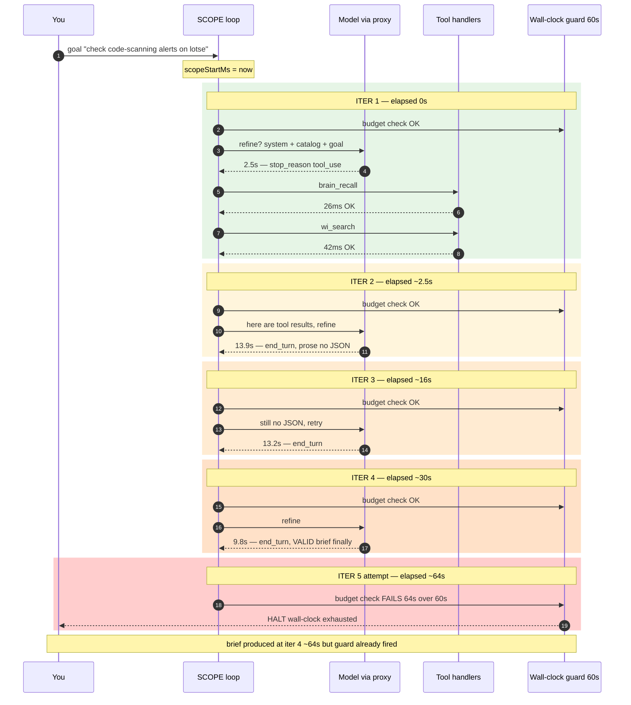
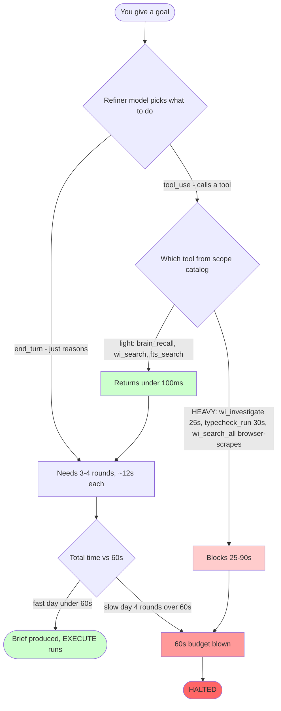

# Cypher SCOPE (refinement) phase — flow map & the 60s-halt bug

> **Status:** live investigation doc, 2026-07-14. Cause 1 fixed; Cause 2 open.
> **Code:** `src/services/cypher/loop.ts` (SCOPE block ~L917–L1310), `src/services/cypher/tool-catalog.ts` (`effectiveToolPhase` L2256, `getCatalogForPhase` L2280).
> **Companion memory:** `memory/bug_scope_phase_heavyweight_tool_leak.md`.

## What the SCOPE phase is

`/wi <goal>` runs a **two-pass loop** (ADR-039), gated by `CYPHER_REFINEMENT_ENABLED=1`:

1. **SCOPE (plan)** — take the fuzzy goal, gather cheap context, emit a structured `refined_goal` JSON brief. Read-only. Budgeted at **60s** (`CYPHER_SCOPE_MAX_WALLCLOCK_MS`).
2. **EXECUTE (do)** — the brief drives the real work with the full toolbox.

The bug: SCOPE routinely halts at 60s with `"wall-clock budget (60000ms) exhausted after 1 iter(s)"` — before it can hand off to EXECUTE.

## Diagram 1 — What actually happens, in order (real probe timings, session `cyp_4165ee97fc7a`)

**The load-bearing fact:** tools (green) cost **68ms total**. The four model calls (2.5 + 13.9 + 13.2 + 9.8 ≈ **40s**) are the problem. Add growing message history and the 4th round lands past 60s.

## Diagram 2 — The two independent roads to the same cliff

- **Road 1 (right, red) — heavy tool.** Model calls a tool that does *real work* mid-plan. **FIXED 2026-07-14:** `effectiveToolPhase` now excludes any untagged tool with `estimated_duration_ms > 3000` from the SCOPE catalog (scope 28→20 tools). Road closed.
- **Road 2 (left, amber) — too many rounds.** Even with only light tools, the model takes 3-4 turns @ ~12s to write valid JSON. **OPEN, dominant.**

## Why those specific tools were dangerous (your literal question)

| Tool | Declared `est_ms` | What the handler *actually* does | In SCOPE after fix? |
|---|---|---|---|
| `wi_investigate` | 25000 | Dispatches a full investigation **subagent** (its own LLM + tool calls) | ❌ excluded |
| `typecheck_run` | 30000 | Runs `tsc` over the repo | ❌ excluded |
| `wi_search_all` | 60000 | Launches **headless Chrome**, scrapes Outlook (90s timeout) + 100 Jira issue pages one-by-one over HTTP | ❌ excluded |
| `wi_jira_analyze` | 12000 | LLM analysis of a Jira issue | ❌ excluded |
| `brain_verify` | 8000 | Hits GitHub/Jira MCP servers | ❌ excluded |
| `wi_search` | 1000 | SQLite FTS query | ✅ kept |
| `fts_search` | 1200 | SQLite FTS query | ✅ kept |
| `brain_recall` | 500 | SQLite/palace lookup | ✅ kept |

The trap: a tool's **declared duration ≠ its real cost**, and some "search"-named tools secretly do heavy I/O (`wi_search_all` = browser automation). The duration-number fix catches them *because* their declared durations were honestly high — but a future tool that *under*-declares would still slip through. That's the argument for eventually tagging by **category** (browser/subagent/network), not just duration.

## Fix status

- **Cause 1 (heavy-tool leak):** ✅ fixed — `effectiveToolPhase` duration fallback. `SCOPE_UNTAGGED_MAX_DURATION_MS = 3000`.
- **Cause 2 (round-count × latency race):** ⬜ open. Candidate fixes:
  - **(a) prompt-tighten** the refiner to emit the JSON brief in **1 round** (cuts round count — biggest lever).
  - **(b) raise** `CYPHER_SCOPE_MAX_WALLCLOCK_MS` to ~90s (safety cushion).
  - **(c) harder prompt-cache** the refiner system prompt + shrink catalog hint (cuts per-call tokens → latency).
  - Recommended: **(a) + (b)**.
