# Data Flow

> Companion to [`architecture/index.md`](./index) — focuses on **sequence flows**: how data moves through the four stages (Fetch → Process → Analyze → Propose) for each major path.

Quick links to flows on this page:
1. [Teams sync](#teams-sync-flow-npm-run-teams-sync) · [Teams query](#query-flow--get_teams_updates)
2. [Jira report](#query-flow--get_jira_report) · [Dedup](#deduplication) · [FTS5](#fts5-search)
3. [Missing transcript detection](#missing-transcript-detection)
4. [Topic notebook build](#topic-notebook-build--update-flow-ep-26--ep-36) · [Topic chat](#topic-chat-flow-ep-26--ep-40)
5. [Semantic search](#semantic-search-flow-ep-37) · [Weekly pattern](#weekly-pattern-analysis-flow-ep-38) · [Stale fallback](#stale-on-error-fallback-flow-ep-40)
6. [Cross-repo knowledge sync](#cross-repo-knowledge-sync-flow) · [CDC pipeline](#cdc-pipeline-flow-ep-63) · [Agent orchestration](#agent-orchestration-flow-ep-6465)
7. [OpenClaw plugin](#openclaw-plugin-layer) · [Unified Brain decide](#unified-brain-decide-flow-adr-024)

---

## Teams Sync Flow (`npm run teams-sync`)

Triggered manually or on a schedule. Opens Teams in a browser session and scrapes all (or unread) group chats.

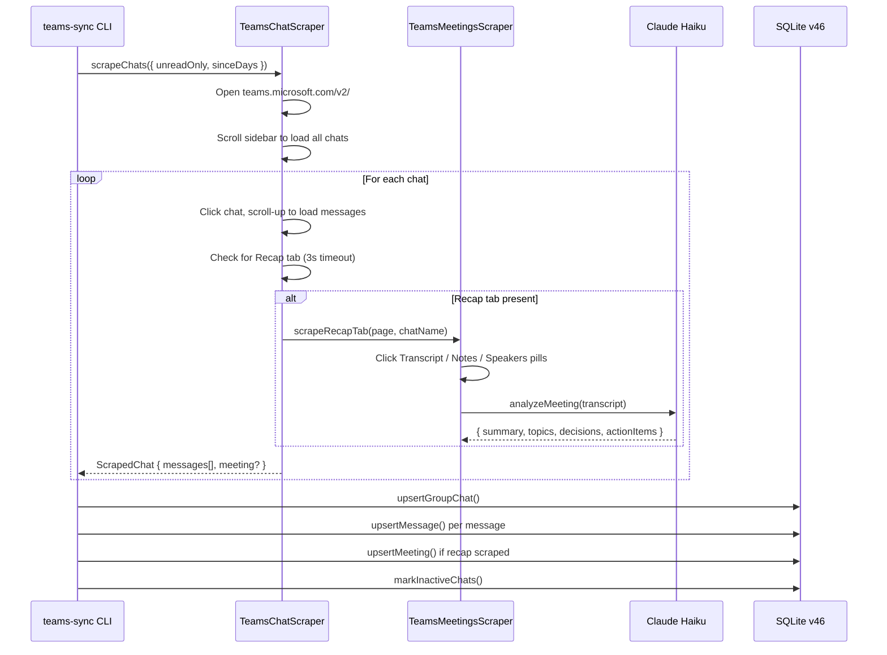

## Query Flow — `get_teams_updates`

All queries run against the local SQLite cache. No live fetching on query.

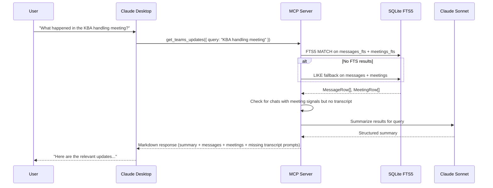

## Query Flow — `get_jira_report`

Live-fetches from Jira, persists to DB, then generates report.

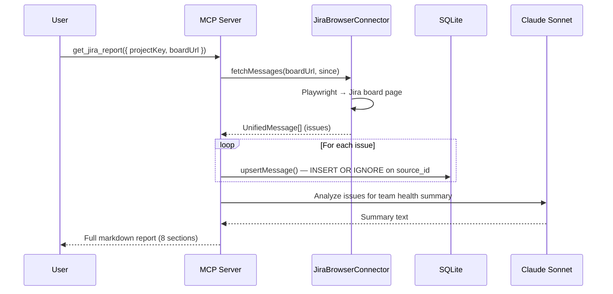

## Deduplication

Messages are deduplicated at the DB layer using a `UNIQUE(source, source_id)` constraint:

- **Teams messages**: `source_id` = `sha256(chat|sender|timestamp|contentPrefix).slice(0,16)`
- **Teams meetings**: `source_id` = `chatName|datetime`
- **Jira**: `source_id` = Jira issue key (e.g. `PROJ-123`)
- **Outlook**: `source_id` = internet message ID or hash of sender+subject+date

`upsertMessage()` / `upsertMeeting()` use `INSERT OR IGNORE` — duplicates are silently skipped.

## FTS5 Search

After each insert, triggers keep the FTS5 virtual tables in sync:

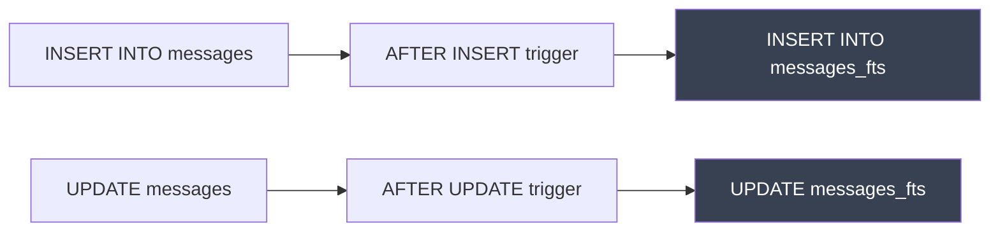

Search uses BM25 ranking; falls back to LIKE when FTS returns zero results (e.g. very short queries).

## Missing Transcript Detection

There are two complementary mechanisms for detecting meetings without transcripts.

### Proactive: Alert Feed (Rule 5)

After every sync, `generateAlerts()` runs Rule 5 — a scan of `calendar_events` for meetings that have already ended:

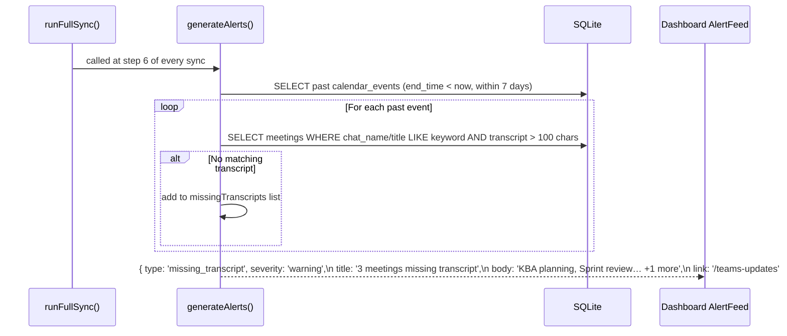

The alert appears in the `AlertFeed` on the dashboard as a yellow warning. Clicking it navigates to `/teams-updates`.

**Matching logic**: takes the first keyword (> 3 chars) from the calendar event title and does a `LIKE` check against `meetings.chat_name` and `meetings.title`. A transcript is considered present when `length(transcript) > 100`.

---

### Reactive: In-query detection (`get_teams_updates`)

When `get_teams_updates` is called, it also checks the matched messages for meeting signals:

1. Collects unique chat names from FTS-matched messages
2. Checks if each chat has a `meetings` row with `length(transcript) > 100`
3. If not, scans the chat's last 50 messages for meeting keywords: `transcript`, `recording`, `recap`, `meeting notes`, `action item`, `follow-up`, `attendees`, `agenda`, `minutes`, `presentation`, `shared screen`
4. Surfaces a prompt in the MCP response:

```
## Missing Transcripts

- **KBA handling in BiS technical setup**: Open Teams → Recap tab → copy transcript → paste here.
```

This lets the user provide transcripts for chats where Teams Premium is required for automatic recording, or where the Recap tab did not appear during the sync. The pasted transcript is available in the current conversation context but is not automatically saved to the DB.

---

## Topic Notebook Build & Update Flow (EP-26 / EP-36)

Notebooks are Claude's persistent memory per topic — built once, updated incrementally on every sync.

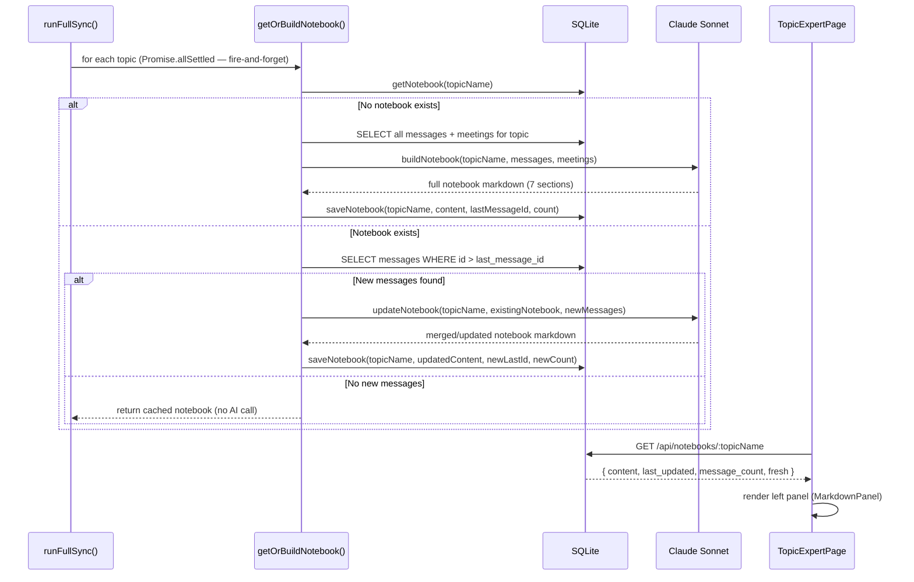

**Key property**: Claude reads its previous notebook + new data and writes a merged version. It does not regenerate from scratch — this is the **incremental LLM memory update** pattern.

**Pre-brief integration (EP-36)**: after notebook refresh, `generatePreBrief(event, notebookContent?)` uses the notebook as additional context when generating calendar event pre-briefs.

---

## Topic Chat Flow (EP-26 / EP-40)

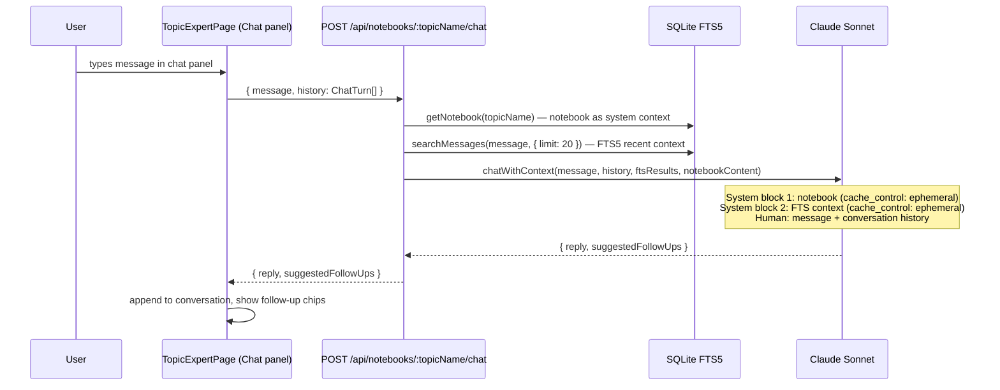

**Impact**: Chat answers are grounded in project history (decisions, blockers, key people) rather than just keyword-matched recent messages.

---

## Semantic Search Flow (EP-37)

Shipped Sprint 6. Requires Ollama (local embedder) and `sqlite-vec` extension. When unavailable, `embeddingsAvailable: false` on `/api/status` and FTS5 takes over.

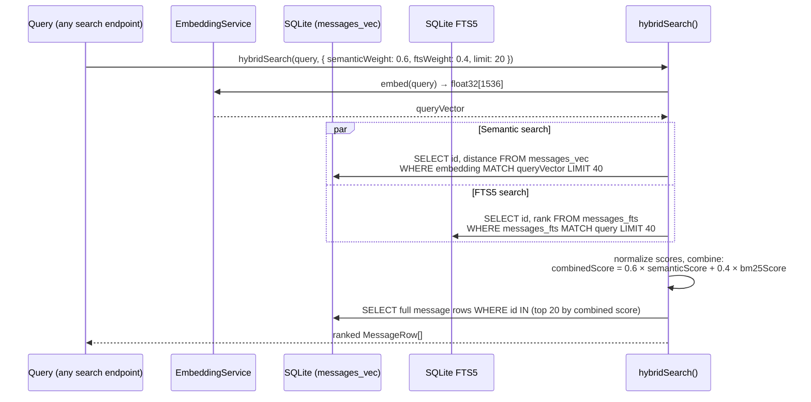

**Embedding pipeline**: new messages are embedded in the background by `EmbeddingService.embedBatch()` during sync. The `message_embeddings` table stores raw blobs; `messages_vec` is the sqlite-vec virtual table for cosine distance queries.

---

## Weekly Pattern Analysis Flow (EP-38)

Shipped Sprint 6.

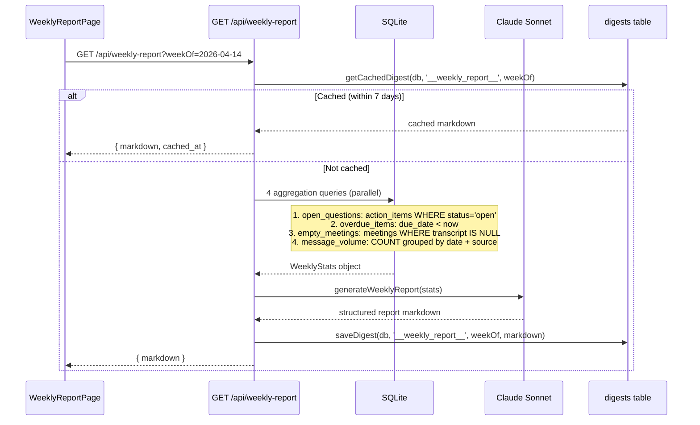

**Cost**: ~$0.02/report (cached 7 days, auto-regenerated weekly in `runFullSync`).

---

## Stale-on-Error Fallback Flow (EP-40)

Shipped Sprint 6. Applies to all read-only AI endpoints (digest, morning-brief, notebooks, weekly-report). Tracked gap (`GAP-P5` in `known-gaps`) — application is inconsistent: chat endpoint does not yet use it.

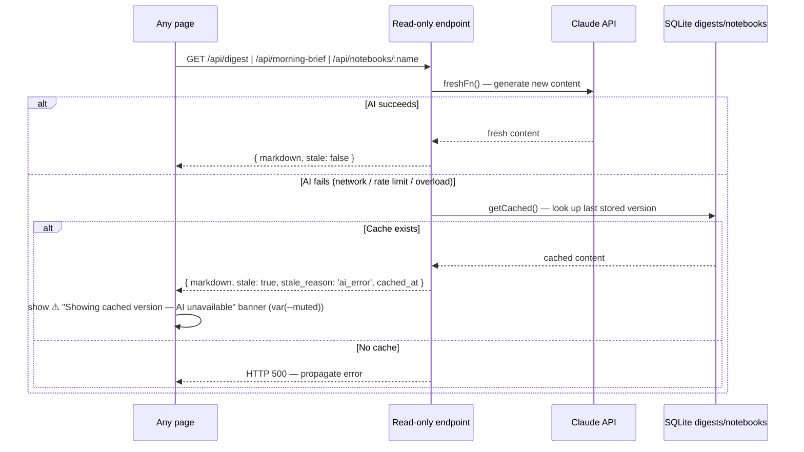

**Rule**: stale fallback ONLY for read-only endpoints (digest, morning-brief, notebooks, weekly-report). Write operations (sync, configure-topic) must fail explicitly.

---

## Cross-Repo Knowledge Sync Flow

When Claude edits files in example-service or operations repos, a PostToolUse hook captures the event and pushes it to the bridge.

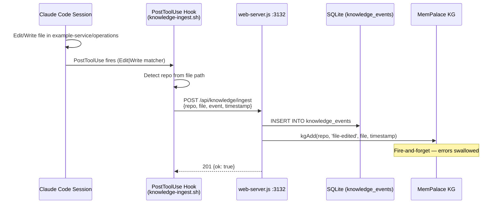

## CDC Pipeline Flow (EP-63)

The Change Data Capture pipeline enables agents to react to data changes without polling external sources.

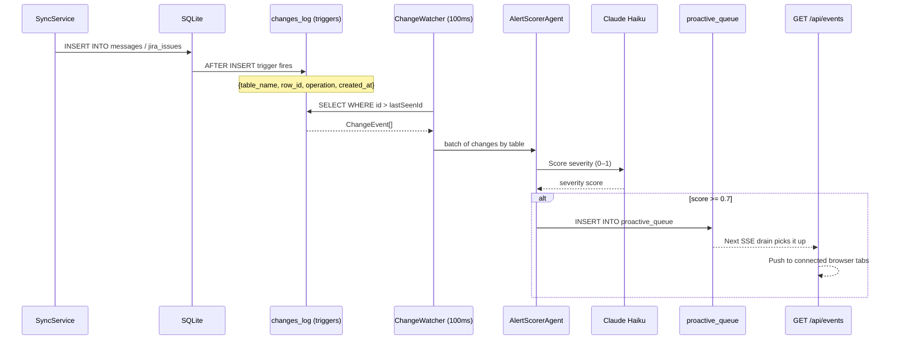

## Agent Orchestration Flow (EP-64/65)

The OrchestratorAgent provides multi-step reasoning via tool_use loops. CorrelationAgent uses it nightly to find cross-topic signals.

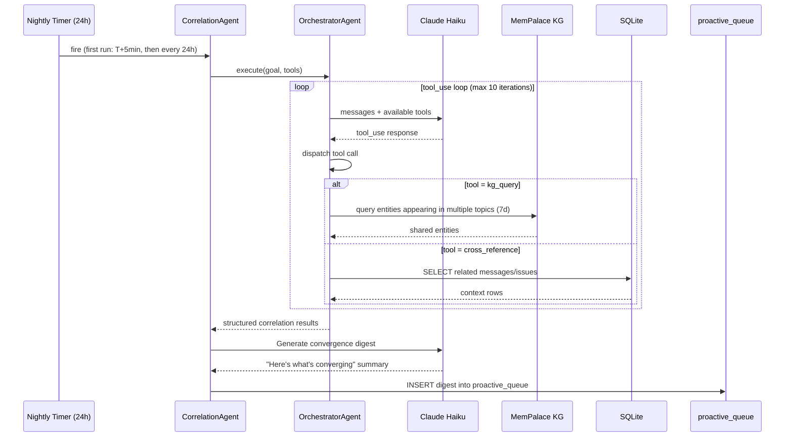

---

## OpenClaw Plugin Layer

The OpenClaw plugin sits as an external gateway layer on top of the bridge. It runs as a TypeScript plugin inside the OpenClaw daemon — no changes to the bridge server are required.

```
Messaging Channel (Telegram / Slack / Discord)
        ↓
OpenClaw Gateway (persistent daemon)
        ↓  ↑
  ┌─────────────────────────────────────┐
  │         Plugin Hooks                │
  │  message_received                   │  ← classify + route incoming messages
  │  before_prompt_build (60s TTL cache)│  ← inject action items + sprint context
  │  tool_result_persist                │  ← save to memory + ticket notes
  │  agent_end                          │  ← push summary; start poller if needed
  │  gateway_start                      │  ← register cron + slash commands
  └─────────────────────────────────────┘
        ↓  ↑  (fetch — circuit-breaker protected)
work-intelligence Bridge (port 3132)
        ↓
     SQLite + MemPalace
```

All plugin calls to the bridge are protected by a circuit breaker (3 failures → 30s open). The plugin is a pure client — it adds no server-side logic and requires no schema changes. See [ADR-023](../adr/adr-023-openclaw-plugin.md) for the full design.

After Phase 72 (ADR-025), the plugin's tool registration imports `TOOL_MANIFEST` directly from `src/tools/manifest.ts` — the same array consumed by `src/server.ts`. There is no string drift between MCP and Atlas: both register byte-identical descriptions, schemas, and endpoints.

---

## Unified Brain Decide Flow (ADR-024)

The primary query path post-Phase 71. Atlas and MCP clients both go through this flow when they need a decision rather than a lookup.

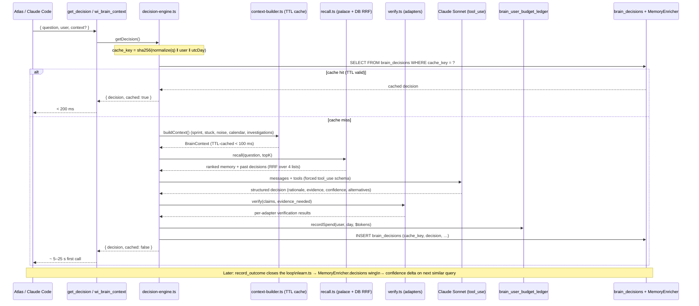

**Cache key invariants** (after BUG-004 fix in `ADR-REVIEW.md`):
- `cache_key TEXT NOT NULL UNIQUE` on `brain_decisions`
- Derivation: `sha256(normalizeQuestion(question) ‖ user ‖ utcDayIso())`
- Two users asking the same question on the same day get **separate** decisions
- Same user asking the same question on the same day (within TTL) gets a **cached** decision
