> **First time here?** This document is written so a complete beginner can follow it. No prior knowledge of MCP, Claude, agents, or this codebase is assumed. Where a term needs more context than fits in flow, you'll see an **ℹ️ info block** — click to expand.

> **The single canonical document.** Everything else (`CLAUDE.md`, `docs/docs/`, `.planning/`) defers to this file for top-level facts. If you find a contradiction, this file wins until updated.

**Last verified:** 2026-06-27 · **Schema:** v86 (v85 ADR-039 `cypher_sessions.refined_goal` + v86 ADR-039 `prompt_outcomes.user_verdict` both live on master) · **Milestone:** Cypher v2.5 foundation in flight (ADR-038 D1-D7 landed; task memory + project scoping + worktrees + permissions ledger + retention/GC live); **ADR-037 tool-use loop** cut over 2026-06-23 (single while-loop replaces the legacy 9-stage pipeline); **ADR-039 refinement-phase substrate** landed 2026-06-27 (T2-T7 merged; T8 + dogfood gate on `CYPHER_REFINEMENT_ENABLED=1` flip pending) · **In-flight:** ADR-039 T8 rollout (smoke § 39 + docs sync); ADR-038 D8 self-model entry point; ADR-034 L1.1 outcome ledger Cypher Learning Engine

---

## 1. What this thing is, in plain English

Imagine you have a junior engineer who has been quietly watching every Jira ticket you touch, every Teams chat you read, every meeting you attended, every PR you opened, and every email you got — for the last six months. They've also read every line of your codebase, indexed who owns what, and remembered every architectural decision you've ever made.

Now imagine that junior engineer can answer questions, write briefs, investigate bugs, and propose fixes — without ever sending your data to anyone but Anthropic (for the AI).

That's Work Intelligence MCP. It runs **entirely on your laptop**.

<details>
<summary><b>ℹ️ What does "MCP" mean?</b></summary>

**MCP** stands for **Model Context Protocol** — a standard from Anthropic for letting AI tools (like Claude Code or Cursor) talk to local programs. Your editor speaks MCP; this project speaks MCP back. They communicate over a `stdio` pipe (stdin/stdout) using JSON-RPC.

When this README says "the MCP server", it means **a small Node.js process that Claude Code starts up and talks to in the background**. You never see it directly — it just exposes "tools" (search Jira, get teammates, etc.) that Claude Code can call when it needs them.
</details>

<details>
<summary><b>ℹ️ Where does my data live?</b></summary>

Three places, all on your laptop:

1. **SQLite database** at `~/.work-intelligence-mcp/data.db` — every Jira ticket, Teams message, action item, decision, bug, etc.
2. **MemPalace** at `~/.work-intelligence-mcp/palace/` — vector embeddings (semantic memory) and a small knowledge graph.
3. **Auto-memory** at `~/.claude/projects/<project>/memory/` — short text notes that survive between Claude Code sessions.

The only outbound traffic is to **Anthropic** (for AI calls) and the **source systems** (Jira, Teams, Outlook, GitHub) to fetch data. Nothing goes to a third party.
</details>

---
## 2. The mental model: brain, body, surfaces

There are exactly three things to keep in your head:

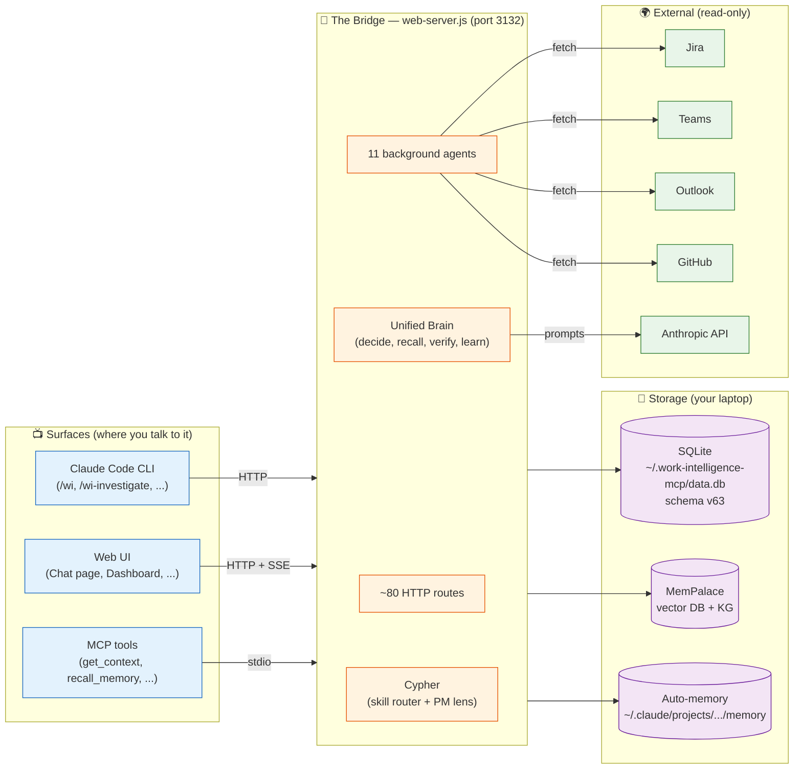

- **Surfaces** are how you interact: CLI (your terminal, via Claude Code), Web (a React app), and MCP tools (called by Claude Code automatically).
- **The Bridge** is one Node.js process. It owns everything: routes, agents, the brain, Cypher. It's the only thing that talks to your database.
- **Storage** is local files. Nothing remote.

<details>
<summary><b>ℹ️ Why is everything in one process?</b></summary>

Earlier versions split things across multiple processes. It was a mess: race conditions on the SQLite WAL, duplicated boot logic, drift between MCP and HTTP. Now there is **one bridge process**. The MCP server is a thin proxy that just forwards calls to the bridge over HTTP. This means:

- One database connection pool.
- One agent boot sequence.
- One place to read logs (`stderr` of the bridge).
- One CORS policy, one auth scheme, one rate limiter.

The trade-off: if the bridge crashes, all surfaces go dark until you restart it. We accept that — the bridge is hardened with per-agent error isolation (see [§ 7](#7-the-11-background-agents)).
</details>

---
## 3. The four processes that run on your laptop

| # | Process | How it starts | What it does |
|---|---|---|---|
| 1 | **HTTP Bridge** | `npm run web:bridge` (`web-server.js`, port **3132**) | Owns SQLite. Hosts all REST routes, all SSE streams, all 11 background agents, the Brain, and Cypher. **The single source of truth at runtime.** |
| 2 | **Web UI (Vite dev server)** | `npm run web:dev` (port **5175**) | A React app served in dev mode. Calls the bridge over HTTP. Just a viewer — no business logic. |
| 3 | **MCP stdio server** | Started by Claude Code / Cursor (`dist/server.js`) | A thin process that exposes tools to Claude Code. Most tools forward to the bridge over HTTP. |
| 4 | **MemPalace** | Spawned by the bridge as a Python child process | ChromaDB vector store + small knowledge graph. Talks to the bridge over MCP `stdio`. |

Processes 1 + 4 must be running for everything to work. Process 2 is only needed if you want the web UI. Process 3 is started automatically by Claude Code.

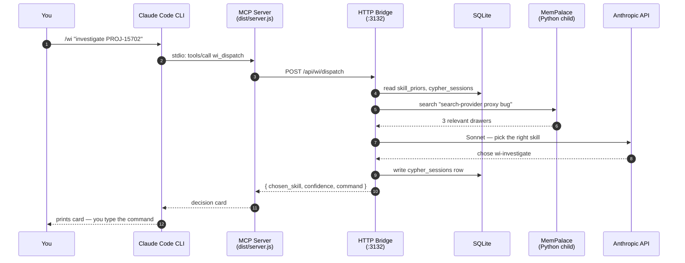

<details>
<summary><b>ℹ️ Why isn't the MCP server doing the work itself?</b></summary>

Two reasons:

1. **Single source of truth.** If both the MCP server and the bridge had their own copies of agents, sync state, and brain caches, they'd drift. By making the MCP server a proxy, every surface sees the same data.
2. **The bridge is always up.** Background agents (the bug investigator, the meeting prep agent, the code-graph indexer) need to run on a schedule even when you're not in Claude Code. The bridge runs continuously; the MCP server only runs while Claude Code is open.
</details>

---
## 4. The four-stage pipeline (data law)

Every piece of data flows through these four stages. **No stage may be merged or skipped.** This rule is checked manually on every PR and is the most important architectural constraint in the codebase.

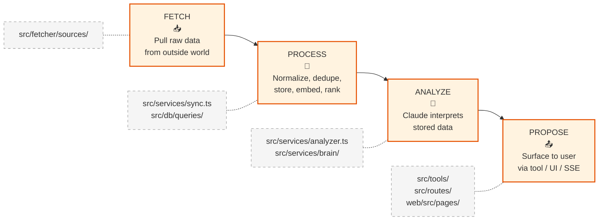

### The hard contracts

| Stage | Allowed | Forbidden |
|---|---|---|
| **FETCH** | Talk to Jira/Teams/Outlook/GitHub. Output `UnifiedMessage[]`. | ❌ Calling Anthropic. ❌ Writing to DB directly. |
| **PROCESS** | Normalize, dedupe (`UNIQUE(source, source_id)`), upsert, FTS5 index, embed, rank. | ❌ Calling external HTTP APIs. ❌ Calling Anthropic. |
| **ANALYZE** | Read stored data. Call Claude. Write decisions, summaries, investigations. | ❌ Fetching anything. ❌ Calling source APIs. |
| **PROPOSE** | Read DB and brain results. Format for the user. Stream over SSE. | ❌ Re-fetching. ❌ Re-analyzing. ❌ Calling Claude (use cached decisions). |

<details>
<summary><b>ℹ️ Why this rule exists</b></summary>

Without it, you get **N+1 problems** and **runaway cost**:

- A connector calls Claude on every fetch → suddenly your sync run costs $40 instead of $0.
- A propose-stage route re-fetches Jira on every page load → Jira rate-limits you and your UI is slow.
- An analyze step writes to source systems → undoable damage if you have a bug.

By enforcing **one direction**, every bug stays in one stage. If sync is slow, look at FETCH or PROCESS. If costs are up, look at ANALYZE. If the UI shows stale data, look at PROPOSE.
</details>

<details>
<summary><b>ℹ️ Known violations of the pipeline (acceptable trade-offs)</b></summary>

- **`generateAlerts()`** in the bridge skips ANALYZE — it's pure SQL. This is OK because alerts are deterministic counts, not interpretations.
- **`BugInvestigatorAgent`** (Phase 75) calls the brain from inside an agent loop. Strictly speaking this puts ANALYZE inside FETCH cadence. Mitigation: per-hour budget cap (`BUG_INVESTIGATOR_MAX_PER_HOUR=10`).
- **Jira browser fetch** is sometimes called from a route handler when the user asks for a fresh ticket. Strictly that's FETCH inside PROPOSE. Mitigation: opt-in only, and protected by `withJiraLock()` to serialize.
</details>

---
## 5. Cypher — the senior-engineer brain

> **⚠️ Section under revision (2026-06-27).** The 9-step pipeline described below is the **legacy v1.4 implementation** that lived in `src/services/cypher/run.ts`. As of 2026-06-23 it has been **cut over** to ADR-037's single-loop agentic controller (`src/services/cypher/loop.ts`) — one `while` loop, ~200 LOC, tools instead of stages. The pipeline file remains in the codebase for ≥4 weeks post-cutover as rollback insurance; the loop is the only engine going forward.
>
> Three ADRs are reshaping how Cypher works:
>
> - **[ADR-037](../adr/adr-037-cypher-tool-use-loop)** — Replaces the 9-stage pipeline with an agentic tool-use loop. **Status: Accepted, cut over 2026-06-23.** Pipeline file removal scheduled 2026-07-21.
> - **[ADR-038](../adr/adr-038-cypher-v2.5-production-grade)** — Production-grade foundation: task memory, project scoping, worktrees, permissions ledger, retention/GC, self-model, always-on orchestrator. **Status: In flight; D1-D7 landed (task memory + projects + worktrees + boundary audit + permissions + GC + boot reaper); D8 self-model entry point in flight.**
> - **[ADR-039](../adr/adr-039-cypher-refinement-phase)** — Splits `runLoop` into a **scope phase** (build a structured `refined_goal` brief) and an **execute phase** (act on it). Adds the `goal_refinement` trigger to ADR-021's PromptEvolver, `user_verdict` signal on `prompt_outcomes`, catalog-aware recall hint, and parallel `tool_use`. **Status: Accepted, substrate landed 2026-06-27 (T2-T7 merged on master). T8 rollout (env-flag gate + smoke + docs) in flight. Behind `CYPHER_REFINEMENT_ENABLED` env flag, defaulted OFF until 2-week dogfood validates.**
>
> The section below is preserved as historical reference for what the legacy pipeline did. The behavioral contract (Cypher decides, user confirms, outcomes are recorded for Bayesian priors) is unchanged; only the internal control flow is different.

Cypher is the single biggest thing to understand about this codebase. It's the *persona* the system presents when you say `/wi <goal>` in Claude Code, or use the chat panel in the web UI. Most things you'd build directly into Claude Code are now built **through Cypher** instead, so the system can learn from how they go.

### What Cypher actually is, in one paragraph

Cypher is a **persistent reactive service** that lives inside the bridge. When you give it a goal in plain English, it: (1) figures out what kind of task this is, (2) picks the best `wi-*` skill to handle it from a catalog of ~123 skills, (3) prints a *decision card* with confidence and alternatives, (4) waits for you to type the suggested command (it never auto-executes risky things), and (5) when you tell it the outcome, updates Bayesian priors so it gets better at picking next time. ADRs **033** (framework), **034** (learning engine), **036** (CLI primary surface) define it.

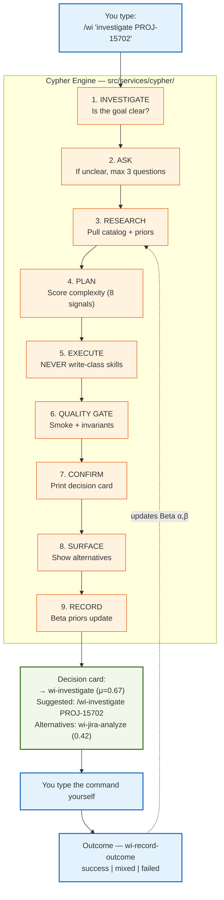

### The 9-step contract (what each step does)

The 9-step contract runs atop the **Workflow tool primitive** — Claude Code's mechanism for orchestrating a sequence of structured steps where each step gets the previous step's output. Cypher uses Workflow to keep stages cleanly separated (you can see exactly which stage failed when something goes wrong) and to make resumption from a checkpoint cheap.

| # | Step | What happens | File |
|---|---|---|---|
| 1 | **investigate** | Is this goal a question, an action, or ambiguous? Pre-fetch related drawers from MemPalace + claude-mem so we don't ask things we already know. | `src/services/cypher/clarify.ts` |
| 2 | **ask** | If still ambiguous, surface ≤ 3 ranked clarifying questions with sensible defaults. Otherwise skip. | `clarify.ts` |
| 3 | **research** | Resolve the candidate skill list from `skill_catalog` (123 skills) and rank via Beta priors. | `candidates.ts`, `learn.ts` |
| 4 | **plan** | Score complexity on 8 signals (long_goal, multi_part, planning_lang, multi_ac, critical_path_files, busy_workboard, research_shape, trivial_shape). Verdict: light / heavy / borderline. | `complexity.ts` |
| 5 | **execute** | Run the skill **only if** it's `auto`-class (read-only or WI-internal write). Write-class skills are returned for user confirmation. | `path-classifier.ts`, `skills.ts` |
| 6 | **quality_gate** | Run the relevant smoke checks. `npm run smoke:bridge` if backend; `smoke:ui` if frontend. | (out-of-process) |
| 7 | **confirm** | Render the decision card. | `run.ts` |
| 8 | **surface** | Push to all consumers (CLI prints, web UI feed, MCP tool result). | `run.ts` |
| 9 | **record** | Write `cypher_sessions` row, update `skill_priors`, write to `cypher_outcomes` (v64 — in flight). | `learn.ts`, `outcomes.ts` |

<details>
<summary><b>ℹ️ What's a "Beta prior" and how does it learn?</b></summary>

Each `(skill_name, task_class)` pair has two numbers stored in the `skill_priors` table: **α** (alpha) and **β** (beta). Both start at 1 — meaning "we have no idea if this skill is good for this task class".

When you record an outcome:

- **success** → α gets +0.5
- **failed** → β gets +0.5
- **mixed** → both get +0.25

Cypher's "expected success rate" for that skill is `μ = α / (α + β)`. So after 10 successes: μ ≈ 0.91. After 5 successes and 5 failures: μ ≈ 0.5.

When picking a skill, Cypher uses **Thompson sampling** — it draws a random number from `Beta(α, β)` for each candidate and picks the one with the highest draw. Skills with little data get explored; skills with lots of data converge on their true rate. No grid search, no manual tuning.

This is why Cypher is called a "learning router" — every dispatch teaches it something about which skills work for which kinds of goals.
</details>

<details>
<summary><b>ℹ️ Why won't Cypher just run the command for me?</b></summary>

This is the **depth ≤ 2 invariant** from ADR-033, amended by ADR-036. The rule: Cypher chooses, you confirm.

The reason is trust calibration. If Cypher picks a `wi-investigate` skill and runs it, and three months later it's been quietly burning $5/run on the wrong skill choice, you'd never know. By forcing you to type the command yourself, every dispatch is a chance to catch a bad pick before it costs you.

ADR-036 softened this for **read-only auto-class skills only** — those run automatically. Anything that writes (Jira comments, file edits, git commits) still requires you to type the command.
</details>

### Cypher's database tables

| Table | Schema version | What it records |
|---|---|---|
| `cypher_sessions` | v59 | One row per `/wi` dispatch — the goal, chosen skill, outcome, total tokens, duration. |
| `cypher_steps` | v59 | One row per stage transition (the 9-step contract). Audit trail. |
| `skill_priors` | v59 | Beta(α, β) for every `(skill_name, task_class)` pair. The learning state. |
| `work_items` | v60 | One row per acceptance criterion / milestone. The PM lens. |
| `work_item_links` | v60 | Many-to-many evidence map: which commits / sessions / smoke sections / files prove a work item shipped. |
| `pm_auto_actions` | v61 | Audit trail for Cypher's autonomous PM writes (auto-link, auto-close). |
| `skill_catalog` | v63 | 123 discovered skills (36 wi-*, 55 global, 32 plugin). Boot-time scanner of `~/.claude/skills/`. |
| `cypher_outcomes` | v64 *(in flight)* | Multi-signal outcome ledger (verdict, thumbs, rerun-detection, edit-distance, CI). ADR-034 L1.1. |

### Cypher's HTTP endpoints

All read-only PM lens routes live under `/api/cypher/pm/*`. The single dispatch entry point is `POST /api/wi/dispatch`.

```
POST /api/wi/dispatch                       — main entry; open or close a session
POST /api/wi/dispatch/classify-prior        — deferred outcome classification (ADR-036 D7)

GET  /api/cypher/pm/next?limit=N            — top-N pending unblocked work items
GET  /api/cypher/pm/status?id=<id>          — single work item + evidence
GET  /api/cypher/pm/rollup                  — counts by phase / wave / status
GET  /api/cypher/pm/impact?kind=&value=     — reverse lookup (e.g. file → ACs)
POST /api/cypher/pm/link                    — append evidence (idempotent)
GET  /api/cypher/pm/drift?staleDays=N       — stale or unlinked work items

GET  /api/cypher/health/priors              — skill_priors snapshot + success rates
GET  /api/cypher/health/sessions?limit=N    — last N dispatches
GET  /api/cypher/health/sessions/:id        — single session drill-down
GET  /api/cypher/health/sessions/stale      — stuck-pending sessions
POST /api/cypher/health/sessions/sweep      — bulk-close stale sessions

GET  /api/cypher/skill-catalog              — all 123 discovered skills
POST /api/cypher/outcomes                   — record outcome signals (v64, in flight)
```

### CLI as Cypher's primary surface (ADR-036, in-flight phase 86)

The original `/api/wi/dispatch` is a **stateless cold POST**: every dispatch builds the prompt from scratch, pays the full input-token cost, and returns a single JSON blob. ADR-036 keeps that endpoint for non-streaming HTTP callers but adds a **rich channel** for the CLI — the surface you actually use most.

The thesis (D1): *Bridge is Cypher's body. CLI is the user's primary surface.* The CLI shouldn't be a thin curl wrapper — it should be an SSE consumer that sees Cypher think.

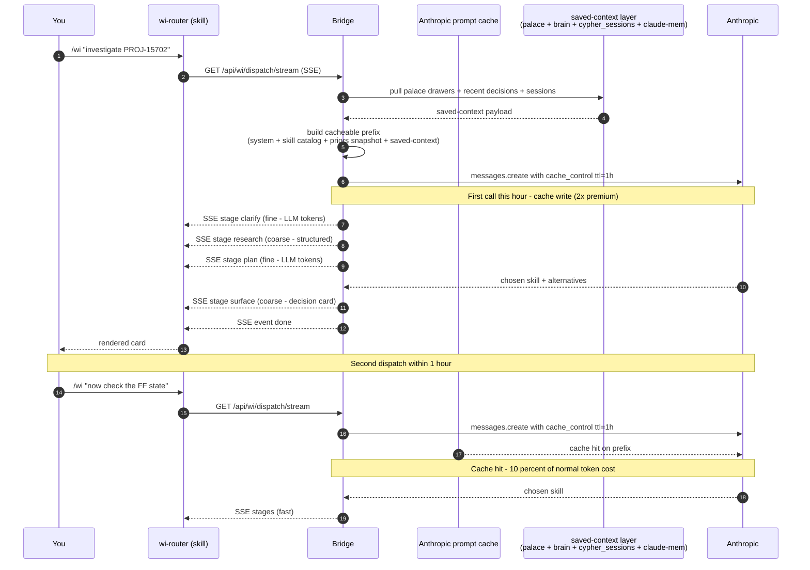

#### D1 — SSE streaming + 1h prompt cache + saved-context cold start

| Decision | What it means | Why |
|---|---|---|
| **D1** | New endpoint `/api/wi/dispatch/stream` (SSE). Same shape as `/api/brain/decide/stream`. CLI sees Cypher think. | Cold POST hides the reasoning. Streaming makes Cypher's thinking visible mid-flight. |
| **D1.4** | Cacheable prefix uses Anthropic's **1-hour TTL** (`cache_control: { type: 'ephemeral', ttl: '1h' }`), not the 5-minute default. | Matches a typical focused working session. Cache-write costs 2× base input price; cache hits cost ~10% of normal. Net huge savings during a 1–2h focused session. |
| **D1.5** | The cacheable prefix is built from **system prompt + skill catalog summary + Beta-priors snapshot + saved-context** pulled from palace + brain_decisions + cypher_sessions + claude-mem. | Bridge's existing memory infrastructure becomes Cypher's persistent warmth layer. The 1h cache is the per-session speedup *on top* of that warmth. |

<details>
<summary><b>ℹ️ How does the 1-hour cache actually save money?</b></summary>

Anthropic's prompt cache works like this: the first time you send a long system prompt, you pay a small write premium (2× base input price, with the 1-hour TTL). After that, any call within the next hour that starts with the same exact prefix only pays ~10% of base input price for those tokens.

So for a typical Cypher prefix of ~10k tokens of system prompt + catalog + saved-context:

- **First dispatch this hour:** pays 10k × 2× = 20k tokens-equivalent (cache write)
- **Subsequent dispatches within the hour:** each pays 10k × 0.1 = 1k tokens-equivalent (cache hit)

If you do 5 dispatches in an hour, you pay 20k + 4 × 1k = 24k tokens-equivalent for the prefix portion — versus 5 × 10k = 50k without caching. That's ~52% savings, scaling to ~90% with 20+ dispatches an hour.

The cache invalidates if *any* byte of the prefix changes. Beta-priors updates (which happen on every outcome) include a "priors hash" so a small change shifts the hash but the rest of the prefix stays cacheable for as long as the hash is stable. The system rebuilds the prefix when significant skill_priors change.
</details>

#### D2 — The transport contract (hybrid SSE event granularity)

The SSE stream isn't uniform. Stages where the *thinking matters* stream fine-grained (token-by-token); deterministic stages emit one structured event:

| Stage | Granularity | Why |
|---|---|---|
| `clarify`, `plan`, `summary` | **Fine** — LLM tokens stream as they arrive | The user wants to *see Cypher reason*. |
| `research` (catalog + priors), `surface` (final decision card) | **Coarse** — one event per stage with the structured output | Deterministic computation. No reason to stream — just emit the answer. |
| Beta-prior ranking, path-classifier rules, DB writes | **Coarse** | Pure code. One event with the result. |

**Schema enforcement (D2.C):** every SSE event has a strict JSON schema. A malformed event is a hard failure — the CLI must fail loudly, never silently render garbage. Smoke section § for SSE schema validation runs the contract against every emit path.

#### D5 — Bridge unreachable: queue files

If the CLI calls `/api/wi/dispatch/stream` and the bridge is down, the CLI does NOT lose the request. It writes a **queue file** to `~/.work-intelligence-mcp/queue/cyp_pending_<id>.json` with the goal, task class, and timestamp. The CLI then attempts to bring the bridge back up via adaptive restart logic (reads `bridge_restart_log.json` to choose a healthy restart cadence) and replays the queued dispatch.

Adaptive policy:
- ≥5 healthy observations recent → use `max(10s, 3 × p95_healthy_ms)`, floor 10s, ceiling 60s
- Bridge `npm run web:bridge` exits non-zero in `<2s` → capture stderr, hard-fail immediately
- ≥3 crash-restart loops in 10 min → stop auto-restart, surface "bridge keeps dying" warning
- Healthcheck OK but agents crashed → surface degraded state, don't pretend healthy

Every step is surfaced to the user (warning, save location, restart attempt, healthcheck progress). No silent degradation.

#### D7 — Outcome capture via natural conversation (not a separate command)

Originally Cypher needed an explicit `/wi-record-outcome` after every dispatch. ADR-036 D7 deprecates that for the common case: when your **next message** arrives, a Haiku classifier (bucket `agents`) reads it together with the prior dispatch output and labels it:

| Classification | Effect on prior session |
|---|---|
| `correction` (e.g. "no, that's not the right ticket") | outcome = `failed`, β += 0.5 |
| `continuation` (e.g. "now show me the FF state") | outcome = `success`, α += 0.5 |
| `unrelated` (different topic) | outcome stays `mixed`, no Beta movement |

Endpoint: `POST /api/wi/dispatch/classify-prior`. The explicit `wi-record-outcome` skill still exists as the override path when the classifier is wrong or you want to record an outcome out-of-band.

#### What this means for the CLI surface

The old `wi-router` SKILL.md was: `curl POST → parse JSON → render card → stop`. The ADR-036 rewrite is:

1. Open SSE stream.
2. Per-event-kind rendering: stream LLM tokens for `clarify`/`plan`, emit structured cards for `research`/`surface`.
3. For `auto`-class skills, invoke them via the Skill tool *during the same interaction* (no second `/wi-…` round-trip).
4. For `confirm`-class skills, render the suggestion and wait for explicit `y/n`.
5. Before each risky step, write to `cyp_pending_<id>.json` (D5) so an interrupt or crash leaves a recoverable trail.

The depth ≤ 2 invariant is preserved for `confirm` and `cli` classes but relaxed for `auto` (read-only WI-internal). See [§ 8](#8-the-skills-system-36-wi--skills) for the category split.

### Cypher's CAP-* capabilities

| CAP | Name | Status | What it does |
|---|---|---|---|
| **CAP-01** | Cross-session thread state | Designed | Threads survive across Claude Code sessions; auto-named from Jira keys; ACTIVE / PAUSED / BLOCKED / DONE lifecycle. |
| **CAP-11** | Fan-out preamble | **Shipped** | Every fan-out sub-agent gets a ≤ 500-token preamble (parent intent, hypothesis, what its output feeds). 14/14 useful telemetry across 5 fan-outs. |
| **CAP-13** | Self-extension | **Shipped (lite + full)** | Recurring pain (≥3 occurrences) + encapsulable I/O → Cypher proposes a new skill. Manual review gate; no orphan ships. |
| **CAP-14** | Skill consolidation | Designed | Three retirement signals: 90d no-fire, ≥70% description-similarity, originating pain fixed. Soft cap of 30 skills. |

### The hooks that enforce Cypher discipline

| File | When it fires | What it blocks |
|---|---|---|
| `.claude/hooks/cypher-discipline.sh` | Before every `Edit` / `Write` / `NotebookEdit` on smoke-gated paths | Refuses the edit if no Cypher session has been opened in the last hour. Bypass: `CYPHER_SKIP=1 CYPHER_SKIP_REASON='typo'`. |
| `.claude/hooks/smoke-before-done.sh` | Before commit signing | Runs the matching smoke script (§ 23–29). Blocks if the schema, category list, or session round-trips drifted. |

---
## 6. The HTTP bridge (`web-server.js`)

The bridge is one Node.js file (`web-server.js`, **7,366 lines**) that owns everything at runtime: the SQLite connection, all HTTP routes, all background agents, the Brain, Cypher, the SSE streams, and the CORS policy. It listens on **port 3132** by default.

### Boot sequence (what happens when you run `npm run web:bridge`)

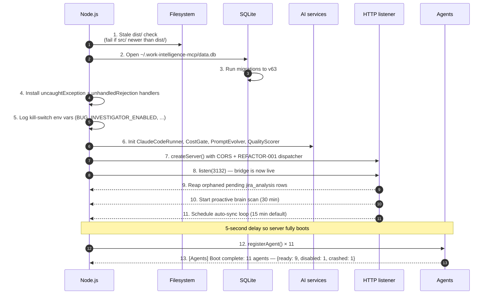

### CORS — the one thing that has surprised everyone

The bridge does **not** wildcard CORS. Browsers from disallowed origins simply get no `Access-Control-Allow-Origin` header back, and the browser blocks the response.

```js
// web-server.js, function corsHeadersFor(req)
function corsHeadersFor(req) {
  const origin = req.headers.origin;
  if (!origin) return {};                                  // curl, MCP, Atlas — no CORS needed
  const allowed = (process.env.ALLOWED_ORIGINS || '').split(',').map(s => s.trim());
  if (!allowed.includes(origin)) return {};                // browser from elsewhere — block
  return {
    'Access-Control-Allow-Origin': origin,
    'Access-Control-Allow-Methods': 'GET, POST, PUT, DELETE, PATCH, OPTIONS',
    'Access-Control-Allow-Headers': 'Content-Type, X-WI-Consumer, Authorization',
    'Access-Control-Allow-Credentials': 'true',
  };
}
```

The smoke script (`scripts/smoke-bridge.sh` § 4) verifies that disallowed origins get **no** CORS headers and allow-listed origins get them echoed.

### The HTTP route map (~80 routes)

Routes are organized by domain. Newer ones live in `src/routes/*.ts` modules (REFACTOR-001 / ADR-026); older ones still live inline in `web-server.js`.

<details>
<summary><b>ℹ️ Which domains are extracted to <code>src/routes/</code> already?</b></summary>

Currently extracted (each file exports a `RouteHandler[]` consumed by the dispatcher in `web-server.js`):

`action-items.ts` · `brain.ts` · `bugs.ts` · `digest.ts` · `model-config.ts` · `palace.ts` · `persona.ts` · `pr.ts` · `profile.ts` · `skills.ts` · `system-health-tokens.ts` · `topics.ts`

Pattern reference: `src/routes/_types.ts` + `src/routes/_util.ts` + `src/routes/README.md`.

Anything not in this list still lives inline in `web-server.js` — Jira routes, code-graph, chat, search, calendar, sync, and the rest. They get extracted opportunistically when the file or a related route changes.
</details>


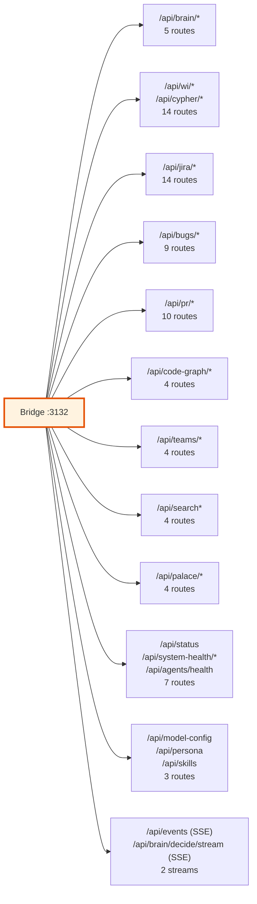

#### Brain (5 routes)
```
POST /api/brain/learn              — record decision outcome (Pillar 4)
POST /api/brain/verify             — verify claim against evidence (Pillar 5)
POST /api/brain/recall             — recall memory by pattern
GET  /api/brain/decisions          — decision audit trail
GET  /api/brain/context            — 7-field operational context (60s TTL)
POST /api/brain/decide             — synchronous decision pipeline
GET  /api/brain/decide/stream      — SSE: pipeline stages + final decision
GET  /api/brain/budget             — per-user daily call + token budget
```

#### Bugs — the self-healing loop (9 routes)
```
POST /api/bugs/report              — capture a new bug (idempotent UPSERT)
GET  /api/bugs                     — list (status, severity filters)
GET  /api/bugs/:id                 — detail + investigation history
POST /api/bugs/:id/reinvestigate   — restart investigation
POST /api/bugs/:id/resolve-attempt — enqueue resolver (BUG_RESOLVER_ENABLED gated)
PUT  /api/bugs/:id/severity        — manual severity override (Phase 75.5)
```

#### Jira (14 routes — the largest domain)
```
GET  /api/jira/velocity            — sprint velocity metrics
GET  /api/jira/cycle-time          — cycle-time analytics
GET  /api/jira/stuck               — overdue tickets
GET  /api/jira/issues              — JQL query (with MCP integration)
GET  /api/jira/board               — board view
GET  /api/jira/mcp-status          — Jira MCP bridge health
GET  /api/jira/learnings           — learnings extracted from tickets
GET  /api/jira/analyses            — historical analyses
POST /api/jira/analyze             — trigger analysis (5-parallel pipeline)
POST /api/jira/investigate         — deep ReAct investigation
GET  /api/jira/brain/stats         — brain stats scoped to Jira
POST /api/jira/brain/refresh-knowledge
GET  /api/saturn/issues            — Saturn board (cached)
GET  /api/jira/my-issues           — current user assigned
```

#### Code graph (4 routes)
```
GET  /api/code-graph/blast-radius  — what changes when this file changes
GET  /api/code-graph/test-coverage — tests touching a file
GET  /api/code-graph/owners        — recent contributors
POST /api/code-graph/index         — manual reindex (lock-protected)
```

#### Server-Sent Events (SSE) — how the UI gets push updates

Two SSE streams. Both set `Content-Type: text/event-stream`.

| Stream | Purpose | Drain interval |
|---|---|---|
| `GET /api/events` | Drains `proactive_queue` for the chat panel "Proactive" badge. | 2 s |
| `GET /api/brain/decide/stream` | Streams brain decision stages (`cache_lookup` → `thinking` → `persisting` → `result`) so the UI shows progress. | event-driven |

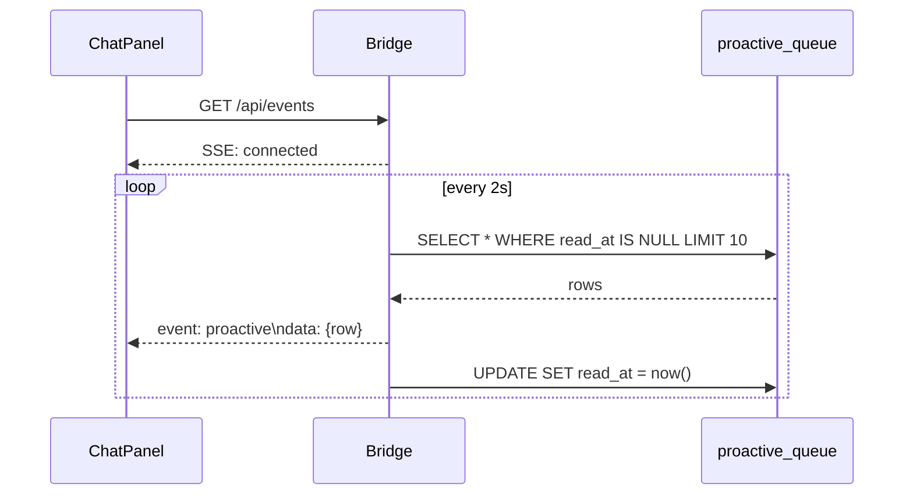

<details>
<summary><b>ℹ️ Why SSE and not WebSockets?</b></summary>

SSE is one-directional (server → client) and rides on plain HTTP. That means:

- No upgrade handshake; works through any HTTP proxy.
- Auto-reconnect built into the browser `EventSource` API.
- Plays nicely with the bridge's CORS policy.

WebSockets would need their own auth handshake, their own CORS rules, and a separate libsubject. Since the only thing the UI needs is push updates from the server, SSE is enough.
</details>

---
## 7. The 11 background agents

Agents are **autonomous loops** that the bridge starts when it boots. Each one polls (or subscribes to events), does some work, and writes results back to SQLite. If one crashes, the others keep running — that's the **per-agent error isolation** pattern.

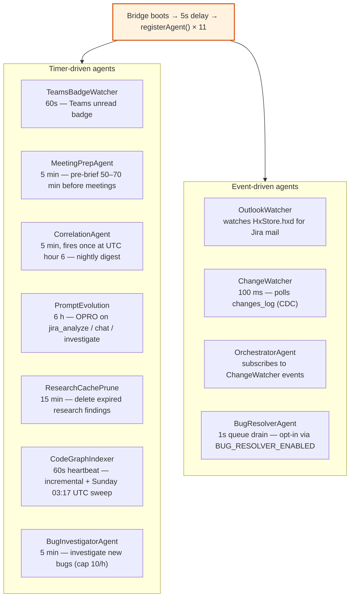

### Agent inventory

| # | Agent | Cadence | Purpose | Kill-switch |
|---|---|---|---|---|
| 1 | **OutlookWatcher** | event-driven (HxStore) | Detects new Jira-related emails on macOS Outlook; triggers targeted Jira sync. | (none — auto-disables if HxStore not found) |
| 2 | **TeamsBadgeWatcher** | 60 s | Polls Teams unread badge; on delta, triggers targeted Teams sync. | `TEAMS_POLL_MS` |
| 3 | **ChangeWatcher** | 100 ms | Change Data Capture — polls `changes_log` table and emits events. | (none) |
| 4 | **OrchestratorAgent** | event-driven | Subscribes to `new-message`, `jira-update`, `calendar-change` events from ChangeWatcher. | (none) |
| 5 | **MeetingPrepAgent** | 5 min | Builds pre-brief 50–70 min before each meeting; pushes to `proactive_queue`. | (none) |
| 6 | **CorrelationAgent** | 5 min (fires only at UTC 06:00) | Generates nightly topic-link digest. | `CORRELATION_HOUR` |
| 7 | **PromptEvolution** | 6 h | Runs OPRO (Optimization by Prompt Refinement) on production prompts. | (none — skips if no API key) |
| 8 | **ResearchCachePrune** | 15 min | Deletes expired rows from `research_cache`. | (none) |
| 9 | **CodeGraphIndexer** | 60 s heartbeat | Incremental indexing of `repos/example-service` and `repos/operations`. Full sweep every Sunday 03:17 UTC. | `CODE_GRAPH_INDEX_DISABLED=1` |
| 10 | **BugInvestigatorAgent** | 5 min | Investigates bugs with status='new'; uses brain bucket `bug-investigator` (Opus, max). Capped at 10/h. | `BUG_INVESTIGATOR_ENABLED=0` |
| 11 | **BugResolverAgent** | 1 s queue drain | Applies suggested patches on user request. Opt-in only. NEVER pushes. | `BUG_RESOLVER_ENABLED` (default off) |

### Fire-and-forget boot tasks (not in the agent registry)

In addition to the 11 registered agents, the bridge fires three **non-recurring boot tasks** that don't poll. They're not part of `getAgentHealthSnapshot()` — they run once at startup and finish.

| Task | File | What it does |
|---|---|---|
| **Skill catalog scanner** | `src/services/cypher/skill-discovery.ts` | Walks `~/.claude/skills/` + plugin marketplaces; finds 36 wi-* + 55 global + 32 plugin (~123 total). Inserts into `skill_catalog` (schema v63). Async; never blocks boot. Kill-switch: `WI_SKILL_DISCOVERY=0`. |
| **Persona Tier-0 parser** | `src/services/persona/parse-tsconfig.js` | Parses `tsconfig` rules into the persona memory layer. Boot-once, synchronous. Kill-switch: `PERSONA_MEMORY_TIER0_ENABLED=0` (default off). |
| **Knowledge indexer** | `src/intelligence/knowledge-indexer.ts` | Walks connected repos and writes code drawers to MemPalace's `code` wing. Async at boot. See § 10b. |

### How error isolation works

Every agent tick is wrapped in a `withAgentTick()` helper. If a tick throws, the agent is marked `flaky` and the error is captured as a bug — but the agent keeps running, and other agents don't notice.

```js
// web-server.js — paraphrased
async function withAgentTick(name, fn) {
  try {
    _setAgentStatus(name, { status: 'running' });
    await fn();
    _setAgentStatus(name, { status: 'ready' });
  } catch (err) {
    captureBug(db, { source: 'agent', context: { agent: name }, message: err.message });
    _setAgentStatus(name, { status: 'flaky', error: err.message });
  }
}
```

Health states: `starting` → `ready` → `running` → either back to `ready` or to `flaky` / `degraded` / `crashed` / `disabled`.

You can see live status anytime:

```bash
curl -s localhost:3132/api/agents/health | jq '.agents[] | {name, status, lastTickAt, error}'
```

<details>
<summary><b>ℹ️ Why does the bridge wait 5 seconds before starting agents?</b></summary>

The HTTP listener needs to be ready first. If an agent's first tick errors out at boot, the bridge will try to write the error to the bugs table, and the bugs table writes go through code that itself depends on the database connection being warm. The 5-second delay gives all those subsystems a chance to settle so the first agent tick doesn't trip over half-initialized state.

It also means smoke tests can hit `/api/status` before agents start, and not have to wait for slow agents like CodeGraphIndexer to come online.
</details>

---
## 8. The skills system (26 `wi-*` skills)

> ROT-NOTE 2026-08-06 (G3-REAP): this section historically claimed 36 skills. Actual on-disk count: **26** (`skills/` dir). The 25 names below with no matching dir were consolidated/retired (ADR-051 wrappers `wi-code`/`wi-people`/`wi-brief`/`wi-jira`/`wi-bug`, `wi-govern`, `wi-search`, `wi-audit`). Full inventory: `docs/planning/notes/g3-doclaws.md` §2a.

A **skill** is a markdown file (`SKILL.md`) that Claude Code reads and executes. It's literally a recipe in plain English with optional shell commands. When you type `/wi-investigate PROJ-15702` in Claude Code, the runtime finds `wi-investigate/SKILL.md`, reads it, and follows the steps.

Skills are the unit Cypher chooses between — every dispatch ends with "run skill X".

### How skills are discovered (the three-layer symlink dance)

This trips everyone up. Claude Code only scans `~/.claude/skills/` **at the top level** for slash commands. So a skill at `~/.claude/skills/work-intelligence/wi-foo/` is **not** discovered as `/wi-foo`. You need a top-level symlink.

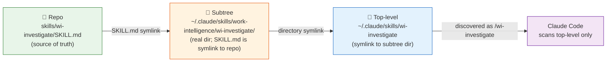

The script `scripts/install-skills.sh` is **idempotent** and detects three drift dimensions:

1. Subtree dir without a top-level symlink (skill exists but won't show as a slash command).
2. Subtree skill not in repo (orphan).
3. Broken symlink pointing to a non-existent repo path.

After every new `wi-*` skill, run from the repo root:

```bash
bash scripts/install-skills.sh
```

<details>
<summary><b>ℹ️ Hermes Agent — second consumer of the same skill catalog</b></summary>


- Wires Hermes-side category symlinks so Hermes sees the same `wi-*` catalog Claude Code does.
- Auto-converts byte-identical real files to symlinks (catches the case where a skill landed as a file copy instead of a link).
- Detects a fourth drift dimension: orphan Hermes symlinks that point to skills the repo no longer ships.

So the durable command — even on a clean machine — is now the skill, not the bash script:

```
/wi-skill-install
```

It is idempotent and safe to re-run any time.
</details>

It prints `linked: N, already: M` and exits 0 if clean.

### The 26 `wi-*` skills, by category

> ROT-NOTE: historical 36-skill table kept for reference; names without an on-disk dir are ghosts (see g3-doclaws.md §2a).

#### 🔍 Observation & intelligence (8)
Read-only — surface state and synthesize.

| Skill | Purpose | Calls |
|---|---|---|
| `wi-action-items` | Open action items across Jira/Teams/Email. | `/api/action-items` |
| `wi-daily-digest` | AI digest for a topic. | `/api/digest` |
| `wi-palace-query` | Semantic query of MemPalace KG. | `/api/palace/status` + chat |
| `wi-search-all` | Cross-source FTS + AI synthesis. | `/api/search-all` |
| `wi-teams-search` | FTS search Teams + meeting transcripts. | `/api/teams-updates` |
| `wi-health` | System health check. | `/api/status` + others |
| `wi-teammate` | Teammate profile lookup. | `/api/teammates/<name>` |
| `wi-morning-brief` | Morning briefing — calendar, issues, activity. | several |

#### 🧠 Research & analysis (7)
Deep reasoning.

| Skill | Purpose |
|---|---|
| `wi-investigate` | 3-layer ReAct bug investigation on a Jira ticket. |
| `wi-jira-analyze` | 5-parallel AI analysis on a Jira ticket. |
| `wi-ask-topic` | Free-text Q&A synthesizing all sources. |
| `wi-code-research` | Claude Code research engine with OPRO-evolved prompts. |
| `wi-pre-meeting` | Meeting prep context card. |
| `wi-blast-radius` | What changes when this file changes? |
| `wi-who-owns` | File ownership map. |

#### 🤝 Work coordination (7)

| Skill | Purpose |
|---|---|
| `wi-jira-report` | Live sprint board health. |
| `wi-pr-review` | AI PR review with work context. |
| `wi-weekly-report` | Weekly engineering health. |
| `wi-find-expert` | Best teammate for a topic / skill. |
| `wi-ticket-links` | Extract + summarize all linked content from a Jira ticket. |
| `wi-correlate` | Cross-domain relationship discovery. |
| `wi-remind` | Smart reminders → Apple Reminders + morning brief. |

#### ✏️ Action & execution (7)
These mutate state — Cypher returns them for your confirmation.

| Skill | Purpose |
|---|---|
| `wi-update-context` | Flush Claude Code session into 4 memory surfaces (bridge / claude-mem / palace / auto-memory). |
| `wi-bug-report` | Capture a bug (idempotent). |
| `wi-bug-resolve` | Mark a bug resolved/wontfix. |
| `wi-bug-resolve-all` | Trigger BugResolverAgent on `proposed` bugs. |
| `wi-record-outcome` | Close a Cypher session (success/mixed/failed). |
| `wi-save-to-ticket` | Append findings to a Jira ticket. |
| `wi-sync` | Trigger a full background sync. |

#### ⚙️ System & configuration (5)

| Skill | Purpose |
|---|---|
| `wi-router` | The `/wi` front door — SSE consumer of `/api/wi/dispatch/stream` (ADR-036 D1). Streams stages, renders per-event-kind, auto-runs `auto`-class skills, asks for `y/n` on `confirm`. |
| `wi-status` | Cypher PM lens query (read-only). |
| `wi-add-bucket` | Walk through wiring a new Anthropic call site into the bucket registry. |
| `wi-skill-install` | Re-verify skill catalog symlinks. |
| `wi-frontmatter` / `wi-check-links` | Memory validation skills. |

#### 🧪 Specialized testing (2)

| Skill | Purpose |
|---|---|
| `wi-bis-regression` | 3-leg BIS regression check (trunk / PR-baseline-FF / PR-required-FF). |

<details>
<summary><b>ℹ️ Why is `wi-router` so important?</b></summary>

`wi-router` is the slash command behind `/wi <goal>`. It is the **only** skill that can pick another skill. Every other skill is leaf-level — it does one thing.

This is the **depth ≤ 2 invariant** from ADR-033: you type `/wi`, it picks one skill, it shows you the command, you type the command. No skill ever calls another skill via the runtime. (Skills can share *helper code* in `src/services/cypher/`, but that's just a TypeScript import, not a runtime invocation.)

This invariant exists because nested skill calls would compound failure modes — a skill three levels deep that goes wrong is impossible to debug.
</details>

### The MCP tool surface (`TOOL_MANIFEST`, ADR-025)

Skills are how *you* invoke Cypher. **MCP tools** are how *Claude Code* invokes the bridge directly — without you typing anything. Both surfaces share the same code path; ADR-025 made the MCP tools the single source of truth.

The single source of truth is `src/tools/manifest.ts` exporting **`TOOL_MANIFEST`**. It declares all 17 `wi_*` tools — name, description, JSON schema for inputs, the bridge endpoint each one forwards to. `src/server.ts` (the MCP stdio server) reads this manifest at boot and registers each entry as an MCP tool.

```
wi_search · wi_jira_get · wi_jira_stuck · wi_jira_analyze · wi_jira_metrics
wi_brain_context · wi_brain_learn
wi_pr_list · wi_pr_create
wi_action_items · wi_topics
wi_teams · wi_calendar · wi_digest · wi_code_graph · wi_teammates · wi_sync
```

Plus the 5 Brain tools (`get_context`, `get_decision`, `verify_claim`, `recall_memory`, `record_outcome`) registered separately in `src/server.ts`.

Tool contract: every `wi_*` tool returns `{ ok: true, data }` on 2xx and `{ ok: false, error: { code, message } }` on 4xx/5xx. Sends `X-WI-Consumer: mcp` header. Forwards `?user=<name>` query string. Default 8-second timeout (30 s for long ops).

To add a new tool: add an entry to `TOOL_MANIFEST` *and* the bridge endpoint it calls — both in the same commit. The smoke check § 17 (parity test) verifies that every manifest entry resolves to a live route.


---
## 9. The web UI (19 pages)

The web UI is a Vite + React app under `web/`. It runs on port **5175** in dev. Every page is a thin viewer over a bridge endpoint — there is **zero business logic in the UI**.

### Sidebar navigation

The sidebar has **5 groups**. Source of truth: `web/src/components/shell/Sidebar.tsx`, the `NAV` constant.

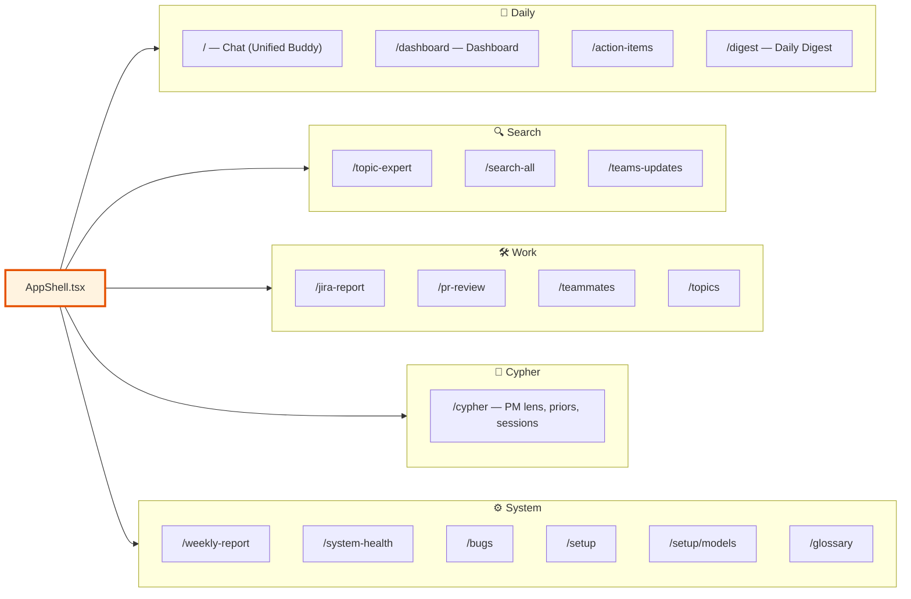

### The 19 pages

| Page | Route | What it shows | Key endpoints |
|---|---|---|---|
| **Chat** (homepage) | `/` | Unified Buddy Chat — primary chat. SSE-streamed responses, mode detection (work/life), persona injection, decision cards, mode chips. | `POST /api/chat` (SSE) |
| **Dashboard** | `/dashboard` | Daily ops overview — calendar, my issues, workload, token stats. | `/api/calendar/upcoming`, `/api/jira/my-issues`, `/api/token-stats` |
| **Action Items** | `/action-items` | Open action items grouped by source. | `/api/action-items` |
| **Daily Digest** | `/digest` | AI digest for a topic. | `/api/digest?topic=&date=` |
| **Topic Expert** | `/topic-expert` | Free-text question answered by all sources. | `/api/topic-expert` |
| **Search All** | `/search-all` | Cross-source FTS + synthesis. | `/api/search-all` |
| **Teams Updates** | `/teams-updates` | FTS over Teams chats and meeting transcripts. | `/api/teams-updates` |
| **Jira Report** | `/jira-report` | Live sprint health. | `/api/jira-report` |
| **PR Review** | `/pr-review` | AI PR review with blast-radius. | `/api/pr/enrich`, `/api/code-graph/blast-radius` |
| **Teammates** | `/teammates` | Teammate profiles. | `/api/teammates` |
| **Topics** | `/topics` | Configured topics + management. | `/api/topics` |
| **Weekly Report** | `/weekly-report` | Velocity, cycle time, action close rate. | `/api/weekly-report` |
| **System Health** | `/system-health` | Bridge / sync / palace / token usage. | `/api/status`, `/api/system-health` |
| **Bugs** | `/bugs` | Captured WI bugs (Phase A/B/C self-healing loop). | `/api/bugs` |
| **Cypher** | `/cypher` | PM lens, skill catalog, learning priors, recent dispatches. | `/api/cypher/*` |
| **Setup** | `/setup` | First-run wizard. | `/api/status` |
| **Models** | `/setup/models` | Per-bucket model + effort + thinking-mode (ADR-031). | `/api/model-config` |
| **Glossary** | `/glossary` | Terminology reference. | static |
| **Not Found** | `*` | 404. | — |

### The Chat page in detail (Phase 78 — Unified Buddy Chat)

The chat page is the homepage and primary interaction surface. It does several things at once:

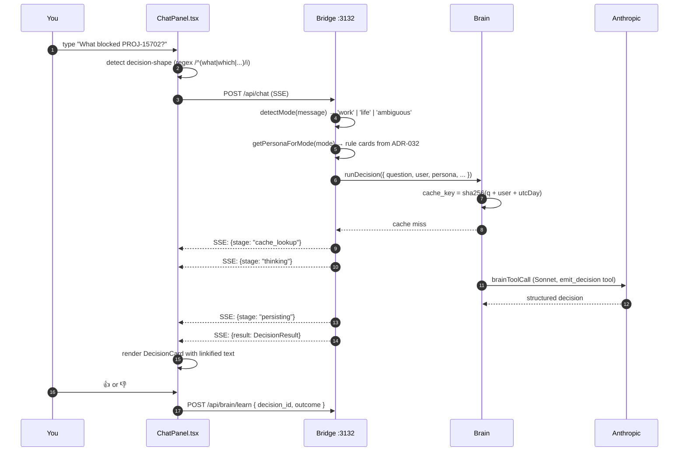

Features:

- **Mode detector (Phase 78a, schema v57)** — every incoming message is classified `work` / `life` / `ambiguous`. The mode determines which persona context the brain injects (work mode pulls work rule cards; life mode pulls life-only memories from the `life` palace wing). You can override the auto-detect via the **Mode Chips** at the top of the chat. Per-turn mode is stored in `chat_messages.mode`; per-conversation default is in `chat_modes.manual_mode`.
- **Private turns** — checking the lock icon on a turn sets `chat_messages.private_turn = 1`. Private turns are excluded from sync to MemPalace and from cross-turn recall — useful for sensitive questions you don't want surfacing later.
- **Decision Cards** — when the question looks like a decision, the assistant turns into a structured card with confidence + evidence + alternatives.
- **Linkify** — Jira keys (`PROJ-15702`), PR refs (`PR #4167`), `@mentions`, and bare URLs are auto-linked.
- **Persona Footer** — shows the active persona (work / life), the rule cards that fired, and a count of how many cards are live for the current mode. Sourced from ADR-032 `rule_cards`.
- **Resizable** — drag the left edge to resize; width persists in `localStorage`.

<details>
<summary><b>ℹ️ How does the mode detector decide work vs life?</b></summary>

It's a small heuristic, not a brain call. It looks at the message for signal strings (Jira keys, PR refs, file paths, technical jargon → work; weekend / family / personal-pronoun-heavy phrasing → life) and returns a confidence. Anything below the threshold is classified `ambiguous` and the brain is told "no strong mode signal; treat as work but don't inject life persona".

The `chat_modes` table also stores `last_signals` (the JSON of what triggered the detection) and `last_confidence` so the `/cypher` page can show drift over time. ADR-035 (parked) plans to unify this with `runDecision`'s mode-awareness — for now they're separate code paths.
</details>


### The `/cypher` page in detail

This is the visibility surface for everything Cypher does. Four sections:

1. **Status strip** (top) — five high-signal numbers (today's sessions, in-flight, stale, queue depth, total skills).
2. **Activity feed** (left, 2/3 width) — recent dispatches with drill-down.
3. **Right rail** (1/3 width) — collapsible skill catalog + Beta priors viewer.
4. **Project state** (bottom) — stale sessions sweep + drift detail.

It's powered entirely by `/api/cypher/*` read endpoints. No Anthropic calls happen here.

### The `/setup/models` page in detail (ADR-031 admin UI)

One row per bucket. For each bucket, you set:

- **Model** — Haiku 4.5 / Sonnet 4.6 / Opus latest
- **Effort** — low / medium / high / xhigh / max
- **Thinking mode** — off / adaptive

The page shows a live cost-per-day estimate based on call volume + per-token pricing. Save → `POST /api/model-config` → invalidates the 60-second registry cache so changes take effect immediately on the next call to that bucket.

---
## 10. The Unified Brain (ADR-024)

The Brain is **not a single AI call** — it's a small library of services in `src/services/brain/` that together implement five "pillars": **decide**, **recall**, **verify**, **learn**, and **context-build**. They share a SQLite-backed cache and a per-user budget.

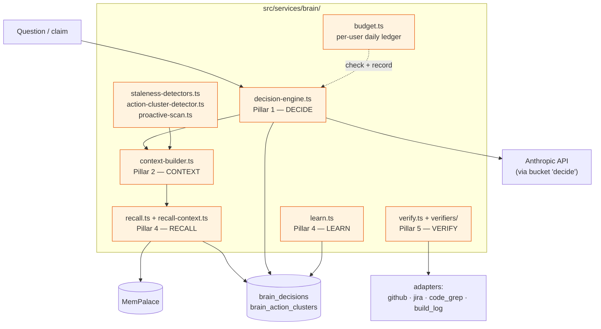

### Pillar 1 — Decide (`decision-engine.ts`)

```
cache_key = sha256(normalize(question) + '\x1f' + user + '\x1f' + utcDayIso)
```

The cache is keyed by **(normalized question, user, UTC day)**. Same question + same user on the same day → returns the cached decision in < 200 ms. Different day or different user → fresh call.

On cache miss:

1. Check daily budget (`budget.ts`) — 50 calls / 200 k input tokens default per user per day.
2. Build context (`context-builder.ts`).
3. Call Claude via `brainToolCall` — `tool_choice: { type: 'tool', name: 'emit_decision' }` forces structured output.
4. Persist to `brain_decisions`.
5. Return.

### Pillar 2 — Context (`context-builder.ts`)

The 7-field context object that every Brain call sees:

| Field | Source |
|---|---|
| `sprint` | `sprint_config` table |
| `stuck_jiras` | `jira_transitions` — non-terminal > 14 days |
| `noise_clusters` | `brain_action_clusters` top-N |
| `calendar_today` | `calendar_events` |
| `open_investigations` | `bug_investigations` where status not terminal |
| `memory_relevant` | recall — palace + brain_decisions LIKE + clusters LIKE |
| `stale_warnings` | `staleness-detectors.ts` |

**60 s per-user TTL** — built once and reused for any Brain call from the same user within the next minute.

### Pillar 4 — Recall (`recall.ts`, `recall-context.ts`)

Three sources queried in parallel and ranked by `recency × confidence`:

1. **MemPalace** semantic search (when connected).
2. **`brain_decisions`** — SQL `LIKE` on question / decision / rationale.
3. **`brain_action_clusters`** — SQL `LIKE` on cluster signature.

`recency_weight = 1 / (1 + days_old / 30)`.

If MemPalace is offline, the call falls back to SQL-only — never throws.

### Pillar 4 — Learn (`learn.ts`)

```
POST /api/brain/learn { decision_id, outcome }
```

`outcome` is one of `success` / `failed` / `abandoned`. The route updates `brain_decisions` and pipes the row to MemoryEnricher → MemPalace `decisions` wing.

### Pillar 5 — Verify (`verify.ts`)

Turns a claim into a verified fact. The claim has an `evidence_needed` array of specs:

```
github:org/repo:path/to/file:expected_value
jira:KEY:field:expected
code_grep:pattern_in_repo
build_log:phase:level:contains
```

Each spec is dispatched to an adapter (`verifiers/github-verifier.ts`, `jira-verifier.ts`, `code-grep-verifier.ts`). Aggregation rules:

- `verified = AND(adapter results)`
- `confidence = MIN(across results)`
- `evidence` = transcript

Every verification (even failures) is written to `brain_verifications` — so a future call can recall "we checked this last Tuesday and it was true".

### Pillar 4 — Budget (`budget.ts`)

Table: `brain_user_budget_ledger`, composite PK `(user, day_iso, bucket)`.

- 50 calls per user per day
- 200 k input tokens per user per day

Throws `BudgetExceededError` on overrun. v46 added the `bucket` column so different parts of the system have separate budgets.

---

## 10b. The intelligence layer (`src/intelligence/`)

The Brain (§ 10) is the *low-level engine*. The intelligence layer is everything that **uses** the brain to do thoughtful, multi-step work — bug investigations, code research, knowledge enrichment. It's where the system goes from "answer one question" to "follow a chain of reasoning until you find the truth".

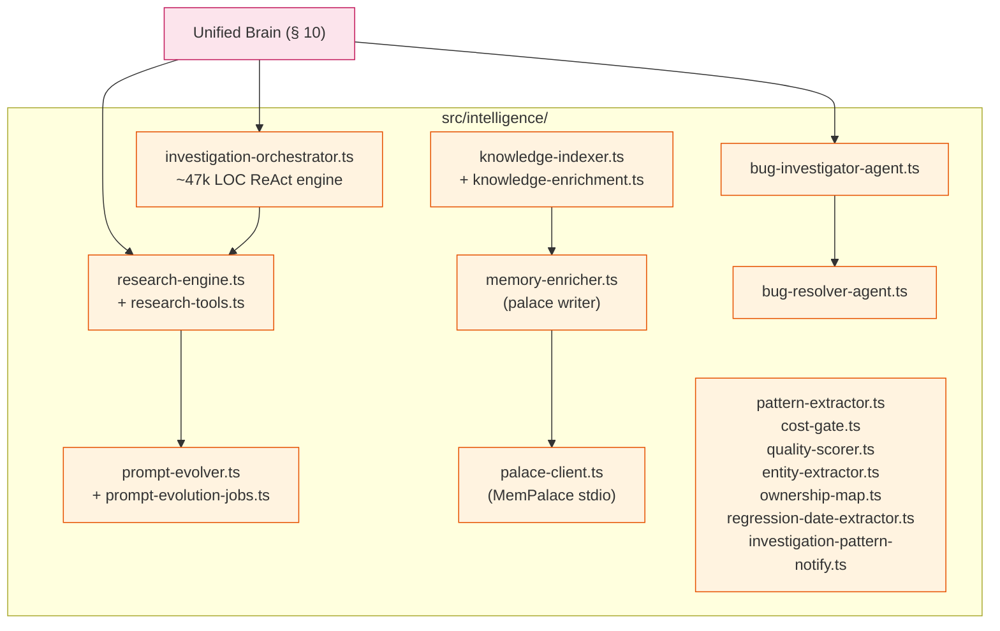

### investigation-orchestrator.ts — the ReAct engine

This is the **biggest single file in the system** (~47k LOC). It powers `wi-investigate` and the `POST /api/jira/investigate` endpoint. ReAct = **Re**ason → **Act** → observe → repeat.

For a Jira ticket, it works in three layers:

| Layer | What it traces |
|---|---|
| **L1 — Fact gathering** | git log around the regression date, dep bumps, feature flags toggled, nearby commits, blame on the suspected file |
| **L2 — Hypothesis** | Brain forms a candidate root cause; verifies via grep / git show / code-graph blast-radius |
| **L3 — Confidence scoring** | If evidence is strong, return root cause + confidence ≥ 0.7. If weak, escalate to user. |

Output is a **confidence-scored root-cause report** persisted to `jira_investigations` table, then optionally written to the Jira ticket via `wi-save-to-ticket` → `PUT /api/jira/analysis/:key/notes` (append-only).

### research-engine.ts + prompt-evolver.ts (ADR-021)

`research-engine.ts` runs **Claude Code as a research agent** — it spins up a Claude Code subprocess pointed at the connected repos (`./repos/example-service`, `./repos/operations`), gives it a research question, and captures the answer. Powers `wi-code-research`.

`prompt-evolver.ts` runs **OPRO** (Optimization by Prompt Refinement) every 6 hours on three trigger types: `jira_analyze`, `chat`, `investigate`. It tries variations of the system prompt against a quality scorer (`quality-scorer.ts`) and promotes winners. Live results visible at `GET /api/research/evolution`.

### knowledge-indexer.ts + knowledge-enrichment.ts

Runs **fire-and-forget at boot**. Walks `./repos/example-service` and `./repos/operations`, extracts symbols/files/owners, and writes them to MemPalace's `code` wing for later semantic recall. Different from the code-graph indexer (§ 7) — that one runs tree-sitter for blast-radius queries; this one writes drawers for "what does file X do" recall.

Endpoint: `GET /api/knowledge/ingest` (manual trigger), `GET /api/knowledge/events` (progress).

### Supporting helpers (the small files)

| File | What it does |
|---|---|
| `pattern-extractor.ts` | Extracts recurring patterns from investigations (lessons-learned style). |
| `cost-gate.ts` | Deterministic pre-check: should this brain call even happen? Cheap classifier (no API call) that decides whether the question is worth a Sonnet/Opus dispatch. |
| `quality-scorer.ts` | Rates research outputs against a rubric. Used by the OPRO loop. |
| `entity-extractor.ts` | Pulls people / projects / files out of free-form text. Used by MemoryEnricher. |
| `ownership-map.ts` | Powers `/api/code-graph/owners` — git-blame analysis cached per file. |
| `regression-date-extractor.ts` | Finds the "when did this break" date inside Jira ticket text. Feeds the L1 fact gather. |
| `investigation-pattern-notify.ts` | When a fresh investigation matches a past pattern, surfaces a "we've seen this before" hint. |
| `palace-seeder.ts` | Bootstraps initial palace state (feature flags → KG triples) on first run. |

<details>
<summary><b>ℹ️ Why is investigation-orchestrator so big?</b></summary>

ReAct loops are stateful. The orchestrator has to remember every fact it's gathered, the hypotheses it's tried and rejected, which tools it has called and with what args, and which evidence supports or refutes each candidate root cause. All of that lives as plain TypeScript in one file because the alternative — splitting state across modules — was tried and made debugging much harder. When something goes wrong in an investigation, you want to read the whole loop top-to-bottom in one place.

There's a long-running plan (ADR-022 / ADR-024 dual-engine investigation) to split it into smaller pieces backed by the brain's `decide`/`recall`/`verify` primitives. Until then, the file stays large by design.
</details>

---

## 11. MemPalace — the long-term memory

MemPalace is the **persistent semantic memory** of the system. It's a Python program that runs ChromaDB (a vector database) plus a tiny knowledge graph. The bridge talks to it over MCP `stdio` like it would talk to any MCP server — except MemPalace runs as a **child process of the bridge**, not on a remote server.

### Architecture

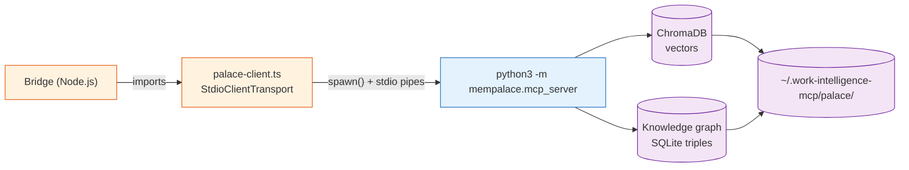

### Wings (namespaces)

Each piece of content is filed into exactly one **wing**:

| Wing | What goes there |
|---|---|
| `backend` | code-graph snapshots, schema events, agent decisions |
| `decisions` | brain_decisions outcomes |
| `meetings` | meeting summaries + transcripts |
| `messages` | Teams + Outlook messages tagged "interesting" |
| `code` | files, symbols, blast radii |
| `research` | OPRO findings, code-research results |
| `personal` | user preferences, persona memory |
| `life` | non-work captures (Phase 78c) |

### How writes happen — MemoryEnricher

`src/intelligence/memory-enricher.ts` is called by the sync pipeline. On every batch of new data, it:

1. Picks the right wing.
2. Optionally extracts **named entities** with Haiku (people, projects, files).
3. Writes a **drawer** (semantic content) for each item.
4. Emits **knowledge graph triples** for relationships (`person — owns — file`, `ticket — references — PR`, etc.).
5. Returns counts: `drawersWritten`, `triplesWritten`, `entitiesExtracted`, `skippedDeduplicated`.

All palace writes are **fire-and-forget**. If the palace is down, sync still succeeds; the data is just not enriched.

### How reads happen

The Brain's `recall.ts` calls `palace.search(pattern, limit, maxDistance)`. ChromaDB returns the top-N drawers by cosine similarity, the brain then ranks them with the SQL recall sources (see § 10).

<details>
<summary><b>ℹ️ Where do embeddings come from?</b></summary>

The system uses **Ollama** running locally on your laptop, with the model **`nomic-embed-text`** (768-dim embeddings, BSD licensed). Schema migration v48 relabeled the `embeddings.model` column from the original OpenAI provider to Ollama — the current default everywhere. The bridge probes Ollama at boot and fires a warmup call so the first real embedding doesn't pay cold-start latency.

Ollama is also the *only* outbound traffic that doesn't go to Anthropic — embeddings stay 100% local. If Ollama isn't running, embedding-aware features (semantic recall, MemPalace search) silently degrade to FTS5-only matching. Nothing crashes.
</details>


### Operational notes

- The palace can be rebuilt from SQLite at any time with `npm run palace:rebuild` (replays all source data through MemoryEnricher).
- Diagnostic: `npm run check:palace` (verifies Python env, mempalace version, ChromaDB).
- If `MEMPALACE_PATH` is unset in `.env`, the palace is **disabled** with zero regression — the brain falls back to SQL-only recall.

---
## 12. Per-bucket model config (ADR-031)

Different parts of the system need different AI models. A bulk-extraction step that runs hundreds of times an hour can't use Opus — it would cost a fortune. A high-stakes architectural decision can't use Haiku — it'd be too dumb.

The solution: **8 functional buckets**, each with its own model, effort, and thinking-mode. Stored in `model_config` (schema v52). Configurable by the user from `/setup/models`.

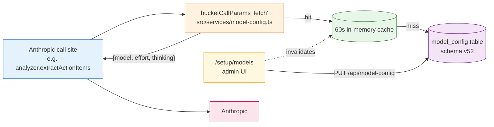

### The 8 buckets

| Bucket | Default model | Default effort | Used by | Why |
|---|---|---|---|---|
| `fetch` | Haiku 4.5 | low | sync extraction (action items, summaries, digests) | high volume, structured output |
| `digest` | Sonnet 4.6 | medium | daily/weekly synthesis | balanced cost/quality |
| `chat` | Opus latest | high | UI chat panel | nuanced reasoning per turn |
| `analyse` | Opus latest | max | Jira analyse + PR review | user-triggered multi-step |
| `decide` | Opus latest | max | Brain `runDecision` | agentic loop (recall + verify) |
| `agents` | Haiku 4.5 | low | correlation, orchestrator, alert scoring | continuous classification |
| `bug-investigator` | Opus latest | max | BugInvestigatorAgent (ADR-030 Phase B) | root-cause + suggested patch |
| `bug-resolver` | Opus latest | max | reserved for Phase 77 brain-escalation | RESERVED |

### The wi-add-bucket workflow

When you write code that calls Anthropic, you **must** route it through a bucket. The skill `wi-add-bucket` walks you through:

1. Pick a bucket (or argue for a new one in an ADR).
2. Replace `client.messages.create({...})` with `bucketCallParams('analyse', ...)`.
3. Add a § smoke test ensuring the call site is bucket-routed.
4. Run `npm run smoke:bridge` — § 16 scans for grandfathered (un-routed) call sites.

The smoke check `§ 16 model-config call-site scanner` is what enforces this. As of 2026-07-19, it reports **48 clean / 0 grandfathered** across `src/services/`, `src/tools/`, `src/intelligence/`, `src/fetcher/`, `src/routes/`, `web-server.js` — every Anthropic call goes through a bucket.

<details>
<summary><b>ℹ️ What's "effort" and "thinking mode"?</b></summary>

**Effort** is how many output tokens the model can use to think. `low` = 1024 max, `medium` = 4096, `high` = 8192, `xhigh` = 16384, `max` = 32000. Higher = more thorough, but slower and pricier.

**Thinking mode** is whether the model uses Anthropic's "extended thinking" feature (which gives it a private scratchpad before answering). `off` = no scratchpad. `adaptive` = the model decides per-call. Adaptive is only available on Sonnet and Opus, not Haiku.
</details>

---
## 13. The bug self-healing loop (ADR-030)

Bugs in this system get **captured automatically**, **investigated automatically**, and (with your permission) **resolved automatically**. Three phases: A (capture), B (investigate), C (resolve).

```mermaid
flowchart LR
    subgraph PHASE_A["Phase A — Capture"]
        ERR["window.onerror<br/>ErrorBoundary<br/>uncaughtException<br/>POST /api/bugs/report"]
        FP["Fingerprint<br/>(idempotent UPSERT)"]
        BUGS[("bugs table<br/>schema v53+")]
    end

    subgraph PHASE_B["Phase B — Investigate"]
        BIA["BugInvestigatorAgent<br/>5 min poll, cap 10/h"]
        EVID["gatherEvidence()<br/>stack + git blame +<br/>palace memory"]
        BRN2["Brain (bucket: bug-investigator,<br/>Opus, max effort)"]
        BIN[("bug_investigations<br/>+ root_cause<br/>+ suggested_patch")]
    end

    subgraph PHASE_C["Phase C — Resolve"]
        BTN["You click 'Resolve this'<br/>on /bugs page"]
        ENQ["POST /api/bugs/:id/resolve-attempt"]
        BRA["BugResolverAgent<br/>queue drain"]
        GATES["Gates:<br/>1. patch exists<br/>2. paths ALLOWED (WI repo only)<br/>3. git apply --check<br/>4. typecheck passes"]
        APP["git apply → git commit<br/>(NEVER push)"]
        BRES[("bug_resolutions<br/>audit table")]
    end

    ERR --> FP --> BUGS
    BUGS -->|status='new'| BIA
    BIA --> EVID --> BRN2 --> BIN
    BIN -.->|status='proposed'| BTN
    BTN --> ENQ --> BRA --> GATES --> APP --> BRES
    GATES -.->|"any fail"| FAIL["status='unable-to-resolve'"]

    classDef phase fill:#fff3e0,stroke:#e65100;
    classDef store fill:#f3e5f5,stroke:#6a1b9a;
    classDef gate fill:#ffebee,stroke:#c62828,stroke-width:2px;
    class BUGS,BIN,BRES store;
    class GATES gate;
```

### Phase A — Capture

- **Sources**: frontend `window.onerror`, React `ErrorBoundary`, Node.js `uncaughtException`/`unhandledRejection`, manual `POST /api/bugs/report`.
- **Fingerprint**: `sha256` of normalized stack + message → idempotent. Same bug twice increments `occurrence_count`.
- **Storage**: `bugs` (v53), `bug_occurrences` (v53), `auto_merge_blocklist` (v53), `bug_investigations` (added in v53, used in B).
- **Kill-switch**: `BUG_INVESTIGATOR_ENABLED=0` disables Phase B but Phase A still captures. Phase A is **always on**.

### Phase B — Investigate

`BugInvestigatorAgent` polls every 5 minutes and picks bugs where `status='new'` and `investigation_attempts < 3`.

State machine:
```
new → investigating → proposed   (success)
new → investigating → new         (transient, attempts < 3)
new → investigating → wont-fix    (attempts ≥ 3)
```

The agent calls `brainToolCall` with bucket `bug-investigator`. Output is a structured `InvestigationDecision`:

```ts
{
  root_cause: string,            // ≤1 sentence
  files_to_change: string[],
  lines_changed: number,         // estimate
  confidence: number,            // 0..1
  suggested_patch: string | null // unified diff
}
```

Persisted to `bug_investigations`. Schema v54 added `bugs.last_investigation_id` so the latest investigation is one indexed lookup away.

**Recursion guard**: errors from `bug-investigator` itself are tagged `source='bug-investigator'` and excluded from the next poll — otherwise the agent would investigate its own crashes forever.

### Phase C — Resolve (opt-in)

When `BUG_RESOLVER_ENABLED=1`, the **Resolve this** button on `/bugs/<id>` enqueues the bug to `BugResolverAgent`. The agent applies the suggested patch — but only after passing **four gates**:

| Gate | What it checks |
|---|---|
| 1 | A `bug_investigations` row exists with non-empty `suggested_patch` |
| 2 | `classifyAllTargets(files_to_change)` is `ALLOWED` — every path is inside the WI repo, none in `./repos/example-service`, `./repos/operations`, or outside |
| 3 | `git apply --check` succeeds |
| 4 | `npm run typecheck` (root + web if touched) passes |

If all four pass, the agent runs `git apply` then `git commit -m "auto-fix: bug #<id> — <root_cause>"`. **Never `git push`**. The user reviews the commit before pushing.

If any gate fails, the patch is reverted (`git checkout -- .`) and `bug_resolutions` records the failure reason.

Schema v56 added `bug_resolutions` (audit) and the 8th model-config bucket.

<details>
<summary><b>ℹ️ Why won't it push for me?</b></summary>

Three reasons:

1. **You're the safety net.** The agent's confidence is calibrated against vetted training data. Real bugs in production code may have edge cases the agent missed.
2. **Push permissions are repo-scoped.** Many of the WI repos enforce CODEOWNERS or branch protection. The agent doesn't authenticate as you for pushes — only commits as you locally.
3. **Reversibility.** A local commit can be discarded with `git reset --hard HEAD~1`. A pushed commit is in everyone's history and CI may have already started building on it.

This is the same trust calibration as Cypher's depth-≤-2 invariant: the AI proposes; you confirm.
</details>

---

## 13b. The persona memory loop (ADR-032 / Phase 80)

When you review a colleague's PR and they leave you 6 review comments, those comments encode lessons. Run another review next week with the same kinds of comments and you've learned nothing — Claude Code starts cold every time.

The persona memory loop fixes that. It ingests every PR review comment you receive, clusters them into recurring patterns, asks you to approve which ones become **rule cards**, and injects those approved rule cards into future reviews via `wi-pr-review` and the chat panel.

Hard rule: **never silently learn**. Every rule card is human-approved before it goes live.

```mermaid
flowchart LR
    subgraph INGEST["1. INGEST"]
        PR["PR review comments<br/>(74-comment baseline)"]
        EXT["persona-extract bucket<br/>(Haiku, low effort)"]
        PRC[("pr_review_comments")]
    end

    subgraph CLUSTER["2. CLUSTER"]
        CL["Pattern detection<br/>(≥3 occurrences)"]
        LL[("lessons_learned")]
    end

    subgraph GATE["3. GATE — propose-then-approve"]
        PROP["Propose rule card<br/>(/setup/persona UI)"]
        YOU["You approve / reject / edit"]
        RC[("rule_cards<br/>+ rule_card_revisions")]
    end

    subgraph INJECT["4. INJECT"]
        WIPR["wi-pr-review"]
        CHAT["Chat panel review"]
        SNAP[("pr_review_snapshots<br/>which rule cards fired")]
    end

    PR --> EXT --> PRC --> CL --> LL --> PROP --> YOU --> RC
    RC --> WIPR --> SNAP
    RC --> CHAT --> SNAP
    SNAP -.->|"refuted_count"| LL

    classDef ingest fill:#e3f2fd,stroke:#1565c0;
    classDef cluster fill:#fff3e0,stroke:#e65100;
    classDef gate fill:#fff8e1,stroke:#f9a825;
    classDef inject fill:#e8f5e9,stroke:#2e7d32;
    classDef store fill:#f3e5f5,stroke:#6a1b9a;
    class PR,EXT ingest;
    class CL cluster;
    class PROP,YOU gate;
    class WIPR,CHAT inject;
    class PRC,LL,RC,SNAP store;
```

### The four stages

| Stage | What happens | File |
|---|---|---|
| **INGEST** | Every PR review comment you receive is normalized + extracted into a structured row. Bucket `persona-extract` (Haiku, low effort) does the canonical-prose extraction. | `pr_review_comments` (v58) |
| **CLUSTER** | When ≥ 3 comments share a pattern (description-similarity ≥ 70%), they cluster into a `lessons_learned` row. | `lessons_learned` (v58) |
| **GATE** | Cypher proposes a rule card from the cluster on `/setup/persona`. **You** approve, reject, or edit. Approval writes to `rule_cards`; every change is versioned in `rule_card_revisions`. | `rule_cards`, `rule_card_revisions` (v58) |
| **INJECT** | Approved rule cards are pulled into every `wi-pr-review` and chat-panel review as context. Each review's used rule cards are recorded in `pr_review_snapshots` so we know which cards actually fired. | `pr_review_snapshots` (v58) |

### The 5 tables (schema v58)

| Table | Rows |
|---|---|
| `pr_review_comments` | One row per inbound reviewer comment. The raw corpus. |
| `lessons_learned` | One row per detected cluster. Increments `refuted_count` if a snapshot shows the rule was wrong. |
| `rule_cards` | The approved, live rules. Each card has a kill-switch + an effective-from timestamp. |
| `rule_card_revisions` | Audit trail — every edit / reject / unapprove is a row. |
| `pr_review_snapshots` | Which rule cards fired during a given PR review. Closes the feedback loop. |

### The HTTP surface

- `POST /api/persona` — upsert from the persona pipeline (used by the extract bucket and by `/setup/persona` UI saves).
- `src/routes/persona.ts` exports `personaRoutes` and `getPersonaForMode` — the latter is **the helper the chat endpoint uses to fetch the right rule cards for the current mode** (work / life). See § 9 chat detail.

### Status (as of 2026-06-16)

Phase 80 is shipped through 77a-wide (the inbound-comment baseline + extraction). Sub-phases 77b (cluster), 77c (gate UI), 77d (inject) are in progress. The 90-day baseline at `.planning/phases/80-persona-memory-loop/BASELINE.md` measures the corpus: 74 reviewer comments, 17 reviewers, 6 recurring patterns confirmed, 10–20 cluster-eligible patterns extrapolated.

<details>
<summary><b>ℹ️ Why "propose-then-approve" instead of "auto-add"?</b></summary>

Two reasons:

1. **Reviewer comments are noisy.** A reviewer might say "rename this variable" once. That's not a *pattern*, that's a one-off. If we auto-promoted every cluster ≥ 3 to a live rule card, you'd quickly drown in `wi-pr-review` output that lectures you about variable naming on every PR.
2. **You're the only one who knows what to teach Claude Code.** A pattern in the data isn't necessarily a lesson worth surfacing — sometimes the reviewer was just having a bad day. The gate gives you the final say.

Same trust principle as Cypher and the bug resolver: the AI surfaces candidates; you decide what becomes durable.
</details>

---

## 14. Database schema (v63)

The single SQLite database at `~/.work-intelligence-mcp/data.db` (WAL mode) is opened by the bridge on boot. Migrations run automatically — `currentVersion` in `meta_kv` is bumped from old to new in one transaction per migration.

**`CURRENT_SCHEMA_VERSION = 63`** in `src/db/schema.ts`. Schema v64 (`cypher_outcomes`) is in flight in phase 87 (ADR-034 L1.1).

### Migrations v45 → v63

Each migration is a TypeScript module imported in `src/db/schema.ts`. Migrations are additive — they add tables/columns or backfill data; they don't drop things.

| Ver | Module | What it added |
|---|---|---|
| v45 | `brain_tables` | `brain_decisions`, `brain_action_clusters`, `brain_verifications`, `brain_user_budget_ledger` (ADR-024) |
| v46 | `budget_bucket` | `bucket` column on `brain_user_budget_ledger` |
| v47 | `brain_evidence_format` | Evidence JSON normalization on read/write |
| v48 | `embedding_model_label` | Relabeled embeddings from OpenAI to Ollama nomic-embed-text |
| v49 | `code_graph_non_ts_ref_types` | Code graph supports non-TypeScript references |
| v50 | `reminders` | `reminders` table (Apple, recurrence, priority, status) |
| v51 | `user_profile_observations` | Persona memory Tier-1 signal |
| v52 | `model_config` | Per-bucket model+effort+thinking (ADR-031) |
| v53 | `bug_capture_tables` | `bugs`, `bug_occurrences`, `bug_investigations`, `auto_merge_blocklist` (ADR-030 Phase A) |
| v54 | `bug_last_investigation` | `bugs.last_investigation_id` (Phase B) |
| v55 | `bug_severity_override` | `bugs.severity_override` columns (Phase 75.5) |
| v56 | `bug_resolver` | `bug_resolutions` table + bug-resolver bucket (Phase C) |
| v57 | `chat_modes_messages` | `chat_modes`, `chat_messages` (Phase 78a — Unified Buddy) |
| v58 | `persona_memory_loop` | `pr_review_comments`, `lessons_learned`, `rule_cards`, `pr_review_snapshots`, `rule_card_revisions` (ADR-032) |
| v59 | `cypher_tables` | `cypher_sessions`, `cypher_steps`, `skill_priors` (ADR-033) |
| v60 | `cypher_pm` | `work_items`, `work_item_dependencies`, `work_item_links` (PM lens) |
| v61 | `pm_auto_actions` | Audit trail for autonomous PM writes |
| v62 | `skill_actually_invoked` | `cypher_sessions.skill_actually_invoked` (credit-assignment fix) |
| v63 | `skill_catalog` | `skill_catalog` table — boot-time scan of `~/.claude/skills/` (Phase 82b) |
| v64 *(in flight)* | `cypher_outcomes` | Multi-signal outcome ledger (ADR-034 L1.1) |

### The major tables you'll touch

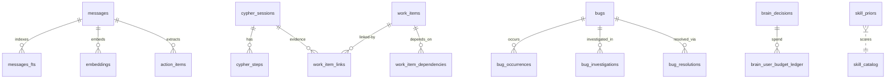

| Table | What lives there |
|---|---|
| `messages` | Every Jira / Teams / Outlook / GitHub message ever fetched. `UNIQUE(source, source_id)`. |
| `messages_fts` | FTS5 index over messages. Powers `wi-search` etc. |
| `embeddings` | Vector embeddings (Ollama `nomic-embed-text`). |
| `action_items` | Extracted by `analyzer.extractActionItems` from messages. |
| `jira_issues`, `jira_transitions` | Jira state + history. |
| `bugs`, `bug_investigations`, `bug_resolutions` | The self-healing loop's tables. |
| `brain_decisions` | Cached brain answers, keyed by `cache_key`. |
| `brain_action_clusters` | Noise clusters detected by `action-cluster-detector.ts`. |
| `brain_verifications` | Every claim verification (success or failure). |
| `cypher_sessions`, `cypher_steps` | Cypher's audit trail. |
| `skill_priors` | Beta(α, β) per (skill, task_class). |
| `work_items`, `work_item_links` | The PM lens. |
| `model_config` | Per-bucket model + effort + thinking. |
| `mcp_oauth_tokens` | OAuth tokens for  Jira MCP, GitHub MCP. |
| `proactive_queue` | What the SSE drain emits. |
| `code_graph_symbols`, `code_graph_call_graph` | Tree-sitter index of `repos/example-service` + `repos/operations`. |
| `sync_state` | Per-source last-sync cursor + due-at heartbeats. |

Full table reference: [`./database-schema`](./database-schema.md).

---
## 15. Connectors — how data gets in

Connectors are the only things allowed to talk to the outside world (FETCH stage). Each one returns `UnifiedMessage[]`, a normalized shape the rest of the system understands.

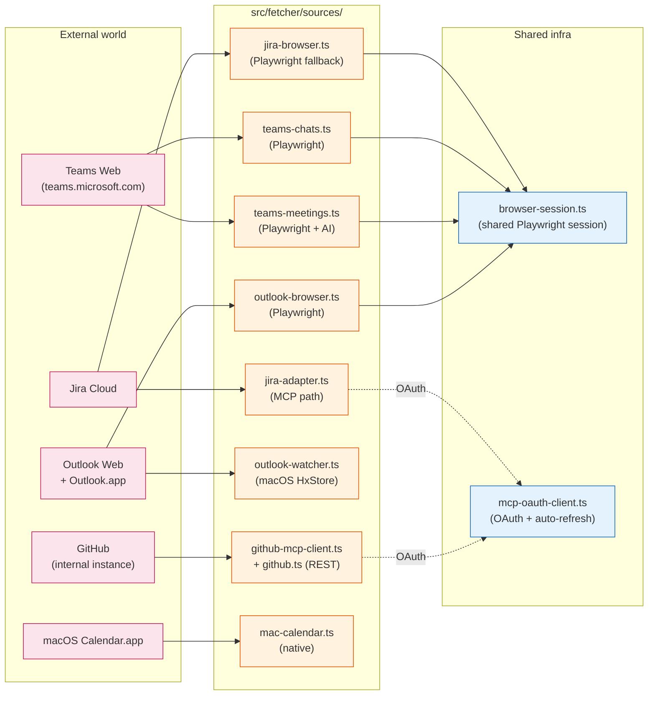

### MCP-based connectors (preferred)

| Connector | Source | How |
|---|---|---|
| `jira-adapter.ts` |  Jira MCP | OAuth token in `mcp_oauth_tokens` table; auto-refresh on 401. Setup: `npm run mcp-setup -- --name jira --url https://mcp.jira.example.com/mcp`. |
| `github-mcp-client.ts` | GitHub MCP | Same OAuth pattern. |

### Playwright-based connectors (fallback / where MCP isn't available)

| Connector | Source | Notes |
|---|---|---|
| `jira-browser.ts` | Jira Web UI | Used only when `JIRA_SOURCE=browser` or MCP fails. Serialized via `withJiraLock()` to prevent concurrent fetches. |
| `teams-chats.ts` | teams.microsoft.com | Sidebar discovery + virtual-list scroll + scroll-up message scrape. |
| `teams-meetings.ts` | teams.microsoft.com | Inline Recap tab — Transcript / Notes / Speakers extraction; Haiku summarizes. |
| `outlook-browser.ts` | outlook.office.com | Email scraper with shared browser session. |

### Native macOS connectors

| Connector | Source | Notes |
|---|---|---|
| `outlook-watcher.ts` | macOS Outlook.app via `osascript` + HxStore.hxd | Event-driven; watches the local Outlook database file. |
| `mac-calendar.ts` | Calendar.app | Native API. Supplements `outlook-browser.ts` for calendar events. |

### MCP OAuth client — the shared infrastructure

Tokens live in SQLite (`mcp_oauth_tokens` table, schema v26+):
```
(server_name, server_url, client_id, access_token, refresh_token, expires_at, scope, updated_at)
```

The `getAccessToken()` helper auto-refreshes any token whose `expires_at < now + 60s`. So tokens **survive restarts** — you only run `npm run mcp-setup` once per server, and they refresh themselves forever.

To verify your tokens are present:
```bash
node --env-file=.env --import tsx/esm -e "
import { getDatabase } from './src/db/connection.js';
import { getStoredToken } from './src/fetcher/sources/mcp-oauth-client.js';
const db = getDatabase();
const t = getStoredToken(db, 'jira');
console.log(t ? 'OK — expires ' + new Date(t.expiresAt).toISOString() : 'MISSING');
"
```

---
## 16. End-to-end flows you should know by heart

Three flows cover 90% of what happens in the system.

### Flow A — Sync (data getting in)

```mermaid
sequenceDiagram
    autonumber
    participant SS as SyncService<br/>(15 min)
    participant CONN as Connectors
    participant DB as SQLite
    participant FTS as messages_fts
    participant EMB as Embeddings
    participant ME as MemoryEnricher
    participant PAL as MemPalace
    participant CW as ChangeWatcher
    participant ASA as AlertScorerAgent
    participant PQ as proactive_queue

    SS->>CONN: fetchMessages() per topic
    CONN-->>SS: UnifiedMessage[]
    loop per message
        SS->>DB: upsertMessage (UNIQUE source, source_id)
        DB->>FTS: insert into messages_fts
        SS->>EMB: embed via Ollama
        SS->>ME: enrichFromSync()
        ME->>PAL: addDrawer + addTriple (fire-and-forget)
        DB->>DB: INSERT changes_log
    end
    CW->>DB: poll changes_log every 100ms
    CW->>ASA: emit event
    ASA->>DB: INSERT proactive_queue
    Note over PQ,ASA: → SSE drain → ChatPanel
```

### Flow B — Brain decide (a question becoming an answer)

```mermaid
sequenceDiagram
    autonumber
    participant U as You
    participant CP as ChatPanel
    participant BR as Bridge
    participant DE as decision-engine.ts
    participant CB as context-builder.ts
    participant RC as recall.ts
    participant PAL as MemPalace
    participant BD as brain_decisions
    participant BUD as budget.ts
    participant ANT as Anthropic

    U->>CP: "What blocked PROJ-15702?"
    CP->>BR: GET /api/brain/decide/stream
    BR->>DE: runDecision({question, user})
    DE->>BD: lookup cache_key
    alt cache hit
        BD-->>DE: prior decision
        DE-->>BR: {result, cache_hit: true}
    else cache miss
        DE->>BUD: checkDailyBudget(user)
        DE->>CB: build 7-field context
        CB->>RC: recallMemory(pattern)
        RC->>PAL: search()
        RC->>BD: SQL LIKE
        RC-->>CB: top-N memories
        CB-->>DE: context object
        DE->>ANT: brainToolCall (bucket=decide)
        ANT-->>DE: emit_decision tool result
        DE->>BD: persist
        DE->>BUD: recordSpend
    end
    BR-->>CP: SSE stages + {result}
    CP-->>U: DecisionCard
```

### Flow C — Cypher dispatch (`/wi <goal>` end-to-end)

```mermaid
sequenceDiagram
    autonumber
    participant U as You
    participant CC as Claude Code
    participant WIR as wi-router (skill)
    participant BR as Bridge
    participant CYP as run.ts (Cypher engine)
    participant SC as skill_catalog
    participant SP as skill_priors
    participant ANT as Anthropic
    participant CS as cypher_sessions

    U->>CC: /wi "investigate PROJ-15702"
    CC->>WIR: invoke
    WIR->>BR: POST /api/wi/dispatch
    BR->>CYP: runCypher({goal, task_class})
    CYP->>SC: load 123 skills
    CYP->>SP: load Beta priors
    CYP->>CYP: clarify (if ambiguous, ASK)
    CYP->>CYP: complexity score (8 signals)
    CYP->>ANT: pick best skill (bucket=decide)
    ANT-->>CYP: {chosen: wi-investigate, confidence: 0.67}
    CYP->>CS: insert session row (status=pending)
    CYP-->>BR: {chosen_skill, alternatives, command}
    BR-->>WIR: decision JSON
    WIR-->>CC: render DecisionCard
    CC-->>U: shows card with /wi-investigate PROJ-15702

    Note over U: You type the suggested command
    U->>CC: /wi-investigate PROJ-15702
    CC->>BR: POST /api/jira/investigate (via skill body)
    Note over U: ...investigation runs...

    U->>CC: /wi-record-outcome session_id success
    CC->>BR: POST /api/wi/dispatch (close)
    BR->>CS: UPDATE outcome=success
    BR->>SP: α += 0.5 for wi-investigate
```

<details>
<summary><b>ℹ️ Why does the user have to record the outcome?</b></summary>

Cypher's whole purpose is to learn which skills work for which kinds of goals. Without an outcome signal, Beta priors stay at their starting (1, 1) values forever — which means Cypher's recommendations stay random.

`wi-record-outcome` (or natural-conversation classification per ADR-036 D7) is the closing of the learning loop. It's the difference between Cypher being a **router** (statically-coded heuristics) and Cypher being a **learning router** (Beta posteriors that converge on real success rates over time).

A session left at `outcome=NULL` is sometimes called "pending" — the dispatch happened but Cypher never learned anything from it. The `/api/cypher/health/sessions/stale` endpoint and the sweep button on `/cypher` page exist to clean these up.
</details>

---
## 17. Where the documentation lives

One fact lives in one place. This file links to canonical sources but never duplicates them.

| Doc | Purpose | Update cadence |
|---|---|---|
| **`ARCHITECTURE.md`** (this file) | Canonical top-level summary | When schema, processes, or tool surface change |
| `CLAUDE.md` | Agent workflow + operational rules | When workflow rules change |
| `README.md` | Human entry point + run commands | When commands change |
| `.claude/rules/smoke-tests.md` | The smoke-test protocol (non-negotiable) | When smoke scripts change |
| `.claude/rules/cypher-discipline.md` | The Cypher session-discipline rule | When the discipline hook changes |
| `docs/docs/intro.md` | Docusaurus landing — mirrors this doc | In sync with this file |
| `docs/docs/architecture/index.md` | Deep architecture | After each architectural shift |
| `docs/docs/architecture/database-schema.md` | **Schema source of truth** | Every schema bump |
| `docs/docs/architecture/components.md` | Per-folder component map (active / legacy / superseded) | After connector/service rename |
| `docs/docs/architecture/known-gaps.md` | Published `.planning/ADR-REVIEW.md` view | Mirrors ADR-REVIEW.md |
| `docs/docs/adr/index.md` | Status table for ADR-001 … ADR-036 | When an ADR is accepted, superseded, or deprecated |
| `docs/docs/adr/adr-033-cypher-framework.md` | Cypher v1.4 framework spec | When the framework changes |
| `docs/docs/adr/adr-036-cypher-cli-primary.md` | CLI as primary surface | When the CLI surface changes |
| `docs/docs/adr/adr-034-cypher-learning-autonomy-engine.md` | Cypher learning engine (L1 in flight) | When learning signals or capabilities change |
| `docs/docs/adr/adr-032-persona-memory-loop.md` | Persona Memory Loop (Phase 80) | When the persona pipeline changes |
| `docs/docs/adr/adr-035-chat-brain-unification.md` | **Parked** — unify `/api/chat` with the brain pipeline | Re-open when prioritized |
| `docs/docs/adr/adr-027-code-graph-indexer-scheduling.md` | Sunday 03:17 UTC sweep + 60s heartbeat | When indexer cadence changes |
| `docs/docs/adr/adr-028-defer-tree-sitter.md` | Tree-sitter approach for the code graph | When indexing strategy changes |
| `docs/docs/epics/index.md` | Sprint-by-sprint shipped work | When a phase ships |
| `docs/docs/api-reference/` | MCP tool + bridge HTTP endpoint reference | When tools/endpoints change |
| `.planning/PROJECT.md` · `ROADMAP.md` · `STATE.md` | Live GSD planning | Continuous |
| `.planning/ADR-REVIEW.md` | Live bug / gap / refactor ledger | Continuous |
| `.planning/phases/86-cypher-cli-primary/PRD.md` | Phase 86 (ADR-036 implementation) | Continuous during phase |
| `.planning/phases/87-adr-034-cypher-learning-engine/` | Phase 87 (ADR-034 L1 implementation) | Continuous during phase |

### How work moves through the docs

```mermaid
flowchart LR
    IDEA["💡 idea / bug"] --> AR[".planning/<br/>ADR-REVIEW.md<br/>BUG-/GAP-/FEATURE-/REFACTOR-NNN"]
    AR --> PHASE[".planning/phases/NN-name/<br/>PLAN.md, SUMMARY.md,<br/>VERIFICATION.md"]
    PHASE --> SHIPPED["📦 phase ships"]
    SHIPPED --> EP["docs/docs/epics/<br/>epNN-name.md"]
    SHIPPED --> ADR_UP["docs/docs/adr/<br/>(if architectural decision)"]
    SHIPPED --> ARCH_DOC["docs/docs/architecture/<br/>components / schema / gaps"]
    SHIPPED --> THIS["ARCHITECTURE.md<br/>(re-verify if anything moved)"]

    classDef live fill:#fff3e0,stroke:#e65100;
    classDef shipped fill:#e8f5e9,stroke:#2e7d32;
    class IDEA,AR,PHASE live;
    class SHIPPED,EP,ADR_UP,ARCH_DOC,THIS shipped;
```

---
## 18. Verifying the system before you change it

These commands **prove** the system is in the state this doc describes. Run them before making any change.

```bash
# Type-check (root + UI separately)
npm run typecheck
cd web && npx tsc --noEmit && cd ..

# Build (refresh dist/ — agents load from dist/)
npm run build

# Restart bridge (kill + boot)
lsof -ti :3132 | xargs kill -9 ; sleep 1
npm run web:bridge &
sleep 3

# Smoke checks (each prints ✓ PASS / ✗ FAIL lines)
npm run smoke:bridge      # 60+ checks against the running bridge
npm run smoke:killswitch  # boots a side-bridge with kill-switch on
npm run smoke:ui          # Playwright UI smoke (needs Vite at :5175)
npm run smoke:all         # bridge + ui
```

**A task is NOT done until the relevant smoke passes.** `npm run typecheck` and `npm run build` are necessary but **not sufficient** — both can pass while runtime is broken (missing env var, schema race, stale `dist/`, route wired to wrong handler, CSS variable undefined).

### The bridge boot sanity check

After `npm run web:bridge`, scan `stderr` for:

1. `[DB] Using database at:` → must point to `~/.work-intelligence-mcp/data.db`
2. **`[Agents] Boot complete: 11 agents — {ready: 9, disabled: 1, ...}`** — all agents accounted for, none `crashed`
3. No `ReferenceError` / `SyntaxError` (means `dist/` is broken)
4. No tight retry loops (same error repeating > 3×/s)

If `/api/agents/health` shows any `crashed` agent, **the bridge is serving wrong answers** — fix before continuing.

### Quick links

- **Architecture deep dive:** this page (you're here)
- **Component-level map:** [`./components`](./components.md)
- **Schema reference:** [`./database-schema`](./database-schema.md)
- **Agent contract (cross-CLI):** [`./agent-contract`](./agent-contract.md) — how any AI coding CLI (Claude Code, Codex, Hermes, OpenCode, Cursor, Gemini, Aider, Cline, Continue, Windsurf, Zed) reads the same rules; git-hook mechanical enforcement; canonical source of truth. See also [ADR-046](../adr/adr-046-model-neutral-agent-contract.md).
- **ADRs:** [`../adr`](../adr/index.md) — latest are ADR-033 (Cypher framework), ADR-036 (CLI primary), ADR-034 (learning engine), ADR-032 (Persona Memory Loop)
- **What's broken:** [`./known-gaps`](./known-gaps.md)
- **Run it / smoke protocol / Cypher discipline:** see `README.md`, `.claude/rules/smoke-tests.md`, and `.claude/rules/cypher-discipline.md` at the **repo root** (these files don't ship with the docs site)
- **Active phases:** `/.planning/phases/86-cypher-cli-primary/`, `/.planning/phases/87-adr-034-cypher-learning-engine/`, and `/.planning/phases/80-persona-memory-loop/` at the repo root

---

*This document was last regenerated on 2026-06-16. If you find a contradiction with the live code, this file is wrong — open a fix and re-verify.*
