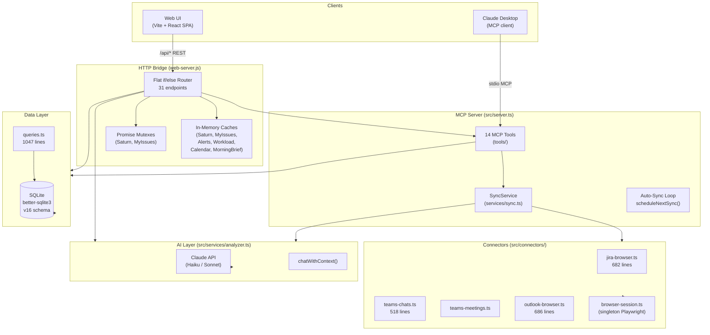

# Architecture Review — Work Intelligence MCP

**Reviewed by:** Senior Architect (automated + manual analysis)
**Date:** 2026-04-18
**Tool versions:** Schema v16, 30 epics completed, 109 source files, ~29K LOC

---

## 1. Current Architecture

### System Overview



### Detected Pattern
**Layered Monolith** (55% confidence per automated scan) — functionally correct but layers are not formally enforced. The MCP server and the HTTP bridge are two separate entry points sharing the same compiled TypeScript output and SQLite database.

---

## 2. Strengths

| Area | Assessment |
|------|-----------|
| **Zero circular dependencies** | Clean internal module graph — analyzer confirmed 0 circular deps |
| **Low coupling score** | 0/100 — modules are well-isolated |
| **FTS5 full-text search** | Correct use of SQLite's FTS5 with WAL mode for performance |
| **Mutex pattern** | `withSaturnLock` / `withMyIssuesLock` correctly serializes browser fetches |
| **Schema migrations** | Versioned migrations (v1→v16) run automatically — clean upgrade path |
| **Dual entry points** | MCP stdio + HTTP bridge share the same core logic cleanly |
| **Prompt caching** | `beta.promptCaching` correctly applied in `AIAnalyzer` |
| **Background polling** | `scheduleNextSync()` recursion avoids drift that `setInterval` causes |
| **202 async pattern** | Jira analysis returns immediately, client polls — correct approach |

---

## 3. Issues Found

### Critical

| # | Issue | Location | Impact |
|---|-------|----------|--------|
| C1 | `web-server.js` is a **1,894-line God File** with 31 endpoints, 8+ in-memory caches, 4 mutexes, business logic, and routing all in one flat file | `web-server.js` | Any change risks breaking unrelated endpoints; impossible to test in isolation |
| C2 | **No request validation** at the HTTP layer — endpoints read raw body fields directly with no schema check | All POST endpoints | Malformed requests can cause silent failures or pass garbage to the AI |
| C3 | **`analyzer.ts` is 1,297 lines** — embedding model constants, auth logic, context-building, all 8 AI methods, and token management in one class | `src/services/analyzer.ts` | Adding new AI capabilities requires touching a file that handles unrelated concerns |

### High

| # | Issue | Location | Impact |
|---|-------|----------|--------|
| H1 | **All caches are plain objects in module scope** — `saturnCache`, `myIssuesCache`, `alertCache`, `workloadCache`, `calendarCache` — no abstraction, duplicated warm/refresh/TTL logic 5× | `web-server.js` lines 51–480 | Every new cached resource requires copy-pasting ~50 lines |
| H2 | **`queries.ts` is a 1,047-line flat file** — all 40+ DB functions in one module with no domain grouping | `src/db/queries.ts` | Finding/changing a query means scanning the whole file |
| H3 | **`web-server.js` imports directly from `dist/`** (compiled output) — if `npm run build` is stale, the server runs old code silently | All imports at top | Developer confusion; subtle bugs when TypeScript changes aren't compiled |
| H4 | **No HTTP framework** — routing is 31 manual `if (path === ...)` checks with method guards inline | `web-server.js` | Adding new endpoints is error-prone; no middleware chain, no param extraction helpers |
| H5 | **Single SQLite file for all concerns** — analytics, sync state, Jira analysis, calendar, notebooks all share one DB with no logical separation | `src/db/schema.ts` | Schema v16 already has 18 tables; will become unwieldy at v25+ |

### Medium

| # | Issue | Location | Impact |
|---|-------|----------|--------|
| M1 | **`src/server.ts` is 579 lines** — MCP tool registration, sync service wiring, and shutdown logic all mixed | `src/server.ts` | Hard to add/remove MCP tools without reading the entire file |
| M2 | **Connector files are 500-700 lines** — jira-browser, outlook-browser, teams-chats each exceed threshold | `src/connectors/` | Scraper logic mixed with DOM parsing, retry logic, and data mapping |
| M3 | **No structured logging** — `process.stderr.write(...)` used throughout | All files | Can't filter by severity/source; no log levels; hard to debug in prod |
| M4 | **`chatWithContext()` is overloaded** — used for quick chat (max_tokens: 1024) AND deep analysis; context is truncated to 400 chars per item | `src/services/analyzer.ts` | Code analysis calls need 4000+ tokens; truncation caused the empty-analysis bug (BUG-10 root) |
| M5 | **No retry logic on AI calls** — a transient 429/503 fails silently with an error string | `src/services/analyzer.ts` | Background Jira analysis jobs fail with no recovery mechanism |

---

## 4. Architecture Diagram (Current vs Recommended)

### Current (Actual)
```
web-server.js (1894 lines)
├── 8 in-memory cache objects (module scope)
├── 4 mutex chains (module scope)  
├── 31 endpoint handlers (flat if/else)
├── Auto-sync scheduling loop
├── Business logic (alert generation, workload scoring)
└── Direct imports from dist/ (compiled output)
```

### Recommended (Target)
```
web-server.js (~150 lines — entry point only)
├── server startup
└── imports routes + middleware

src/routes/ (new)
├── jira.routes.ts       — /api/jira/*
├── teams.routes.ts      — /api/teams-*
├── calendar.routes.ts   — /api/calendar/*
├── notebooks.routes.ts  — /api/notebooks/*
├── sync.routes.ts       — /api/sync/*
├── search.routes.ts     — /api/search, /api/search-all
└── admin.routes.ts      — /api/status, /api/topics, /api/errors

src/cache/ (new)
└── ResourceCache.ts     — generic TTL + refresh + mutex class

src/services/analyzer.ts (split)
├── analyzer.ts          — base client + auth (~200 lines)
├── chat-service.ts      — chatWithContext(), model routing
└── analysis-service.ts  — jira analysis, deep code review (higher token limits)

src/db/queries/ (split)
├── messages.ts
├── topics.ts
├── notebooks.ts
├── jira.ts
├── calendar.ts
└── errors.ts
```

---

## 5. Improvement Recommendations

### Priority 1 — Quick wins (1–2 days each)

**R1: Add Zod validation to all POST endpoints**

Every endpoint currently does `const { field } = await readBody(req)` with no validation. Add a thin validation layer:

```js
// Before (current)
const { issueKey, title } = await readBody(req);
if (!issueKey || !title) { json(res, 400, { error: '...' }); return; }

// After
const schema = z.object({ issueKey: z.string(), title: z.string() });
const result = schema.safeParse(await readBody(req));
if (!result.success) { json(res, 400, { error: result.error.message }); return; }
const { issueKey, title } = result.data;
```

Already have Zod as a dependency — zero new packages needed.

---

**R2: Extract a generic `ResourceCache` class**

The same warm/refresh/TTL/mutex pattern is copy-pasted 5 times. Replace with:

```js
class ResourceCache {
  constructor({ ttlMs, name, loader, dbLoader }) { ... }
  async get() { ... }          // returns data, fires background refresh if stale
  isStale() { ... }
  get isRefreshing() { ... }
}

// Usage
const saturnCache = new ResourceCache({
  ttlMs: 10 * 60_000,
  name: 'saturn',
  loader: () => getSaturnIssues(session),
  dbLoader: () => loadJiraIssues(db, 'saturn'),
});
```

Eliminates ~200 lines of duplicated logic.

---

**R3: Add a structured logger**

Replace all `process.stderr.write(...)` calls with a thin logger:

```js
const log = {
  info:  (msg, ctx) => process.stderr.write(JSON.stringify({ level: 'info',  msg, ...ctx, ts: Date.now() }) + '\n'),
  warn:  (msg, ctx) => process.stderr.write(JSON.stringify({ level: 'warn',  msg, ...ctx, ts: Date.now() }) + '\n'),
  error: (msg, ctx) => process.stderr.write(JSON.stringify({ level: 'error', msg, ...ctx, ts: Date.now() }) + '\n'),
};
```

No dependencies, 10 lines, structured JSON output. Makes the error log section in the UI actually filterable.

---

### Priority 2 — Medium effort (1 week)

**R4: Split `web-server.js` into route modules**

Extract endpoint groups into `src/routes/` — each file exports a `register(app, deps)` function:

```js
// src/routes/jira.routes.js
export function register(router, { db, analyzer }) {
  router.get('/api/jira/analyses', (req, res) => { ... });
  router.post('/api/jira/analyze', async (req, res) => { ... });
  // ...
}
```

`web-server.js` becomes a ~100-line bootstrap file. Consider using `express` or `hono` (tiny, zero deps beyond Node) to get proper param extraction (`req.params.id` instead of regex matches).

---

**R5: Add a dedicated `AnalysisService` for deep AI calls**

`chatWithContext()` caps context at 400 chars/item and max_tokens at 1024 — right for chat, wrong for code analysis. Extract:

```ts
// src/services/analysis-service.ts
export class AnalysisService {
  async analyzeJiraTicket(issueKey, title, codeContext, dbContext): Promise<AnalysisResult> {
    // Uses max_tokens: 4096, no truncation on code snippets
  }
}
```

This prevents future callers from accidentally using the wrong limits.

---

**R6: Split `queries.ts` into domain modules**

```
src/db/queries/
├── index.ts          — re-exports everything (backwards-compatible)
├── messages.ts       — upsertMessage, searchMessages, ...
├── topics.ts         — listTopics, upsertTopic, deleteTopic, ...
├── jira.ts           — saveJiraIssues, saveJiraAnalysis, ...
├── notebooks.ts      — getNotebook, saveNotebookChatEntry, ...
├── calendar.ts       — upsertCalendarEvent, getUpcomingEvents, ...
└── errors.ts         — insertErrorLog, listErrorLogs, ...
```

The `index.ts` re-exports all names — zero breaking changes to callers.

---

### Priority 3 — Architectural (2–4 weeks)

**R7: Introduce a proper HTTP router**

Replace the 31-handler if/else chain with `hono` (2KB, no deps, native Node support):

```js
import { Hono } from 'hono';
const app = new Hono();
app.get('/api/status', (c) => c.json(getStatus()));
app.post('/api/jira/analyze', validator('json', analyzeSchema), analyzeHandler);
```

Benefits: automatic param extraction, middleware chain (auth, logging, validation), testable handlers.

---

**R8: Add retry + circuit breaker on AI calls**

```ts
async function withRetry<T>(fn: () => Promise<T>, maxAttempts = 3): Promise<T> {
  for (let i = 0; i < maxAttempts; i++) {
    try { return await fn(); }
    catch (err) {
      if (i === maxAttempts - 1 || !isTransientError(err)) throw err;
      await sleep(1000 * 2 ** i); // exponential backoff
    }
  }
}
```

Wrap all `analyzer.*` calls. Prevents Jira deep analysis jobs from silently failing on a single 503.

---

## 6. Updated Architecture Decision Records (ADRs)

### ADR-001: Single-file HTTP bridge → Route modules

| | |
|--|--|
| **Status** | Accepted (EP-31-6, EP-31-8) |
| **Context** | `web-server.js` at 1,894 lines has become unmaintainable |
| **Decision** | Extract into `src/routes/` domain modules; keep `web-server.js` as entry point only |
| **Consequences** | Routes become independently testable; new endpoints don't touch the router file |

---

### ADR-002: In-memory caches → `ResourceCache` class

| | |
|--|--|
| **Status** | Accepted (EP-31-2) |
| **Context** | Saturn, MyIssues, Alerts, Workload, Calendar each have hand-rolled TTL+mutex logic |
| **Decision** | Introduce a generic `ResourceCache` with pluggable `loader` and `dbLoader` |
| **Consequences** | Adding a new cached resource is ~5 lines; TTL/refresh/staleness bugs fixed in one place |

---

### ADR-003: `chatWithContext()` token limits → tiered AI calls

| | |
|--|--|
| **Status** | Accepted (EP-31-5) |
| **Context** | Chat uses 400-char context + 1024 max_tokens; code analysis needs 10× more |
| **Decision** | Split into `ChatService` (quick Q&A) and `AnalysisService` (deep, 4096+ tokens) |
| **Consequences** | Eliminates class of bugs where analysis returned empty strings due to truncation |

---

### ADR-004: `queries.ts` monolith → domain modules

| | |
|--|--|
| **Status** | Accepted (EP-31-4) |
| **Context** | 1,047-line file with 40+ functions spanning 10 unrelated domains |
| **Decision** | Split into `src/db/queries/*.ts` by domain; `index.ts` re-exports for compatibility |
| **Consequences** | Each domain's queries are co-located with its schema; easier to find and test |

---

## 7. Metrics Summary

| Metric | Current | Target |
|--------|---------|--------|
| Largest file | `web-server.js` 1,894 lines | &lt;300 lines (entry point only) |
| Endpoint routing | 31 if/else handlers | Domain route modules |
| Cache implementations | 5 hand-rolled | 1 generic class |
| AI service methods | 1 class × 8 methods × 1,297 lines | 2–3 focused services |
| DB query file | 1,047 lines flat | 6 domain modules ~150 lines each |
| Request validation | None | Zod on all POST bodies |
| Retry on AI calls | None | 3 attempts + exponential backoff |
| Structured logging | None | JSON log lines with level + context |
| Circular deps | 0 | 0 (maintain) |
| Coupling score | 0/100 | 0/100 (maintain) |
| Schema migrations | v16, clean | Continue versioned pattern |

---

## 8. Next Epic: EP-31 — Architecture Hardening

Full epic with detailed tickets: [EP-31](../epics/ep31-architecture-hardening.md)

Tickets in implementation order:

| Ticket | Work | Effort |
|--------|------|--------|
| EP-31-1 | Add Zod validation to all POST endpoints | S |
| EP-31-2 | Extract `ResourceCache` class, refactor 5 caches | M |
| EP-31-3 | Add structured JSON logger, replace all stderr writes | S |
| EP-31-4 | Split `queries.ts` into domain modules | M |
| EP-31-5 | Extract `AnalysisService` with proper token limits | M |
| EP-31-6 | Split `web-server.js` into route modules | L |
| EP-31-7 | Add retry + backoff on all AI calls | S |
| EP-31-8 | Introduce HTTP router (hono) for `web-server.js` | L |
