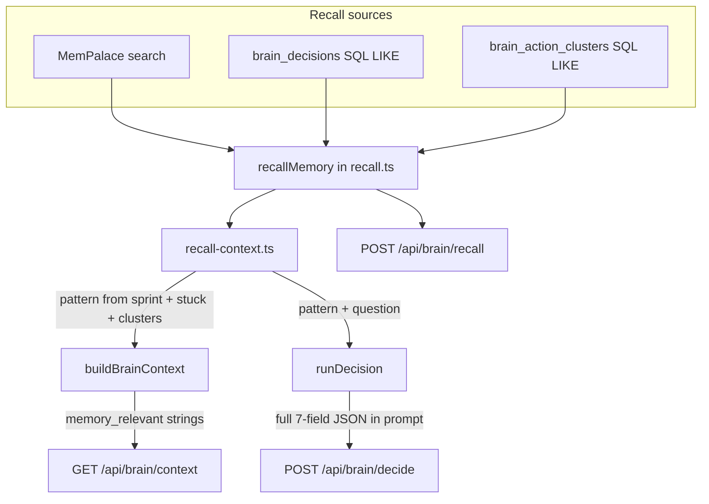

# Second Brain — Recall Integration

> **Status:** Shipped 2026-05-21 · **Code:** `src/services/brain/recall-context.ts`, `context-builder.ts`, `decision-engine.ts`

This document describes how MemPalace + SQLite memory are wired into the Unified Brain so context and decisions automatically see relevant past work — not only when a client calls `POST /api/brain/recall` explicitly.

---

## 1. Problem this solves

Before this integration:

| Surface | Behavior |
|---------|----------|
| `GET /api/brain/context` | `memory_relevant` was always `[]` |
| `POST /api/brain/decide` | Used caller `context` only; no automatic recall |
| `POST /api/brain/recall` | Worked, but opt-in and separate from context/decide |

After integration, **Pillar 4 (`recallMemory`) feeds Pillar 2 (`buildBrainContext`) and Pillar 1 (`runDecision`)** through a shared helper module.

---

## 2. Architecture (three recall paths)



| Path | Entry | Pattern source | Limit |
|------|--------|----------------|-------|
| **Context** | `buildBrainContext(db, user, { palace })` | Sprint name + top stuck Jira keys + noise cluster signatures | 8 (`CONTEXT_RECALL_LIMIT`) |
| **Decide** | `runDecision({ palace, ... })` | Same as context **plus** the user question (trimmed to 120 chars) | 12 (`DECIDE_RECALL_LIMIT`) |
| **Chat** | `POST /api/chat` | Same `buildBrainContext` snapshot prepended as `ContextItem`s before FTS/palace fusion | 8 (via brain context items) |
| **Explicit** | `POST /api/brain/recall` body `{ pattern }` | Caller-supplied | 1–100 (default 10) |


All three call the same `recallMemory()` orchestrator in `recall.ts`.

---

## 3. Pattern construction

`buildRecallPattern()` in `recall-context.ts` concatenates:

1. Active sprint name (if any)
2. Up to 5 stuck Jira keys (`BDS-*`)
3. Up to 3 noise cluster signatures
4. Optional question text (decide path only)

If everything is empty, the fallback pattern is `work intelligence sprint jira` so MemPalace/SQL still return something useful on a cold DB.

**Example** (operational context with one stuck ticket):

```
Saturn Sprint 93 PROJ-4821 teams:sync timeout Should we escalate the blocker?
```

That single string is passed to:

- MemPalace `palace.search(pattern, …)`
- `brain_decisions` WHERE `question|decision|rationale LIKE %pattern%`
- `brain_action_clusters` WHERE `signature LIKE %pattern%`

Results are merged, ranked by `recencyWeight(created_at) × confidence`, and sliced to the limit.

---

## 4. `memory_relevant` string format

Each hit becomes one line in the locked 7-field `memory_relevant: string[]`:

```
[decision] dec_ABC123: How do we fix sprint blocker → Run teams-sync (score 0.72)
[cluster] teams:sync timeout: teams:sync timeout | cause: OAuth refresh (score 0.83)
[palace] palace-0: Obsidian note snippet about FF_RM_11372… (score 0.46)
```

This matches the ADR-024 spirit (`obs-6783: FF_RM_11372 pattern`) while encoding source and rank for debugging.

---

## 5. Code map

| File | Role |
|------|------|
| `src/services/brain/recall.ts` | `recallMemory()` — palace + decisions + clusters |
| `src/services/brain/recall-context.ts` | Pattern build, format lines, `fetchMemoryRelevantStrings`, `augmentMemoryRelevant` |
| `src/services/brain/context-builder.ts` | `buildBrainContext(db, user, { palace?, recallLimit? })` |
| `src/services/brain/decision-engine.ts` | `resolveOperationalContext()` before Claude |
| `web-server.js` | Passes module-scope `palaceClient` into context + decide handlers |

### Bridge wiring

```javascript
// GET /api/brain/context (cache miss)
const payload = await buildBrainContext(db, user, { palace: palaceClient });

// POST /api/brain/decide
await runDecision({ db, question, user, palace: palaceClient, ... });
```

When MemPalace is offline or `palaceClient` is null, recall still runs against SQLite (`brain_decisions`, `brain_action_clusters`). Palace failures are logged and return `[]` for that source — **context and decide never fail because recall failed**.

---

## 6. Caching interactions

| Cache | TTL | Effect on recall |
|-------|-----|------------------|
| `brainContextCache` (per user) | 60s | `memory_relevant` is fixed until cache expires |
| Decision `cache_key` | UTC day | Same question+user+day returns prior decision **without** re-recall |

To see fresh memory in context after a new decision, wait for cache TTL or use a different `user` query param. To force a new decision with fresh recall, change the question text or wait until the next UTC day (cache key includes `utcDayIso()`).

---

## 7. Operator verification

```bash
# 1. Build + restart bridge (dist/ must include recall-context)
npm run build
lsof -ti :3132 | xargs kill -9; sleep 1
npm run web:bridge &

# 2. Context — memory_relevant may be non-empty when DB/palace have hits
curl -s 'http://localhost:3132/api/brain/context?user=anon' | jq '.memory_relevant'

# 3. Explicit recall (body field is pattern, not query)
curl -s -X POST http://localhost:3132/api/brain/recall \
  -H 'Content-Type: application/json' \
  -d '{"pattern":"sprint","limit":5}' | jq .

# 4. Decide — operational context in prompt includes memory_relevant
curl -s -X POST http://localhost:3132/api/brain/decide \
  -H 'Content-Type: application/json' \
  -H 'x-wi-consumer: ui' \
```

**Palace health:** `npm run check:palace` · Bridge status: `GET /api/status` → `palace.connected`.

**Thin palace:** If boot warns `<50 drawers`, palace hits may be sparse until `MemoryEnricher` + sync populate wings. SQLite decision/cluster recall still works.

---

## 8. Why web chat felt “memory-less” (before chat wiring)

The UI **ChatPanel** uses two backends:

| Your message shape | Backend | Brain recall? |
|--------------------|---------|---------------|
| Starts with `what/which/should/where/how/who` **and** ends with `?` | `POST /api/brain/decide` | Yes (since recall integration) |
| Everything else (summaries, statements, “Any decisions this week”) | `POST /api/chat` | **Was no** — only FTS + raw palace search on the message text |

Examples that used **general chat** (no unified brain snapshot):

- `Summarise yesterday's Teams activity` (no `?`)
- `Any decisions made this week?` (does not start with the decision verb list)

**Fix (shipped):** `/api/chat` now prepends the same `buildBrainContext` + `memory_relevant` block as the first context items, so general chat sees sprint/stuck/memory too.

Restart the bridge after `npm run build` so `dist/` includes `brain-context-items.js`.

### Web UI uses the same `wi_*` tools as plugins

Chat **Run sync now** / **Check sync status** call `web/src/lib/wi-tools.ts`, which uses `TOOL_MANIFEST` + `buildHandler` with `X-WI-Consumer: ui` — the same contract as Atlas (`wi_sync`, `wi_brain_context`, `wi_teams`, …). Prefer skills like **wi-sync** in Claude Code rather than raw `curl` when you are in an agent session.

| Intent | Tool | Input |
|--------|------|--------|
| Full sync | `wi_sync` | `{ "kind": "all" }` |
| Sync progress | `wi_sync` | `{ "kind": "status" }` |
| Operational context | `wi_brain_context` | `{}` |
| Teams search / summary | `wi_teams` | `{ "kind": "updates", "query": "…" }` |

---

## 9. Related docs

- [ADR-024 Unified Brain](../adr/adr-024-unified-brain.md) — pillar contracts
- [`ARCHITECTURE.md`](../../ARCHITECTURE.md) §6b — decide flow diagram
- [`data-flow.md`](data-flow.md) — FETCH → PROCESS → ANALYZE → PROPOSE
- [`known-gaps.md`](known-gaps.md) — remaining palace population / meetings gaps
