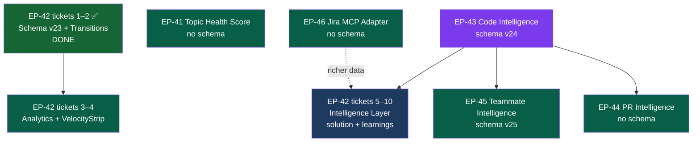
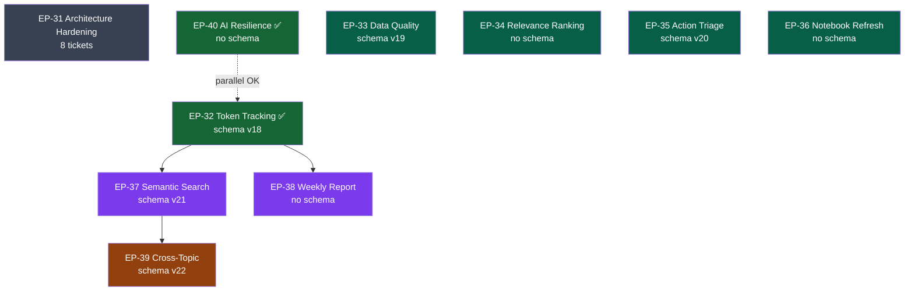

# Epics Overview

All work is organized into epics, divided by sprint. Use the [interactive dashboard](/backlog-dashboard) for filtering and search.

> **Tracking conventions (post-Sprint 18):**
> - **Sprints 1–18 (EP-0 … EP-67)** — original epic-per-feature tracking. Documented here in full.
> - **Sprints 19+ (Phases 68+)** — work tracked live in [`/.planning/`](https://github.com/your-org/work-intelligence-mcp/tree/main/.planning) using GSD (`PROJECT.md`, `ROADMAP.md`, `STATE.md`, `phases/`, `milestones/`). When a phase ships, its summary is published here as a numbered epic doc (e.g. [EP-69/70/71](./ep69-71-unified-brain), [EP-72](./ep72-atlas-operational-surface)).
> - **Authoritative ledger of open bugs/gaps/redundancies:** [`/.planning/ADR-REVIEW.md`](https://github.com/your-org/work-intelligence-mcp/blob/main/.planning/ADR-REVIEW.md), published view at [`architecture/known-gaps`](../architecture/known-gaps).
> - **Top-level canonical doc:** [`/ARCHITECTURE.md`](https://github.com/your-org/work-intelligence-mcp/blob/main/ARCHITECTURE.md) at the repo root.

---

## Sprint Summary

| Sprint | Goal | Status | Epics |
|--------|------|--------|-------|
| **Sprint 1** | No-browser foundation: error tracking, digest memory, headless browser | ✅ Done | EP-17, EP-18, EP-19 |
| **Sprint 2** | Browser-dependent dashboard features | ✅ Done | EP-20, EP-21, EP-22 |
| **Sprint 3** | AI intelligence: daily summary + smart chat | ✅ Done | EP-23, EP-24 |
| **Sprint 4** | New connector: Outlook calendar | ✅ Done | EP-25 |
| **Sprint 5** | UI/UX overhaul + Jira deep analysis + Teams redesign + notebooks | ✅ Done | EP-26, EP-28, EP-29, EP-30 |
| **Sprint 6** | Architecture hardening + Data & AI capabilities | ✅ Done | EP-31–EP-40 |
| **Sprint 7** | Multi-repo intelligence: code graph, PR automation, teammate profiles, Jira intelligence | ✅ Done | EP-41–EP-46 (EP-47 merged → EP-42) |
| **Sprint 8** | Jira Solution Engine + UX & functional improvements | ✅ Done | EP-48 ✅, EP-49 ✅ |
| **Sprint 9** | Jira My Work Cockpit — JQL-based sprint detection, master-detail UI, auto-teammate import | ✅ Done | EP-50 |
| **Sprint 10** | Meeting Intelligence — fix calendar bugs, pre-meeting context panel, auto-transcript capture, topic mapping | ✅ Done | EP-51, EP-52 |
| **Sprint 11** | Teams Intelligence Feed + PR Follow Dashboard | ✅ Done | EP-53, EP-54 |
| **Sprint 12** | Bug Investigation Engine + Self-Learning Brain — 3-layer ReAct engine + feedback loop | ✅ Done | EP-55, EP-56 |
| **Sprint 13** | MemPalace Integration — semantic memory, knowledge graph, cross-repo timeline for investigation engine | ✅ Done | EP-57 |
| **Sprint 14** | Second Brain: Universal Memory Writer — persistent palace process, sync-loop enrichment, health endpoint | ✅ Done | EP-58 |
| **Sprint 15** | Recall-Augmented Chat — entity extraction, palace search, RRF fusion, KG traversal, provenance UI | ✅ Done | EP-59 |
| **Sprint 16** | Autonomous Memory Growth — Obsidian annotation feedback loop, memory health dashboard | ✅ Done | EP-60 |
| **Sprint 17** | Always-On Agent Architecture — event-driven agents, self-learning fix, SSE event stream, sprint config, CDC pipeline, cross-repo knowledge sync | ✅ Done | EP-61–EP-65 |
| **Sprint 18** | Deep Analysis Intelligence — link-aware ticket analysis, Claude Code research engine with self-evolving prompts | ✅ Done | EP-66, EP-67 |
| **Sprint 19** | OpenClaw Plugin + Unified Brain Build-Out (v1.0.x — Phases 68–71) — Atlas chat integration + Unified Brain API (decide/recall/verify/learn) + cross-consumer parity | ✅ Done (2026-05-17 → 2026-05-18) | EP-68, [EP-69/70/71](./ep69-71-unified-brain) |
| **Sprint 20** | Atlas Operational Surface (v1.1 — Phase 72) — 17 `wi_*` operational tools from a single manifest, parity test suite, per-session tool-call budget | ✅ Done (2026-05-20) | [EP-72](./ep72-atlas-operational-surface) |
| **Sprint 21** | Architecture & UX Hygiene Bundles A/B/C + REFACTOR-001 opening pass — 13 P0/P1 fixes (CORS lockdown, per-agent isolation, dry-run safety, alert dedup, sidebar IA, ErrorBoundary, 404 page, prompt rollback, palace banner, budget widget, StaleBanner) + smoke-test discipline + `src/routes/` scaffold | ✅ Done (2026-05-20 → 2026-05-21) | [EP-73](./ep73-hygiene-bundles), [ADR-026](../adr/adr-026-route-module-extraction) |

---

## Sprint 1 — No-Browser Foundation ✅

**Goal**: Standalone features that don't require a browser session. Safe to ship first.

| Epic | Title | Status |
|------|-------|--------|
| [EP-17](./ep17-headless-browser) | Headless Browser (invisible Jira/Outlook) | ✅ Done |
| [EP-18](./ep18-error-tracking) | Error Tracking & Auto Bug Report | ✅ Done |
| [EP-19](./ep19-persistent-digests) | Persistent Digests (Memory / History) | ✅ Done |

**Delivered**: `error_logs` table, `persistError()`, `ErrorLogSection` on dashboard; `digests` table with date shortcuts and cached badge; headless browser as default (`BROWSER_HEADLESS=true`).

---

## Sprint 2 — Browser Dashboard Features ✅

**Goal**: Dashboard sections that require live Jira/browser data.

| Epic | Title | Status |
|------|-------|--------|
| [EP-20](./ep20-saturn-board) | Saturn Board Dashboard Section | ✅ Done |
| [EP-21](./ep21-my-jira-issues) | My Jira Issues (Assigned to Me) | ✅ Done |
| [EP-22](./ep22-sync-all) | Sync All Button on Dashboard | ✅ Done |

**Delivered**: `SaturnBoardSection` + `MyIssuesSection` widgets; `SyncAllButton` triggering parallel sync; `withJiraLock()` mutex preventing concurrent browser crashes.

---

## Sprint 3 — AI Intelligence ✅

**Goal**: AI-generated daily context and conversational interface.

| Epic | Title | Status |
|------|-------|--------|
| [EP-23](./ep23-daily-summary) | Daily Summary Dashboard Section | ✅ Done |
| [EP-24](./ep24-smart-chat) | Smart Chat Sidebar | ✅ Done |

**Delivered**: `DailySummarySection` hero accordion (6 sections + slackMarkdown, cached 1h); persistent `SmartChat` sidebar with conversation history.

---

## Sprint 4 — Calendar Connector ✅

**Goal**: Wire in Outlook Calendar as a first-class data source.

| Epic | Title | Status |
|------|-------|--------|
| [EP-25](./ep25-calendar-sync) | Outlook Calendar Sync | ✅ Done |

**Delivered**: `calendar_events` table (schema v14); `pre_brief` column; `TodaysCalendarSection` on dashboard; pre-meeting brief generation in `runFullSync`.

---

## Sprint 5 — UI/UX Overhaul + Deep Features ✅

**Goal**: Complete UI redesign, notebook-based topic memory, deep Jira analysis, Teams feed redesign.

| Epic | Title | Status | Priority |
|------|-------|--------|----------|
| [EP-26](./ep26-topic-notebooks) | Topic Notebooks (LLM Memory) | ✅ Done | High |
| [EP-28](./ep28-web-ui-ux-overhaul) | Web UI/UX Overhaul | ✅ Done | High |
| [EP-29](./ep29-jira-deep-analysis) | Jira Deep Analysis (3-tab inline, DB-persisted) | ✅ Done | High |
| [EP-30](./ep30-teams-updates-redesign) | Teams Updates Redesign (feed + fav keywords) | ✅ Done | High |
| [EP-27](./ep27-obsidian-vault-mirror) | Obsidian Knowledge Graph Mirror | ✅ Done | Medium |

**Delivered**:
- `topic_notebooks` table (schema v15); `buildNotebook()` / `updateNotebook()` on `AIAnalyzer`; notebook+chat split layout on Topic Expert page
- Dashboard redesigned: DailySummary hero → 3-col grid (NeedsAttention/Calendar/Meetings) → 2-col (MyIssues/Saturn)
- Mobile sidebar drawer + mobile full-screen chat; sync status in Topbar
- `jira_analysis` table (schema v15); 3-tab inline analysis (Analysis | Effort | Explanation); 202+poll pattern; epic filter + collapsible groups
- `teams_fav_keywords` table (schema v16); `FavChip` component; multi-result accordion with `ResultCard`

---

## Sprint 6 — Architecture Hardening + Data & AI ✅

**Goal**: Harden the codebase foundation, then add token tracking, semantic search, data quality observability, and AI resilience. All epics documented with agent-ready prompts in [Sprint 6 Architecture Guide](../architecture/sprint-6-ai-data).

### Phase A — Architecture Hardening (no new features, do first)

| Epic | Title | Status | Priority | Complexity |
|------|-------|--------|----------|------------|
| [EP-31](./ep31-architecture-hardening) | Architecture Hardening (Zod, ResourceCache, logger, route split, AnalysisService, retry, Hono) | ✅ Done (EP-31-1/4/5/6/7 deferred → Sprint 7) | High | Large (5–8 days) |

**EP-31 Tickets** (can be done independently):
- **EP-31-1**: Zod validation on all 16 POST endpoints
- **EP-31-2**: `ResourceCache` class replacing 5 hand-rolled cache objects
- **EP-31-3**: Structured JSON logger (`src/lib/logger.ts`)
- **EP-31-4**: Split `queries.ts` (1047 lines) → `src/db/queries/` (14 domain files)
- **EP-31-5**: `AnalysisService` (`src/services/analysis-service.ts`) with `max_tokens: 4096`
- **EP-31-6**: Split `web-server.js` (1894 lines) → `src/routes/` (8 route modules)
- **EP-31-7**: `withRetry` + exponential backoff on all `AnalysisService` methods
- **EP-31-8**: Hono router replacing 31 if/else handlers

### Phase B — Parallel Sprint 6 Tracks (start EP-32 + EP-40 first)

| Epic | Title | Status | Priority | Schema | Depends On |
|------|-------|--------|----------|--------|------------|
| [EP-32](./ep32-token-usage-tracking) | [AI] Token Usage Tracking | ✅ Done | High | v18 | None |
| [EP-33](./ep33-data-quality-observability) | Data Quality & Pipeline Observability | ✅ Done | High | v19 | None |
| [EP-34](./ep34-relevance-ranked-context) | [AI] Relevance-Ranked Context Injection | ✅ Done | High | None | None |
| [EP-35](./ep35-action-item-triage) | [AI] Action Item Confidence Triage | ✅ Done | Medium | v20 | None |
| [EP-36](./ep36-notebook-auto-refresh) | [AI] Notebook Auto-Refresh & Pre-Brief Enhancement | ✅ Done | Medium | None | EP-26 |
| [EP-37](./ep37-semantic-search) | [AI] Semantic Search via Embeddings | ✅ Done | Medium | v22 | EP-32 |
| [EP-38](./ep38-weekly-pattern-analysis) | [AI] Weekly Pattern Analysis | ✅ Done | Medium | None | EP-32 |
| [EP-39](./ep39-cross-topic-relationships) | [AI] Cross-Topic Relationship Detection | ✅ Done | Low | v21 | EP-37 |
| [EP-40](./ep40-ai-resilience-model-hygiene) | [AI] AI Resilience & Model Hygiene | ✅ Done | High | None | None |

**Sprint 6 execution order**:
1. **Start immediately (parallel)**: EP-32 + EP-40 — no dependencies, highest value
2. **Then parallel**: EP-33, EP-34, EP-35, EP-36 — all independent
3. **After EP-32**: EP-37 (semantic search needs token tracking instrumented), EP-38 (weekly report uses token stats)
4. **After EP-37**: EP-39 (cross-topic uses embeddings)

---

## Sprint 7 — Multi-Repo Intelligence ✅

**Goal**: MCP becomes the brain for example-service + Operations repos. Understands code interlinks, reviews PRs with full work context, profiles teammates, tracks Jira velocity.

**Repos**:

**Required env vars**: `example-service_PATH`, `OPERATIONS_PATH`, `GITHUB_TOKEN`

| Epic | Title | Status | Priority | Schema | Depends On |
|------|-------|--------|----------|--------|------------|
| [EP-46](./ep46-jira-mcp-adapter) | **Jira MCP Adapter with Scraper Fallback** — `JiraDataSource` abstraction, `JiraMcpAdapter` (primary), `JiraBrowserConnector` (fallback), `JIRA_SOURCE` env var | ✅ Done | High | None | None |
| [EP-41](./ep41-topic-health-score) | Topic Health Score (SQL badge, no schema) | ✅ Done | High | None | None |
| [EP-42](./ep42-jira-transition-history) | **Jira Intelligence Layer** — transitions, velocity, unified list, hierarchy, solution engine, learnings, draft PR *(absorbs EP-47)* | ✅ Done (EP-42-6/8/9/10 → EP-48) | High | v23 ✅ | — |
| [EP-48](./ep48-jira-solution-engine) | **Jira Solution Engine** — hierarchical fetch, solution proposal, code impact tabs, blast radius, draft PR *(deferred from EP-42)* | ✅ Done (2026-04-20) | Medium | None | EP-42 ✅ |
| [EP-43](./ep43-multi-repo-code-intelligence) | Multi-Repo Code Intelligence (code_graph, indexer, blast radius) | ✅ Done | High | v24 | EP-31-6 recommended |
| [EP-44](./ep44-pr-intelligence) | PR Intelligence (review + enrich + create draft) | ✅ Done (2026-04-19) | High | None | EP-43 |
| [EP-45](./ep45-teammate-intelligence) | Teammate Intelligence (opt-in profiles, identity resolution, code ownership, workload) | ✅ Done (2026-04-19) | High | v25 | EP-43 |

**EP-42 has 11 tickets** (EP-42-1 through EP-42-11). First 4 (transition history + velocity) are done or in progress. Last 7 (intelligence layer + learnings stats) benefit from EP-43 for blast radius but degrade gracefully without it.

**EP-45 key design decisions** (see [ADR-005](../adr/adr-005-teammate-identity-model)):
- Schema v25 (NOT v24 — v24 belongs to EP-43)
- `member_aliases` table for identity resolution — exact name match catches only 60-80% of messages
- `buildMemberProfile()` uses Sonnet (not Haiku) — cross-source synthesis requires reasoning depth
- Incremental rebuild guard — only rebuilds profile when new messages/commits exist (saves ~$1.50/day)
- `notes` field structurally excluded from AI via TypeScript `Omit<>` — not just convention

**Delivered**:
- EP-46: `JiraDataSource` abstraction + `JiraMcpAdapter` (OAuth PKCE via SQLite) + `JiraBrowserConnector` fallback; `JIRA_SOURCE=auto` env var; schema v26 (`mcp_oauth_tokens`)
- EP-41: `getTopicHealthScores()`, colored dot badges in TopicsPage, NeedsAttentionSection
- EP-42: `jira_transitions` + `ticket_learnings` tables (schema v23); velocity/cycle-time endpoints; VelocityStrip; unified `/api/jira/issues`; learnings CRUD
- EP-43: `code_graph` table (schema v24); `CodeIndexer` (ts-morph); blast-radius/test-coverage/owners endpoints
- EP-44: `reviewPR()` + `generatePRDescription()`; `GitHubMcpClient`; 6 PR endpoints; "Post to GitHub" button in PRReviewPage
- EP-45: `team_members`, `member_aliases`, `member_profiles` tables (schema v25); identity resolver; profile builder; TeammatesPage

**Sprint 7 execution order**:
1. **Done ✅**: EP-46 (Jira MCP Adapter) + EP-41 (Topic Health) + EP-42 (Jira Intelligence) + EP-43 (Code Intelligence)
2. **Done ✅**: EP-44 (PR Intelligence) + EP-45 (Teammate Intelligence)
3. **→ Sprint 8**: EP-48 (Jira Solution Engine — deferred from EP-42)

**EP-46 delivers immediately**: once merged, `JIRA_SOURCE=mcp` fetches live Jira data without a browser, and `JIRA_SOURCE=auto` (default) fails over to the scraper automatically. EP-42 and EP-47 can then use richer MCP data (comments, transition history, linked PRs).



**Full agent guides**: [Sprint 6 Architecture Guide](../architecture/sprint-6-ai-data) | [Sprint 7 Jira & Connector Guide](../architecture/sprint-7-jira-mcp)

---

## Sprint 8 — Jira Solution Engine + UX Improvements ✅

**Goal**: Complete the Jira solution engine (deferred from EP-42) and fix 10 UX pain points across Topic Expert, Jira Report, and global chat. Reported 2026-04-20. All delivered 2026-04-20.

| Epic | Title | Status | Priority | Tickets |
|------|-------|--------|----------|---------|
| [EP-48](./ep48-jira-solution-engine) | **Jira Solution Engine** — hierarchical fetch, solution proposal, code impact tabs, blast radius, draft PR | ✅ Done (2026-04-20) | Medium | EP-48-1 through EP-48-5 ✅ |
| [EP-49](./ep49-ux-functional-sprint8) | UX & Functional Improvements — Topic Expert layout, human feedback, graph redesign, Jira data source + fixes, chat ticket lookup | ✅ Done (2026-04-20) | High | EP-49-1 through EP-49-10 ✅ |

**Key deliverables**:
- Topic Expert: 2-column layout, notes bug fix, notebook source citations, human correction feedback loop
- Graph: shared Jira tickets on edges, variable node sizes, mini-legend, strongest-pair callout
- Jira: data source chip (MCP vs scraper), fix "Unknown" label, fix infinite loading, fix sprint status detection
- Chat: ticket mention (`PROJ-1234`) triggers live Jira fetch and injects context into AI answer

---

## Sprint 9 — Jira My Work Cockpit ✅ Done

**Goal**: Redesign the Jira page into a real daily work cockpit: JQL-based sprint detection, master-detail layout, Mine/Sprint/All tabs, auto-import sprint teammates. Delivered 2026-04-20.

| Epic | Title | Status | Priority | Schema | Depends On |
|------|-------|--------|----------|--------|------------|
| [EP-50](./ep50-jira-my-work-cockpit) | **Jira My Work Cockpit** — JQL sprint detection, master-detail UI, 3-tab board, auto-teammate import, MCP reconnect panel | ✅ Done (2026-04-20) | High | v29 | EP-46 ✅, EP-49 ✅ |

**Key deliverables**:
- `GET /api/jira/board?tab=mine|sprint|all` with JQL-based sprint detection (`sprint in openSprints()`)
- Master-detail layout: ticket list left (340px), detail panel right with description/comments/analysis
- Schema v29: `jira_issues.sprint_name` + `jira_issues.sprint_context`
- Auto-import sprint assignees into `team_members` after Sprint tab fetch
- MCP reconnect guidance panel with `npm run mcp-setup` instructions + Retry button

---

## Sprint 10 — Meeting Intelligence ✅ Done

**Goal**: Fix two silent calendar bugs, add inline pre-meeting context panel with attendee history and action items, automate post-meeting transcript capture from Teams, smart-map transcripts to topics, and make missing-info alerts actionable. Documented 2026-04-20.

| Epic | Title | Status | Priority | Schema | Depends On |
|------|-------|--------|----------|--------|------------|
| [EP-51](./ep51-pre-meeting-context) | **Pre-Meeting Context Panel** — fix CALENDAR_TTL_MS + timezone bug, inline expand with attendees/history/action items/Jira tickets, "Prepare me" chat injection | ✅ Done | High | None (pure SQL) | EP-25 ✅, EP-34 ✅, EP-45 ✅ |
| [EP-52](./ep52-meeting-intelligence) | **Meeting Intelligence** — auto transcript capture on meeting end, `meeting_topic_links` table, topic suggestion engine, auto action item extraction, alert CTA upgrade | ✅ Done | High | v31 | EP-51, EP-11 ✅, EP-15 ✅ |

**Key design decisions** (see [ADR-010](../adr/adr-010-meeting-intelligence)):
- `CALENDAR_TTL_MS` was declared but never defined — causes 500 error on `?days=7` (BUG-25)
- Today filter uses UTC `datetime('now')` — misses events stored in local time (BUG-26)
- Pre-meeting context is pure SQL (no AI latency) — brief generation remains separate
- Post-meeting capture uses targeted chat scrape (not full sync) for speed
- Topic mapping is surfaced as suggestions (`confirmed = 0`) — user confirms before linking

**Sprint 10 execution order**:
1. **Wave 1**: EP-51-0 (bugs) → EP-51-1 (context endpoint) → EP-51-2 (UI panel) → EP-51-3 (meetings widget polish)
2. **Wave 2**: EP-52-0 (schema v30) + EP-52-1 (meeting-end detection)
3. **Wave 3**: EP-52-2 (targeted scrape) + EP-52-3 (transcript upsert) + EP-52-4 (action items)
4. **Wave 4**: EP-52-5 (topic mapping) + EP-52-6 (alert CTA) + EP-52-7 (UI topic chips)

---

## Sprint 11 — Teams Intelligence Feed + PR Follow Dashboard ✅ Done

**Goal**: Pivot Teams Updates from search-only to activity-first cockpit; wire the existing `watched_prs` table to REST endpoints and surface followed PRs on the dashboard. Delivered 2026-04-21.

| Epic | Title | Status | Priority | Schema | Depends On |
|------|-------|--------|----------|--------|------------|
| [EP-53](./ep53-teams-intelligence) | **Teams Intelligence Feed** — activity-first chat list, per-chat feed panel, on-demand AI digest, Jira key extraction | ✅ Done (2026-04-21) | High | v33 | EP-11 ✅, EP-30 ✅ |
| [EP-54](./ep54-pr-follow-dashboard) | **PR Follow Dashboard** — DB-backed PR follow state, watched PR summary endpoint, `MyPRsWidget` on dashboard | ✅ Done (2026-04-21) | Medium | v34 (pre-existing) | EP-44 ✅ |

## Sprint 12 — Bug Investigation Engine + Self-Learning Brain ✅ Done

**Goal**: Build a 3-layer ReAct investigation engine that debugs regressions like a senior developer, with a self-learning feedback layer that improves confidence over time. Delivered 2026-04-21.

| Epic | Description | Status | Priority | Schema | Depends On |
|------|-------|--------|----------|--------|------------|
| [EP-55](./ep55-bug-investigation-engine) | **Bug Investigation Engine** — temporal layer (git log + dep diff), symptom-driven code layer (call graph + file reader), ReAct orchestrator (max 8 iterations), UI streaming trace panel, cross-session pattern memory | ✅ Done (2026-04-21) | High | v35 | EP-48 ✅ |
| [EP-56](./ep56-self-learning-brain) | **Self-Learning Brain** — pattern confidence scoring, tool effectiveness learning, hypothesis accuracy tracking, knowledge TTL decay | ✅ Done (2026-04-21) | High | v36 | EP-55 ✅ |

**Key design decisions** (see [ADR-013](../adr/adr-013-intelligent-bug-investigation), [ADR-014](../adr/adr-014-self-learning-investigation-brain)):
- Three-layer architecture: temporal first (what changed around the regression date?), then symptom trace (who provides this functionality?), then targeted code read
- ReAct loop: Claude Sonnet, max 8 iterations, confidence threshold 0.8, `conclude` tool terminates loop
- Ownership-aware: produces `fixOwner` and `isExternalDep` as structured fields — no more wrong example-service fixes for SMRDP bugs
- Incremental confidence adjustments (±0.10/0.15 deltas), not full ML retraining — lightweight and auditable
- Tool effectiveness keyed per `(tool_name, rootCauseType)` composite — temporal tools score higher for dep-upgrade bugs
- Outcome confirmation opt-in: no automated git-blame scanning; developer confirms root cause after investigation
- Knowledge TTL is soft decay (30-day threshold, not hard delete) — stale entries flagged but preserved

**Known gaps identified from PROJ-15257 post-mortem** (→ Sprint 13):
- Engine never calls `git_log_window` on `operations` repo in iteration 1 — feature flag flips invisible
- No `get_flag_diff` tool for `cluster-setup/feature-flags.yaml`
- Hardcoded SMRDP domain hints in system prompt caused anchoring bias before checking operations
- No cross-repo pre-loop timeline injection; `conclude` has no operations-check gate

**Sprint 12 execution order**:
1. **EP-55** (Bug Investigation Engine) — schema v35 + ReAct orchestrator + temporal/symptom layers + UI trace panel
2. **EP-56** (Self-Learning Brain) — schema v36 + feedback endpoints + `BrainStatsPanel` + ADR-014

---

## Sprint 13 — MemPalace Integration ✅ Done

**Goal**: Layer MemPalace (local-first semantic memory + knowledge graph) on top of the existing investigation engine without replacing any existing process. Add vector recall for past investigations, a KG for operational entities (feature flags, deps), and agent diary meta-learning — all as additive touch points. Delivered 2026-04-24.

| Epic | Description | Status | Priority | Schema | Depends On |
|------|-------|--------|----------|--------|------------|
| [EP-57](./ep57-mempalace-integration) | **MemPalace Integration** — `PalaceClient` wrapper, pre-loop semantic recall + KG query, post-conclude drawer write + diary, `get_flag_diff` tool, operations parallel git scan, palace context in system prompt, `web-server.js` wiring + startup seeder | ✅ Done (2026-04-24) | High | None (MemPalace is external) | EP-55 ✅, EP-56 ✅ |

**Delivered touch points** (additive only — nothing replaced):
1. `src/intelligence/palace-client.ts` — thin McpClient wrapper for MemPalace's 29 MCP tools
2. Pre-loop: `queryPalaceMemory()` — `mempalace_search(wing=investigations)` + `mempalace_kg_query` by regression date; injected as new section in `buildSystemPrompt()`
3. Post-conclude: `writeToPalace()` — drawer (full report), KG triple (flag/dep → ticket), diary entry (which tools worked vs. dead ends)
4. `get_flag_diff` investigation tool — reads `cluster-setup/feature-flags.yaml` diff between two SHAs in operations repo; conclude gate blocks config-change without an operations check
5. Force parallel `git_log_window` on both `example-service` + `operations` in iteration 1; Rule 7 in system prompt
6. `palace-seeder.ts` — one-time bootstrap of operations feature flags into MemPalace KG
7. `web-server.js` wiring — startup seeder + PalaceClient passed as 6th param to orchestrator constructor

**Setup** (one-time):
```bash
pip install mempalace
mempalace init ~/.work-intelligence-mcp/palace
# add to .env: MEMPALACE_PATH=~/.work-intelligence-mcp/palace
```

---

## Sprint 17 — Always-On Agent Architecture ✅ Done

**Goal**: Evolve from passive request/response to an event-driven system that initiates pre-meeting briefs, scores incoming alerts, and closes the self-learning loop broken since Sprint 12. Three waves gated by complexity. See [ADR-017](../adr/adr-017-always-on-agent-architecture.md).

### Why Sprint 17 matters

Before this sprint the system was entirely reactive — it only answered when asked. Sprint 14–16 gave it a Second Brain (MemPalace), recall-augmented chat, and autonomous memory growth. Sprint 17 makes it **proactive**: it wakes up before a meeting to brief you, scores incoming alerts for severity, and remembers what it learned from every investigation without any human prompting.

Two immediate problems made Sprint 17 urgent:

1. **Broken self-learning loop** (Sprint 12 regression): `extractAndSaveBugPattern()` was built in EP-55 but never wired — every investigation threw away its learned pattern. EP-61 fixed this with a single function call after `completeInvestigation()`.
2. **Hardcoded sprint config**: The Saturn-93 sprint name and date range were baked into `web-server.js`. Switching sprints required a code deploy. EP-62 moves this to a DB table with a PUT endpoint.

| Epic | Description | Status | Priority | Depends On |
|------|-------------|--------|----------|------------|
| EP-61 | **Quick Wins Wave 1a** — Schema v38 (`proactive_queue` table + partial index), `GET /api/events` SSE drain endpoint, `MeetingPrepAgent` 5-min poll (Haiku pre-meeting briefs T−60min), frontend SSE subscription + proactive badge in ChatPanel | ✅ Done (2026-05-03) | High | EP-60 ✅ |
| EP-62 | **Quick Wins Wave 1b** — `sprint_config` DB table + `GET/PUT /api/config/sprint`, remove hardcoded Saturn-93, `proactive_queue` 24h max-age eviction, `embeddingsAvailable` field in `/api/status` | ✅ Done (2026-05-03) | High | EP-61 ✅ |
| EP-63 | **CDC Pipeline** — `changes_log` SQLite triggers, `ChangeWatcher` service (100ms poll), `AlertScorerAgent` (Haiku severity scoring) | ✅ Done (2026-05-03) | Medium | EP-62 |
| EP-64 | **OrchestratorAgent** — tool_use loop agent with multi-step reasoning, TDD test suite, AIAnalyzer proxy pattern | ✅ Done (2026-05-04) | Medium | EP-63 |
| EP-65 | **CorrelationAgent** — Nightly KG traversal, "here's what's converging" digest, cross-topic signal surfacing | ✅ Done (2026-05-04) | Low | EP-64 |

### What EP-61 delivered (2026-05-03)

EP-61 shipped three concrete capabilities:

**Schema v38 — `proactive_queue` table**
A new SQLite table that agents write to when they want to push a notification to the user. Two indexes: a partial index on `(read_at, id) WHERE read_at IS NULL` for O(unread) drain queries, and a covering index on `(agent, source_id, created_at)` for per-agent dedup. The table is the connective tissue between background agents and the user's chat UI.

**`GET /api/events` — SSE drain endpoint**
Replaces the 3-second polling interval in ChatPanel with a persistent HTTP connection (`text/event-stream`). The bridge drains unread `proactive_queue` rows every 2 seconds and pushes them as JSON events. Keep-alive comments prevent proxy/browser timeouts. Timer leak protection: both `drainInterval` and `keepAliveInterval` are cleared on `req.on('close')` — one cleanup pair per browser tab.

**MeetingPrepAgent — autonomous pre-meeting briefs**
A 5-minute `setInterval` in the boot block that queries `calendar_events` for meetings starting 50–70 minutes from now. For each qualifying event: builds meeting context (recent messages from attendees, past meeting summaries), calls `generatePreBrief` with `claude-haiku-latest` (Haiku, not Sonnet — cost constraint), and writes the brief as JSON to `proactive_queue`. A 90-minute dedup guard prevents duplicate briefs for the same event. The agent is entirely fire-and-forget — errors are caught and logged, never propagated to the server.

**Frontend SSE wire-up + proactive badge**
`ChatPanel.tsx` opens an `EventSource('/api/events')` on mount and closes it on unmount. Received events are injected into the chat store as assistant messages with `isProactive: true`. `ChatMessage.tsx` renders a small "Proactive" badge (accent color) before the message body when `isProactive` is set.

**Key decisions** (see [ADR-017](../adr/adr-017-always-on-agent-architecture.md)):
- One level of subagent nesting (Anthropic constraint) — all calls route through OrchestratorAgent
- Haiku for always-on processing (~$0.001/event); Sonnet only for event-triggered briefs (~$0.01–0.02/event)
- `ChangeWatcher` uses 100ms SQLite poll (not native CDC) — no native module dependency, WAL mode handles concurrent reads
- `proactive_queue` max-age eviction (24h) to prevent fill when bridge is down — implemented in EP-62
- `generatePreBrief` optional 6th `model` param (default: `DIGEST_MODEL`) — MeetingPrepAgent passes `claude-haiku-latest` explicitly

### What EP-62 delivered (2026-05-03)

EP-62 shipped two infrastructure polish items that eliminate the last hardcoded constants from `web-server.js`.

**Schema v39 — `sprint_config` table**
A new SQLite table (`id`, `sprint_name`, `project_key`, `start_date`, `end_date`, `active`, `created_at`) with a partial index on `active`. The migration seeds a Saturn-93 row (id=1) for existing deployments using `INSERT OR IGNORE` — upgrades are non-destructive. Sprint config is now a runtime concern, not a deploy concern.

**`GET/PUT /api/config/sprint` — sprint management endpoints**
`GET /api/config/sprint` returns the active sprint row as JSON (404 if none). `PUT /api/config/sprint` accepts `sprint_name`, `project_key`, `start_date`, `end_date`; runs an atomic transaction that deactivates all existing rows then inserts the new one; invalidates the in-memory `sprintMeta` cache so `_fetchBoardTab()` picks up the change immediately. All five Saturn-93 string literals in `_fetchBoardTab()` are replaced with DB reads via `_activeSprint` (null-safe fallback to `'Unknown'`).

**`proactive_queue` 24h eviction**
The SSE drain interval now runs a `DELETE FROM proactive_queue WHERE created_at < datetime('now', '-24 hours')` as its first statement every 2 seconds. Rows older than 24h are silently evicted before the unread SELECT — prevents unbounded table growth when the bridge is stopped or the browser tab is closed for an extended period. Eviction errors are absorbed by the existing outer `try/catch` and never break the SSE connection.

**`embeddingsAvailable` in `/api/status`**
`GET /api/status` is now an async IIFE (matching the `/api/system-health` pattern) that calls `checkOllamaAvailable()` and surfaces the result as a boolean `embeddingsAvailable` field. Dashboards can now detect embedding degradation from the primary status endpoint without polling `/api/system-health`.

**Key decisions:**
- Used `INSERT OR IGNORE INTO sprint_config (id=1, ...)` in migration — explicit id prevents duplicate seed rows on re-run
- `parseBody(req)` in the plan was a typo; corrected to `readBody(req)` (the raw JSON body parser in this codebase; `parseBody` is a Zod validation wrapper)
- `_activeSprint` fallback avoids a crash if someone deletes all rows from `sprint_config`

### What EP-63 delivered (2026-05-03)

EP-63 shipped the CDC (Change Data Capture) pipeline — the event backbone that lets agents react to data changes without polling external sources.

**Schema v40 — `changes_log` table + CDC triggers**
A new table (`id`, `table_name`, `row_id`, `operation`, `created_at`) with indexes on `created_at` and `id`. Four AFTER INSERT triggers on `messages`, `jira_issues`, `calendar_events` (plus UPDATE on `jira_issues`) write change events automatically. The `_cdc_` infix in trigger names avoids collision with existing FTS5 triggers.

**ChangeWatcher service**
A 100ms `setInterval` that polls `changes_log` for rows with `id > lastSeenId`. Groups changes by table, passes batches to registered handlers. Runs in the boot block alongside MeetingPrepAgent. WAL mode ensures the poll never blocks writes.

**AlertScorerAgent**
Subscribes to ChangeWatcher events for `messages` and `jira_issues`. Uses Claude Haiku to score each change for severity (0–1). Events scoring above threshold (0.7) are written to `proactive_queue` for SSE delivery to the frontend. Fire-and-forget — errors never propagate.

### What EP-64 delivered (2026-05-04)

EP-64 built the OrchestratorAgent — a reusable multi-step reasoning agent using the tool_use loop pattern (since Anthropic Managed Agent Sessions SDK wasn't available in the pinned SDK v0.32.1).

**OrchestratorAgent class**
A generic agent that takes a goal + available tools, runs a Claude tool_use loop (max 10 iterations), and returns structured results. Uses `PromptCachingBetaTool` type from SDK 0.32.1's beta namespace. All token usage tracked via `recordTokenUsage()`. Designed as a building block for future agents (CorrelationAgent, future investigation agents).

**TDD test suite**
Full test suite written before implementation (RED phase committed separately). Tests cover: tool dispatch, multi-step reasoning, max-iteration guard, error handling, token tracking.

**AIAnalyzer proxy pattern**
OrchestratorAgent wraps AIAnalyzer's existing `client.beta.promptCaching.messages.create()` pattern. System prompt cached with `cache_control: { type: 'ephemeral' }`. Model defaults to Haiku for cost efficiency.

### What EP-65 delivered (2026-05-04)

EP-65 built the CorrelationAgent — a nightly analysis agent that traverses the knowledge graph to surface cross-topic convergence signals.

**CorrelationAgent**
Runs as a nightly `setTimeout` (fires once per 24h cycle). Queries MemPalace KG for entities appearing in multiple topics/contexts within the last 7 days. Uses OrchestratorAgent as its execution engine with correlation-specific tools (KG query, topic fetch, cross-reference check).

**Convergence digest**
When correlations are found, generates a "here's what's converging" summary via Claude Haiku and writes it to `proactive_queue`. The digest links related Jira tickets, Teams discussions, and code changes that share common entities but were never explicitly connected.

**Nightly schedule wiring**
Integrated into `web-server.js` boot block with a 24h interval. First run fires 5 minutes after startup to catch up on any missed nightly cycle. Gracefully no-ops when MemPalace is not connected.

### Cross-Repo Knowledge Sync (Post-Sprint 17)

After completing the agent architecture, a cross-repo knowledge bridge was added to capture file edit events from example-service/operations repos:

**Schema v41 — `knowledge_events` table**
Stores `(repo, file_path, event_type, timestamp, metadata)` with indexes on repo and timestamp. Populated by a PostToolUse hook in Claude Code settings.

**`POST /api/knowledge/ingest` endpoint**
Receives edit events from the hook, writes to SQLite, and enriches MemPalace KG with `(repo, 'file-edited', file_path)` triples. Fire-and-forget palace write.

**`GET /api/knowledge/events` endpoint**
Query interface for debugging and future UI — returns recent events filtered by repo.

**PostToolUse hook**
`~/.claude/hooks/knowledge-ingest.sh` fires on Edit/Write, detects example-service/operations file paths, and POSTs to the bridge in background (non-blocking, 5s timeout).

---

## Sprint 18 — Deep Analysis Intelligence ✅ Done

**Goal**: Make the Jira analyzer context-aware by automatically following links in tickets and spawning Claude Code CLI for deep codebase research — with self-evolving prompts that learn from outcome quality to produce better analysis over time.

| Epic | Description | Status | Priority | Schema | Depends On |
|------|-------------|--------|----------|--------|------------|
| [EP-66](./ep66-link-aware-ticket-analysis) | **Link-Aware Ticket Analysis** — extract links from tickets, fetch via MCP (Jira/GitHub) + Playwright (Wiki/SharePoint), clean HTML→markdown, relevance filter, inject into AI context, cache in SQLite, show sources in UI | ✅ Done | High | v43 | EP-65 ✅ |
| [EP-67](./ep67-claude-code-research-engine) | **Claude Code Research Engine** — spawn Claude Code CLI for deep code research across all repos (example-service, operations, work-intelligence-mcp), with self-evolving prompt templates (OPRO + TextGrad + A/B gating) that learn from outcome quality, cost-gated universal trigger, structured JSON output, result caching | ✅ Done | High | v44 | EP-65 ✅, EP-56 ✅ |

### Why Sprint 18 matters

The analyzer currently treats URLs as opaque strings and can only grep for code. In a sample of 50 BDS tickets, 78% contained meaningful links (avg 2.3/ticket). A ticket saying "See design doc: [wiki link]" gets analyzed without the design doc. And when a chat question asks "how does auth work?", the system returns filenames from grep but cannot explain architectural intent.

Sprint 18 closes both gaps:
- **EP-66** fetches and injects linked documents into analysis context
- **EP-67** spawns Claude Code for IDE-level code understanding, with prompts that improve automatically

**Key architectural decisions**:
- EP-66: Use MCP for structured sources (instant, no browser slots). Playwright ONLY for SSO-protected URLs.
- EP-67: Claude Code CLI with `--print --output-format json --json-schema` for structured subprocess output. Self-evolving prompts via OPRO meta-optimization + TextGrad per-failure repair + A/B statistical gate.

**New dependencies**: EP-66: `@mozilla/readability` + `linkedom` + `turndown` + `p-queue` (~153 KB). EP-67: None (Claude CLI already installed).

### Sprint 18 Delivered (2026-05-05)

**EP-66 — Link-Aware Ticket Analysis:**
- `src/services/link-extractor.ts` — typed URL extraction from descriptions + comments
- `src/services/link-fetcher.ts` — MCP-first cascade (Jira MCP → GitHub MCP → web_cache → HTTP)
- `src/services/content-extractor.ts` — Readability + turndown HTML→markdown
- `src/db/queries/web-cache.ts` — TTL-based caching (schema v43)
- Integration into POST /api/jira/analyze pipeline (web-server.js:3299-3328)
- LinkedSourceItem component in JiraReportPage Sources tab

**EP-67 — Claude Code Research Engine:**
- `src/services/claude-code-runner.ts` — CLI subprocess executor (--print --output-format json --bare)
- `src/intelligence/cost-gate.ts` — CostGateClassifier (Haiku) gates $0.30-0.50 invocations
- `src/intelligence/prompt-evolver.ts` — versioned prompts with A/B weighted selection + variable injection
- `src/intelligence/prompt-evolution-jobs.ts` — OPRO weekly optimization, TextGrad per-failure repair, 30-pair A/B gate
- `src/intelligence/quality-scorer.ts` — Haiku auto-scoring (relevance x0.4 + depth x0.3 + actionability x0.3)
- `src/db/queries/research-cache.ts` — full query layer for 4 new tables (schema v44)
- Integration into /api/jira/analyze, /api/chat, and investigation orchestrator
- ResearchInsightCard component wired into JiraReportPage

---

## Sprint 14 — Second Brain: Universal Memory Writer ✅ Done

**Goal**: Replace the catastrophically slow `execFileSync` subprocess model with a persistent MCP child process, wire MemPalace into the sync loop as a universal memory writer, and establish the palace as a self-populating enrichment layer. ADR-016 approved with conditions by 4-expert review.

| Epic | Description | Status | Priority | Schema | Depends On |
|------|-------------|--------|----------|--------|------------|
| [EP-58](./ep58-universal-memory-writer) | **Universal Memory Writer** — PalaceClient v2 (MCP stdio), MemoryEnricher service, sync loop step 4c, Obsidian Deep Memory, investigation persist, health endpoint, palace:rebuild | ✅ Done | High | v37 | EP-57 ✅ |

**Key decisions** (see [ADR-016](../adr/adr-016-second-brain-architecture), [ADR-016 Review](../adr/adr-016-review)):
- Persistent MCP child process via `StdioClientTransport` — 594ms to under 50ms per call, event loop never blocked
- `MemoryEnricher` as standalone service — notebooks, Jira, Teams, meetings all write to palace in sync step 4c
- `kgInvalidate()` moved from EP-60 — prerequisite for accurate recall in EP-59
- Haiku sync-time NER for entity extraction (~$0.02/day)
- Exit strategy documented for mempalace dependency risk
- Gate for EP-59/60: >50 drawers after 1 week, >80% topics return non-empty recall

---

## Sprint 15 — Recall-Augmented Chat ✅ Done

**Goal**: Make every chat interaction benefit from semantic palace search, KG relationships, and multi-source retrieval fusion. Users see where answers come from via inline provenance links. Gated on EP-58 success metrics.

| Epic | Description | Status | Priority | Schema | Depends On |
|------|-------------|--------|----------|--------|------------|
| [EP-59](./ep59-recall-augmented-chat) | **Recall-Augmented Chat** — regex NER (query-time) + Haiku NER (sync-time), palace search as ContextItem[], RRF fusion (extend hybridSearch), 2-hop KG traversal, inline citation provenance | ✅ Done | High | None | EP-58 ✅ (gate: >50 drawers) |

**Key decisions** (see [EP-59/60 Review](../adr/ep59-ep60-review)):
- Regex NER at query time (not LLM) — zero latency. LLM NER deferred to >500 drawers
- Palace context assembled in `web-server.js` as `ContextItem[]` — no `chatWithContext()` signature change
- RRF with 4 rank lists: FTS5, embeddings, palace search, KG results
- 2-hop traversal (not 3) — 3 hops returns 60%+ of graph at current scale
- Inline citations reusing existing `addAssistantMessage` sources flow

---

## Sprint 16 — Autonomous Memory Growth ✅ Done

**Goal**: Close the human-in-the-loop gap (Obsidian annotations flow back to palace) and add memory health observability. Reduced scope per 4-expert review.

| Epic | Description | Status | Priority | Schema | Depends On |
|------|-------------|--------|----------|--------|------------|
| [EP-60](./ep60-autonomous-memory-growth) | **Autonomous Memory Growth** — Obsidian annotations → palace (on-sync + fs.watch), memory health dashboard (4 metrics). Reduced from 4 to 2 waves. | ✅ Done | Medium | None | EP-59 ✅ |

**Scope changes** (4-expert review):
- 60-01 (`kg_invalidate`) moved to EP-58 — prerequisite for EP-59 accuracy
- 60-03 (cross-wing tunnels) **CUT** — revisit at 300+ drawers
- 60-04 (health dashboard) deprioritized — execute opportunistically

---

## Backlog — Deferred

| Epic | Title | Status | Priority | Blocked By |
|------|-------|--------|----------|------------|
| [EP-27](./ep27-obsidian-vault-mirror) | Obsidian Knowledge Graph Mirror | ✅ Done | Medium | EP-26 |
| [EP-8](./ep8-testing) | Testing | 🔲 TODO | Medium | EP-0 |
| [EP-9](./ep9-cleanup) | Dead Code Cleanup | 🔲 TODO | Low | EP-2, EP-3 |

---

## Complete Epic History (EP-0 to EP-30)

<details>
<summary>Click to expand all completed epics</summary>

| Epic | Title | Status | Priority | Blocked By |
|------|-------|--------|----------|-----------|
| [EP-0](./ep0-foundation) | Foundation | ✅ Done | — | — |
| [EP-1](./ep1-browser-session) | Browser Session Manager | ✅ Done | High | EP-0 |
| [EP-2](./ep2-teams-scraper) | Teams Browser Connector | ✅ Done | High | EP-1 |
| [EP-3](./ep3-outlook-scraper) | Outlook Browser Connector | ✅ Done | High | EP-1 |
| [EP-4](./ep4-jira-wiring) | Jira Connector Wiring | ✅ Done | Medium | EP-0 |
| [EP-5](./ep5-sync-pipeline) | Sync Pipeline Wiring | ✅ Done | High | EP-1,2,3,4,7 |
| [EP-6](./ep6-ai-analyzer) | AI Analyzer Upgrade | ✅ Done | Medium | EP-0 |
| [EP-7](./ep7-schema-migration) | Schema Migration v2 | ✅ Done | High | EP-0 |
| [EP-10](./ep10-saturn-jira-report) | Saturn Team Jira Report | ✅ Done | High | EP-4, EP-7 |
| [EP-11](./ep11-teams-sync) | Teams Chat Sync & Search | ✅ Done | High | EP-2, EP-7 |
| [EP-12](./ep12-search-all) | Universal Search (search_all) | ✅ Done | High | EP-3, EP-4, EP-11 |
| [EP-13](./ep13-topic-expert) | Topic Expert (ask_topic_expert) | ✅ Done | High | EP-0, EP-7 |
| [EP-14](./ep14-smart-topic-expert) | Smart Topic Expert | ✅ Done | High | EP-13, EP-2, EP-3 |
| [EP-15](./ep15-proactive-agent) | Proactive Intelligence Engine | ✅ Done | High | EP-14, EP-26 |
| [EP-16](./ep16-n8n-http-transport) | macOS Trigger System (Smart Resync) | ✅ Done | High | EP-15 |
| [EP-17](./ep17-headless-browser) | Headless Browser (invisible Jira/Outlook) | ✅ Done | High | — |
| [EP-18](./ep18-error-tracking) | Error Tracking & Auto Bug Report | ✅ Done | High | — |
| [EP-19](./ep19-persistent-digests) | Persistent Digests (Memory / History) | ✅ Done | High | — |
| [EP-20](./ep20-saturn-board) | Saturn Board Dashboard Section | ✅ Done | High | EP-17 |
| [EP-21](./ep21-my-jira-issues) | My Jira Issues (Assigned to Me) | ✅ Done | High | EP-17 |
| [EP-22](./ep22-sync-all) | Sync All Button on Dashboard | ✅ Done | High | — |
| [EP-23](./ep23-daily-summary) | Daily Summary Dashboard Section | ✅ Done | High | EP-19, EP-20 |
| [EP-24](./ep24-smart-chat) | Smart Chat Sidebar | ✅ Done | High | — |
| [EP-25](./ep25-calendar-sync) | Outlook Calendar Sync | ✅ Done | Medium | EP-17, EP-22 |
| [EP-26](./ep26-topic-notebooks) | Topic Notebooks (LLM Memory) | ✅ Done | High | EP-13 |
| [EP-28](./ep28-web-ui-ux-overhaul) | Web UI/UX Overhaul (Sprint 5) | ✅ Done | High | EP-20..EP-26 |
| [EP-29](./ep29-jira-deep-analysis) | Jira Deep Analysis (3-tab inline, DB-persisted) | ✅ Done | High | EP-20 |
| [EP-30](./ep30-teams-updates-redesign) | Teams Updates Redesign (feed + fav keywords) | ✅ Done | High | EP-11 |

</details>

---

## Definition of Done

A ticket is **Done** when ALL of the following are true:

1. `npm run typecheck` passes with zero errors
2. `npm run lint` passes
3. `npm test` passes (for tickets with testable logic)
4. All acceptance criteria checkboxes for the ticket are checked
5. No files modified outside the epic's scope (see [Component Ownership Map](../architecture#component-ownership-map))
6. No untyped `any` without an explanatory comment
7. `UnifiedMessage` shape unchanged, `DataSource` interface unchanged

---

## Recommended Work Order — Sprint 6

See [Sprint 6 Architecture Guide](../architecture/sprint-6-ai-data) for detailed agent-ready implementation prompts.



**Wave 1** (done ✅): EP-32 + EP-40  
**Wave 2** (next, parallel): EP-31 tickets, EP-33, EP-34, EP-35, EP-36  
**Wave 3** (after EP-32 done ✅): EP-37, EP-38 — unblocked now  
**Wave 4** (after EP-37 done): EP-39
