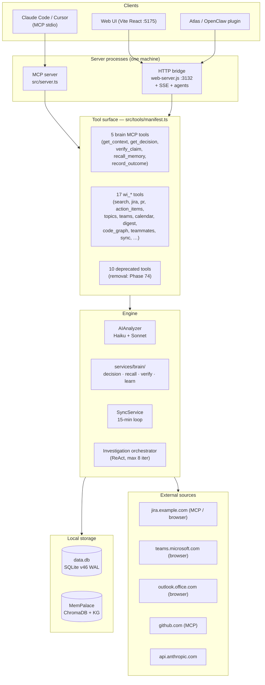

# Work Intelligence MCP

> **The canonical architecture document lives at the repo root: [`ARCHITECTURE.md`](https://github.com/your-org/work-intelligence-mcp/blob/main/ARCHITECTURE.md).**
> This page is the web-friendly mirror. When the two disagree, the root file wins.

A local-first AI brain for engineering work. It pulls **Microsoft Teams, Outlook, Jira, and GitHub** into SQLite, layers a **Unified Brain** (ADR-024) and **Cypher** (ADR-033 / ADR-036 / ADR-037) on top, and exposes everything through three surfaces:

- **MCP stdio** — for Claude Code / Cursor
- **HTTP bridge** — for the web UI and CLI skills
- **Background agents** — 11 autonomous loops (meeting prep, bug investigator, code-graph indexer, ...)

All data stays on your laptop. The only outbound traffic is to Anthropic (for AI) and the source systems (for data).

**Last verified:** 2026-06-20 · **Schema:** v63 (v64 in flight) · **Milestones:** Cypher v1.4 shipped; ADR-036 live code work complete (PHASE-86-02-A/B/C); **Cypher v2.0 PRD locked** (ADR-037 loop); **v2.5 architectural commitment** ([ADR-038](adr/adr-038-cypher-v2.5-production-grade.md)).

> **Cypher doctrine** lives at [`CYPHER.md`](https://github.com/your-org/work-intelligence-mcp/blob/main/CYPHER.md) at the repo root. Read it for the persona contract — what Cypher *is* (not just what it does).

---

## System architecture

## What ships today

| Surface | Status |
|---|---|
| 5 canonical brain MCP tools | ✅ Live |
| 17 `wi_*` operational tools (manifest-driven) | ✅ Live (Phase 72) |
| 10 legacy tools — `[DEPRECATED]` prefix | ✅ Live (back-compat) |
| Web UI (Dashboard, Topic Expert, Jira Report, Teams Updates, PRs, Teammates, Brain Status…) | ✅ Live |
| Background agents (MeetingPrep, AlertScorer, Correlation, ChangeWatcher) | ✅ Live |
| MemPalace (semantic recall + KG) | ✅ Live |
| Self-evolving prompts (OPRO + TextGrad + A/B) | ✅ Live (ADR-021) |
| OpenClaw plugin — 3 brain tools + 17 `wi_*` tools | ✅ Live |

## Quick links

| If you are… | Read |
|---|---|
| Wiring this into Claude Code | [`getting-started/quick-start`](./getting-started/quick-start) → [`getting-started/configuration`](./getting-started/configuration) |
| Trying to understand the system | [`architecture/index`](./architecture/index) → [`architecture/data-flow`](./architecture/data-flow) |
| Looking for the schema | [`architecture/database-schema`](./architecture/database-schema) |
| Tracking what shipped when | [`epics/index`](./epics/index) |
| Reading decisions and why | [`adr/index`](./adr/index) |
| Checking what's currently broken | [`architecture/known-gaps`](./architecture/known-gaps) |

---

:::tip Using This Site
- **Cmd/Ctrl + K** — search across all docs
- **Left sidebar** — browse by category
- **Right sidebar** — jump to sections on this page
:::
