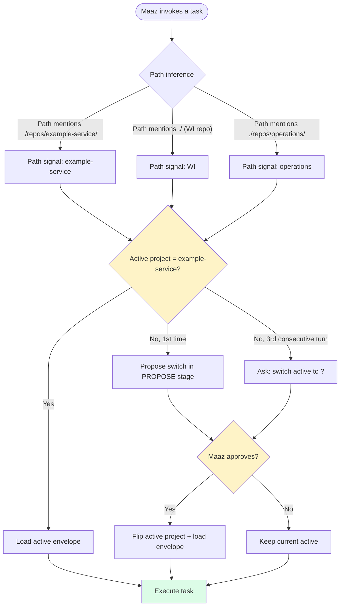
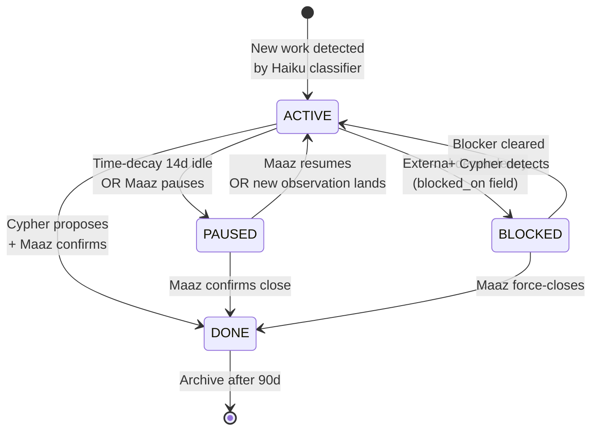
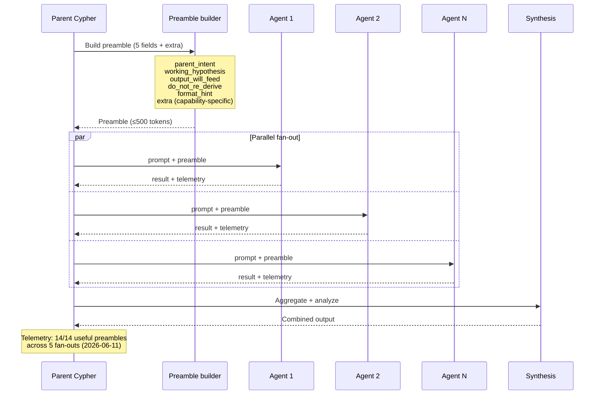
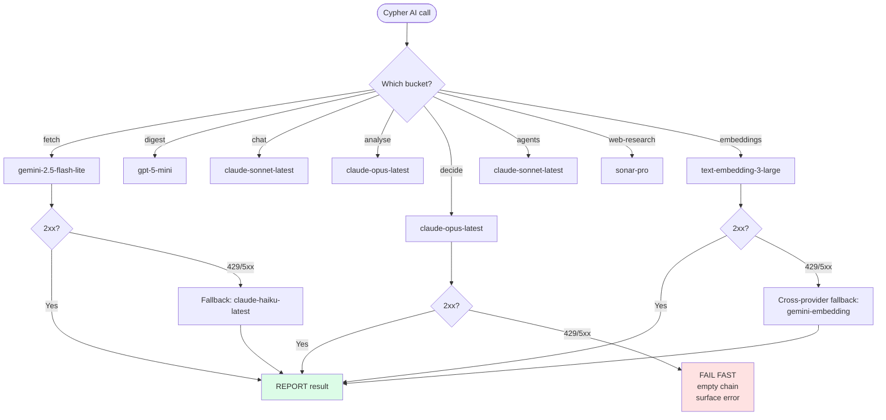
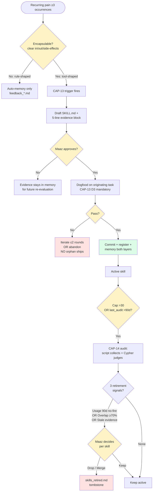
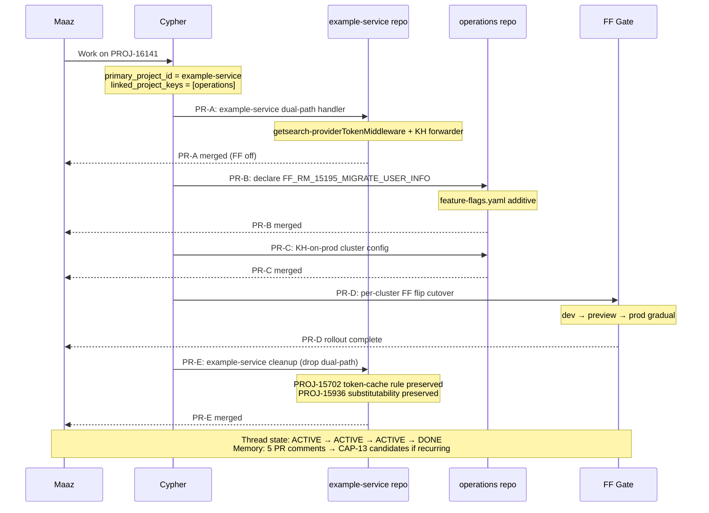

# Cypher v1.4 — Product Requirements Document

> **STATUS: LOCKED v1 (2026-06-12).** Synthesizes 14 locked Cypher design docs ([`.planning/cypher/`](.planning/cypher)). All 10 operational questions resolved (see § 11). Backed by [ADR-033 — Cypher Framework](../adr/adr-033-cypher-framework.md) Status: **Accepted**.
>
> **Branch:** `adr-032-blocker-fixes-and-prd`
> **Architectural decision:** [ADR-033 — Cypher Framework](../adr/adr-033-cypher-framework.md)
> **First proof point:** shipped 2026-06-11 (commit `04e6534`) — see § 8.

---

## 1. Mission

WI v1.4 ships **Cypher** — a token-cheap, brain-anchored execution surface that survives `/clear` and `/compact`. Cypher is a 9-step task contract layered over the existing Workflow tool primitive, six paired capabilities (thread state + fan-out preamble + multi-model routing + self-extension + skill consolidation), and four locked component pillars (identity + interaction protocol + project portfolio + memory model). The milestone closes the GSD substrate (67 skills, 2.9 MB `.planning/`, 41 commits in 14 days, per-agent context re-loads) and replaces it with a portfolio-aware framework that lets Maaz operate as a senior engineer across WI / example-service / operations / future projects with isolated knowledge envelopes per project. v1.4 ships the foundation; v1.5+ extends.

---

## 2. The problem

WI today executes work via GSD — a 67-skill agent-orchestration substrate built for one big delivery (example-service's WI MCP, Phases 68–76). It worked, but the substrate has eaten its own returns.

### Token-waste signals (2026-06-10 snapshot)

| Signal | Number |
|---|---|
| GSD skills installed | 67 |
| `.planning/` size on disk | 2.9 MB |
| GSD-driven commits in last 14 days | 41 |
| Phase 80 PRD reads per milestone | ~25 (5 waves × ~5 agents) |
| `CLAUDE.md` loaded every session | 27 KB / 484 lines |

### Felt-pain audit ratio (2026-06-11)

Of the 19 `feedback_*.md` correction memories Maaz has accumulated over the past quarter, only **5 are skill-shaped** (recurring AND encapsulable). The other 14 are rules, principles, or process discipline — correctly memory-shaped, NOT skills. Without a gate that rejects rule-shaped pain, GSD's 67-skill failure repeats at smaller scale. CAP-13's `recurring + encapsulable` trigger (§ 5) is that gate.

### External corroboration

's EATER tool radar (verified 2026-06-11) lists GSD #33 and GSD #36 as **REJECTED** for wide adoption. The token-cost intuition + EATER's evaluation failures + cost analysis converge on the same conclusion: replace GSD's execution substrate.

---

## 3. Personas

### Primary: Maaz (portfolio engineer)


- **WI** (this repo) — primary residence; meta-project; ships its own ADRs/PRDs/SPECs.
- **example-service** (`./repos/example-service`) — customer codebase; BDS-* Jira tickets; FF-gated migrations; oRPC adapter rules.
- **operations** (`./repos/operations`) — deployment + cluster configs; FF YAML.
- **Future projects** — arrive ad-hoc; auto-discovered by Cypher on first path mention.

Maaz needs Cypher to (a) know which project is active, (b) apply the right rules per project, (c) never silently mix project envelopes, (d) surface progress legibly, (e) honor an authority matrix (auto / confirm / always-maaz).

### Secondary: future  teammates (tertiary read-only)

Read-only consumers of the Docusaurus docs site. They learn Cypher's surface from the PRD + ADR-033 + SKILL.md frontmatters; they don't author.

---

## 4. User journeys (with diagrams)

The 8 diagrams below visualize the load-bearing flows. Each is constrained by a locked capability or component pillar.

### 4.1 Portfolio model — project envelope switching

When Maaz invokes a example-service task while WI was the active project, Cypher detects the path signal, confirms the switch, and loads example-service's `CLAUDE.md` envelope. No silent flip.



**Locked by:** Track G `02-PROJECT-PORTFOLIO.md` Q1–Q8. Anti-pattern: never silently flip the active project.

### 4.2 9-step framework contract

Every Cypher turn honors the contract. Trivial info queries short-circuit; non-trivial work fires all 9 steps with the visible-stages contract overlay.

```mermaid
flowchart LR
    Start([Maaz request]) --> S1[1 Investigate]
    S1 --> S2{2 Ambiguous?}
    S2 -->|Yes ≤3 questions| Ask[Ask user]
    Ask --> S3
    S2 -->|No| S3{3 Need research?}
    S3 -->|Yes| Research[External fetch]
    Research --> S4
    S3 -->|No| S4[4 Plan DAG]
    S4 --> S5[5 Parallel execute<br/>via Workflow + CAP-11]
    S5 --> S6[6 Quality gates]
    S6 -->|Pass| S7[7 Cost check]
    S6 -->|Fail| S5
    S7 --> S8{8 Destructive?}
    S8 -->|Yes| Confirm[CONFIRM-THEN-DO]
    Confirm -->|Approved| S9
    Confirm -->|Rejected| Halt([Halt])
    S8 -->|No AUTO| S9[9 Surface progress]
    S9 --> Done([Report + R&U])

    style S2 fill:#fef3c7
    style S3 fill:#fef3c7
    style S6 fill:#fef3c7
    style S8 fill:#fef3c7
    style Confirm fill:#fef3c7
    style Done fill:#dcfce7
    style Halt fill:#fee2e2
```



**Locked by:** Track G `03-FRAMEWORK-CONTRACT.md` Q1–Q12. Step 5 fans out via Workflow's existing `parallel()` primitive with CAP-11 preamble; framework SITS ON the Workflow tool, doesn't replace it.

### 4.3 6-stage visible turn shape

Every non-trivial turn has a visible stage progression. Trivial info queries short-circuit ACK → REPORT.

```mermaid
sequenceDiagram
    participant M as Maaz
    participant C as Cypher
    participant T as Tools/Brain
    participant Q as pending_approvals

    M->>C: Request

    Note over C: ACK (&lt;1s)
    C-->>M: 🟢 Mode + project named

    Note over C: INVESTIGATE
    C->>T: Read code + memory + brain
    T-->>C: Findings

    Note over C: PROPOSE
    C-->>M: Plan + cost estimate + authority tier

    alt CONFIRM-THEN-DO
        Note over C,Q: WAIT
        C->>Q: Queue if non-primary surface
        M-->>C: Approve / reject
    end

    Note over C: EXECUTE
    C->>T: Apply changes (per authority)
    T-->>C: Results

    Note over C: REPORT
    C-->>M: Outcome + R&U + receipts
```

**Locked by:** Track B `04-INTERACTION-PROTOCOL.md` Sub-decision 3. Symmetric across 4 surfaces: Claude Code CLI, OpenCode TUI, WI Web UI ChatPanel, `wi_dispatch` MCP.

### 4.4 CAP-01 thread lifecycle

Threads transition through 4 statuses with explicit transitions. Cypher proposes status changes; Maaz confirms (memory writes are CONFIRM-THEN-DO per Track A).



**Locked by:** Track D `cap-01-thread-state.md` D5. Anti-pattern: never auto-DONE without Maaz confirmation. Auto-PAUSE on time-decay is OK; auto-DONE is NOT.

### 4.5 CAP-11 fan-out with preamble

When Cypher fans out N parallel agents, each inherits a ≤500-token preamble. Without CAP-11, every agent re-loads CLAUDE.md + recent observations + project state from scratch (~19K wasted tokens per 4-agent fan-out, measured).



**Locked by:** Track D `cap-11-fanout-with-context.md` D6. Anti-pattern confirmed: parallel agents need stable on-disk substrate; live external multi-step fetches cause socket disconnects (the 2/16 failure mode).

### 4.6 CAP-12 routing + per-bucket fallback chain

Each bucket has a primary model and a fallback chain. Critical-reasoning buckets (`decide`, `bug-investigator`, `bug-resolver`) have **empty fallback chain = fail fast**. Cypher reports fallback events explicitly in REPORT stage — never silent quality drop.



**Locked by:** Track F `cap-12-multi-model-routing.md` D1–D5. Critical-reasoning rule: 4 reasoning-heavy buckets stay on Anthropic Opus AND have empty fallback chains. D5 multi-perspective ensemble is on-demand only ("check with Gemini" / "what does GPT-5 think?").

### 4.7 CAP-13 + CAP-14 paired loop — birth pump + retirement valve

CAP-13 proposes new skills when recurring pain becomes encapsulable. CAP-14 retires skills via cap-breach OR quarterly audit. Without CAP-14, CAP-13 reproduces GSD's 67-skill failure at smaller scale.



**Locked by:** Track E `cap-13-self-extension.md` D1–D4 + `cap-14-skill-consolidation.md` D1–D4. **Empirically validated 2026-06-11** by `wi-skill-install` (commit `04e6534`) — CAP-13 birth pump end-to-end.

### 4.8 PROJ-16141 multi-project task lifecycle

Real worked example: a example-service user-info → knowledge-hub migration that spans 5 PRs across example-service + operations with an FF gate. Cypher handles multi-project tasks via `primary_project_id` + `linked_project_keys[]`.



**Locked by:** Track G `02-PROJECT-PORTFOLIO.md` Q7. PROJ-16141 was the canonical multi-project example referenced throughout the design. CAP-01 thread inherits `linked_project_keys` shape.

---

## 5. Capabilities scope

### Six capabilities locked v1

| ID | Capability | Effort | Doc |
|---|---|---|---|
| CAP-01 | Thread state (cross-session memory) | ~10–12 days | [`cap-01`](.planning/cypher/cap-01-thread-state.md) |
| CAP-11 | Fan-out with context (preamble) | ~4–5 days | [`cap-11`](.planning/cypher/cap-11-fanout-with-context.md) |
| CAP-12 | Multi-model routing (per-bucket + fallback) | ~9–12 days | [`cap-12`](.planning/cypher/cap-12-multi-model-routing.md) |
| CAP-13 | Self-extension (recurring + encapsulable gate) | ~4.5–6.5 days | [`cap-13`](.planning/cypher/cap-13-self-extension.md) |
| CAP-14 | Skill consolidation (soft cap + audit) | ~5 days | [`cap-14`](.planning/cypher/cap-14-skill-consolidation.md) |

### Four locked component pillars

| Pillar | Effort (incidental) | Doc |
|---|---|---|
| Identity (7 modes, 4-status lifecycle, authority matrix) | ~2 days | [`01-identity`](.planning/cypher/01-CYPHER-IDENTITY.md) |
| Interaction protocol (6-stage visible, symmetric surfaces, pending_approvals) | ~5–7 days | [`04-interaction`](.planning/cypher/04-INTERACTION-PROTOCOL.md) |
| Project portfolio (projects table, multi-project tasks) | ~4–5 days | [`02-portfolio`](.planning/cypher/02-PROJECT-PORTFOLIO.md) |
| Memory model (additive scoping/promotion/decay/observability) | ~3–4 days | [`05-memory`](.planning/cypher/05-MEMORY-MODEL.md) |

### Cross-cutting

- 9-step framework contract integration (~2 days, mostly discipline/lint, framework sits on Workflow)
- Four schema migrations (v59 → v62) (~2 days)
- 5 new smoke sections (§ 25 framework, § 26 CAP-14, § 27 CAP-12 fallback, § 28 CAP-12 new buckets, § 29 ensemble) (~3 days)
- Telemetry instrumentation (per-bucket + per-skill `last_fired`) (~1 day)
- `/setup/models` UI extension for fallback-chain editor (~1 day)
- Documentation (this PRD + ADR-033 + per-capability code-level READMEs) (~1 day)

**Total: ~52–61 engineer-days for one engineer** (~3–4 calendar weeks for two engineers with critical-path discipline).

---

## 6. Schedule

Week-by-week, assuming **Phase 80 wave 77a-wide ships first** (per `07-GSD-DROP-PLAN.md` Q7).

| Week | Stream A (1 engineer) | Stream B (parallel, if 2 engineers) |
|---|---|---|
| **W0 (gate)** | Phase 80 ships under GSD; v1.4 starts after | — |
| **W1** | Schema v59 (CAP-12 fallback_chain) + ALL_MODELS expansion + LiteLLM-shape adapter | Schema v60 (CAP-01 threads) + sync cursor + classifier |
| **W2** | CAP-11 preamble builder wired into Workflow `agent()` first-class option + smoke § 25 framework + telemetry hooks | CAP-01 lifecycle state machine + per-prompt Haiku classifier + smoke § 23a-e |
| **W3** | Schema v61 (portfolio + memory `project_id`) + ProjectResolver + EnvelopeLoader | CAP-12 fallback retry wrapper + REPORT-stage rendering + smoke § 27 |
| **W4** | Framework contract integration (9-step) + 9→6-stage mapping in surfaces | CAP-13 trigger detector + SKILL.md drafter + dogfood harness + smoke § 25 (CAP-13 birth flow) |
| **W5** | CAP-14 audit script (`scripts/skill-audit.mjs`) + audit-table renderer + tombstone writer + smoke § 26 | Memory model: project_id FK migrations + tombstone column + observability surface |
| **W6** | New buckets (web-research, embeddings) wired + MEMPALACE_PYTHON dual-write phase + smoke § 28 | Interaction protocol surfaces: visible-stages contract in Web UI ChatPanel + active-thread digest renderer |
| **W7** | First proof + 3-execution soak (CAP-13 D3 evidence accumulation) | Pre-ship empirical validation on fetch + digest cheap-bucket switches |
| **W8** | GSD-67 Batch 1 retirement + `gsd-dead/v1.4` tag + ROADMAP/STATE/CLAUDE.md updates | Optional schema v62 (pending_approvals queue) if interaction protocol hits the implementation deliverable |

**Critical path** (in solo-engineer mode):
```
W0 Phase 80 → W1 Schema v59 → W2 CAP-11 builder → W3 Schema v61 → W4 Framework integration → W5 CAP-14 audit → W7 Proof soak → W8 gsd-dead tag
```

**Parallelizable streams** (if 2 engineers):
- CAP-01 thread state (Stream B W1–W2)
- CAP-12 fallback (Stream B W3)
- CAP-13/14 (Stream B W4–W5 — paired)
- Memory model (Stream B W5)
- Interaction surfaces (Stream B W6)

---

## 7. Schema migrations

Schema v58 ships under Phase 80. v1.4 picks up at v59.

| Version | Capability | Tables touched | Migration shape |
|---|---|---|---|
| **v59** | CAP-12 routing | `model_config` | Add `fallback_chain TEXT` column (JSON-encoded `ModelId[]`); backfill empty array for existing 8 buckets except cheap-throughput; insert 2 new bucket rows (`web-research`, `embeddings`) |
| **v60** | CAP-01 thread state | NEW: `threads`, `thread_observations`, `thread_sync_cursor` | Three new tables; backfill from claude-mem session_summaries via deterministic clusterer + Haiku gate |
| **v61** | Portfolio + Memory | NEW: `projects`, `promotion_proposals`. Modified: `threads`, `pr_review_comments`, `lessons_learned`, `rule_cards` | Add `project_id` FK column on existing tables; populate via path-inference; add `tombstone_at` column on lessons + rule_cards |
| **v62** (optional) | Interaction protocol | NEW: `pending_approvals` | Active-surface tracker module + Apple notification fallback; ships only if interaction-protocol implementation deliverable lands in v1.4 vs v1.5 |

Each migration ships with:
- Tests in `tests/db/<vNN>-migration.test.ts`
- Backup-before-bump in CI
- Manual rollback runbook in `docs/docs/development/schema-rollback.md`

---

## 8. Acceptance criteria

### Per capability

| Capability | Acceptance |
|---|---|
| CAP-01 | Smoke § 23a-e + § 24a-c pass. Active-thread digest renders &lt;400 tokens at SessionStart. Lifecycle transitions all observable in `/api/threads`. Per-prompt classifier latency p95 &lt;800ms. |
| CAP-11 | Smoke § 25 framework passes. Telemetry shows ≥90% useful preambles in production fan-outs. Preamble token cap of 500 enforced at builder layer. |
| CAP-12 | Smoke § 27 (fallback) + § 28 (new buckets) pass. Critical-reasoning buckets fail fast on simulated 429. Pre-ship validation: fetch + digest cheap-bucket switches within &lt;5% quality delta at >5× cost reduction OR revert. |
| CAP-13 | Smoke § 25 (CAP-13 birth flow) passes. First proof point `wi-skill-install` shipped (already done 2026-06-11, commit `04e6534`). 2 more proof executions complete with dogfood pass. |
| CAP-14 | Smoke § 26 passes. `scripts/skill-audit.mjs` runs idempotently. First quarterly audit dry-run on synthetic catalog produces correct Merge/Drop/Keep recommendations. |
| Identity | All 13+3 authority-matrix rows tested (AUTO / CONFIRM-THEN-DO / ALWAYS-MAAZ paths). 7 modes each have a smoke fixture. |
| Interaction protocol | Visible-stages contract honored on all 4 surfaces. `pending_approvals` queue + active-surface notification + Apple fallback E2E test. |
| Project portfolio | `projects` table + `ProjectResolver` + `EnvelopeLoader`. Smoke § 17 verifies path-inference correctness across WI/example-service/operations. |
| Memory model | Per-project `project_id` FK populated correctly. Cross-project promotion gated by ADR-032 GATE. MINJA red-team smoke extended to self-outcome loop. |
| Framework contract | All 9 steps map to 6 visible stages in the contract integration test. Workflow tool primitive untouched (no upstream PR needed). |

### First-proof gate

Per `08-FIRST-PROOF-POINT.md` § Success criteria:

1. Registration completeness: all `wi-*` skills register correctly (currently 33/33).
2. Wallclock: ≤30 min total proof execution.
3. R&U report: token cost vs handcrafted-equivalent baseline.

**STATUS: PASS for proof #1** (`wi-skill-install`, 2026-06-11). Need 2 more proof executions for `gsd-dead/v1.4` cutover gate.

### `gsd-dead/v1.4` tag preconditions (per `07-GSD-DROP-PLAN.md` Q8)

1. ☐ All 6 v1.4 capabilities ship
2. ☑ First proof point + ☐ 2 more successful Cypher-framework executions
3. ☐ Phase 80 ships
4. ☐ GSD-67 Batch 1 retired
5. ☐ `.planning/` archive policy applied
6. ☐ ROADMAP.md / STATE.md / CLAUDE.md updated to reference Cypher

Currently 1.5/6.

---

## 9. Risk register

| ID | Risk | Severity | Mitigation |
|---|---|---|---|
| **R2** | `latest` alias regression silently changes WI behavior overnight | HIGH | `/api/system-health/tokens` per-bucket telemetry catches token / latency / error spikes; revert path is one UI click |
| **R3** | `MEMPALACE_PYTHON` cutover dual-write phase fails | HIGH | Two-stage: dual-write phase (both old + new) → cutover only after parity verified across N drawers; rollback path = re-enable Python sidecar |
| R4 | Schema migration bug bricks `data.db` | MED | Migration tests in `tests/db/` per migration; backup before each schema bump; manual rollback runbook |
| R5 | First proof's "Step 5 parallel" gap means CAP-11 not fully validated for v1.4 in-context | MED | Run `wi-research-fanout` as second proof point — it's a CAP-11-shaped task by definition |
| R6 | GSD-67 retirement timing — Phase 78a/77 land mid-cutover | MED | Hard rule: in-flight phases complete under GSD; new phases started after `gsd-dead/v1.4` use Cypher |
| R7 | Authority-matrix friction (CONFIRM-THEN-DO every memory write) drowns Maaz in approval prompts | LOW | Batch CONFIRM-THEN-DO requests in active-thread digest; queue in `pending_approvals` table; Apple Reminders fallback |
| R8 | Project envelope merge conflicts on multi-project tasks | LOW | Surface conflicts as ambiguity, NOT silent merge (per Track G Q7 anti-pattern) |
| R9 | CAP-13 D3 dogfood gate fails on a real skill | LOW | Iterate ≤2 rounds or abandon; evidence stays in memory; no orphan ships |
| R10 | wi-* skill catalog overshoots 30-skill soft cap mid-implementation | LOW | Cap-breach triggers CAP-14 audit immediately; new skill commits alongside retirements |

---

## 10. Out of scope (deferred to v1.5+)

- **CAP-02..CAP-10** (8 capabilities) — most are downstream consequences of locked work. Brainstorm + lock during v1.5 implementation if needed.
- **Auto-modification of existing skills** — ALWAYS-MAAZ per Track A; never CAP-13. v1.5 may add a propose-then-approve modify path.
- **Cross-project skill consolidation** — v1.4 audits per-project; cross-project consolidation is a v1.5+ enhancement.
- **Auto-merge of two skills into one** — v1.4 supports Drop + manual rewrite; full auto-merge ships v1.5+ if manual workflow proves painful.
- **Skill-marketplace publish** — out of scope; v1.4 is local catalog only.  Skill Marketplace (Track C follow-up #5) is a separate publish track.
- **Per-bucket cost ceiling** — e.g. "if `agents` bucket spends >$50 in a session, alert and pause." Useful but not a v1.4 requirement.
- **Cross-provider streaming** — v1.4 streams Anthropic only; non-streaming (digest, fetch, embeddings) can use any provider.
- **Per-call model override beyond bucket dispatch** — CAP-11's `extra.preferred_provider` field is advisory hint only in v1.4; hard override deferred.
- **Telemetry-driven auto-tuning** — analyzing per-bucket data to auto-suggest cheaper models for over-spending buckets. Deferred.
- **OpenCode adoption** — gated on WI MCP Registry SADD submission (Track C follow-up #6).
- **Multi-perspective ensemble synthesis automation** — D5 is on-demand only in v1.4; auto-synthesis stays manual ("which is right?" → Cypher runs synthesis pass).

---

## 11. Operational decisions (resolved 2026-06-12)

All 10 operational questions resolved interactively. None were design holes — all scheduling/staffing/scope decisions.

| # | Question | Locked answer | Cascade |
|---|---|---|---|
| **Q1** | Staffing | You + Claude Code as Stream B (parallel-able) | Total elapsed: ~3–4 weeks |
| **Q2** | Phase 80 vs v1.4 sequencing | Parallel — Phase 80 schema (v57+v58) ships first (~2-3 days, blocking only for Cypher v61), then both run together | Both finish within a week of each other |
| **Q3** | A/B harness fixture | Hybrid: 50 real (anonymized claude-mem observations) + 50 synthetic | Adds ~3 days for capture + scoring; catches drift |
| **Q4** | Apple Notification idle threshold | 5 min (current default, battle-tested via `wi-remind`) | No change to Track B Sub-decision 4 |
| **Q5** | `web-research` bucket scope | Conservative — new call sites only; existing `wi-search-all` + `wi-code-research` keep current implementations until v1.5 | Removes ~2-3 days of v1.4 refactoring; defers Brave/Tavily decoupling |
| **Q6** | `MEMPALACE_PYTHON` dual-write soak | 2 weeks (industry-standard for cross-provider embedding migrations) | Adds 1 week vs aggressive cutover; reduces regression risk |
| **Q7** | Schema ordering vs Phase 80 v58 | Float — assign migration version at write-time | Most flexible; no upfront reservation |
| **Q8** | OpenCode MCP Registry SADD | Include in v1.4 (~1-2 days governance work) | Unblocks OpenCode adoption per Track C follow-up #6 |
| **Q9** | GSD-67 Batch 1 retirement | Workflow orchestrators first: `gsd-execute-phase`, `gsd-discuss-phase`, `gsd-plan-phase`, `gsd-autonomous`, `gsd-mvp-phase`, `gsd-execute-plan`, `gsd-progress`, `gsd-quick`, `gsd-fast` | ~9 skills retire; biggest token-waste reduction; direct Cypher framework replacements available |
| **Q10** | `wi-skill-audit` recursive bootstrap | Skill + script paired birth — author `scripts/skill-audit.mjs` AND `wi-skill-audit` SKILL.md together as a CAP-13 D2 paired delivery | CAP-14 first audit run is the dogfood evidence |

### Schedule impact summary

- Q1 + Q2: ~3-4 weeks elapsed for Cypher v1.4 (you + Stream B), runs parallel with Phase 80 finish.
- Q3: +3 days A/B fixture work in W7.
- Q5: -2-3 days (Conservative scope) — net W6 lighter.
- Q6: +1 week MEMPALACE soak — extends cutover from W6 into early W8.
- Q8: +1-2 days SADD governance work — folds into W8.
- Q9 + Q10: GSD-67 Batch 1 (~9 workflow orchestrator skills) + `wi-skill-audit` paired-birth = single W8 deliverable.

**Net total estimate: ~3-4 weeks** with you + Stream B; Phase 80 finishes within ~1 week of v1.4 (both ~W4).

---

## 12. Source-doc mapping

Every claim in this PRD traces to one or more locked design docs.

| PRD section | Source doc(s) |
|---|---|
| § 1 Mission | All 14 cypher docs |
| § 2 Token-waste signals | `00-INDEX.md` § Token-cost discipline |
| § 2 Felt-pain audit | Track E `cap-13-self-extension.md` § Felt-pain audit |
| § 3 Personas | `02-PROJECT-PORTFOLIO.md` Q1; `01-CYPHER-IDENTITY.md` |
| § 4.1 Portfolio diagram | `02-PROJECT-PORTFOLIO.md` Q2, Q4, Q8 |
| § 4.2 9-step contract diagram | `03-FRAMEWORK-CONTRACT.md` Q1–Q12 |
| § 4.3 6-stage visible diagram | `04-INTERACTION-PROTOCOL.md` Sub-decision 3 |
| § 4.4 Thread lifecycle diagram | `cap-01-thread-state.md` D5 |
| § 4.5 Fan-out preamble diagram | `cap-11-fanout-with-context.md` D6 |
| § 4.6 CAP-12 routing diagram | `cap-12-multi-model-routing.md` D1, D3 |
| § 4.7 CAP-13/14 paired diagram | `cap-13-self-extension.md` + `cap-14-skill-consolidation.md` |
| § 4.8 PROJ-16141 diagram | `02-PROJECT-PORTFOLIO.md` Q7; `project_bds16141_mfs_token_move.md` auto-memory |
| § 5 Capabilities scope | All `cap-*.md` deliverables sections |
| § 6 Schedule | `.planning/cypher/v1.4-PRD.md` § Schedule |
| § 7 Schema migrations | `.planning/cypher/v1.4-PRD.md` § Schema migrations |
| § 8 Acceptance criteria | Per-capability "v1.4 implementation deliverables" sections |
| § 9 Risk register | `.planning/cypher/v1.4-PRD.md` § Risk register |
| § 10 Out of scope | Per-doc "What's NOT in v1" sections |
| § 11 Open questions | `.planning/cypher/v1.4-PRD.md` § Open questions |

---

## When this PRD is locked

- Status: DRAFT → LOCKED with Maaz signoff (after § 11 answered).
- Backed by [ADR-033](../adr/adr-033-cypher-framework.md) Status: Proposed → Accepted.
- v1.4 implementation phase begins.
- This PRD becomes the canonical scope reference; `.planning/cypher/v1.4-PRD.md` stays as engineering source-of-truth (mirrors this PRD + adds engineering-only schema/test detail).
- ROADMAP.md updated: v1.4 as next milestone after Phase 80.
- STATE.md updated: Current Position = "v1.4 implementation, foundation phase."
- CLAUDE.md updated: 7 Cypher modes, visible-stages contract, project portfolio table.
- `gsd-dead/v1.4` cutover tag scheduled per § 8 preconditions.
